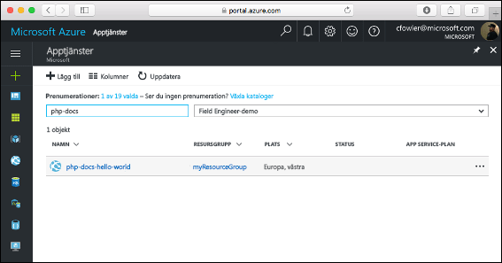
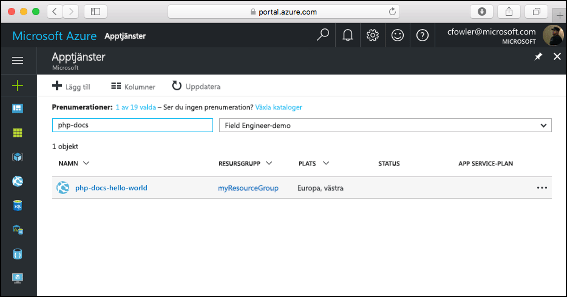

# <a name="create-a-php-web-app-in-azure"></a>Skapa en PHP-webbapp i Azure

> [!NOTE]
> I den här artikeln distribueras en app till App Service i Windows. Om du vill distribuera en app till App Service i _Linux_ kan du läsa [Skapa en PHP-webbapp i App Service på Linux](./containers/quickstart-php.md).
>

Med [Azure Web Apps](app-service-web-overview.md) får du en mycket skalbar och automatiskt uppdaterad webbvärdtjänst.  Den här snabbstartskursen visar hur du distribuerar en PHP-app till Azure Web Apps. Du skapar webbappen med [Azure CLI](https://docs.microsoft.com/cli/azure/get-started-with-azure-cli) i Cloud Shell och använder en [ZIP-fil](app-service-deploy-zip.md) för att distribuera PHP-exempelkoden till webbappen.

![Sample app running in Azure]](media/app-service-web-get-started-php/hello-world-in-browser.png)

Du kan följa stegen här på en Mac-, Windows- eller Linux-dator. Det tar cirka fem minuter att slutföra självstudiekursen när de nödvändiga komponenterna har installerats.

## <a name="prerequisites"></a>Nödvändiga komponenter

För att slutföra den här snabbstarten behöver du:

* <a href="https://php.net" target="_blank">Installera PHP</a>

[!INCLUDE [quickstarts-free-trial-note](../../includes/quickstarts-free-trial-note.md)]

## <a name="download-the-sample-locally"></a>Ladda ned exemplet lokalt

Ladda ned PHP-exempelprojektet från [https://github.com/Azure-Samples/php-docs-hello-world/archive/master.zip](https://github.com/Azure-Samples/php-docs-hello-world/archive/master.zip) och extrahera ZIP-arkivet.

Navigera till rotkatalogen för PHP-exempelprojektet i ett terminalfönster (det som innehåller _index.php_).

## <a name="run-the-app-locally"></a>Köra appen lokalt

Kör programmet lokalt genom att öppna ett terminalfönster och använda kommandot `php` för att starta den inbyggda PHP-webbservern.

```bash
php -S localhost:8080
```

Öppna en webbläsare och navigera till exempelappen på `http://localhost:8080`.

Du ser meddelandet **Hello World!** från exempelappen på sidan.


Tryck på **Ctrl+C** i terminalfönstret för att avsluta webbservern.

[!INCLUDE [Create ZIP file](../../includes/app-service-web-create-zip.md)]

[!INCLUDE [cloud-shell-try-it.md](../../includes/cloud-shell-try-it.md)]

[!INCLUDE [Upload zip file](../../includes/app-service-web-upload-zip.md)]

[!INCLUDE [Create resource group](../../includes/app-service-web-create-resource-group.md)]

[!INCLUDE [Create app service plan](../../includes/app-service-web-create-app-service-plan.md)]

## <a name="create-a-web-app"></a>Skapa en webbapp

I Cloud Shell skapar du en webbapp i `myAppServicePlan` App Service-planen med kommandot [az webapp create](/cli/azure/webapp?view=azure-cli-latest#az_webapp_create). 

Ersätt `<app_name>` med ett globalt unikt appnamn (giltiga tecken är `a-z`, `0-9` och `-`) i följande exempel. Körningen har angetts till `PHP|7.0`. Om du vill se alla körningar som stöds kör du [az webapp list-runtimes](/cli/azure/webapp?view=azure-cli-latest#az_webapp_list_runtimes). 

```azurecli-interactive
az webapp create --resource-group myResourceGroup --plan myAppServicePlan --name <app_name> --runtime "PHP|7.0"
```

När webbappen har skapats visar Azure CLI utdata liknande den i följande exempel:

```json
{
  "availabilityState": "Normal",
  "clientAffinityEnabled": true,
  "clientCertEnabled": false,
  "cloningInfo": null,
  "containerSize": 0,
  "dailyMemoryTimeQuota": 0,
  "defaultHostName": "<app_name>.azurewebsites.net",
  "enabled": true,
  < JSON data removed for brevity. >
}
```

Bläddra till webbappen som precis skapades. Ersätt _&lt;appnamn >_ med ett unikt appnamn.

```bash
http://<app name>.azurewebsites.net
```


[!INCLUDE [Deploy uploaded ZIP file](../../includes/app-service-web-deploy-zip.md)]

## <a name="browse-to-the-app"></a>Bläddra till appen

Bläddra till den distribuerade appen via webbläsaren.

```bash
http://<app_name>.azurewebsites.net
```

PHP-exempelkoden körs i en Azure App Service-webbapp.


**Grattis!** Du har distribuerat din första PHP-app till App Service.

## <a name="update-locally-and-redeploy-the-code"></a>Uppdatera lokalt och distribuera om koden

Öppna filen `index.php` i PHP-appen med ett lokalt textredigeringsprogram och gör små ändringar i texten i strängen bredvid `echo`:

```php
echo "Hello Azure!";
```

I det lokala terminalfönstret navigerar du till programmets rotkatalog och skapar en ny ZIP-fil för det uppdaterade projektet.

```
# Bash
zip -r myUpdatedAppFiles.zip .

# PowerShell
Compress-Archive -Path * -DestinationPath myUpdatedAppFiles.zip
``` 

Ladda upp den nya ZIP-filen till Cloud Shell med samma steg som i [Ladda upp ZIP-filen](#upload-the-zip-file).

Sedan distribuerar du den uppladdade ZIP-filen till Cloud Shell igen.

```azurecli-interactive
az webapp deployment source config-zip --resource-group myResouceGroup --name <app_name> --src clouddrive/myUpdatedAppFiles.zip
```

Gå tillbaka till webbläsarfönstret som öppnades när du skulle **söka efter appen** och klicka på knappen för att uppdatera sidan.


## <a name="manage-your-new-azure-web-app"></a>Hantera din nya Azure-webbapp

Gå till <a href="https://portal.azure.com" target="_blank">Azure Portal</a> för att hantera den webbapp som du skapade.

Klicka på **Apptjänster** i menyn till vänster och sedan på namnet på din Azure-webbapp.



Nu visas sidan Översikt för din webbapp. Här kan du utföra grundläggande hanteringsåtgärder som att bläddra, stoppa, starta, starta om och ta bort.



Menyn till vänster innehåller olika sidor för att konfigurera appen. 

[!INCLUDE [cli-samples-clean-up](../../includes/cli-samples-clean-up.md)]

## <a name="next-steps"></a>Nästa steg

> [!div class="nextstepaction"]
> [PHP med MySQL](app-service-web-tutorial-php-mysql.md)
