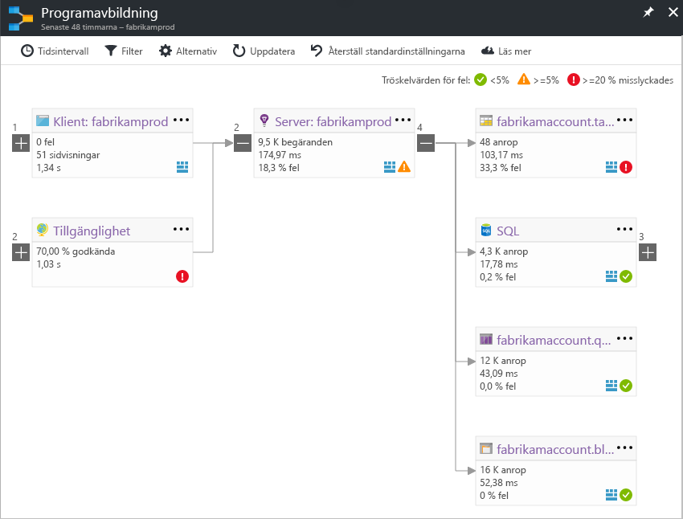

# Programavbildningen i Application Insights
I [Azure Application Insights](app-insights-overview.md), programavbildningen är en visuell layout av hello beroenden av programkomponenterna. Varje komponent visas KPI: er, till exempel belastning, prestanda, fel och varningar, toohelp du identifiera någon komponent som orsakar ett prestandaproblem eller fel. Du kan klicka på via från någon komponent toomore detaljerad diagnostik, till exempel Application Insights händelser. Om din app använder Azure-tjänster, kan du också klicka tooAzure diagnostiken, till exempel SQL Database Advisor-rekommendationer.

Du kan fästa ett program kartan toohello Azure instrumentpanel, där det är fullt fungerande som andra diagram. 

## Öppna hello programavbildningen
Öppna hello mappning från hello översikt bladet för ditt program:

hello kartan visar:

* Tillgänglighetstester
* Klient-komponenten (övervakas med hello JavaScript SDK)
* Server-sida-komponent
* Beroenden för hello klient- och serverkomponenter

Du kan expandera och komprimera beroende länken grupper:

Om du har många beroenden av en typ (SQL, http-etc.), kan de visas grupperade. 

## Hitta problem
Varje nod har relevanta nyckeltal, till exempel hello belastning, prestanda och fel priser för den komponenten. 

Varning ikoner Markera möjliga problem. En orange varning som innebär att det finns fel i förfrågningar, sidvisningar eller beroendeanrop. Rött innebär en felintervall över 5 procent. Om du vill tooadjust tröskelvärdena, öppna alternativ.

Aktiva aviseringar också visa upp: 

Om du använder SQL Azure, det finns en ikon som visas när det finns rekommendationer om hur du kan förbättra prestanda. 

Klicka på en ikon tooget mer information:

## Diagnostiska klicka dig igenom
Varje hello nod på hello karta erbjuder riktade klicka dig igenom för diagnostik. hello alternativen varierar beroende på hello typ av hello-nod.

För komponenter som finns i Azure, bland hello Direktlänkar toothem.

## Filter och tidsintervall
Som standard sammanfattas hello Mappa alla hello data som är tillgängliga för hello valt tidsintervall. Men du kan filtrera tooinclude specifika åtgärden namn eller beroenden.

* Åtgärdsnamn: Detta inkluderar både sidvisningar och typer av begäranden på serversidan. Med det här alternativet hello hello karta visar KPI på hello server-klientsidan nod för valda hello-åtgärder. Den visar hello beroenden anropas i kontexten hello över de specifika åtgärder.
* Beroende basnamn: Detta inkluderar hello AJAX webbläsare beroenden och beroenden för serversidan. Om du rapporterar anpassade beroendetelemetri med hello TrackDependency API visas de också här. Du kan välja hello beroenden tooshow på hello karta. Det här urvalet filtrera för närvarande inte hello serversidan förfrågningar eller hello klientsidan sidvisningar.

## Spara filter
toosave hello filter som du har använt, PIN-kod hello filtrerad vy på en [instrumentpanelen](app-insights-dashboards.md).

## Fel-fönstret
När du klickar på en nod i hello karta visas ett fel fönstret hello höger sammanfattning fel för noden. Fel grupperas först efter åtgärds-ID och sedan grupperade efter problem-ID.

Klicka på ett fel går du toohello senaste förekomst av att fel.

## Resurshälsa
För vissa typer av resurser visas resurshälsa hello överst i fönstret för hello-fel. Till exempel visas klickar på en SQL-nod hello databasen hälsa och eventuella aviseringar som har aktiverats.

Du kan klicka på hello resurs namn tooview standard översikt måtten för resursen.

## Slutpunkt till slutpunkt system app maps

*Kräver SDK version 2.3 eller senare*

Om programmet har flera komponenter – till exempel en backend tjänst dessutom toohello webbapp – och du kan visa dem på en inbyggd app-karta.

hello app kartan hittar servernoder genom att följa alla HTTP-beroendeanrop mellan servrar med hello Application Insights SDK installerad. Varje Application Insights-resurs antas toocontain en server.

### Flera rollen app karta (förhandsgranskning)

hello förhandsgranskningsfunktion flera rollen app kartan kan du toouse hello app karta med flera servrar som skickar data toohello samma Application Insights-resurs / instrumentation nyckel. Servrar i hello kartan segmenterade av hello cloud_RoleName-egenskapen på telemetri objekt. Ange *flera rollen programavbildningen* för*på* från hello förhandsgranskningar bladet tooenable den här konfigurationen.

Den här metoden kan det vara önskvärt i ett micro-services-program, eller i andra scenarier där du vill ha toocorrelate händelser över flera servrar i en enda Application Insights-resurs.

## Video

> [!VIDEO https://channel9.msdn.com/events/Connect/2016/112/player] 

## Feedback
Lämna feedback via hello portal feedback.

## Nästa steg

* [Azure Portal](https://portal.azure.com)
