# Översikt över Application Insights för DevOpsOverview of Application Insights for DevOps

Med [Programinsikter](app-insights-overview.md), du snabbt få reda på hur din app har dålig och som används när den är aktiv.With [Application Insights](app-insights-overview.md), you can quickly find out how your app is performing and being used when it's live. Om det finns ett problem, får du reda på om den, kan du utvärdera effekten av hello och hjälper dig att avgöra hello orsak.If there's a problem, it lets you know about it, helps you assess hello impact, and helps you determine hello cause.

Här är ett konto från ett team som utvecklar webbprogram:Here's an account from a team that develops web applications:

* *”Ett par dagar sedan, distribuerade vi en” mindre ”snabbkorrigering. Det gick inte att köra en bred testet, men vissa oväntad ändring har tyvärr samman i hello-nyttolast som orsakar inkompatibilitet mellan hello främre och bakre slutar. Direkt undantag ökade kraftigt, vår aviseringen utlöses och vi har gjorts medveten om hello situation. Några få klick bort på hello Application Insights-portalen kan vi har fått tillräckligt med information från undantag callstacks toonarrow ned hello problem. Vi återställde omedelbart och begränsad hello skador. Application Insights har gjort den här delen av hello devops växla mycket enkel och tillförlitlig ”.**"A couple of days ago, we deployed a 'minor' hotfix. We didn't run a broad test pass, but unfortunately some unexpected change got merged into hello payload, causing incompatibility between hello front and back ends. Immediately, server exceptions surged, our alert fired, and we were made aware of hello situation. A few clicks away on hello Application Insights portal, we got enough information from exception callstacks toonarrow down hello problem. We rolled back immediately and limited hello damage. Application Insights has made this part of hello devops cycle very easy and actionable."*

I den här artikeln vi följer ett team i Fabrikam Bank som utvecklar hello online bankwebbplatser system (OBS) toosee hur de använder Application Insights tooquickly svara toocustomers och göra uppdateringar.In this article we follow a team in Fabrikam Bank that develops hello online banking system (OBS) toosee how they use Application Insights tooquickly respond toocustomers and make updates.  

hello-teamet fungerar på en DevOps cykel avbildade i hello följande bild:hello team works on a DevOps cycle depicted in hello following illustration:

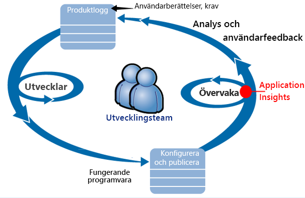

Krav som matas in deras utveckling eftersläpning (uppgiftslista).Requirements feed into their development backlog (task list). De fungerar i korthet sprints, vilket ofta ger fungerande programvara - vanligtvis i hello form av förbättringar och tillägg toohello befintliga program.They work in short sprints, which often deliver working software - usually in hello form of improvements and extensions toohello existing application. hello aktiva app uppdateras regelbundet med nya funktioner.hello live app is frequently updated with new features. När den är aktiv övervakar hello team den om prestanda och användning med hello hjälp av Application Insights.While it's live, hello team monitors it for performance and usage with hello help of Application Insights. APM-data feeds tillbaka till deras utveckling eftersläpning.This APM data feeds back into their development backlog.

hello team använder Application Insights toomonitor hello live webbprogram nära för:hello team uses Application Insights toomonitor hello live web application closely for:

* Prestanda.Performance. De vill toounderstand hur svarstiderna varierar beroende på antalet begäranden; hur mycket CPU, nätverk, disk och andra resurser som används; och där hello flaskhalsar.They want toounderstand how response times vary with request count; how much CPU, network, disk, and other resources are being used; and where hello bottlenecks are.
* Fel.Failures. Om det finns undantag eller misslyckade begäranden, eller om en prestandaräknare går utanför räckvidd föredrar, hello team behov tooknow snabbt så att de kan vidta åtgärder.If there are exceptions or failed requests, or if a performance counter goes outside its comfortable range, hello team needs tooknow rapidly so that they can take action.
* Användning.Usage. När en ny funktion släpps hello team vill tooknow toowhat omfattning används, och om användare har problem med den.Whenever a new feature is released, hello team want tooknow toowhat extent it is used, and whether users have any difficulties with it.

Nu ska vi fokusera på hello feedback tillhör hello cykel:Let's focus on hello feedback part of hello cycle:

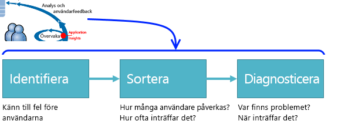

## Identifiera dålig tillgänglighetDetect poor availability
Marcela Markova är en erfaren utvecklare i hello OBS team och tar hello lead på övervaka online prestanda.Marcela Markova is a senior developer on hello OBS team, and takes hello lead on monitoring online performance. Hon konfigurerar flera [tillgänglighetstester](app-insights-monitor-web-app-availability.md):She sets up several [availability tests](app-insights-monitor-web-app-availability.md):

* En enskild URL-test för hello huvudsakliga Landningssida för hello app http://fabrikambank.com/onlinebanking/.A single-URL test for hello main landing page for hello app, http://fabrikambank.com/onlinebanking/. Hon anger kriterierna för HTTP-kod 200 och text Välkommen!.She sets criteria of HTTP code 200 and text 'Welcome!'. Om det här testet misslyckas är något allvarligt fel med hello nätverk eller hello servrar eller kan vara ett distributionsproblem med.If this test fails, there's something seriously wrong with hello network or hello servers, or maybe a deployment issue. (Eller någon har ändrat hello Välkommen!(Or someone has changed hello Welcome! meddelande på hello sidan utan att låta hennes informerad).message on hello page without letting her know.)
* En djupare flera steg testet som loggar in och hämtar en aktuella kontot lista, kontrollera några viktiga uppgifter på varje sida.A deeper multi-step test, which logs in and gets a current account listing, checking a few key details on each page. Det här testet kontrollerar att hello länken toohello kontodatabasen fungerar.This test verifies that hello link toohello accounts database is working. Hon använder fiktiva kund-id: några av dem bevaras för testning.She uses a fictitious customer id: a few of them are maintained for test purposes.

Med dessa tester som ställer in är Marcela säker på att hello team snabbt vet om eventuella avbrott.With these tests set up, Marcela is confident that hello team will quickly know about any outage.  

Fel visas som röda punkter i hello web test diagram:Failures show up as red dots on hello web test chart:

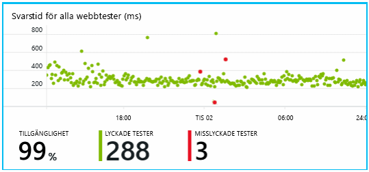

Men viktigare är en avisering om ett fel med e-post toohello Utvecklingsteamet.But more importantly, an alert about any failure is emailed toohello development team. På så sätt kan känner de till den innan nästan alla hello kunder.In that way, they know about it before nearly all hello customers.

## Övervaka prestandaMonitor Performance
På översiktssidan i Application Insights hello är ett diagram som visar olika [nyckeln mått](app-insights-web-monitor-performance.md).On hello overview page in Application Insights, there's a chart that shows a variety of [key metrics](app-insights-web-monitor-performance.md).

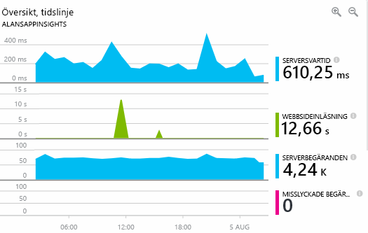

Sidhämtningstid härleds från telemetri skickas direkt från webbsidor.Browser page load time is derived from telemetry sent directly from web pages. Serversvarstid, antalet för server-begäran och antalet misslyckade begäranden alla mätt i hello webbservern och skickas tooApplication insikter därifrån.Server response time, server request count, and failed request count are all measured in hello web server and sent tooApplication Insights from there.

Marcela är något berörda med hello server svar graph.Marcela is slightly concerned with hello server response graph. Det här diagrammet visar hello Genomsnittlig tid mellan när hello servern tar emot en HTTP-begäran från en användares webbläsare och när den returnerar hello-svar.This graph shows hello average time between when hello server receives an HTTP request from a user's browser, and when it returns hello response. Det är inte ovanliga toosee variationen i det här diagrammet eftersom belastningen på hello system varierar.It isn't unusual toosee a variation in this chart, as load on hello system varies. Men i det här fallet systemdiskar toobe en korrelation mellan små ökar i hello antal begäranden, och stor stiger hello svarstid.But in this case, there seems toobe a correlation between small rises in hello count of requests, and big rises in hello response time. Som kan tyda på att hello system fungerar bara vid gränsen.That could indicate that hello system is operating just at its limits.

Hon öppnar hello servrar diagram:She opens hello Servers charts:

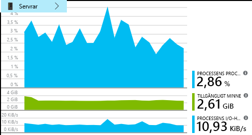

Det verkar toobe några tecken på begränsade resurser, så kanske hello stötar i hello server svar diagram är bara en plötslig.There seems toobe no sign of resource limitation there, so maybe hello bumps in hello server response charts are just a coincidence.

## Ställ in aviseringar toomeet målSet alerts toomeet goals
Dock vill hon tookeep koll på hello svarstider.Nevertheless, she'd like tookeep an eye on hello response times. Om de reser för hög vill hon tooknow om den omedelbart.If they go too high, she wants tooknow about it immediately.

Så hon anger ett [avisering](app-insights-metrics-explorer.md), för svarstider som är större än ett tröskelvärde för vanliga.So she sets an [alert](app-insights-metrics-explorer.md), for response times greater than a typical threshold. Detta ger sitt förtroende som hon vet om det. Om svarstider är långsam.This gives her confidence that she'll know about it if response times are slow.

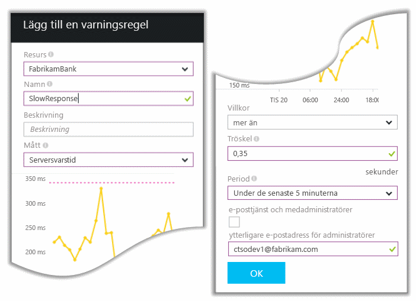

Aviseringar kan ställas in på en mängd andra mått.Alerts can be set on a wide variety of other metrics. Du kan till exempel ta emot e-postmeddelanden om hello undantag antal blir hög eller hello tillgängligt minne blir låg, eller om det är en topp klientbegäranden.For example, you can receive emails if hello exception count becomes high, or hello available memory goes low, or if there is a peak in client requests.

## Håll dig informerad med aviseringar för Smart identifieringStay informed with Smart Detection Alerts
Nästa dag, en varning e-post tas emot från Application Insights.Next day, an alert email does arrive from Application Insights. Men när hon öppnas hon hittar inte hello svar tid aviseringen som hon har angetts.But when she opens it, she finds it isn't hello response time alert that she set. I stället den information om det har en plötslig ökning av misslyckade begäranden – det vill säga begäranden som har returnerats felkoder på 500 eller mer.Instead, it tells her there's been a sudden rise in failed requests - that is, requests that have returned failure codes of 500 or more.

Misslyckade förfrågningar är där användare har sett ett fel - vanligtvis efter ett undantag uppstod i hello kod.Failed requests are where users have seen an error - typically following an exception thrown in hello code. Kanske ser de ett meddelande om ”tyvärr vi inte kunde uppdatera din information just nu”.Maybe they see a message saying "Sorry we couldn't update your details right now." Eller absolut onödiga sämsta en stackdump visas på skärmen hello användarens tillstånd hello webbservern.Or, at absolute embarrassing worst, a stack dump appears on hello user's screen, courtesy of hello web server.

Den här aviseringen är en oväntat eftersom hello senast hon tittar på det, hello misslyckade begäranden var antalet encouragingly låg.This alert is a surprise, because hello last time she looked at it, hello failed request count was encouragingly low. Ett litet antal fel är toobe förväntas i en upptagen server.A small number of failures is toobe expected in a busy server.

Det har också en oväntat för henne lite eftersom hon inte hade tooconfigure aviseringen.It was also a bit of a surprise for her because she didn't have tooconfigure this alert. Application Insights innehålla smarta identifiering.Application Insights include Smart Detection. Den justeras automatiskt tooyour app mönster av vanliga fel och ”hämtar används för att” fel på en viss sida eller under hög belastning eller länkade tooother mått.It automatically adjusts tooyour app's usual failure pattern, and "gets used to" failures on a particular page, or under high load, or linked tooother metrics. Den genererar hello larm om det finns en ökning kommer tooexpect ovan IT-avdelningen.It raises hello alarm only if there's a rise above what it comes tooexpect.

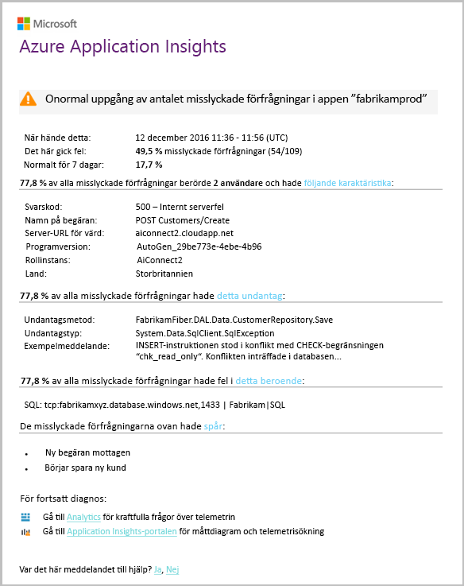

Det här är en användbar e-post.This is a very useful email. Den öka inte bara larm.It doesn't just raise an alarm. Det har mycket hello prioritering och diagnostik arbete för.It does a lot of hello triage and diagnostic work, too.

Den visar hur många kunder påverkas, och vilka webbsidor eller åtgärder.It shows how many customers are affected, and which web pages or operations. Marcela kan bestämma om hon tooget hello hela teamet arbetar på detta som en ökad fire eller om den kan ignoreras tills nästa vecka.Marcela can decide whether she needs tooget hello whole team working on this as a fire drill, or whether it can be ignored until next week.

hello e-post visas också att en viss undantag uppstod och - ännu mer intressant - hello felet är associerad med misslyckade anrop tooa viss databas.hello email also shows that a particular exception occurred, and - even more interesting - that hello failure is associated with failed calls tooa particular database. Det förklarar varför hello fel plötsligt fanns även om Marcela's team inte har distribuerats eventuella uppdateringar nyligen.This explains why hello fault suddenly appeared even though Marcela's team has not deployed any updates recently.

Marcella pingar hello som styr hello databasen team baserat på den här e-post.Marcella pings hello leader of hello database team based on this email. Hon lär sig de tillgängliga en snabbkorrigering i hello senaste halvtimme; och OJ, kanske kan har en mindre schemaändring...She learns that they released a hot fix in hello past half hour; and Oops, maybe there might have been a minor schema change....

Hello problem är därför på hello sätt toobeing fast även innan du undersöker loggar och inom 15 minuter från det som följer.So hello problem is on hello way toobeing fixed, even before investigating logs, and within 15 minutes of it arising. Dock klickar Marcela hello länken tooopen Application Insights.However, Marcela clicks hello link tooopen Application Insights. Öppnas direkt till en misslyckad begäran och hon kan se misslyckade anrop i hello associerade lista över beroendeanrop databasen.It opens straight onto a failed request, and she can see the failed database call in hello associated list of dependency calls.

## Identifiera undantagDetect exceptions
Med lite installationen [undantag](app-insights-asp-net-exceptions.md) är rapporterade tooApplication insikter automatiskt.With a little bit of setup, [exceptions](app-insights-asp-net-exceptions.md) are reported tooApplication Insights automatically. De kan också läggas till explicit genom att infoga anrop för[TrackException()](app-insights-api-custom-events-metrics.md#trackexception) till hello kod:They can also be captured explicitly by inserting calls too[TrackException()](app-insights-api-custom-events-metrics.md#trackexception) into hello code:  

    var telemetry = new TelemetryClient();
    ...
    try
    { ...
    }
    catch (Exception ex)
    {
       // Set up some properties:
       var properties = new Dictionary <string, string>
         {{"Game", currentGame.Name}};

       var measurements = new Dictionary <string, double>
         {{"Users", currentGame.Users.Count}};

       // Send hello exception telemetry:
       telemetry.TrackException(ex, properties, measurements);
    }

hello Fabrikam Bank team har utvecklats hello praxis alltid skicka telemetri vid ett undantag såvida det inte finns en tydlig återställning.hello Fabrikam Bank team has evolved hello practice of always sending telemetry on an exception, unless there's an obvious recovery.  

I själva verket sina strategin är även bredare än: de skicka telemetri i samtliga fall där hello kunden är frustrerade i vilka de ville toodo, om den motsvarar tooan undantag i hello-kod eller inte.In fact, their strategy is even broader than that: They send telemetry in every case where hello customer is frustrated in what they wanted toodo, whether it corresponds tooan exception in hello code or not. Till exempel om hello externa mellan bank överföring system returnerar meddelandet ”Det går inte att slutföra den här transaktionen” önskemål operativa (inga fel hello kunden) spåra sedan de händelsen.For example, if hello external inter-bank transfer system returns a "can't complete this transaction" message for some operational reason (no fault of hello customer) then they track that event.

    var successCode = AttemptTransfer(transferAmount, ...);
    if (successCode < 0)
    {
       var properties = new Dictionary <string, string>
            {{ "Code", returnCode, ... }};
       var measurements = new Dictionary <string, double>
         {{"Value", transferAmount}};
       telemetry.TrackEvent("transfer failed", properties, measurements);
    }

TrackException är används tooreport undantag eftersom den skickar en kopia av hello stacken.TrackException is used tooreport exceptions because it sends a copy of hello stack. TrackEvent är används tooreport andra händelser.TrackEvent is used tooreport other events. Du kan koppla eventuella egenskaper som kan vara användbar vid diagnos.You can attach any properties that might be useful in diagnosis.

Undantag och händelser som visas i hello [diagnostiska Sök](app-insights-diagnostic-search.md) bladet.Exceptions and events show up in hello [Diagnostic Search](app-insights-diagnostic-search.md) blade. Du kan detaljerat dem toosee hello ytterligare egenskaper och stackspårning.You can drill into them toosee hello additional properties and stack trace.

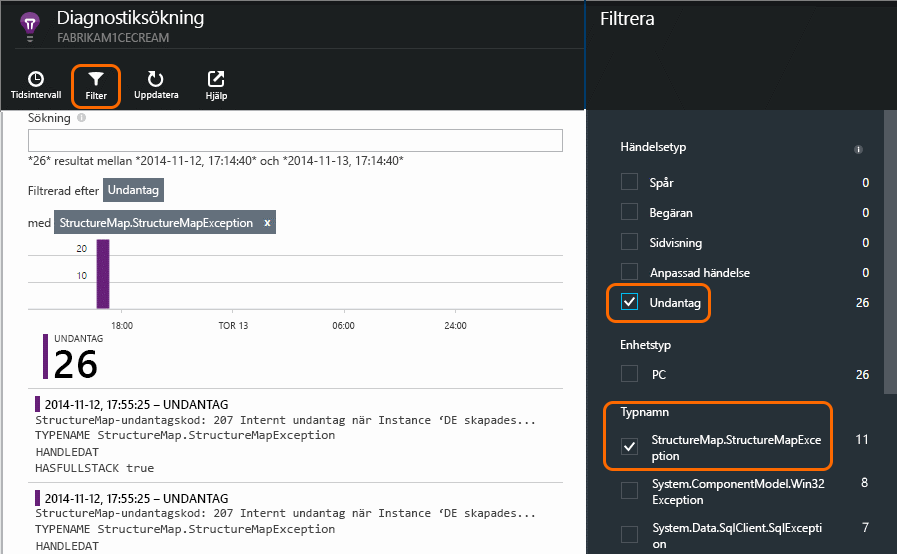

## Övervaka proaktivtMonitor proactively
Marcela sitta inte bara runt väntar på aviseringar.Marcela doesn't just sit around waiting for alerts. Strax efter varje Omdistributionen hon tar en titt på [svarstider](app-insights-web-monitor-performance.md) – både hello övergripande bild och hello tabell med långsammast begäranden som undantag räknas.Soon after every redeployment, she takes a look at [response times](app-insights-web-monitor-performance.md) - both hello overall figure and hello table of slowest requests, as well as exception counts.  

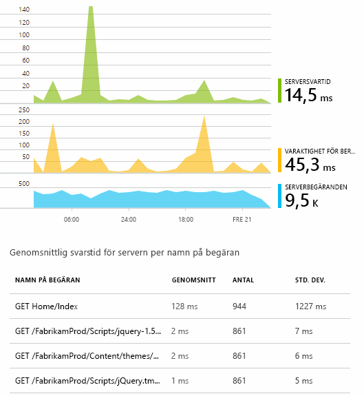

Hon kan bedöma hello prestanda effekten av varje distribution vanligtvis jämföra varje vecka med hello senast.She can assess hello performance effect of every deployment, typically comparing each week with hello last. Om det finns en plötslig försämras, genererar hon som med relevanta hello-utvecklare.If there's a sudden worsening, she raises that with hello relevant developers.

## Prioritering problemTriage issues
Prioritering - bedöma hello allvarlighetsgrad och omfattningen av ett problem - är hello görs efter identifiering.Triage - assessing hello severity and extent of a problem - is hello first step after detection. Ska vi kallar ut hello team vid midnatt?Should we call out hello team at midnight? Eller kan den finnas kvar tills hello nästa praktiskt lucka i hello eftersläpning?Or can it be left until hello next convenient gap in hello backlog? Det finns några viktiga frågor i prioritering.There are some key questions in triage.

Hur ofta det händer? hello diagram på hello översikt bladet ge perspektiv tooa problem.How often is it happening? hello charts on hello Overview blade give some perspective tooa problem. Till exempel genereras hello Fabrikam programmet fyra web test varningar en natt.For example, hello Fabrikam application generated four web test alerts one night. Tittar på hello diagram hello morgonen, hello gruppen kan se att det fanns verkligen vissa röda punkter om fortfarande de flesta hello tester vore grön.Looking at hello chart in hello morning, hello team could see that there were indeed some red dots, though still most of hello tests were green. Vidaresökning i hello tillgänglighet diagram var det tydligt att alla dessa återkommande problem var från ett test-plats.Drilling into hello availability chart, it was clear that all of these intermittent problems were from one test location. Detta var naturligtvis ett nätverksproblem som påverkar endast en och troligen avmarkerar sig själv.This was obviously a network issue affecting only one route, and would most likely clear itself.  

Däremot dramatisk och stabil ökning hello diagram över antalet undantag eller svarstider är naturligtvis något toopanic om.By contrast, a dramatic and stable rise in hello graph of exception counts or response times is obviously something toopanic about.

En användbar prioritering skräpposten är försök den själv.A useful triage tactic is Try It Yourself. Om du stöter på hello samma problem du vet att det är verkliga.If you run into hello same problem, you know it's real.

Vilken del av användare som påverkas? tooobtain en grov svaret delar hello felintervall med hello session count.What fraction of users are affected? tooobtain a rough answer, divide hello failure rate by hello session count.

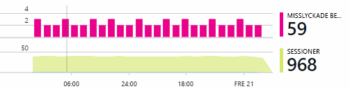

När det finns långsamt svar, jämför hello tabell med långsammast svarar på begäranden med hello användning frekvensen för varje sida.When there are slow responses, compare hello table of slowest-responding requests with hello usage frequency of each page.

Det är viktigt hello blockeras scenario?How important is hello blocked scenario? Om det här är ett funktionellt problem som blockerar en viss användare artikel spelar det roll mycket?If this is a functional problem blocking a particular user story, does it matter much? Om kunder inte kan betala för sina växlar, är det allvarliga; Om de inte kan ändra preferenser skärmen färg, kan kanske den vänta.If customers can't pay their bills, this is serious; if they can't change their screen color preferences, maybe it can wait. Hej detail hello händelse eller undantag eller hello identitet hello långsam sida, anger du där kunder har problem med.hello detail of hello event or exception, or hello identity of hello slow page, tells you where customers are having trouble.

## Diagnostisera problemDiagnose issues
Diagnostik är inte helt hello samma som felsökning.Diagnosis isn't quite hello same as debugging. Innan du börjar spårning genom hello koden du bör ha en grov uppfattning om varför, var och när hello problemet uppstår.Before you start tracing through hello code, you should have a rough idea of why, where and when hello issue is occurring.

**När sker det?**  hello historiska vyn i hello händelser och mått diagram gör det enkelt toocorrelate effekter med möjliga orsaker.**When does it happen?** hello historical view provided by hello event and metric charts makes it easy toocorrelate effects with possible causes. Om det finns återkommande toppar i svaret tid eller undantag priser, titta på hello begäran antal: om den toppar som pekar åt på hello samma tid, och sedan det ser ut som ett resursproblem.If there are intermittent peaks in response time or exception rates, look at hello request count: if it peaks at hello same time, then it looks like a resource problem. Behöver du tooassign mer CPU eller minne?Do you need tooassign more CPU or memory? Eller är ett beroende som inte kan hantera belastningen hello?Or is it a dependency that can't manage hello load?

**Är det oss?****Is it us?**  Om du har en plötslig nedgång i prestanda för en viss typ av begäran - till exempel när hello kunden uttrycket konto - och sedan är möjligheten kan det vara ett externt undersystem i stället för ditt webbprogram.If you have a sudden drop in performance of a particular type of request - for example when hello customer wants an account statement - then there's a possibility it might be an external subsystem rather than your web application. Välj hello beroendefel frekvens och varaktighet för beroende priser och jämföra deras historik över hello efter några timmar eller dagar med hello-problemet du identifierade i Metrics Explorer.In Metrics Explorer, select hello Dependency Failure rate and Dependency Duration rates and compare their histories over hello past few hours or days with hello problem you detected. Om det korrelerar ändringar, kan en extern undersystemet vara tooblame.If there are correlating changes, then an external subsystem might be tooblame.  

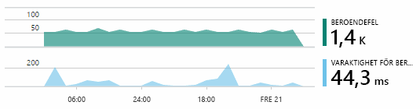

Vissa problem med långsam beroende är geolokalisering problem.Some slow dependency issues are geolocation problems. Fabrikam banken använder Azure virtuella datorer och identifierade att de hade oavsiktligt finns sina webbservern och kontot server i olika länder.Fabrikam Bank uses Azure virtual machines, and discovered that they had inadvertently located their web server and account server in different countries. En dramatisk förbättring har medfört genom att migrera en av dem.A dramatic improvement was brought about by migrating one of them.

**Vad vi?****What did we do?** Om hello problemet inte visas toobe ett beroende, och om det inte alltid det, beror det förmodligen på en ändring.If hello issue doesn't appear toobe in a dependency, and if it wasn't always there, it's probably caused by a recent change. hello historiska perspektiv som tillhandahålls av hello mått och händelse diagram gör det enkelt toocorrelate ändringar plötslig med distributioner.hello historical perspective provided by hello metric and event charts makes it easy toocorrelate any sudden changes with deployments. Som begränsar ned hello letar hello problem.That narrows down hello search for hello problem.

**Vad är det som händer?****What's going on?** Vissa problem uppstå sällan och kan vara svårt tootrack ned genom att testa offline.Some problems occur only rarely and can be difficult tootrack down by testing offline. Vi kan göra bara tootry toocapture hello programfel när det uppstår live.All we can do is tootry toocapture hello bug when it occurs live. Du kan inspektera hello stackdump i undantag rapporter.You can inspect hello stack dumps in exception reports. Dessutom kan du skriva spårning anrop med din favorit loggningsramverk eller med TrackTrace() eller trackevent ().In addition, you can write tracing calls, either with your favorite logging framework or with TrackTrace() or TrackEvent().  

Fabrikam hade ett tillfälligt problem med överföringar mellan kontot, men endast med vissa typer av konton.Fabrikam had an intermittent problem with inter-account transfers, but only with certain account types. toounderstand bättre vad händer infogas de TrackTrace() samtal vid huvudpunkter i hello kod, bifoga hello kontotyp som ett anrop för egenskapen tooeach.toounderstand better what was happening, they inserted TrackTrace() calls at key points in hello code, attaching hello account type as a property tooeach call. Som gjort det enkelt toofilter ut de spårningar diagnostiska sökning.That made it easy toofilter out just those traces in Diagnostic Search. De anslutna också parametervärden som egenskaper och åtgärder toohello spårning av anrop.They also attached parameter values as properties and measures toohello trace calls.

## Svara toodiscovered problemRespond toodiscovered issues
När du har diagnostiserats hello problem du kan göra en plan toofix den.Once you've diagnosed hello issue, you can make a plan toofix it. Du kanske behöver tooroll tillbaka en ändring eller kanske du kan bara gå vidare och åtgärda problemet.Maybe you need tooroll back a recent change, or maybe you can just go ahead and fix it. När hello korrigering är klart får Application Insights du om du är klar.Once hello fix is done, Application Insights tells you whether you succeeded.  

Fabrikam Bank Utvecklingsteamet ta ett mer strukturerade metoden tooperformance mått än de använde toobefore de använde Application Insights.Fabrikam Bank's development team take a more structured approach tooperformance measurement than they used toobefore they used Application Insights.

* De kan ange prestandamål vad gäller särskilda åtgärder för hello Application Insights översiktssidan.They set performance targets in terms of specific measures in hello Application Insights overview page.
* De utforma åtgärderna som utförs i hello program från hello start, till exempel hello mått som mäter användaren förloppet skorstenar.They design performance measures into hello application from hello start, such as hello metrics that measure user progress through 'funnels.'  

## Övervakaren användaraktivitetMonitor user activity
När svarstiden är konsekvent bra och få undantag, flytta hello dev-teamet på toousability.When response time is consistently good and there are few exceptions, hello dev team can move on toousability. De kan fundera på hur tooimprove hello användarnas upplevelse och hur tooencourage flera användare tooachieve hello önskad mål.They can think about how tooimprove hello users' experience, and how tooencourage more users tooachieve hello desired goals.

Application Insights kan också vara används toolearn vad användare göra med en app.Application Insights can also be used toolearn what users do with an app. När den körs smidigt som hello team tooknow vilka funktioner som är mest populär hello vad användare gillar och har problem med och hur ofta de kommer tillbaka.Once it's running smoothly, hello team would like tooknow which features are hello most popular, what users like or have difficulty with, and how often they come back. Som hjälper dem att prioritera kommande arbetet.That will help them prioritize their upcoming work. Och de kan planera toomeasure hello framgången för varje funktion som en del av hello utvecklingscykeln.And they can plan toomeasure hello success of each feature as part of hello development cycle. 

En typisk användare resa via hello-webbplats har till exempel en tydlig ”tratten”.For example, a typical user journey through hello web site has a clear "funnel." Många kunder titta på hello frekvens av olika typer av lån.Many customers look at hello rates of different types of loan. Ett mindre antal gå toofill i hello citattecken form.A smaller number go on toofill in hello quotation form. Av de som får en offert några gå vidare och ta ut hello lån.Of those who get a quotation, a few go ahead and take out hello loan.

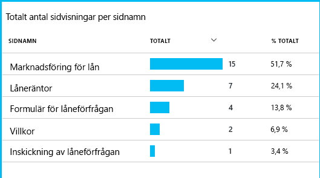

Genom att beakta där hello största antal kunder släppa, fungerar hello business ut hur tooget fler användare via toohello längst ned på hello tratt.By considering where hello greatest numbers of customers drop out, hello business can work out how tooget more users through toohello bottom of hello funnel. Det kan finnas ett user experience (UX) fel i vissa fall – till exempel hello ' Nästa ' är hårda toofind eller hello instruktioner inte tydligt.In some cases, there might be a user experience (UX) failure - for example, hello 'next' button is hard toofind, or hello instructions aren't obvious. Det finns mer sannolikt större affärsskäl för bortfall: kanske hello lån är för högt.More likely, there are more significant business reasons for drop-outs: maybe hello loan rates are too high.

Oavsett hello skäl, hjälper hello data hello-teamet arbetar reda på vad användarna gör.Whatever hello reasons, hello data helps hello team work out what users are doing. Flera spårning anrop kan vara infogas toowork mer detaljer.More tracking calls can be inserted toowork out more detail. Trackevent () kan vara används toocount några användaråtgärder från hello detaljnivå av enskilda knappen klickar toosignificant prestationer, till exempel betala av ett lån.TrackEvent() can be used toocount any user actions, from hello fine detail of individual button clicks, toosignificant achievements such as paying off a loan.

hello-teamet får använda toohaving information om användaraktivitet.hello team is getting used toohaving information about user activity. Idag används när de utformar en ny funktion, fungerar de reda på hur de ska få feedback om dess användning.Nowadays, whenever they design a new feature, they work out how they will get feedback about its usage. De utforma spårning anrop till hello funktionen från hello start.They design tracking calls into hello feature from hello start. De funktionen hello feedback tooimprove hello i varje utvecklingscykeln.They use hello feedback tooimprove hello feature in each development cycle.

[Läs mer om att spåra användning](app-insights-usage-overview.md).[Read more about tracking usage](app-insights-usage-overview.md).

## Tillämpa hello DevOps cykelApply hello DevOps cycle
Detta är hur ett team att använda Application Insights inte bara toofix enskilda problem, men tooimprove utvecklingslivscykeln.So that's how one team use Application Insights not just toofix individual issues, but tooimprove their development lifecycle. Jag hoppas det du har fått några tips om hur Application Insights kan hjälpa dig med hantering av prestanda i dina program.I hope it has given you some ideas about how Application Insights can help you with application performance management in your own applications.

## VideoVideo

> [!VIDEO https://channel9.msdn.com/events/Connect/2016/112/player]

## Nästa stegNext steps
Du kan komma igång på flera sätt, beroende på hello egenskaper för programmet.You can get started in several ways, depending on hello characteristics of your application. Välj vad passar dig bäst:Pick what suits you best:

* [ASP.NET-webbprogramASP.NET web application](app-insights-asp-net.md)
* [Java-webbappJava web application](app-insights-java-get-started.md)
* [Node.js-webbappNode.js web application](app-insights-nodejs.md)
* Redan distribuerade appar, finns på [IIS](app-insights-monitor-web-app-availability.md), [J2EE](app-insights-java-live.md), eller [Azure](app-insights-azure.md).Already deployed apps, hosted on [IIS](app-insights-monitor-web-app-availability.md), [J2EE](app-insights-java-live.md), or [Azure](app-insights-azure.md).
* [Webbsidor](app-insights-javascript.md) -den enda sidan App eller vanlig webbsida - använder det på sin egen eller i tillägg tooany av hello serveralternativ.[Web pages](app-insights-javascript.md) - Single Page App or ordinary web page - use this on its own or in addition tooany of hello server options.
* [Tillgänglighetstester](app-insights-monitor-web-app-availability.md) tootest appen från hello offentliga internet.[Availability tests](app-insights-monitor-web-app-availability.md) tootest your app from hello public internet.
