# Vad är Application Insights?What is Application Insights?
Application Insights är en utökningsbar APM-tjänst (Application Performance Management) för webbutvecklare på flera plattformar.Application Insights is an extensible Application Performance Management (APM) service for web developers on multiple platforms. Använd den toomonitor live webbprogrammet.Use it toomonitor your live web application. Den identifierar automatiskt prestandaavvikelser.It will automatically detect performance anomalies. Den innehåller kraftfulla analytics verktyg toohelp du diagnostisera problem och toounderstand vad användare utför med din app.It includes powerful analytics tools toohelp you diagnose issues and toounderstand what users actually do with your app.  Den är utformad toohelp kontinuerligt förbättra prestanda och användbarhet.It's designed toohelp you continuously improve  performance and usability. Det fungerar för appar på en mängd olika plattformar, inklusive .NET, Node.js och J2EE finns lokalt eller i hello molnet.It works for apps on a wide variety of platforms including .NET, Node.js and J2EE, hosted on-premises or in hello cloud. Den kan integreras med devOps-processen och har anslutning punkter tooa olika utvecklingsverktyg.It  integrates with your devOps process, and has connection points tooa variety of development tools.

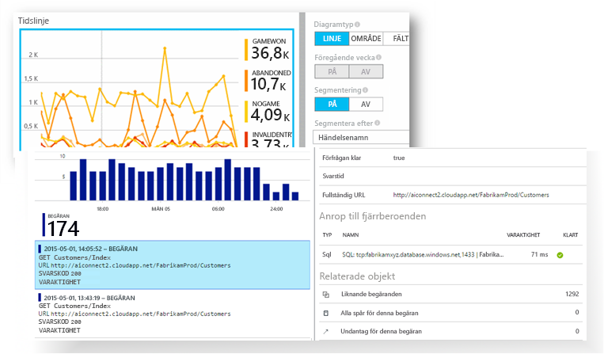

[Ta en titt på hello introduktion animering](https://www.youtube.com/watch?v=fX2NtGrh-Y0).[Take a look at hello intro animation](https://www.youtube.com/watch?v=fX2NtGrh-Y0).

## Hur fungerar Application Insights?How does Application Insights work?
Du installerar ett litet instrumentation paket i ditt program och ställa in en Application Insights-resurs i hello Microsoft Azure-portalen.You install a small instrumentation package in your application, and set up an Application Insights resource in hello Microsoft Azure portal. hello instrumentation övervakar din app och skickar telemetri data toohello portal.hello instrumentation monitors your app and sends telemetry data toohello portal. (hello programmet kan köras var som helst - det har inte toobe finns i Azure.)(hello application can run anywhere - it doesn't have toobe hosted in Azure.)

Du kan instrumentera inte bara hello webbtjänstprogrammet, utan även alla komponenter som bakgrund och hello JavaScript i hello webbsidor sig själva.You can instrument not only hello web service application, but also any background components, and hello JavaScript in hello web pages themselves. 

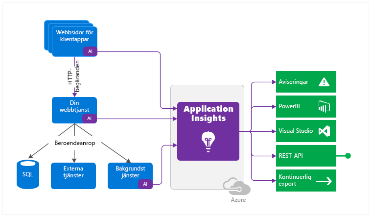

Du kan dessutom dra i telemetri från hello värdmiljöer som prestandaräknare, Azure-diagnostik eller Docker-loggar.In addition, you can pull in telemetry from hello host environments such as performance counters, Azure diagnostics, or Docker logs. Du kan också ställa in webbtester som regelbundet skicka syntetiska begäranden tooyour webbtjänsten.You can also set up web tests that periodically send synthetic requests tooyour web service.

Alla dessa telemetri strömmar är integrerade i hello Azure-portalen, du kan tillämpa kraftfulla analytiska och Sök verktyg toohello rådata.All these telemetry streams are integrated in hello Azure portal, where you can apply powerful analytic and search tools toohello raw data.

### Vad är hello kostnader?What's hello overhead?
hello påverkan på prestandan för din app är mycket liten.hello impact on your app's performance is very small. Anropsspårning är icke-blockerande, och grupperas och skickas i en separat tråd.Tracking calls are non-blocking, and are batched and sent in a separate thread.

## Vad övervakar Application Insights?What does Application Insights monitor?

Application Insights syftar hello Utvecklingsteamet, toohelp du förstår hur din app fungerar och hur den används.Application Insights is aimed at hello development team, toohelp you understand how your app is performing and how it's being used. Tjänsten övervakar:It monitors:

* **Begärandefrekvens, svarstider och felfrekvens** – Ta reda på vilka sidor som är mest populära, vid vilka tidpunkter på dagen och var dina användare finns.**Request rates, response times, and failure rates** - Find out which pages are most popular, at what times of day, and where your users are. Se vilka sidor som fungerar bäst.See which pages perform best. Om svarstiden och felfrekvensen är hög när det finns många begäranden kan det bero på ett resurstilldelningsproblem.If your response times and failure rates go high when there are more requests, then perhaps you have a resourcing problem. 
* **Beroendefrekvens, svarstider och felfrekvens** – Ta reda på om externa tjänster gör systemet långsammare.**Dependency rates, response times, and failure rates** - Find out whether external services are slowing you down.
* **Undantag** – analysera hello samman statistik, eller välja specifika instanser och detaljerat hello stackspårning och relaterade begäranden.**Exceptions** - Analyse hello aggregated statistics, or pick specific instances and drill into hello stack trace and related requests. Både server- och webbläsarundantag rapporteras.Both server and browser exceptions are reported.
* **Sidvyer och inläsningsprestanda** – Rapporteras av användarnas webbläsare.**Page views and load performance** - reported by your users' browsers.
* **AJAX-anrop** från webbsidor – frekvens, svarstider och felfrekvens.**AJAX calls** from web pages - rates, response times, and failure rates.
* **Antal användare och sessioner**.**User and session counts**.
* **Prestandaräknare** från dina Windows- eller Linux-serverdatorer, till exempel processor, minne och nätverksanvändning.**Performance counters** from your Windows or Linux server machines, such as CPU, memory, and network usage. 
* **Värddiagnostik** från Docker eller Azure.**Host diagnostics** from Docker or Azure. 
* **Diagnostikspårningsloggar** från din app – så att du kan jämföra spårningshändelser med begäranden.**Diagnostic trace logs** from your app - so that you can correlate trace events with requests.
* **Anpassade händelser och mått** att du kan skriva själv i hello klient eller server kod, tootrack affärshändelser som objekt säljs eller spel vann.**Custom events and metrics** that you write yourself in hello client or server code, tootrack business events such as items sold or games won.

## Var ser jag min telemetri?Where do I see my telemetry?

Det finns många sätt tooexplore dina data.There are plenty of ways tooexplore your data. Läs dessa artiklar:Check out these articles:

|  |  |
| --- | --- |
| [**Smart identifiering och manuella aviseringar****Smart detection and manual alerts**](app-insights-proactive-diagnostics.md) Automatisk aviseringar anpassa tooyour app normal mönster av telemetri och utlösare när det finns något utanför hello vanliga mönstret.Automatic alerts adapt tooyour app's normal patterns of telemetry and trigger when there's something outside hello usual pattern. Du kan också [ställa in aviseringar](app-insights-alerts.md) på särskilda nivåer med anpassade måttvärden eller standardmått.You can also [set alerts](app-insights-alerts.md) on particular levels of custom or standard metrics. |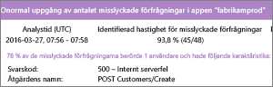 |
| [**Programkarta****Application map**](app-insights-app-map.md) hello komponenter i appen med nyckelvärden och -varningar.hello components of your app, with key metrics and alerts. |  |
| [**Profilerare****Profiler**](app-insights-profiler.md) Kontrollera hello körning av profiler provade begäranden.Inspect hello execution profiles of sampled requests. |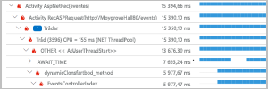 |
| [**Användningsanalys****Usage analysis**](app-insights-usage-overview.md) Analysera användarsegment och kvarhållning.Analyze user segmentation and retention.| |
| [**Diagnostiksökning efter instansdata****Diagnostic search for instance data**](app-insights-diagnostic-search.md) Sök efter och filtrera händelser, till exempel begäranden, undantag, beroendeanrop, loggspårningar och sidvyer.Search and filter events such as requests, exceptions, dependency calls, log traces, and page views.  |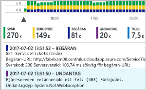 |
| [**Metrics Explorer för aggregerade data****Metrics Explorer for aggregated data**](app-insights-metrics-explorer.md) Utforska, filtrera och segmentera aggregerade data, till exempel begärande-, fel- och undantagsfrekvens, svarstider och sidinläsningstider.Explore, filter, and segment aggregated data such as rates of requests, failures, and exceptions; response times, page load times. | |
| [**Instrumentpaneler****Dashboards**](app-insights-dashboards.md#dashboards) Kombinera data från flera resurser och dela med andra.Mash up data from multiple resources and share with others. Bra för flera komponenten program och för kontinuerlig visning i hello team rum.Great for multi-component applications, and for continuous display in hello team room. | |
| [**Live-ström med mätvärden****Live Metrics Stream**](app-insights-live-stream.md) När du distribuerar en ny version kan du titta på dessa nära realtid prestanda indikatorer toomake att allt fungerar som förväntat.When you deploy a new build, watch these near-real-time performance indicators toomake sure everything works as expected. |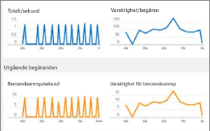 |
| [**Analytics****Analytics**](app-insights-analytics.md) Besvara svåra frågor om appens prestanda och användning med hjälp av det här kraftfulla frågespråket.Answer tough questions about your app's performance and usage by using this powerful query language. |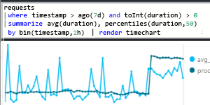 |
| [**Visual Studio****Visual Studio**](app-insights-visual-studio.md) Se prestandadata i hello kod.See performance data in hello code. Gå toocode från stackspår.Go toocode from stack traces.|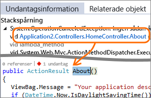 |
| [**Felsökning av ögonblicksbild****Snapshot debugger**](app-insights-snapshot-debugger.md) Felsök ögonblicksbilder från program som körs med parametervärden.Debug snapshots sampled from live operations, with parameter values.|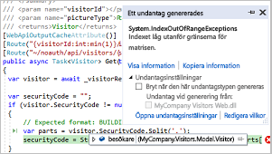 |
| [**Power BI****Power BI**](app-insights-export-power-bi.md) Integrera användningsmätvärden med annan Business Intelligence.Integrate usage metrics with other business intelligence.| 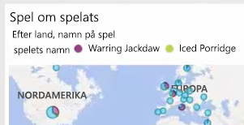|
| [**REST API****REST API**](https://dev.applicationinsights.io/) Skriva koden toorun frågor via din mått och rådata.Write code toorun queries over your metrics and raw data.|  |
| [**Löpande export****Continuous export**](app-insights-export-telemetry.md) Massredigera export av rådata toostorage när den tas emot.Bulk export of raw data toostorage as soon as it arrives. |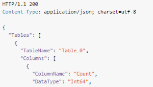 |

## Hur använder jag Application Insights?How do I use Application Insights?

### ÖvervakaMonitor
Installera Application Insights i din app, konfigurera [webbtester för tillgänglighet](app-insights-monitor-web-app-availability.md) och:Install Application Insights in your app, set up [availability web tests](app-insights-monitor-web-app-availability.md), and:

* Konfigurera en [instrumentpanelen](app-insights-dashboards.md) sidan belastningar och AJAX-anrop för ditt team rum tookeep ett öga på belastning, svarstider och hello prestanda hos dina beroenden.Set up a [dashboard](app-insights-dashboards.md) for your team room tookeep an eye on load, responsiveness, and hello performance of your dependencies, page loads, and AJAX calls.
* Identifiera som är hello långsammaste och de flesta misslyckade begäranden.Discover which are hello slowest and most failing requests.
* Titta på [Liveströmning](app-insights-live-stream.md) när du distribuerar en ny version tooknow omedelbart om försämring.Watch [Live Stream](app-insights-live-stream.md) when you deploy a new release, tooknow immediately about any degradation.

### Identifiera och diagnostiseraDetect, Diagnose
När du får en avisering eller identifierar ett problem:When you receive an alert or discover a problem:

* Utvärdera hur många användare som påverkas.Assess how many users are affected.
* Korrelera fel med undantag, beroendeanrop och spårningar.Correlate failures with exceptions, dependency calls and traces.
* Undersök profilerare, ögonblicksbilder, stackdumpar och spårningsloggar.Examine profiler, snapshots, stack dumps, and trace logs.

### Bygg, mät och lärBuild, Measure, Learn
[Mäta hello effektivt](app-insights-usage-overview.md) av varje ny funktion som du distribuerar.[Measure hello effectiveness](app-insights-usage-overview.md) of each new feature that you deploy.

* Planera toomeasure hur kunder använder nya UX eller funktioner för företag.Plan toomeasure how customers use new UX or business features.
* Skriv in anpassad telemetri i din kod.Write custom telemetry into your code.
* Grundläggande hello nästa utveckling Bläddra på hårddisken bevis från din telemetri.Base hello next development cycle on hard evidence from your telemetry.

## Kom igångGet started
Application Insights är en av hello många tjänster finns i Microsoft Azure och telemetri det skickas för analys och presentation.Application Insights is one of hello many services hosted within Microsoft Azure, and telemetry is sent there for analysis and presentation. Innan du gör något annat måste en prenumeration för[Microsoft Azure](http://azure.com).So before you do anything else, you'll need a subscription too[Microsoft Azure](http://azure.com). Är det kostnadsfria toosign upp och om du väljer hello grundläggande [priser plan](https://azure.microsoft.com/pricing/details/application-insights/) av Application Insights är gratis tills programmet har växt toohave betydande användning.It's free toosign up, and if you choose hello basic [pricing plan](https://azure.microsoft.com/pricing/details/application-insights/) of Application Insights, there's no charge until your application has grown toohave substantial usage. Om din organisation redan har en prenumeration, de kan lägga till ditt Microsoft-konto tooit.If your organization already has a subscription, they could add your Microsoft account tooit.

Det finns flera sätt tooget igång.There are several ways tooget started. Börja på det sätt som passar dig bäst.Begin with whichever works best for you. Du kan lägga till hello andra senare.You can add hello others later.

* **AT körtid: instrumentera ditt webbprogram på hello-servern.****At run time: instrument your web app on hello server.** Undviker någon uppdatering toohello kod.Avoids any update toohello code. Du måste administratören tooyour fjärråtkomstserver.You need admin access tooyour server.
  * [**IIS lokalt eller på en virtuell dator****IIS on-premises or on a VM**](app-insights-monitor-performance-live-website-now.md)
  * [**Azure-webbapp eller virtuell dator****Azure web app or VM**](app-insights-monitor-performance-live-website-now.md)
  * [**J2EE****J2EE**](app-insights-java-live.md)
* **Vid tid: Lägg till Application Insights tooyour kod.****At development time: add Application Insights tooyour code.** Kan du toowrite anpassad telemetri och tooinstrument backend-appar och program.Allows you toowrite custom telemetry and tooinstrument back-end and desktop apps.
  * [Visual Studio](app-insights-asp-net.md) 2013 uppdatering 2 eller senare.[Visual Studio](app-insights-asp-net.md) 2013 update 2 or later.
  * Java i [Eclipse](app-insights-java-eclipse.md) eller [andra verktyg](app-insights-java-get-started.md)Java in [Eclipse](app-insights-java-eclipse.md) or [other tools](app-insights-java-get-started.md)
  * [Node.jsNode.js](app-insights-nodejs.md)
  * [Andra plattformarOther platforms](app-insights-platforms.md)
* **[Instrumentera dina webbsidor](app-insights-javascript.md)** för sidvisning, AJAX och annan telemetri på klientsidan.**[Instrument your web pages](app-insights-javascript.md)** for page view, AJAX and other client-side telemetry.
* **[Tillgänglighetstester](app-insights-monitor-web-app-availability.md)** –pinga din webbplats regelbundet från våra servrar.**[Availability tests](app-insights-monitor-web-app-availability.md)** - ping your website regularly from our servers.

## Nästa stegNext steps
Kom igång under körningsfasen med:Get started at runtime with:

* [IIS-serverIIS server](app-insights-monitor-performance-live-website-now.md)
* [J2EE-serverJ2EE server](app-insights-java-live.md)

Kom igång under utvecklingsfasen med:Get started at development time with:

* [ASP.NETASP.NET](app-insights-asp-net.md)
* [JavaJava](app-insights-java-get-started.md)
* [Node.jsNode.js](app-insights-nodejs.md)

## Support och feedbackSupport and feedback
* Frågor och problem:Questions and Issues:
  * [Felsökning][qna][Troubleshooting][qna]
  * [MSDN-forumMSDN Forum](https://social.msdn.microsoft.com/Forums/vstudio/home?forum=ApplicationInsights)
  * [StackOverflowStackOverflow](http://stackoverflow.com/questions/tagged/ms-application-insights)
* Dina förslag:Your suggestions:
  * [UserVoiceUserVoice](https://visualstudio.uservoice.com/forums/357324)
* Blogg:Blog:
  * [Application Insights-bloggApplication Insights blog](https://azure.microsoft.com/blog/tag/application-insights)

## VideoklippVideos

[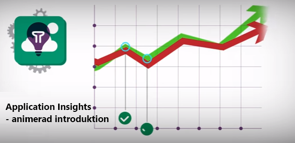](https://www.youtube.com/watch?v=fX2NtGrh-Y0)

> [!VIDEO https://channel9.msdn.com/events/Connect/2016/100/player] 

<!--Link references-->

[android]: https://github.com/Microsoft/ApplicationInsights-Android
[azure]: ../insights-perf-analytics.md
[client]: app-insights-javascript.md
[desktop]: app-insights-windows-desktop.md
[detect]: app-insights-detect-triage-diagnose.md
[greenbrown]: app-insights-asp-net.md
[ios]: https://github.com/Microsoft/ApplicationInsights-iOS
[java]: app-insights-java-get-started.md
[knowUsers]: app-insights-web-track-usage.md
[platforms]: app-insights-platforms.md
[portal]: http://portal.azure.com/
[qna]: app-insights-troubleshoot-faq.md
[redfield]: app-insights-monitor-performance-live-website-now.md
