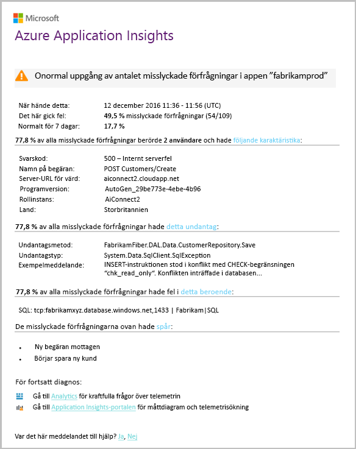

# Identifiering – fel avvikelser för smartkortSmart Detection - Failure Anomalies
[Application Insights](app-insights-overview.md) automatiskt meddelar dig i nära realtid om ditt webbprogram påträffar en onormal ökning hello antal misslyckade begäranden.[Application Insights](app-insights-overview.md) automatically notifies you in near real time if your web app experiences an abnormal rise in hello rate of failed requests. Den identifierar en onormal ökning av hello frekvensen för HTTP-begäranden eller beroendeanrop som rapporteras som misslyckad.It detects an unusual rise in hello rate of HTTP requests or dependency calls that are reported as failed. För begäranden är misslyckade begäranden vanligtvis de med svarskoder 400 eller högre.For requests, failed requests are usually those with response codes of 400 or higher. toohelp du hantera och diagnostisera problem hello en analys av hello egenskaper hello fel och relaterad telemetri tillhandahålls i hello-meddelande.toohelp you triage and diagnose hello problem, an analysis of hello characteristics of hello failures and related telemetry is provided in hello notification. Det finns även länkar toohello Application Insights-portalen för ytterligare diagnos.There are also links toohello Application Insights portal for further diagnosis. hello funktionen behöver ingen installation eller konfiguration, eftersom den använder maskininlärning algoritmer toopredict hello normal felintervall.hello feature needs no set-up nor configuration, as it uses machine learning algorithms toopredict hello normal failure rate.

Den här funktionen fungerar för Java- och ASP.NET-webbprogram, finns i molnet hello eller egna servrar.This feature works for Java and ASP.NET web apps, hosted in hello cloud or on your own servers. Den fungerar även för alla appar som genererar begäran eller beroende telemetri – till exempel om du har en arbetsroll som anropar [TrackRequest()](app-insights-api-custom-events-metrics.md#trackrequest) eller [TrackDependency()](app-insights-api-custom-events-metrics.md#trackdependency).It also works for any app that generates request or dependency telemetry - for example, if you have a worker role that calls [TrackRequest()](app-insights-api-custom-events-metrics.md#trackrequest) or [TrackDependency()](app-insights-api-custom-events-metrics.md#trackdependency).

När du har installerat [Programinsikter för ditt projekt](app-insights-overview.md), och om din app genererar en viss minsta mängd telemetri, Smart identifiering av fel avvikelser tar 24 timmar toolearn hello normalt beteende för din app, innan den slås på och skicka aviseringar.After setting up [Application Insights for your project](app-insights-overview.md), and provided your app generates a certain minimum amount of telemetry, Smart Detection of failure anomalies takes 24 hours toolearn hello normal behavior of your app, before it is switched on and can send alerts.

Här är aviseringen.Here's a sample alert.

> [!NOTE]
> Som standard kan du få ett kortare format e-postmeddelande än det här exemplet.By default, you get a shorter format mail than this example. Men du kan [växel toothis detaljerat format](#configure-alerts).But you can [switch toothis detailed format](#configure-alerts).
>
>

Observera att du får meddelande:Notice that it tells you:

* Hej felintervall jämfört med toonormal Apps beteende.hello failure rate compared toonormal app behavior.
* Hur många användare påverkas – så att du vet hur mycket tooworry.How many users are affected – so you know how much tooworry.
* Ett servicenivåmått mönster som är associerade med hello-fel.A characteristic pattern associated with hello failures. I det här exemplet finns ett visst svarskod, begäran namn (åtgärden) och programversion.In this example, there’s a particular response code, request name (operation) and app version. Som anger du omedelbart där toostart söker i koden.That immediately tells you where toostart looking in your code. Andra möjligheter kan vara ett specifikt operativsystem webbläsare eller klienten.Other possibilities could be a specific browser or client operating system.
* hello undantag och loggspårningar beroendefel (databaser eller andra externa komponenter) som visas toobe som är associerade med hello kännetecknas fel.hello exception, log traces, and dependency failure (databases or other external components) that appear toobe associated with hello characterized failures.
* Länkar direkt toorelevant sökningar hello telemetri i Application Insights.Links directly toorelevant searches on hello telemetry in Application Insights.

## Fördelarna med Smart identifieringBenefits of Smart Detection
Vanlig [mått aviseringar](app-insights-alerts.md) berättar om det kan finnas problem.Ordinary [metric alerts](app-insights-alerts.md) tell you there might be a problem. Men Smart identifiering startar hello diagnostiska arbete du utför mycket hello analys som du annars skulle ha toodo själv.But Smart Detection starts hello diagnostic work for you, performing a lot of hello analysis you would otherwise have toodo yourself. Du snabbt hello resultat snyggt paketeras hjälper dig att tooget toohello rot hello problem.You get hello results neatly packaged, helping you tooget quickly toohello root of hello problem.

## Hur det fungerarHow it works
Smart identifiering övervakar hello telemetri som tagits emot från din app och i särskilda hello fel priser.Smart  Detection monitors hello telemetry received from your app, and in particular hello failure rates. Den här regeln är hello antalet begäranden efter vilket Hej `Successful request` egenskapen är false och hello antal beroende anrop för vilka hello `Successful call` egenskapen är false.This rule counts hello number of requests for which hello `Successful request` property is false, and hello number of dependency calls for which hello `Successful call` property is false. För begäranden som standard `Successful request == (resultCode < 400)` (om du har skrivit anpassad kod för[filter](app-insights-api-filtering-sampling.md#filtering) eller skapa egna [TrackRequest](app-insights-api-custom-events-metrics.md#trackrequest) anrop).For requests, by default, `Successful request == (resultCode < 400)` (unless you have written custom code too[filter](app-insights-api-filtering-sampling.md#filtering) or generate your own [TrackRequest](app-insights-api-custom-events-metrics.md#trackrequest) calls). 

Prestanda för din app har en typisk beteendemönstret.Your app’s performance has a typical pattern of behavior. Vissa begäranden eller beroendeanrop kommer att orsaka toofailure än andra. och hello övergripande felintervall kan gå upp när belastningen ökar.Some requests or dependency calls will be more prone toofailure than others; and hello overall failure rate may go up as load increases. Smart identifiering använder maskininlärning toofind dessa avvikelser.Smart Detection uses machine learning toofind these anomalies.

Eftersom telemetri kommer till Application Insights från ditt webbprogram, jämför Smart identifiering hello aktuella beteende med hello mönster ses över hello senaste dagarna.As telemetry comes into Application Insights from your web app, Smart Detection compares hello current behavior with hello patterns seen over hello past few days. Om en onormal ökning av antalet misslyckade observeras förhållande tidigare prestanda, utlöses en analys.If an abnormal rise in failure rate is observed by comparison with previous performance, an analysis is triggered.

När en analys utlöses utför hello-tjänsten en kluster-analys hello misslyckade begäranden, tootry tooidentify ett mönster av värden som karakteriserar hello-fel.When an analysis is triggered, hello service performs a cluster analysis on hello failed request, tootry tooidentify a pattern of values that characterize hello failures. I hello-exemplet ovan identifierade hello analys att de flesta fel är om en specifik Resultatkod begäran namn, Server-URL-värden och rollinstans.In hello example above, hello analysis has discovered that most failures are about a specific result code, request name, Server URL host, and role instance. Däremot har hello analys upptäckt att hello klientegenskap operativsystem distribueras över flera värden och därför det inte visas.By contrast, hello analysis has discovered that hello client operating system property is distributed over multiple values, and so it is not listed.

När tjänsten är försett med dessa telemetri anrop, söker hello mätaren efter ett undantag och ett beroendefel som är associerade med begäranden i hello kluster har identifierat tillsammans med ett exempel på några loggar som är associerade med de begäranden.When your service is instrumented with these telemetry calls, hello analyser looks for an exception and a dependency failure that are associated with requests in hello cluster it has identified, together with an example of any trace logs associated with those requests.

hello resulterande analys skickas tooyou som aviseringen om du har inte konfigurerat den.hello resulting analysis is sent tooyou as alert, unless you have configured it not to.

Som hello [aviseringar du manuellt ange](app-insights-alerts.md), du kan inspektera hello tillståndet för hello avisering och konfigurerar det i hello aviseringar bladet för Application Insights-resurs.Like hello [alerts you set manually](app-insights-alerts.md), you can inspect hello state of hello alert and configure it in hello Alerts blade of your Application Insights resource. Men till skillnad från andra aviseringar som du inte behöver tooset upp eller konfigurerar Smart identifiering.But unlike other alerts, you don't need tooset up or configure Smart Detection. Om du vill kan du inaktivera det eller ändra dess mål e-postadresser.If you want, you can disable it or change its target email addresses.

## Konfigurera aviseringarConfigure alerts
Du kan inaktivera Smart identifiering, ändra hello e-postmottagare, skapa en webhook eller välja toomore detaljerad Varna meddelanden.You can disable Smart Detection, change hello email recipients, create a webhook, or opt in toomore detailed alert messages.

Öppna hello aviseringar.Open hello Alerts page. Fel avvikelser ingår tillsammans med eventuella aviseringar som du har angett manuellt och du kan se om det är för närvarande hello tillstånd för avisering.Failure Anomalies is included along with any alerts that you have set manually, and you can see whether it is currently in hello alert state.

Klicka på hello varning tooconfigure den.Click hello alert tooconfigure it.

Observera att du kan inaktivera Smart identifiering, men du kan inte ta bort (eller skapa en ny).Notice that you can disable Smart Detection, but you can't delete it (or create another one).

#### Detaljerad aviseringarDetailed alerts
Om du väljer ”Ta fram mer detaljerad diagnostik” innehåller flera diagnostikinformation hello e-post.If you select "Get more detailed diagnostics" then hello email will contain more diagnostic information. Ibland kommer du att kunna toodiagnose hello problemet bara från hello data i hello e-post.Sometimes you'll be able toodiagnose hello problem just from hello data in hello email.

Det finns en mindre risk att hello mer detaljerad avisering kan innehålla känslig information, eftersom den innehåller undantag och spåra meddelanden.There's a slight risk that hello more detailed alert could contain sensitive information, because it includes exception and trace messages. Detta kan dock bara hända om koden möjliggör känslig information i dessa meddelanden.However, this would only happen if your code could allow sensitive information into those messages.

## Triaging och diagnostisering av en aviseringTriaging and diagnosing an alert
En avisering som anger att en onormal ökning hello misslyckade förfrågningar har identifierats.An alert indicates that an abnormal rise in hello failed request rate was detected. Det är troligt att det finns problem med din app eller dess miljö.It's likely that there is some problem with your app or its environment.

Från hello procent av begäranden och antalet användare som påverkas, kan du bestämma hur brådskande hello problemet är.From hello percentage of requests and number of users affected, you can decide how urgent hello issue is. I hello-exemplet ovan, hello antalet misslyckade 22,5% Jämför med en normal andel % 1, anger att något händer.In hello example above, hello failure rate of 22.5% compares with a normal rate of 1%, indicates that something bad is going on. Hej på andra sidan, 11 endast användare som påverkats.On hello other hand, only 11 users were affected. Du kommer att kan tooassess hur allvarlig som om det vore din app.If it were your app, you'd be able tooassess how serious that is.

I många fall, kommer du att kunna toodiagnose hello problemet snabbt från hello begäran namn, undantag, beroende felet och spåra informationen.In many cases, you will be able toodiagnose hello problem quickly from hello request name, exception, dependency failure and trace data provided.

Det finns några andra ledtrådar.There are some other clues. Hello beroende felintervall i det här exemplet är hello samtidigt som hello undantag hastighet (89.3%).For example, hello dependency failure rate in this example is hello same as hello exception rate (89.3%). Detta tyder på att hello undantag uppstår direkt från hello beroendefel - ger en tydlig bild av var toostart söker i koden.This suggests that hello exception arises directly from hello dependency failure - giving you a clear idea of where toostart looking in your code.

tooinvestigate dessutom hello länkar i varje avsnitt leder raka tooa [söksidan](app-insights-diagnostic-search.md) filtrerade toohello relevanta begäranden, undantag, beroenden eller spår.tooinvestigate further, hello links in each section will take you straight tooa [search page](app-insights-diagnostic-search.md) filtered toohello relevant requests, exception, dependency or traces. Du kan också öppna hello [Azure-portalen](https://portal.azure.com), navigera toohello Application Insights-resurs för din app och öppna bladet för hello-fel.Or you can open hello [Azure portal](https://portal.azure.com), navigate toohello Application Insights resource for your app, and open hello Failures blade.

I det här exemplet öppnar genom att klicka på hello ”visa beroende fel information” länken hello Application Insights Sök bladet.In this example, clicking hello 'View dependency failures details' link opens hello Application Insights search blade. Den visar hello SQL-uttryck som innehåller ett exempel på hello rotorsaken: null-värden har angetts i obligatoriska fält och klarade inte valideringen under hello åtgärden för att spara.It shows hello SQL statement that has an example of hello root cause: NULLs were provided at mandatory fields and did not pass validation during hello save operation.

## Granska de senaste aviseringarnaReview recent alerts

Klicka på **Smart identifiering** tooget toohello senaste avisering:Click **Smart Detection** tooget toohello most recent alert:

## Vad är skillnaden hello...What's hello difference ...
Smart identifiering av fel avvikelser kompletterar andra liknande men olika funktioner i Application Insights.Smart Detection of failure anomalies complements other similar but distinct features of Application Insights.

* [Mått aviseringar](app-insights-alerts.md) anges av du och kan övervaka en mängd olika mått, till exempel CPU användandet begäran priser, sidinläsningstider och så vidare.[Metric Alerts](app-insights-alerts.md) are set by you and can monitor a wide range of metrics such as CPU occupancy, request rates,  page load times, and so on. Du kan använda dem toowarn du till exempel om du behöver tooadd mer resurser.You can use them toowarn you, for example, if you need tooadd more resources. Däremot omfattar Smart identifiering av fel avvikelser en liten uppsättning viktiga mått (för närvarande endast misslyckade förfrågningar), utformats toonotify dig i nära realtid sätt när misslyckade förfrågningar för ditt webbprogram ökar avsevärt jämfört med tooweb app normalt beteende.By contrast, Smart Detection of failure anomalies covers a small range of critical metrics (currently only failed request rate), designed toonotify you in near real time manner once your web app's failed request rate increases significantly compared tooweb app's normal behavior.

    Smart identifiering justeras automatiskt sitt tröskelvärde i svaret tooprevailing villkor.Smart Detection automatically adjusts its threshold in response tooprevailing conditions.

    Smart identifiering startar hello diagnostiska fungerar.Smart Detection starts hello diagnostic work for you.
* [Identifiering av prestandaavvikelser för smartkort](app-insights-proactive-performance-diagnostics.md) också använder datorn intelligence toodiscover ovanliga mönster i din mått och krävs ingen konfiguration av dig.[Smart Detection of performance anomalies](app-insights-proactive-performance-diagnostics.md) also uses machine intelligence toodiscover unusual patterns in your metrics, and no configuration by you is required. Men till skillnad från Smart identifiering av fel avvikelser hello Smart identifiering av prestandaavvikelser syftar toofind segment för din användning samlingsrör som felaktigt kan hanteras, till exempel specifika sidor på en viss typ av webbläsare.But unlike Smart Detection of failure anomalies, hello purpose of Smart  Detection of performance anomalies is toofind segments of your usage manifold that might be badly served - for example, by specific pages on a specific type of browser. hello analys utförs varje dag och om något resultat hittas, är det troligt toobe mycket mindre brådskande än en avisering.hello analysis is performed daily, and if any result is found, it's likely toobe much less urgent than an alert. Däremot hello analys för fel avvikelser utförs kontinuerligt inkommande telemetri och du meddelas inom minuter om priser för server-felet är större än förväntat.By contrast, hello analysis for failure anomalies is performed continuously on incoming telemetry, and you will be notified within minutes if server failure rates are greater than expected.

## Om du får en avisering om smarta identifieringIf you receive a Smart Detection alert
*Varför fått den här aviseringen?**Why have I received this alert?*

* Vi har upptäckt en onormal ökning av misslyckade begäranden hastighet jämfört med toohello normal baslinje för hello föregående period.We detected an abnormal rise in failed requests rate compared toohello normal baseline of hello preceding period. Vi tror att det finns ett problem som bör du fundera på att efter analys av hello fel och associerade telemetri.After analysis of hello failures and associated telemetry, we think that there is a problem that you should look into.

*Innebär hello-meddelande jag definitivt har problem?**Does hello notification mean I definitely have a problem?*

* Vi försöker tooalert på app avbrott eller försämring, men bara du kan förstå hello semantik och hello påverkan på hello app eller användare.We try tooalert on app disruption or degradation, but only you can fully understand hello semantics and hello impact on hello app or users.

*Så är fallet bör du guys tittar på Mina data?**So, you guys look at my data?*

* Nej.No. hello-tjänsten är helt automatisk.hello service is entirely automatic. Bara hämta hello meddelanden.Only you get hello notifications. Dina data är [privata](app-insights-data-retention-privacy.md).Your data is [private](app-insights-data-retention-privacy.md).

*Måste jag toosubscribe toothis aviseringen?**Do I have toosubscribe toothis alert?*

* Nej.No. Alla program som skickar begärande telemetri har hello Smart avisering identifieringsregeln.Every application that sends request telemetry has hello Smart Detection alert rule.

*Kan jag säga upp prenumerationen eller hämta hello-meddelanden som skickas toomy kollegor i stället?**Can I unsubscribe or get hello notifications sent toomy colleagues instead?*

* Ja, i Varningsregler, klicka på hello Smart identifiering regeln tooconfigure den.Yes, In Alert rules, click hello Smart Detection rule tooconfigure it. Du kan inaktivera hello aviseringen eller ändra mottagarna för hello aviseringen.You can disable hello alert, or change recipients for hello alert.

*Gick förlorad hello e-post. Var hittar jag hello meddelanden i hello portal?**I lost hello email. Where can I find hello notifications in hello portal?*

* I hello aktivitetsloggar.In hello Activity logs. Öppna hello Application Insights-resurs för din app i Azure, och välj aktivitetsloggar.In Azure, open hello Application Insights resource for your app, then select Activity logs.

*Vissa av hello aviseringar om kända problem och vill inte tooreceive dem.**Some of hello alerts are about known issues and I do not want tooreceive them.*

* Vi har aviseringsundertryckning på vår eftersläpning.We have alert suppression on our backlog.

## Nästa stegNext steps
Dessa verktyg för Nätverksdiagnostik hjälpa dig att inspektera hello telemetri från din app:These diagnostic tools help you inspect hello telemetry from your app:

* [Mått explorerMetric explorer](app-insights-metrics-explorer.md)
* [Sök explorerSearch explorer](app-insights-diagnostic-search.md)
* [Analytics - frågespråket kraftfullaAnalytics - powerful query language](app-insights-analytics-tour.md)

Smart identifieringar är helt automatisk.Smart detections are completely automatic. Men du kanske vill tooset in några fler aviseringar?But maybe you'd like tooset up some more alerts?

* [Manuellt konfigurerade mått aviseringarManually configured metric alerts](app-insights-alerts.md)
* [Tillgänglighetstester för webbprogramAvailability web tests](app-insights-monitor-web-app-availability.md)
