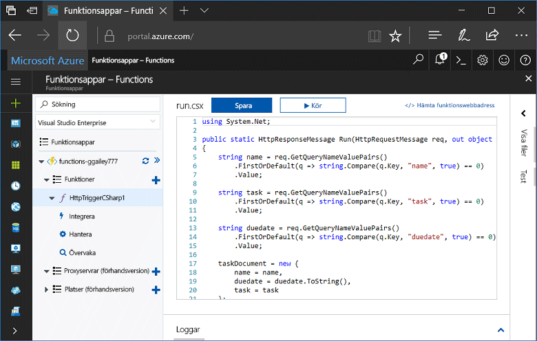
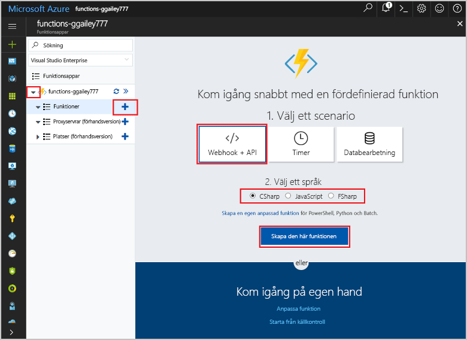
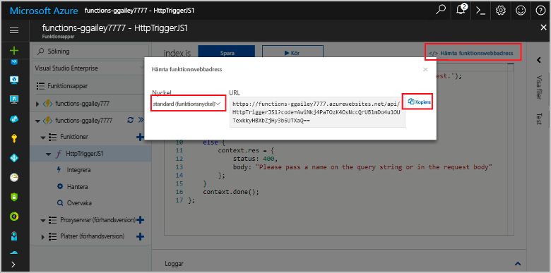
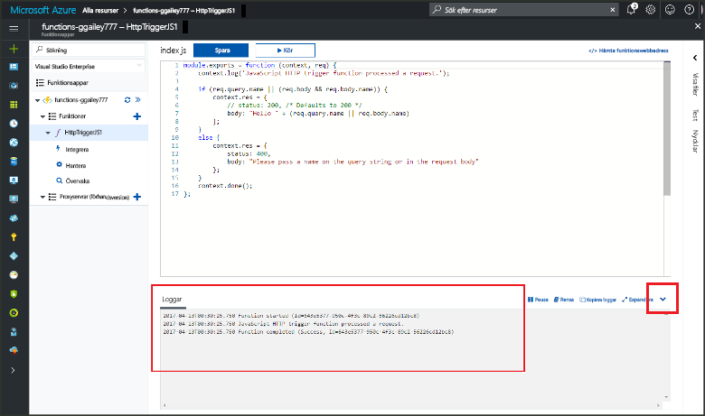

# Skapa din första funktion i hello Azure-portalen

Azure Functions kan du köra din kod i en miljö med serverlösa utan toofirst skapa en virtuell dator eller publicera ett webbprogram. I det här avsnittet lär du dig hur fungerar toouse toocreate ”hello world”-funktionen i hello Azure-portalen.

[!INCLUDE [quickstarts-free-trial-note](../../includes/quickstarts-free-trial-note.md)]

## Logga in tooAzure

Logga in toohello [Azure-portalen](https://portal.azure.com/).

## Skapa en funktionsapp

Du måste ha en funktion app toohost hello körningen av dina funktioner. I en funktionsapp kan du gruppera funktioner som en logisk enhet så att det blir enklare att hantera, distribuera och dela resurser. 

[!INCLUDE [Create function app Azure portal](../../includes/functions-create-function-app-portal.md)]

[!INCLUDE [functions-portal-favorite-function-apps](../../includes/functions-portal-favorite-function-apps.md)]

Därefter skapar du en funktion i hello ny funktionsapp.

## Skapa en HTTP-utlöst funktion

1. Expandera den nya funktion appen och klicka sedan på hello  **+**  knappen för nästa**funktioner**.

2.  I hello **komma igång snabbt** väljer **WebHook + API**, **väljer du ett språk** för din funktion och klickar på **skapa den här funktionen** . 
   
    

En funktion som har skapats i ditt valda språk med hjälp av hello mall för en HTTP-utlöses funktion. Du kan köra hello nya funktionen genom att skicka en HTTP-begäran.

## Testa hello-funktionen

1. Klicka på den nya funktionen **</> Hämta funktions-URL**, välj **Standard (funktionsnyckel)** och klicka sedan på **Kopiera**. 

    

2. Klistra in hello funktions-URL i adressfältet i webbläsaren. Lägg till hello frågesträngen `&name=<yourname>` toothis URL och tryck på hello `Enter` nyckel på tangentbordet tooexecute hello begäran. hello följande är ett exempel på hello svaret som returnerades av hello-funktionen i hello Edge-webbläsaren:

    

    hello begäran URL innehåller en nyckel som krävs, som standard tooaccess din funktion via HTTP.   

3. När din funktion körs, skrivs spårningsinformation toohello loggar. toosee hello spårningsutdata från hello tidigare körning och returnera tooyour funktion i hello portal och klicka på hello UPPIL längst hello hello skärmen tooexpand **loggar**. 

   

## Rensa resurser

[!INCLUDE [Clean up resources](../../includes/functions-quickstart-cleanup.md)]

## Nästa steg

Du har nu skapat en funktionsapp med en enkel HTTP-utlöst funktion.  

[!INCLUDE [Next steps note](../../includes/functions-quickstart-next-steps.md)]

Mer information finns i [Azure Functions HTTP and webhook bindings](functions-bindings-http-webhook.md) (HTTP- och webhookbindningar i Azure Functions).

