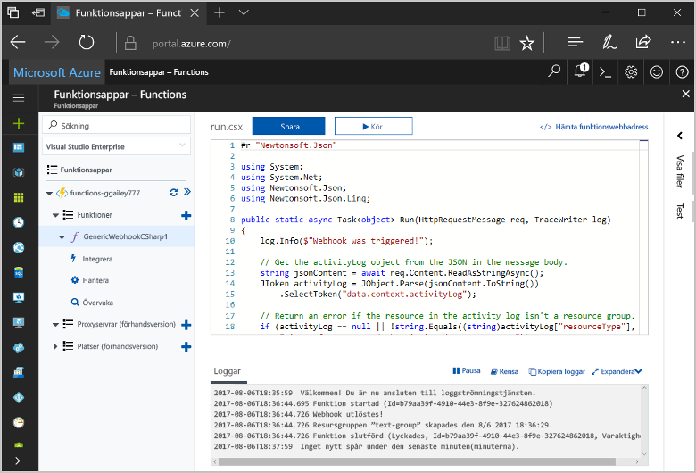
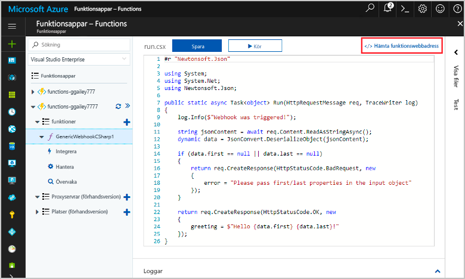
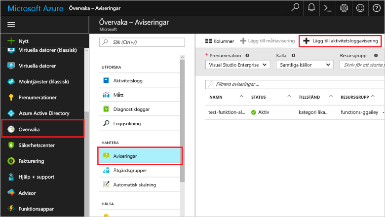
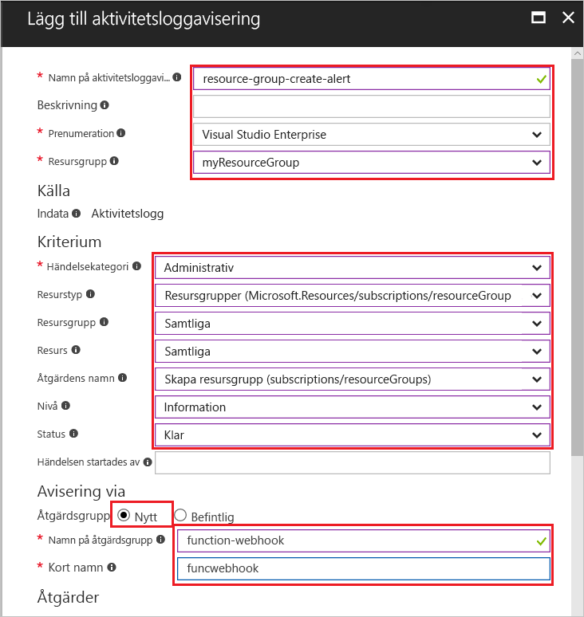
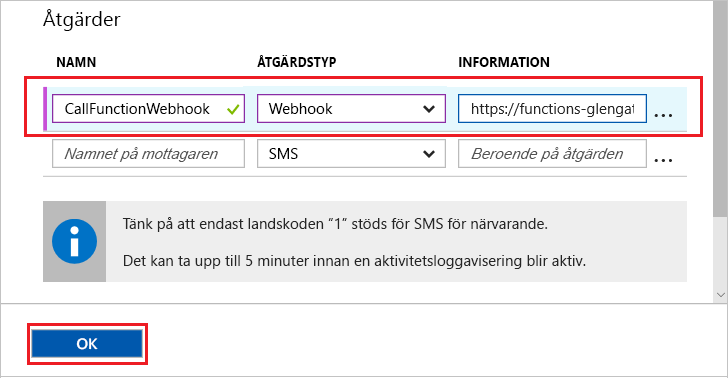
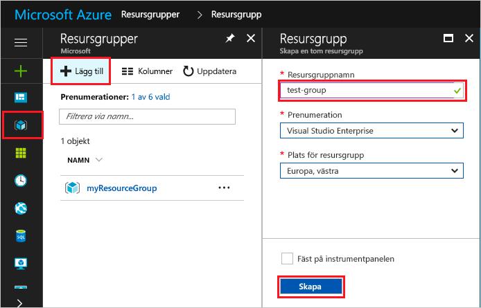
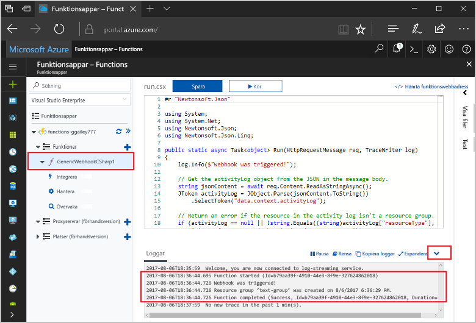

# <a name="create-a-function-triggered-by-a-generic-webhook"></a><span data-ttu-id="29549-103">Skapa en funktion som utlöses av en allmän webhook</span><span class="sxs-lookup"><span data-stu-id="29549-103">Create a function triggered by a generic webhook</span></span>

<span data-ttu-id="29549-104">Azure Functions kan du köra din kod i en miljö med serverlösa utan toofirst skapa en virtuell dator eller publicera ett webbprogram.</span><span class="sxs-lookup"><span data-stu-id="29549-104">Azure Functions lets you execute your code in a serverless environment without having toofirst create a VM or publish a web application.</span></span> <span data-ttu-id="29549-105">Du kan till exempel konfigurera en funktion toobe som utlöses av en avisering som skapats av Azure-Monitor.</span><span class="sxs-lookup"><span data-stu-id="29549-105">For example, you can configure a function toobe triggered by an alert raised by Azure Monitor.</span></span> <span data-ttu-id="29549-106">Det här avsnittet visar hur tooexecute C#-kod när en resursgrupp är läggs tooyour prenumeration.</span><span class="sxs-lookup"><span data-stu-id="29549-106">This topic shows you how tooexecute C# code when a resource group is added tooyour subscription.</span></span>   



## <a name="prerequisites"></a><span data-ttu-id="29549-108">Krav</span><span class="sxs-lookup"><span data-stu-id="29549-108">Prerequisites</span></span> 

<span data-ttu-id="29549-109">toocomplete den här kursen:</span><span class="sxs-lookup"><span data-stu-id="29549-109">toocomplete this tutorial:</span></span>

+ <span data-ttu-id="29549-110">Om du inte har en Azure-prenumeration kan du skapa ett [kostnadsfritt konto](https://azure.microsoft.com/free/?WT.mc_id=A261C142F) innan du börjar.</span><span class="sxs-lookup"><span data-stu-id="29549-110">If you don't have an Azure subscription, create a [free account](https://azure.microsoft.com/free/?WT.mc_id=A261C142F) before you begin.</span></span>

[!INCLUDE [functions-portal-favorite-function-apps](../../includes/functions-portal-favorite-function-apps.md)]

## <a name="create-an-azure-function-app"></a><span data-ttu-id="29549-111">Skapa en Azure Functions-app</span><span class="sxs-lookup"><span data-stu-id="29549-111">Create an Azure Function app</span></span>

[!INCLUDE [Create function app Azure portal](../../includes/functions-create-function-app-portal.md)]

<span data-ttu-id="29549-112">Därefter skapar du en funktion i hello ny funktionsapp.</span><span class="sxs-lookup"><span data-stu-id="29549-112">Next, you create a function in hello new function app.</span></span>

## <span data-ttu-id="29549-113"><a name="create-function"></a>Skapa en allmän webhook utlöses-funktion</span><span class="sxs-lookup"><span data-stu-id="29549-113"><a name="create-function"></a>Create a generic webhook triggered function</span></span>

1. <span data-ttu-id="29549-114">Expandera funktionen appen och klicka på hello  **+**  knappen för nästa**funktioner**.</span><span class="sxs-lookup"><span data-stu-id="29549-114">Expand your function app and click hello **+** button next too**Functions**.</span></span> <span data-ttu-id="29549-115">Om den här funktionen är hello förstnämnda i funktionen appen, Välj **anpassad funktionen**.</span><span class="sxs-lookup"><span data-stu-id="29549-115">If this function is hello first one in your function app, select **Custom function**.</span></span> <span data-ttu-id="29549-116">Detta visar hello fullständig uppsättning funktionen mallar.</span><span class="sxs-lookup"><span data-stu-id="29549-116">This displays hello complete set of function templates.</span></span>

    

2. <span data-ttu-id="29549-118">Välj hello **allmän WebHook - C#** mall.</span><span class="sxs-lookup"><span data-stu-id="29549-118">Select hello **Generic WebHook - C#** template.</span></span> <span data-ttu-id="29549-119">Skriv ett namn för ditt C#-funktionen och sedan välja **skapa**.</span><span class="sxs-lookup"><span data-stu-id="29549-119">Type a name for your C# function, then select **Create**.</span></span>

      

2. <span data-ttu-id="29549-121">Klicka på den nya funktionen **<> / Get funktions-URL**, kopiera och spara hello värde.</span><span class="sxs-lookup"><span data-stu-id="29549-121">In your new function, click **</> Get function URL**, then copy and save hello value.</span></span> <span data-ttu-id="29549-122">Du kan använda det här värdet tooconfigure hello webhooken.</span><span class="sxs-lookup"><span data-stu-id="29549-122">You use this value tooconfigure hello webhook.</span></span> 

    
         
<span data-ttu-id="29549-124">Därefter skapar du en webhook-slutpunkt i en aktivitet loggen avisering i Azure-Monitor.</span><span class="sxs-lookup"><span data-stu-id="29549-124">Next, you create a webhook endpoint in an activity log alert in Azure Monitor.</span></span> 

## <a name="create-an-activity-log-alert"></a><span data-ttu-id="29549-125">Skapa en aktivitet loggen avisering</span><span class="sxs-lookup"><span data-stu-id="29549-125">Create an activity log alert</span></span>

1. <span data-ttu-id="29549-126">I hello Azure portal, navigerar toohello **övervakaren** tjänsten, Välj **aviseringar**, och klicka på **Lägg till aktivitet loggen avisering**.</span><span class="sxs-lookup"><span data-stu-id="29549-126">In hello Azure portal, navigate toohello **Monitor** service, select **Alerts**, and click **Add activity log alert**.</span></span>   

    

2. <span data-ttu-id="29549-128">Använda hello inställningar som anges i hello tabell:</span><span class="sxs-lookup"><span data-stu-id="29549-128">Use hello settings as specified in hello table:</span></span>

    

    | <span data-ttu-id="29549-130">Inställning</span><span class="sxs-lookup"><span data-stu-id="29549-130">Setting</span></span>      |  <span data-ttu-id="29549-131">Föreslaget värde</span><span class="sxs-lookup"><span data-stu-id="29549-131">Suggested value</span></span>   | <span data-ttu-id="29549-132">Beskrivning</span><span class="sxs-lookup"><span data-stu-id="29549-132">Description</span></span>                              |
    | ------------ |  ------- | -------------------------------------------------- |
    | <span data-ttu-id="29549-133">**Aktiviteten loggnamn för avisering**</span><span class="sxs-lookup"><span data-stu-id="29549-133">**Activity log alert name**</span></span> | <span data-ttu-id="29549-134">resurs-grupp-skapa-avisering</span><span class="sxs-lookup"><span data-stu-id="29549-134">resource-group-create-alert</span></span> | <span data-ttu-id="29549-135">Namnet på loggen varning hello.</span><span class="sxs-lookup"><span data-stu-id="29549-135">Name of hello activity log alert.</span></span> |
    | <span data-ttu-id="29549-136">**Prenumeration**</span><span class="sxs-lookup"><span data-stu-id="29549-136">**Subscription**</span></span> | <span data-ttu-id="29549-137">Din prenumeration</span><span class="sxs-lookup"><span data-stu-id="29549-137">Your subscription</span></span> | <span data-ttu-id="29549-138">hello-prenumeration som du använder för den här kursen.</span><span class="sxs-lookup"><span data-stu-id="29549-138">hello subscription you are using for this tutorial.</span></span> | 
    |  <span data-ttu-id="29549-139">**Resursgrupp**</span><span class="sxs-lookup"><span data-stu-id="29549-139">**Resource Group**</span></span> | <span data-ttu-id="29549-140">myResourceGroup</span><span class="sxs-lookup"><span data-stu-id="29549-140">myResourceGroup</span></span> | <span data-ttu-id="29549-141">hello resursgrupp som hello avisering resurser har distribuerats till.</span><span class="sxs-lookup"><span data-stu-id="29549-141">hello resource group that hello alert resources are deployed to.</span></span> <span data-ttu-id="29549-142">Med hjälp av hello samma resursgrupp som appen funktionen gör det enklare tooclean när du har slutfört hello kursen.</span><span class="sxs-lookup"><span data-stu-id="29549-142">Using hello same resource group as your function app makes it easier tooclean up after you complete hello tutorial.</span></span> |
    | <span data-ttu-id="29549-143">**Händelsekategori**</span><span class="sxs-lookup"><span data-stu-id="29549-143">**Event category**</span></span> | <span data-ttu-id="29549-144">Administrativa</span><span class="sxs-lookup"><span data-stu-id="29549-144">Administrative</span></span> | <span data-ttu-id="29549-145">Den här kategorin innehåller ändringar som gjorts tooAzure resurser.</span><span class="sxs-lookup"><span data-stu-id="29549-145">This category includes changes made tooAzure resources.</span></span>  |
    | <span data-ttu-id="29549-146">**Resurstyp**</span><span class="sxs-lookup"><span data-stu-id="29549-146">**Resource type**</span></span> | <span data-ttu-id="29549-147">Resursgrupper</span><span class="sxs-lookup"><span data-stu-id="29549-147">Resource groups</span></span> | <span data-ttu-id="29549-148">Filtrerar aviseringar tooresource gruppaktiviteter.</span><span class="sxs-lookup"><span data-stu-id="29549-148">Filters alerts tooresource group activities.</span></span> |
    | <span data-ttu-id="29549-149">**Resursgrupp**</span><span class="sxs-lookup"><span data-stu-id="29549-149">**Resource Group**</span></span><br/><span data-ttu-id="29549-150">och **resurs**</span><span class="sxs-lookup"><span data-stu-id="29549-150">and **Resource**</span></span> | <span data-ttu-id="29549-151">Alla</span><span class="sxs-lookup"><span data-stu-id="29549-151">All</span></span> | <span data-ttu-id="29549-152">Övervaka alla resurser.</span><span class="sxs-lookup"><span data-stu-id="29549-152">Monitor all resources.</span></span> |
    | <span data-ttu-id="29549-153">**Åtgärdsnamn**</span><span class="sxs-lookup"><span data-stu-id="29549-153">**Operation name**</span></span> | <span data-ttu-id="29549-154">Skapa resursgrupp</span><span class="sxs-lookup"><span data-stu-id="29549-154">Create Resource Group</span></span> | <span data-ttu-id="29549-155">Filtrerar aviseringar toocreate åtgärder.</span><span class="sxs-lookup"><span data-stu-id="29549-155">Filters alerts toocreate operations.</span></span> |
    | <span data-ttu-id="29549-156">**Nivå**</span><span class="sxs-lookup"><span data-stu-id="29549-156">**Level**</span></span> | <span data-ttu-id="29549-157">Information</span><span class="sxs-lookup"><span data-stu-id="29549-157">Informational</span></span> | <span data-ttu-id="29549-158">Omfatta nivå informationsaviseringar.</span><span class="sxs-lookup"><span data-stu-id="29549-158">Include informational level alerts.</span></span> | 
    | <span data-ttu-id="29549-159">**Status**</span><span class="sxs-lookup"><span data-stu-id="29549-159">**Status**</span></span> | <span data-ttu-id="29549-160">Lyckades</span><span class="sxs-lookup"><span data-stu-id="29549-160">Succeeded</span></span> | <span data-ttu-id="29549-161">Filtrerar tooactions för aviseringar som har slutförts.</span><span class="sxs-lookup"><span data-stu-id="29549-161">Filters alerts tooactions that have completed successfully.</span></span> |
    | <span data-ttu-id="29549-162">**Grupp**</span><span class="sxs-lookup"><span data-stu-id="29549-162">**Action group**</span></span> | <span data-ttu-id="29549-163">Ny</span><span class="sxs-lookup"><span data-stu-id="29549-163">New</span></span> | <span data-ttu-id="29549-164">Skapa en ny åtgärdsgrupp, som definierar hello åtgärden tar när en avisering utlöses.</span><span class="sxs-lookup"><span data-stu-id="29549-164">Create a new action group, which defines hello action takes when an alert is raised.</span></span> |
    | <span data-ttu-id="29549-165">**Åtgärden gruppnamn**</span><span class="sxs-lookup"><span data-stu-id="29549-165">**Action group name**</span></span> | <span data-ttu-id="29549-166">funktionen webhooken</span><span class="sxs-lookup"><span data-stu-id="29549-166">function-webhook</span></span> | <span data-ttu-id="29549-167">En tooidentify hello åtgärd gruppnamnet.</span><span class="sxs-lookup"><span data-stu-id="29549-167">A name tooidentify hello action group.</span></span>  | 
    | <span data-ttu-id="29549-168">**Kort namn**</span><span class="sxs-lookup"><span data-stu-id="29549-168">**Short name**</span></span> | <span data-ttu-id="29549-169">funcwebhook</span><span class="sxs-lookup"><span data-stu-id="29549-169">funcwebhook</span></span> | <span data-ttu-id="29549-170">Ett kort namn för hello grupp.</span><span class="sxs-lookup"><span data-stu-id="29549-170">A short name for hello action group.</span></span> |  

3. <span data-ttu-id="29549-171">I **åtgärder**, lägga till en åtgärd med hello inställningar som anges i hello tabell:</span><span class="sxs-lookup"><span data-stu-id="29549-171">In **Actions**, add an action using hello settings as specified in hello table:</span></span> 

    

    | <span data-ttu-id="29549-173">Inställning</span><span class="sxs-lookup"><span data-stu-id="29549-173">Setting</span></span>      |  <span data-ttu-id="29549-174">Föreslaget värde</span><span class="sxs-lookup"><span data-stu-id="29549-174">Suggested value</span></span>   | <span data-ttu-id="29549-175">Beskrivning</span><span class="sxs-lookup"><span data-stu-id="29549-175">Description</span></span>                              |
    | ------------ |  ------- | -------------------------------------------------- |
    | <span data-ttu-id="29549-176">**Namn**</span><span class="sxs-lookup"><span data-stu-id="29549-176">**Name**</span></span> | <span data-ttu-id="29549-177">CallFunctionWebhook</span><span class="sxs-lookup"><span data-stu-id="29549-177">CallFunctionWebhook</span></span> | <span data-ttu-id="29549-178">Ett namn för hello åtgärden.</span><span class="sxs-lookup"><span data-stu-id="29549-178">A name for hello action.</span></span> |
    | <span data-ttu-id="29549-179">**Åtgärdstyp**</span><span class="sxs-lookup"><span data-stu-id="29549-179">**Action type**</span></span> | <span data-ttu-id="29549-180">Webhook</span><span class="sxs-lookup"><span data-stu-id="29549-180">Webhook</span></span> | <span data-ttu-id="29549-181">hello svar toohello aviseringen är att en Webhooksadressen anropas.</span><span class="sxs-lookup"><span data-stu-id="29549-181">hello response toohello alert is that a Webhook URL is called.</span></span> |
    | <span data-ttu-id="29549-182">**Detaljer**</span><span class="sxs-lookup"><span data-stu-id="29549-182">**Details**</span></span> | <span data-ttu-id="29549-183">Funktions-URL</span><span class="sxs-lookup"><span data-stu-id="29549-183">Function URL</span></span> | <span data-ttu-id="29549-184">Klistra in i hello Webhooksadressen för hello-funktion som du kopierade tidigare.</span><span class="sxs-lookup"><span data-stu-id="29549-184">Paste in hello webhook URL of hello function that you copied earlier.</span></span> |<span data-ttu-id="29549-185">v</span><span class="sxs-lookup"><span data-stu-id="29549-185">v</span></span>

4. <span data-ttu-id="29549-186">Klicka på **OK** toocreate hello aviseringen och åtgärden grupp.</span><span class="sxs-lookup"><span data-stu-id="29549-186">Click **OK** toocreate hello alert and action group.</span></span>  

<span data-ttu-id="29549-187">Hej webhook kallas nu när gruppen skapas i din prenumeration.</span><span class="sxs-lookup"><span data-stu-id="29549-187">hello webhook is now called when a resource group is created in your subscription.</span></span> <span data-ttu-id="29549-188">Därefter uppdaterar du hello kod i din funktion toohandle hello JSON loggdata i hello brödtext hello-begäran.</span><span class="sxs-lookup"><span data-stu-id="29549-188">Next, you update hello code in your function toohandle hello JSON log data in hello body of hello request.</span></span>   

## <a name="update-hello-function-code"></a><span data-ttu-id="29549-189">Uppdatera Funktionskoden hello</span><span class="sxs-lookup"><span data-stu-id="29549-189">Update hello function code</span></span>

1. <span data-ttu-id="29549-190">Gå tillbaka tooyour funktionsapp hello-portalen och expandera din funktion.</span><span class="sxs-lookup"><span data-stu-id="29549-190">Navigate back tooyour function app in hello portal, and expand your function.</span></span> 

2. <span data-ttu-id="29549-191">Ersätt hello C# skriptkod i hello-funktionen i hello portal med hello följande kod:</span><span class="sxs-lookup"><span data-stu-id="29549-191">Replace hello C# script code in hello function in hello portal with hello following code:</span></span>

    ```csharp
    #r "Newtonsoft.Json"
    
    using System;
    using System.Net;
    using Newtonsoft.Json;
    using Newtonsoft.Json.Linq;
    
    public static async Task<object> Run(HttpRequestMessage req, TraceWriter log)
    {
        log.Info($"Webhook was triggered!");
    
        // Get hello activityLog object from hello JSON in hello message body.
        string jsonContent = await req.Content.ReadAsStringAsync();
        JToken activityLog = JObject.Parse(jsonContent.ToString())
            .SelectToken("data.context.activityLog");
    
        // Return an error if hello resource in hello activity log isn't a resource group. 
        if (activityLog == null || !string.Equals((string)activityLog["resourceType"], 
            "Microsoft.Resources/subscriptions/resourcegroups"))
        {
            log.Error("An error occured");
            return req.CreateResponse(HttpStatusCode.BadRequest, new
            {
                error = "Unexpected message payload or wrong alert received."
            });
        }
    
        // Write information about hello created resource group toohello streaming log.
        log.Info(string.Format("Resource group '{0}' was {1} on {2}.",
            (string)activityLog["resourceGroupName"],
            ((string)activityLog["subStatus"]).ToLower(), 
            (DateTime)activityLog["submissionTimestamp"]));
    
        return req.CreateResponse(HttpStatusCode.OK);    
    }
    ```

<span data-ttu-id="29549-192">Nu kan du testa hello funktionen genom att skapa en ny resursgrupp i din prenumeration.</span><span class="sxs-lookup"><span data-stu-id="29549-192">Now you can test hello function by creating a new resource group in your subscription.</span></span>

## <a name="test-hello-function"></a><span data-ttu-id="29549-193">Testa hello-funktionen</span><span class="sxs-lookup"><span data-stu-id="29549-193">Test hello function</span></span>

1. <span data-ttu-id="29549-194">Klickar du på ikonen hello resurs grupp hello till vänster i hello Azure portal, Välj **+ Lägg till**, ange ett **resursgruppnamn**, och välj **skapa** toocreate en tom resursgrupp.</span><span class="sxs-lookup"><span data-stu-id="29549-194">Click hello resource group icon in hello left of hello Azure portal, select **+ Add**, type a **Resource group name**, and select **Create** toocreate an empty resource group.</span></span>
    
    

2. <span data-ttu-id="29549-196">Gå tillbaka tooyour och expandera hello **loggar** fönster.</span><span class="sxs-lookup"><span data-stu-id="29549-196">Go back tooyour function and expand hello **Logs** window.</span></span> <span data-ttu-id="29549-197">När du har skapat hello resursgruppen hello aktivitet loggen avisering utlösare hello webhook och hello funktionen körs.</span><span class="sxs-lookup"><span data-stu-id="29549-197">After hello resource group is created, hello activity log alert triggers hello webhook and hello function executes.</span></span> <span data-ttu-id="29549-198">Du kan se hello namn hello ny resursgrupp skrivs toohello loggar.</span><span class="sxs-lookup"><span data-stu-id="29549-198">You see hello name of hello new resource group written toohello logs.</span></span>  

    

3. <span data-ttu-id="29549-200">(Valfritt) Gå tillbaka och ta bort hello resursgruppen som du skapade.</span><span class="sxs-lookup"><span data-stu-id="29549-200">(Optional) Go back and delete hello resource group that you created.</span></span> <span data-ttu-id="29549-201">Observera att den här aktiviteten inte utlöses hello-funktionen.</span><span class="sxs-lookup"><span data-stu-id="29549-201">Note that this activity doesn't trigger hello function.</span></span> <span data-ttu-id="29549-202">Detta beror på att ta bort operations filtreras bort av hello aviseringen.</span><span class="sxs-lookup"><span data-stu-id="29549-202">This is because delete operations are filtered out by hello alert.</span></span> 

## <a name="clean-up-resources"></a><span data-ttu-id="29549-203">Rensa resurser</span><span class="sxs-lookup"><span data-stu-id="29549-203">Clean up resources</span></span>

[!INCLUDE [Next steps note](../../includes/functions-quickstart-cleanup.md)]

## <a name="next-steps"></a><span data-ttu-id="29549-204">Nästa steg</span><span class="sxs-lookup"><span data-stu-id="29549-204">Next steps</span></span>

<span data-ttu-id="29549-205">Du har skapat en funktion som körs när en begäran tas emot från en allmän webhook.</span><span class="sxs-lookup"><span data-stu-id="29549-205">You have created a function that runs when a request is received from a generic webhook.</span></span> 

[!INCLUDE [Next steps note](../../includes/functions-quickstart-next-steps.md)]

<span data-ttu-id="29549-206">Mer information om webhook-utlösare finns i [Azure Functions HTTP och webhook-bindningar](functions-bindings-http-webhook.md).</span><span class="sxs-lookup"><span data-stu-id="29549-206">For more information about webhook triggers, see [Azure Functions HTTP and webhook bindings](functions-bindings-http-webhook.md).</span></span> <span data-ttu-id="29549-207">toolearn mer information om hur du utvecklar funktioner i C#, se [Azure Functions C# skript för utvecklare](functions-reference-csharp.md).</span><span class="sxs-lookup"><span data-stu-id="29549-207">toolearn more about developing functions in C#, see [Azure Functions C# script developer reference](functions-reference-csharp.md).</span></span>

