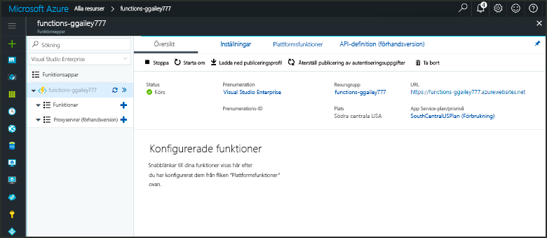

# Skapa en funktion som utlöses av en GitHub-webhookCreate a function triggered by a GitHub webhook

Lär dig hur toocreate en funktion som utlöses av en HTTP-begäran för webhook med en GitHub-specifika nyttolast.Learn how toocreate a function that is triggered by an HTTP webhook request with a GitHub-specific payload.

## KravPrerequisites

+ Ett GitHub-konto med minst ett projekt.A GitHub account with at least one project.
+ En Azure-prenumeration.An Azure subscription. Om du inte har ett konto kan du skapa ett [kostnadsfritt konto](https://azure.microsoft.com/free/?WT.mc_id=A261C142F) innan du börjar.If you don't have one, create a [free account](https://azure.microsoft.com/free/?WT.mc_id=A261C142F) before you begin.

[!INCLUDE [functions-portal-favorite-function-apps](../../includes/functions-portal-favorite-function-apps.md)]

## Skapa en Azure Functions-appCreate an Azure Function app

[!INCLUDE [Create function app Azure portal](../../includes/functions-create-function-app-portal.md)]

Därefter skapar du en funktion i hello ny funktionsapp.Next, you create a function in hello new function app.

## Skapa en webhook-utlöst GitHub-funktionCreate a GitHub webhook triggered function

1. Expandera funktionen appen och klicka på hello  **+**  knappen för nästa**funktioner**.Expand your function app and click hello **+** button next too**Functions**. Om det är första hello-funktion i din funktionsapp **anpassad funktionen**.If this is hello first function in your function app, select **Custom function**. Detta visar hello fullständig uppsättning funktionen mallar.This displays hello complete set of function templates.

    

2. Välj hello **GitHub-WebHook** mall för språket.Select hello **GitHub WebHook** template for your desired language. **Namnge funktionen** och klicka på **Skapa**.**Name your function**, then select **Create**.

      

3. Klicka på den nya funktionen **<> / Get funktions-URL**, kopiera och spara hello värden.In your new function, click **</> Get function URL**, then copy and save hello values. Hello samma sak för **<> / hämta GitHub hemlighet**.Do hello same thing for **</> Get GitHub secret**. Du kan använda dessa värden tooconfigure hello webhook i GitHub.You use these values tooconfigure hello webhook in GitHub.

    

Skapa sedan en webhook i GitHub-lagringsplatsen.Next, you create a webhook in your GitHub repository.

## Konfigurera hello-webhookConfigure hello webhook

1. Navigera tooa databasen som du äger i GitHub.In GitHub, navigate tooa repository that you own. Du kan också använda en lagringsplats du har förgrenat.You can also use any repository that you have forked. Om du behöver toofork en databas kan använda <https://github.com/Azure-Samples/functions-quickstart>.If you need toofork a repository, use <https://github.com/Azure-Samples/functions-quickstart>.

1. Klicka på **Inställningar**, klicka på **Webhooks** och klicka sedan på **Lägg till webhook**.Click **Settings**, then click **Webhooks**, and  **Add webhook**.

    

1. Använda inställningar som anges i hello tabell och klicka sedan på **lägga till webhook**.Use settings as specified in hello table, then click **Add webhook**.

    

| InställningSetting | Föreslaget värdeSuggested value | BeskrivningDescription |
|---|---|---|
| **Payload URL** (Webbadress för nyttolast)**Payload URL** | Kopierat värdeCopied value | Använd hello-värdet som returneras av **<> / Get funktions-URL**.Use hello value returned by  **</> Get function URL**. |
| **Hemlighet****Secret**   | Kopierat värdeCopied value | Använd hello-värdet som returneras av **<> / hämta GitHub hemlighet**.Use hello value returned by  **</> Get GitHub secret**. |
| **Innehållstyp****Content type** | application/jsonapplication/json | hello förväntar sig en JSON-nyttolast.hello function expects a JSON payload. |
| HändelseutlösareEvent triggers | Låt mig välja enskilda händelserLet me select individual events | Vi vill bara tootrigger på problemet kommentar händelser.We only want tootrigger on issue comment events.  |
| | ÄrendekommentarIssue comment |  |

Nu hello webhook är konfigurerade tootrigger din funktion när en ny problemet kommentar läggs.Now, hello webhook is configured tootrigger your function when a new issue comment is added.

## Testa hello-funktionenTest hello function

1. Öppna i GitHub-lagringsplatsen hello **problem** fliken i ett nytt webbläsarfönster.In your GitHub repository, open hello **Issues** tab in a new browser window.

1. I hello nya fönstret, klickar du på **nytt ärende**, Skriv ett namn och klicka sedan på **skicka nya**.In hello new window, click **New Issue**, type a title, and then click **Submit new issue**.

1. Skriv en kommentar i hello problemet, och klicka på **kommentar**.In hello issue, type a comment and click **Comment**.

    

1. Gå tillbaka toohello portal och visa hello loggar.Go back toohello portal and view hello logs. Du bör se en spårningspost med hello ny Kommentartext.You should see a trace entry with hello new comment text.

     

## Rensa resurserClean up resources

[!INCLUDE [Next steps note](../../includes/functions-quickstart-cleanup.md)]

## Nästa stegNext steps

Du har skapat en funktion som körs när en begäran tas emot från en GitHub-webhook.You have created a function that runs when a request is received from a GitHub webhook.

[!INCLUDE [Next steps note](../../includes/functions-quickstart-next-steps.md)]

Mer information om webhook-utlösare finns i [Azure Functions HTTP och webhook-bindningar](functions-bindings-http-webhook.md).For more information about webhook triggers, see [Azure Functions HTTP and webhook bindings](functions-bindings-http-webhook.md).
