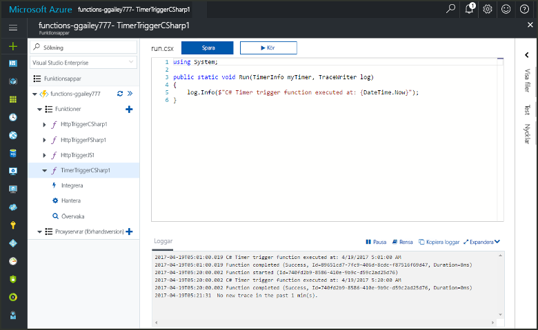
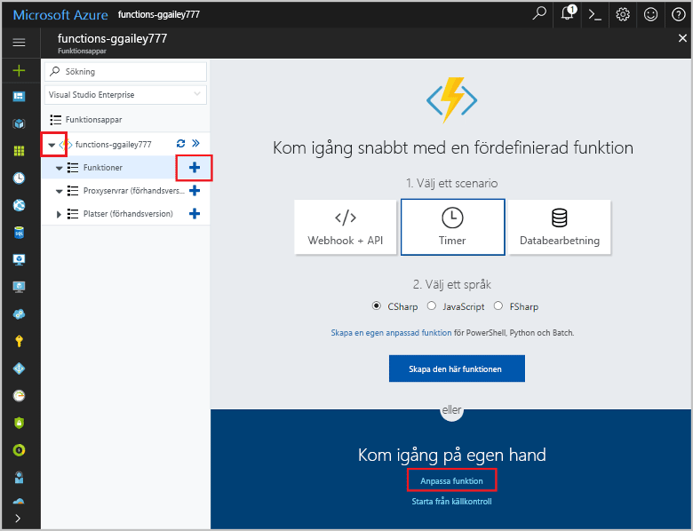
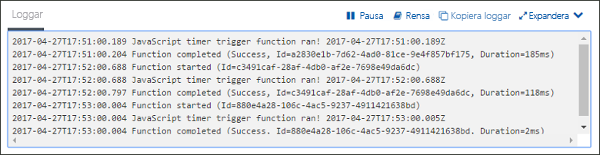
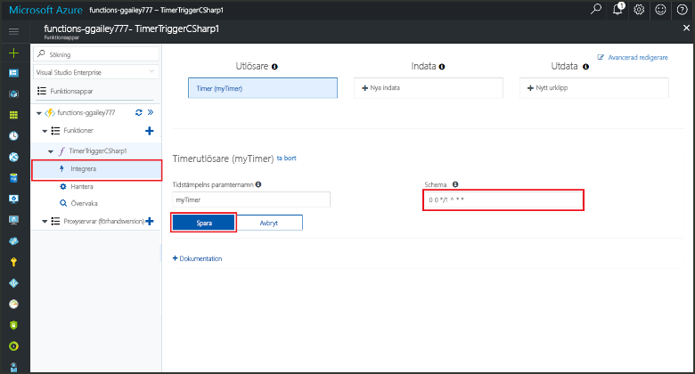

# Skapa en funktion i Azure som utlöses av en timerCreate a function in Azure that is triggered by a timer

Lär dig hur toouse Azure Functions toocreate en funktion som körs baserat ett schema som du definierar.Learn how toouse Azure Functions toocreate a function that runs based a schedule that you define.

## KravPrerequisites

toocomplete den här kursen:toocomplete this tutorial:

+ Om du inte har en Azure-prenumeration kan du skapa ett [kostnadsfritt konto](https://azure.microsoft.com/free/?WT.mc_id=A261C142F) innan du börjar.If you don't have an Azure subscription, create a [free account](https://azure.microsoft.com/free/?WT.mc_id=A261C142F) before you begin.

[!INCLUDE [functions-portal-favorite-function-apps](../../includes/functions-portal-favorite-function-apps.md)]

## Skapa en Azure Functions-appCreate an Azure Function app

[!INCLUDE [Create function app Azure portal](../../includes/functions-create-function-app-portal.md)]

Därefter skapar du en funktion i hello ny funktionsapp.Next, you create a function in hello new function app.

## Skapa en timerutlöst funktionCreate a timer triggered function

1. Expandera funktionen appen och klicka på hello ** + ** knappen för nästa**funktioner**.Expand your function app and click hello **+** button next too**Functions**. Om det är första hello-funktion i din funktionsapp **anpassad funktionen**.If this is hello first function in your function app, select **Custom function**. Detta visar hello fullständig uppsättning funktionen mallar.This displays hello complete set of function templates.

    

2. Välj hello **TimerTrigger** mall för språket.Select hello **TimerTrigger** template for your desired language. Använd sedan hello inställningar som anges i hello tabell:Then use hello settings as specified in hello table:

    

    | InställningSetting | Föreslaget värdeSuggested value | BeskrivningDescription |
    |---|---|---|
    | **Namnge din funktion****Name your function** | TimerTriggerCSharp1TimerTriggerCSharp1 | Definierar hello namn tidsinställda utlösts-funktionen.Defines hello name of your timer triggered function. |
    | **[Schema](http://en.wikipedia.org/wiki/Cron#CRON_expression)****[Schedule](http://en.wikipedia.org/wiki/Cron#CRON_expression)** | 0 \*/1 \* \* \* \*0 \*/1 \* \* \* \* | Ett sex fält [CRON-uttryck](http://en.wikipedia.org/wiki/Cron#CRON_expression) som schemalägger din funktion toorun varje minut.A six field [CRON expression](http://en.wikipedia.org/wiki/Cron#CRON_expression) that schedules your function toorun every minute. |

2. Klicka på **Skapa**.Click **Create**. En funktion skapas i valt språk som körs varje minut.A function is created in your chosen language that runs every minute.

3. Kontrollera körning genom att visa spårningsinformation skrivs toohello loggar.Verify execution by viewing trace information written toohello logs.

    

Du kan nu ändra hello funktionen schemat så att den körs så ofta som en gång i timmen.Now, you can change hello function's schedule so that it runs less often, such as once every hour. 

## Uppdateringsschema hello timerUpdate hello timer schedule

1. Expandera funktionen och klicka på **Integrera**.Expand your function and click **Integrate**. Detta är där du ange indata och utdata bindningar för din funktion och även ange hello schema.This is where you define input and output bindings for your function and also set hello schedule. 

2. Ange det nya **Schema**-värdet `0 0 */1 * * *` och klicka sedan på **Spara**.Enter a new **Schedule** value of `0 0 */1 * * *`, and then click **Save**.  

Du har nu en funktion som körs en gång i timmen.You now have a function that runs once every hour. 

## Rensa resurserClean up resources

[!INCLUDE [Next steps note](../../includes/functions-quickstart-cleanup.md)]

## Nästa stegNext steps

Du har skapat en funktion som körs enligt ett schema.You have created a function that runs based on a schedule.

[!INCLUDE [Next steps note](../../includes/functions-quickstart-next-steps.md)]

Mer information timerutlösare finns i [Schedule code execution with Azure Functions](functions-bindings-timer.md) (Schemalägga kodkörning med Azure Functions).For more information timer triggers, see [Schedule code execution with Azure Functions](functions-bindings-timer.md).