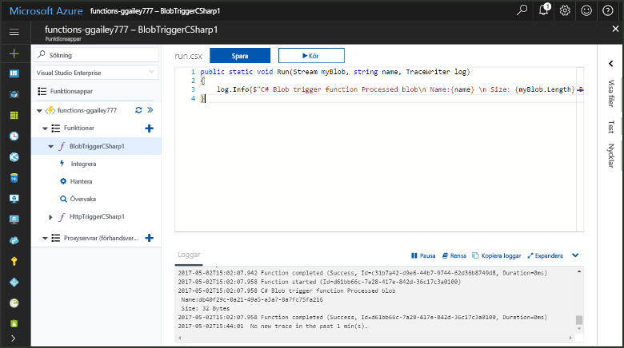
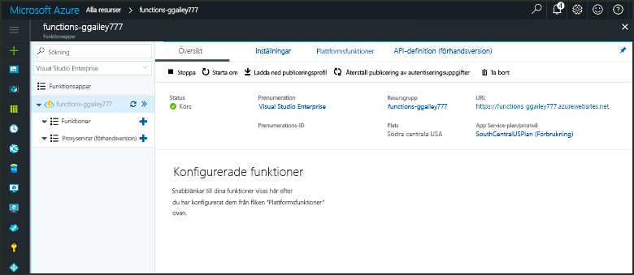
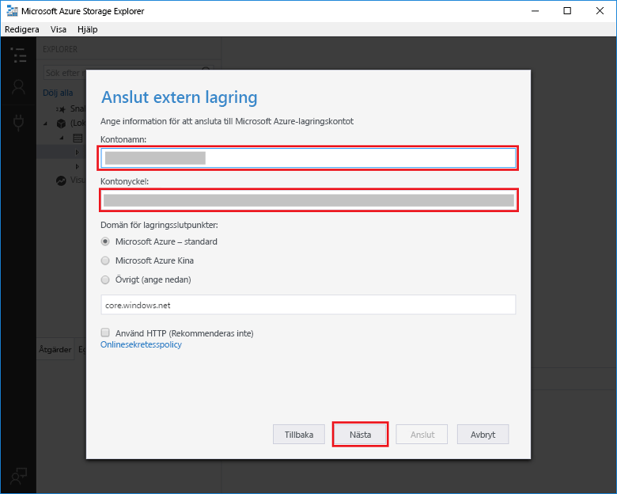
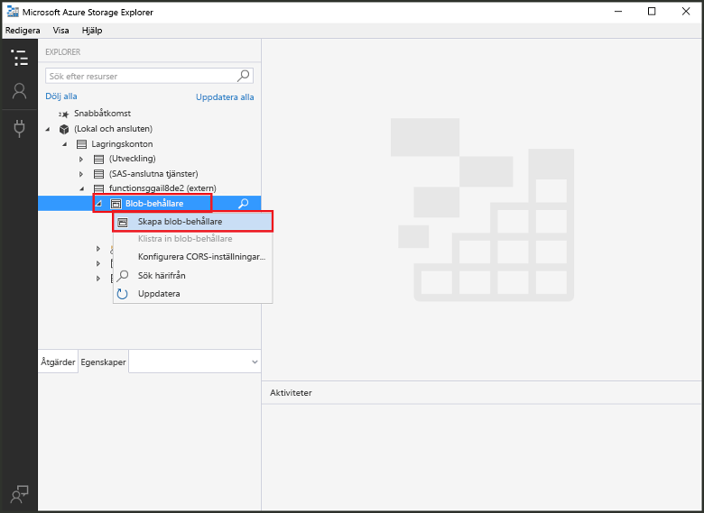
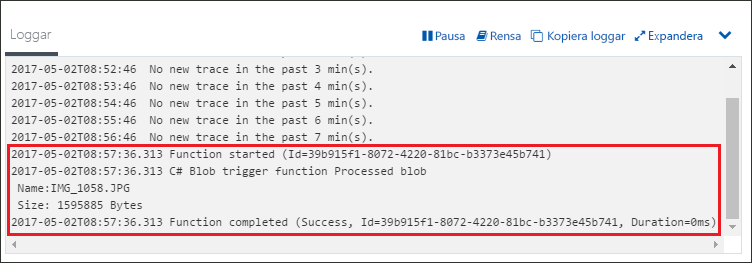

# Skapa en funktion som utlöses av Azure Blob StorageCreate a function triggered by Azure Blob storage

Lär dig hur toocreate en funktion som utlöses när filerna har överförts tooor uppdateras i Azure Blob storage.Learn how toocreate a function triggered when files are uploaded tooor updated in Azure Blob storage.

## KravPrerequisites

+ Hämta och installera hello [Microsoft Azure Lagringsutforskaren](http://storageexplorer.com/).Download and install hello [Microsoft Azure Storage Explorer](http://storageexplorer.com/).
+ En Azure-prenumeration.An Azure subscription. Om du inte har ett konto kan du skapa ett [kostnadsfritt konto](https://azure.microsoft.com/free/?WT.mc_id=A261C142F) innan du börjar.If you don't have one, create a [free account](https://azure.microsoft.com/free/?WT.mc_id=A261C142F) before you begin.

[!INCLUDE [functions-portal-favorite-function-apps](../../includes/functions-portal-favorite-function-apps.md)]

## Skapa en Azure Functions-appCreate an Azure Function app

[!INCLUDE [Create function app Azure portal](../../includes/functions-create-function-app-portal.md)]

Därefter skapar du en funktion i hello ny funktionsapp.Next, you create a function in hello new function app.

## Skapa en funktion som utlöses av Blob StorageCreate a Blob storage triggered function

1. Expandera funktionen appen och klicka på hello  **+**  knappen för nästa**funktioner**.Expand your function app and click hello **+** button next too**Functions**. Om det är första hello-funktion i din funktionsapp **anpassad funktionen**.If this is hello first function in your function app, select **Custom function**. Detta visar hello fullständig uppsättning funktionen mallar.This displays hello complete set of function templates.

    

2. Välj hello **BlobTrigger** mall för önskat språk och Använd hello inställningar som anges i hello tabell.Select hello **BlobTrigger** template for your desired language, and use hello settings as specified in hello table.

    

    | InställningSetting | Föreslaget värdeSuggested value | BeskrivningDescription |
    |---|---|---|
    | **Sökväg****Path**   | mycontainer /{namn}mycontainer/{name}    | Platsen i Blob Storage som övervakas.Location in Blob storage being monitored. hello filnamn hello blob skickas i hello bindning som hello _namn_ parameter.hello file name of hello blob is passed in hello binding as hello _name_ parameter.  |
    | **Lagringskontoanslutning****Storage account connection** | AzureWebJobStorageAzureWebJobStorage | Du kan använda hello konto lagringsanslutning redan används av din funktionsapp eller skapa en ny.You can use hello storage account connection already being used by your function app, or create a new one.  |
    | **Namnge din funktion****Name your function** | Ett unikt namn i funktionsappenUnique in your function app | Namnge funktionen som utlöses av blobben.Name of this blob triggered function. |

3. Klicka på **skapa** toocreate din funktion.Click **Create** toocreate your function.

Därefter måste du ansluta tooyour Azure Storage-konto och skapa hello **minbehållare** behållare.Next, you connect tooyour Azure Storage account and create hello **mycontainer** container.

## Skapa hello behållareCreate hello container

1. Klicka på **Integrera** i din funktion, expandera **Dokumentation** och kopiera både **kontonamnet** och **kontonyckeln**.In your function, click **Integrate**, expand **Documentation**, and copy both **Account name** and **Account key**. Du använder dessa autentiseringsuppgifter tooconnect toohello storage-konto.You use these credentials tooconnect toohello storage account. Hoppa över toostep 4 om du redan har anslutit ditt lagringskonto.If you have already connected your storage account, skip toostep 4.

    

1. Kör hello [Microsoft Azure Lagringsutforskaren](http://storageexplorer.com/) verktyg, klicka på hello ansluta ikonen hello vänster, Välj **använder ett lagringskontonamn och nyckel**, och klicka på **nästa**.Run hello [Microsoft Azure Storage Explorer](http://storageexplorer.com/) tool, click hello connect icon on hello left, choose **Use a storage account name and key**, and click **Next**.

    

1. Ange hello **kontonamn** och **kontonyckel** från steg 1, klickar du på **nästa** och sedan **Anslut**.Enter hello **Account name** and **Account key** from step 1, click **Next** and then **Connect**. 

    

1. Expandera hello kopplade storage-konto, högerklicka på **Blob-behållare**, klickar du på **skapa blob-behållaren**, typen `mycontainer`, och tryck sedan på RETUR.Expand hello attached storage account, right-click **Blob containers**, click **Create blob container**, type `mycontainer`, and then press enter.

    

Nu när du har en blob-behållare kan testa du hello funktionen genom att överföra en fil toohello behållare.Now that you have a blob container, you can test hello function by uploading a file toohello container.

## Testa hello-funktionenTest hello function

1. Tillbaka i hello Azure-portalen, bläddra tooyour funktionen expanderar hello **loggar** hello längst ned i hello sidan och se till att loggen strömning inte pausades.Back in hello Azure portal, browse tooyour function expand hello **Logs** at hello bottom of hello page and make sure that log streaming isn't paused.

1. Expandera ditt lagringskonto, **Blob containers** (Blobbehållare) och **mycontainer** i Storage Explorer.In Storage Explorer, expand your storage account, **Blob containers**, and **mycontainer**. Klicka på **Ladda upp** och sedan på **Ladda upp filer**.Click **Upload** and then **Upload files...**.

    

1. I hello **ladda upp filer** dialogrutan klickar du på hello **filer** fältet.In hello **Upload files** dialog box, click hello **Files** field. Bläddra efter tooa fil på den lokala datorn, till exempel en bildfil, markerar du den och klickar på **öppna** och sedan **överför**.Browse tooa file on your local computer, such as an image file, select it and click **Open** and then **Upload**.

1. Gå tillbaka tooyour funktionsloggar och kontrollera att hello-blob har lästs.Go back tooyour function logs and verify that hello blob has been read.

   

    >[!NOTE]
    > När funktionen appen körs i hello standardplanen förbrukning, kan det uppstå en fördröjning på upp tooseveral minuter mellan hello blob som lagts till eller uppdaterats och hello fungera som utlöses.When your function app runs in hello default Consumption plan, there may be a delay of up tooseveral minutes between hello blob being added or updated and hello function being triggered. Om du behöver låg latens i dina blobutlösta funktioner bör du köra funktionsapparna med en App Service-plan.If you need low latency in your blob triggered functions, consider running your function app in an App Service plan.

## Rensa resurserClean up resources

[!INCLUDE [Next steps note](../../includes/functions-quickstart-cleanup.md)]

## Nästa stegNext steps

Du har skapat en funktion som körs när en blob läggs tooor uppdateras i Blob storage.You have created a function that runs when a blob is added tooor updated in Blob storage. 

[!INCLUDE [Next steps note](../../includes/functions-quickstart-next-steps.md)]

Mer information om Blob Storage-utlösare finns i [Azure Functions Blob storage bindings](functions-bindings-storage-blob.md) (Blob Storage-bindningar i Azure Functions).For more information about Blob storage triggers, see [Azure Functions Blob storage bindings](functions-bindings-storage-blob.md).
