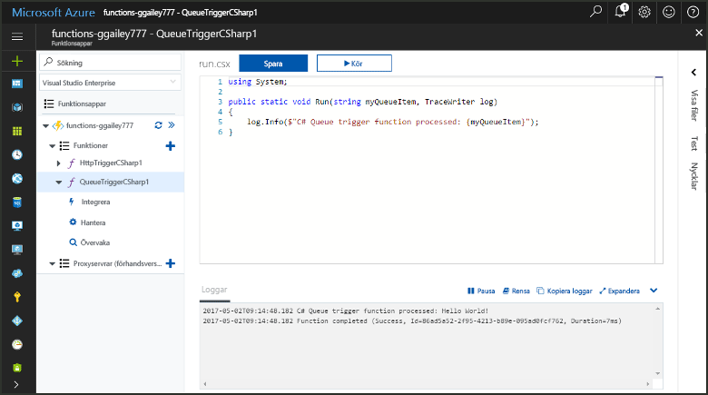
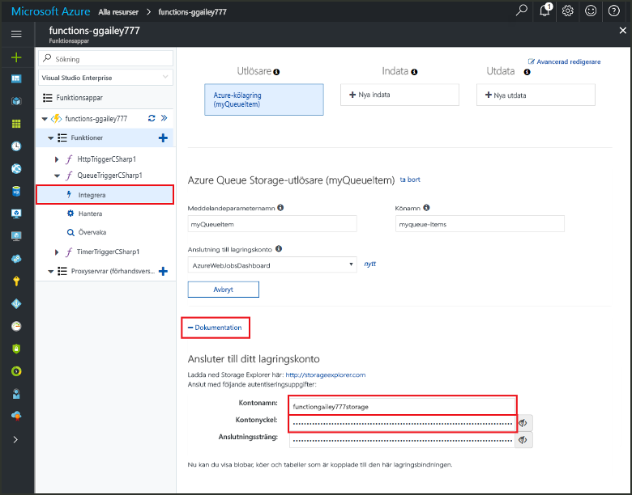
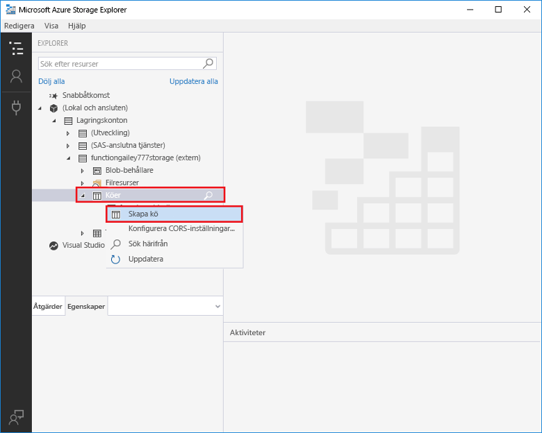
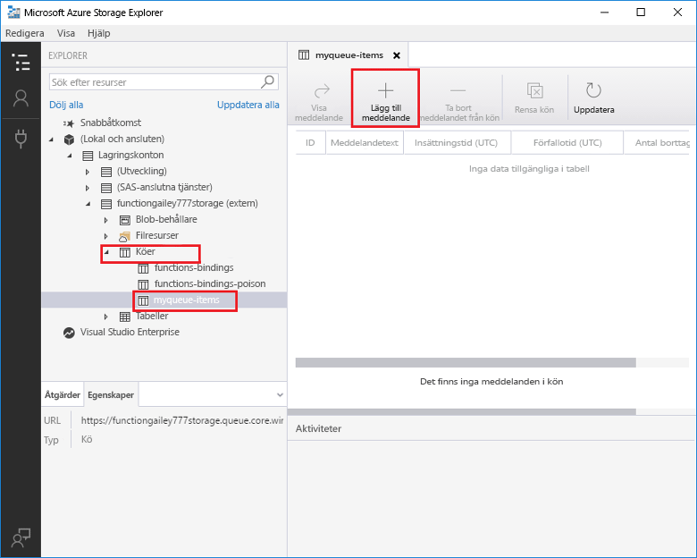
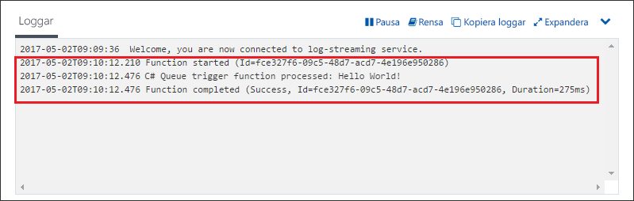

# Skapa en funktion som utlöses av Azure Queue StorageCreate a function triggered by Azure Queue storage

Lär dig hur toocreate en funktion som utlöses när meddelanden skickas tooan Azure Storage-kö.Learn how toocreate a function triggered when messages are submitted tooan Azure Storage queue.

## KravPrerequisites

- Hämta och installera hello [Microsoft Azure Lagringsutforskaren](http://storageexplorer.com/).Download and install hello [Microsoft Azure Storage Explorer](http://storageexplorer.com/).

- En Azure-prenumeration.An Azure subscription. Om du inte har ett konto kan du skapa ett [kostnadsfritt konto](https://azure.microsoft.com/free/?WT.mc_id=A261C142F) innan du börjar.If you don't have one, create a [free account](https://azure.microsoft.com/free/?WT.mc_id=A261C142F) before you begin.

[!INCLUDE [functions-portal-favorite-function-apps](../../includes/functions-portal-favorite-function-apps.md)]

## Skapa en Azure Functions-appCreate an Azure Function app

[!INCLUDE [Create function app Azure portal](../../includes/functions-create-function-app-portal.md)]

Därefter skapar du en funktion i hello ny funktionsapp.Next, you create a function in hello new function app.

## Skapa en funktion som utlöses av en köCreate a Queue triggered function

1. Expandera funktionen appen och klicka på hello  **+**  knappen för nästa**funktioner**.Expand your function app and click hello **+** button next too**Functions**. Om det är första hello-funktion i din funktionsapp **anpassad funktionen**.If this is hello first function in your function app, select **Custom function**. Detta visar hello fullständig uppsättning funktionen mallar.This displays hello complete set of function templates.

    

2. Välj hello **QueueTrigger** mall för önskat språk och Använd hello inställningar som anges i hello tabell.Select hello **QueueTrigger** template for your desired language, and  use hello settings as specified in hello table.

    
    
    | InställningSetting | Föreslaget värdeSuggested value | BeskrivningDescription |
    |---|---|---|
    | **Könamn****Queue name**   | myqueue-itemsmyqueue-items    | Namnet på hello kö tooconnect tooin ditt lagringskonto.Name of hello queue tooconnect tooin your Storage account. |
    | **Lagringskontoanslutning****Storage account connection** | AzureWebJobStorageAzureWebJobStorage | Du kan använda hello konto lagringsanslutning redan används av din funktionsapp eller skapa en ny.You can use hello storage account connection already being used by your function app, or create a new one.  |
    | **Namnge din funktion****Name your function** | Ett unikt namn i funktionsappenUnique in your function app | Namnge funktionen som utlöses av kön.Name of this queue triggered function. |

3. Klicka på **skapa** toocreate din funktion.Click **Create** toocreate your function.

Därefter måste du ansluta tooyour Azure Storage-konto och skapa hello **MinKö objekt** storage-kö.Next, you connect tooyour Azure Storage account and create hello **myqueue-items** storage queue.

## Skapa hello köCreate hello queue

1. Klicka på **Integrera** i din funktion, expandera **Dokumentation** och kopiera både **kontonamnet** och **kontonyckeln**.In your function, click **Integrate**, expand **Documentation**, and copy both **Account name** and **Account key**. Du använder dessa autentiseringsuppgifter tooconnect toohello storage-konto.You use these credentials tooconnect toohello storage account. Hoppa över toostep 4 om du redan har anslutit ditt lagringskonto.If you have already connected your storage account, skip toostep 4.

    vv

1. Kör hello [Microsoft Azure Lagringsutforskaren](http://storageexplorer.com/) verktyg, klicka på hello ansluta ikonen hello vänster, Välj **använder ett lagringskontonamn och nyckel**, och klicka på **nästa**.Run hello [Microsoft Azure Storage Explorer](http://storageexplorer.com/) tool, click hello connect icon on hello left, choose **Use a storage account name and key**, and click **Next**.

    

1. Ange hello **kontonamn** och **kontonyckel** från steg 1, klickar du på **nästa** och sedan **Anslut**.Enter hello **Account name** and **Account key** from step 1, click **Next** and then **Connect**.

    

1. Expandera hello kopplade storage-konto, högerklicka på **köer**, klickar du på **Skapa kö**, typen `myqueue-items`, och tryck sedan på RETUR.Expand hello attached storage account, right-click **Queues**, click **Create queue**, type `myqueue-items`, and then press enter.

    

Nu när du har en kö för lagring kan testa du hello funktionen genom att lägga till en meddelandekö toohello.Now that you have a storage queue, you can test hello function by adding a message toohello queue.

## Testa hello-funktionenTest hello function

1. Tillbaka i hello Azure-portalen, bläddra tooyour funktionen expanderar hello **loggar** hello längst ned i hello sidan och se till att loggen strömning inte pausades.Back in hello Azure portal, browse tooyour function expand hello **Logs** at hello bottom of hello page and make sure that log streaming isn't paused.

1. I Lagringsutforskaren expanderar du ditt lagringskonto, **Köer** och **myqueue-items**. Klicka sedan på **Lägg till meddelande**.In Storage Explorer, expand your storage account, **Queues**, and **myqueue-items**, then click **Add message**.

    

1. Skriv ditt "Hello World!"-Type your "Hello World!" meddelande i **Meddelandetext** och klicka på **OK**.message in **Message text** and click **OK**.

1. Vänta några sekunder och sedan gå tillbaka tooyour funktionsloggar och kontrollera att nya hello-meddelande har lästs från hello kö.Wait for a few seconds, then go back tooyour function logs and verify that hello new message has been read from hello queue.

    

1. Klicka på tillbaka i Lagringsutforskaren, **uppdatera** och kontrollera att hello-meddelande har bearbetats och är inte längre i hello kö.Back in Storage Explorer, click **Refresh** and verify that hello message has been processed and is no longer in hello queue.

## Rensa resurserClean up resources

[!INCLUDE [Next steps note](../../includes/functions-quickstart-cleanup.md)]

## Nästa stegNext steps

Du har skapat en funktion som körs när ett meddelande läggs tooa storage-kö.You have created a function that runs when a message is added tooa storage queue.

[!INCLUDE [Next steps note](../../includes/functions-quickstart-next-steps.md)]

Mer information om Queue Storage-utlösare finns i [Azure Functions Storage queue bindings](functions-bindings-storage-queue.md) (Azure Functions-lagringsköbindningar).For more information about Queue storage triggers, see [Azure Functions Storage queue bindings](functions-bindings-storage-queue.md).