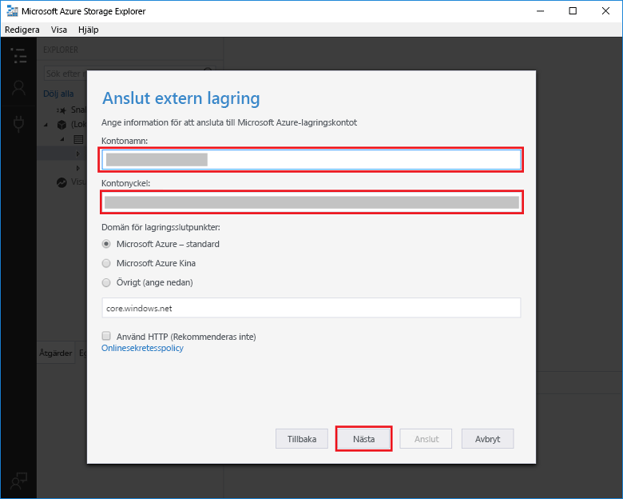

# Skapa en funktion som utlöses av Azure Queue Storage

Lär dig hur toocreate en funktion som utlöses när meddelanden skickas tooan Azure Storage-kö.

## Krav

- Hämta och installera hello [Microsoft Azure Lagringsutforskaren](http://storageexplorer.com/).

- En Azure-prenumeration. Om du inte har ett konto kan du skapa ett [kostnadsfritt konto](https://azure.microsoft.com/free/?WT.mc_id=A261C142F) innan du börjar.

[!INCLUDE [functions-portal-favorite-function-apps](../../includes/functions-portal-favorite-function-apps.md)]

## Skapa en Azure Functions-app

[!INCLUDE [Create function app Azure portal](../../includes/functions-create-function-app-portal.md)]

Därefter skapar du en funktion i hello ny funktionsapp.

## Skapa en funktion som utlöses av en kö

1. Expandera funktionen appen och klicka på hello  **+**  knappen för nästa**funktioner**. Om det är första hello-funktion i din funktionsapp **anpassad funktionen**. Detta visar hello fullständig uppsättning funktionen mallar.

    

2. Välj hello **QueueTrigger** mall för önskat språk och Använd hello inställningar som anges i hello tabell.

    
    
    | Inställning | Föreslaget värde | Beskrivning |
    |---|---|---|
    | **Könamn**   | myqueue-items    | Namnet på hello kö tooconnect tooin ditt lagringskonto. |
    | **Lagringskontoanslutning** | AzureWebJobStorage | Du kan använda hello konto lagringsanslutning redan används av din funktionsapp eller skapa en ny.  |
    | **Namnge din funktion** | Ett unikt namn i funktionsappen | Namnge funktionen som utlöses av kön. |

3. Klicka på **skapa** toocreate din funktion.

Därefter måste du ansluta tooyour Azure Storage-konto och skapa hello **MinKö objekt** storage-kö.

## Skapa hello kö

1. Klicka på **Integrera** i din funktion, expandera **Dokumentation** och kopiera både **kontonamnet** och **kontonyckeln**. Du använder dessa autentiseringsuppgifter tooconnect toohello storage-konto. Hoppa över toostep 4 om du redan har anslutit ditt lagringskonto.

    v

1. Kör hello [Microsoft Azure Lagringsutforskaren](http://storageexplorer.com/) verktyg, klicka på hello ansluta ikonen hello vänster, Välj **använder ett lagringskontonamn och nyckel**, och klicka på **nästa**.

    

1. Ange hello **kontonamn** och **kontonyckel** från steg 1, klickar du på **nästa** och sedan **Anslut**.

    

1. Expandera hello kopplade storage-konto, högerklicka på **köer**, klickar du på **Skapa kö**, typen `myqueue-items`, och tryck sedan på RETUR.

    

Nu när du har en kö för lagring kan testa du hello funktionen genom att lägga till en meddelandekö toohello.

## Testa hello-funktionen

1. Tillbaka i hello Azure-portalen, bläddra tooyour funktionen expanderar hello **loggar** hello längst ned i hello sidan och se till att loggen strömning inte pausades.

1. I Lagringsutforskaren expanderar du ditt lagringskonto, **Köer** och **myqueue-items**. Klicka sedan på **Lägg till meddelande**.

    

1. Skriv ditt "Hello World!"- meddelande i **Meddelandetext** och klicka på **OK**.

1. Vänta några sekunder och sedan gå tillbaka tooyour funktionsloggar och kontrollera att nya hello-meddelande har lästs från hello kö.

    

1. Klicka på tillbaka i Lagringsutforskaren, **uppdatera** och kontrollera att hello-meddelande har bearbetats och är inte längre i hello kö.

## Rensa resurser

[!INCLUDE [Next steps note](../../includes/functions-quickstart-cleanup.md)]

## Nästa steg

Du har skapat en funktion som körs när ett meddelande läggs tooa storage-kö.

[!INCLUDE [Next steps note](../../includes/functions-quickstart-next-steps.md)]

Mer information om Queue Storage-utlösare finns i [Azure Functions Storage queue bindings](functions-bindings-storage-queue.md) (Azure Functions-lagringsköbindningar).