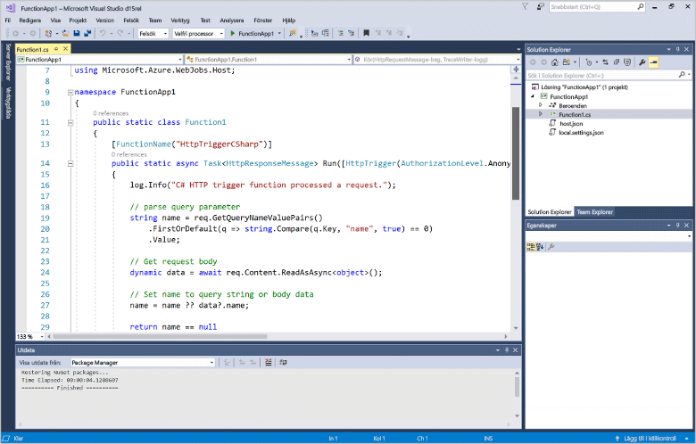
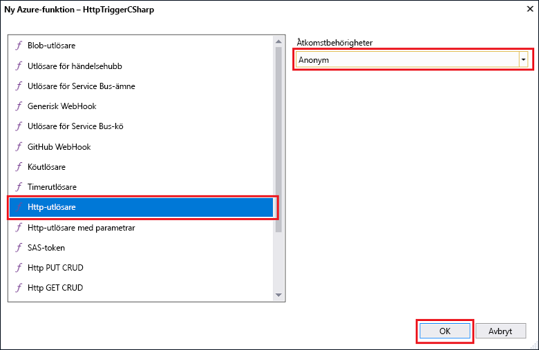

# Skapa din första funktion med Visual Studio

Azure Functions kan du köra din kod i en miljö med serverlösa utan toofirst skapa en virtuell dator eller publicera ett webbprogram.

I det här avsnittet dig du hur toouse hello 2017 för Visual Studio tools för Azure Functions toocreate och testa en ”hello world”-funktionen lokalt. Du sedan publicerar hello funktionen koden tooAzure. Dessa verktyg är tillgängliga som en del av hello Azure-utveckling arbetsbelastningen i Visual Studio 2017 version 15,3 eller en senare version.

## Krav

toocomplete självstudier, installationen:

* [Visual Studio 2017 version 15,3](https://www.visualstudio.com/vs/preview/), inklusive hello **Azure-utveckling** arbetsbelastning.

    
    
    >[!NOTE]  
    När du installerar eller uppgraderar tooVisual Studio 2017 version 15,3 kanske du också toomanually uppdatering hello 2017 för Visual Studio tools för Azure Functions. Du kan uppdatera hello verktyg från hello **verktyg** menyn under **tillägg och uppdateringar...**   >  **Uppdateringar** > **Visual Studio Marketplace** > **Azure Functions och Web jobb verktyg**  >  **Uppdatering**. 

[!INCLUDE [quickstarts-free-trial-note](../../includes/quickstarts-free-trial-note.md)] 

## Skapa ett Azure Functions-projekt i Visual Studio

[!INCLUDE [Create a project using hello Azure Functions template](../../includes/functions-vstools-create.md)]

Nu när du har skapat hello-projekt kan skapa du din första funktion.

## Skapa hello-funktion

1. I **Solution Explorer** högerklickar du på projektnoden och väljer **Lägg till** > **Nytt objekt**. Välj **Azure Function** och klicka på **Lägg till**.

2. Välj **HttpTrigger**, ange ett **Funktionsnamn**, välj **Anonym** för **Åtkomsträttigheter** och klicka på **Skapa**. hello-funktion skapas används av en HTTP-begäran från klienter. 

    

    En kodfil läggs tooyour projekt som innehåller en klass som implementerar din funktionskoden. Den här koden är baserad på en mall, som tar emot ett namnvärde och ta bort eko tillbaka. Hej **FunctionName** attribut anger hello namnet på funktionen. Hej **HttpTrigger** attributet anger hello-meddelande som utlöser hello-funktionen. 

    

Nu när du har skapat en HTTP-utlöst funktion kan du testa den på en lokal dator.

## Testa hello funktionen lokalt

Med Azure Functions Core Tools kan du köra Azure Functions-projekt på din lokala utvecklingsdator. Du kan ange tooinstall verktygen hello första gången du startar en funktion från Visual Studio.  

1. tootest din funktion, tryck på F5. Om du uppmanas acceptera hello begäran från Visual Studio toodownload och installera verktyg för Azure Functions kärnor (CLI).  Du kanske också måste tooenable ett undantag i brandväggen så att hello verktyg kan hantera HTTP-begäranden.

2. Kopiera hello URL för din funktion från hello Azure Functions-runtime utdata.  

    

3. Klistra in hello URL för hello HTTP-begäran i webbläsarens adressfält. Lägg till hello frågesträngen `&name=<yourname>` toothis URL och utföra hello-begäran. hello följande visar hello svar i hello webbläsare toohello lokala GET-begäran returneras av hello: 

    

4. toostop felsökning, klicka på hello **stoppa** i verktygsfältet hello Visual Studio.

När du har kontrollerat att hello-funktionen fungerar korrekt på den lokala datorn, är den tid toopublish hello projekt tooAzure.

## Publicera hello projekt tooAzure

Du måste ha en funktionsapp i din Azure-prenumeration innan du kan publicera projektet. Du kan skapa en funktionsapp direkt från Visual Studio.

[!INCLUDE [Publish hello project tooAzure](../../includes/functions-vstools-publish.md)]

## Testa din funktion i Azure

1. Kopiera hello bas-URL för hello funktionsapp från hello publicera profilsida. Ersätt hello `localhost:port` del av hello-URL som du använde när du testar hello funktionen lokalt med hello ny bas-URL. Som tidigare gör att tooappend hello frågesträngen `&name=<yourname>` toothis URL och utföra hello-begäran.

    hello-URL som anropar HTTP aktiveras funktionen ser ut så här:

        http://<functionappname>.azurewebsites.net/api/<functionname>?name=<yourname> 

2. Klistra in den här nya URL: en för hello HTTP-begäran i webbläsarens adressfält. hello följande visar hello svar i hello webbläsare toohello GET fjärrbegäran returneras av hello: 

    
 
## Nästa steg

Du har använt funktionsapp för Visual Studio toocreate C# med en enkel HTTP utlöses-funktion. 

+ toolearn hur tooconfigure projekt-toosupport andra typer av utlösare och bindningar finns hello [konfigurera hello projekt för lokal utveckling](functions-develop-vs.md#configure-the-project-for-local-development) i avsnittet [Azure Functions Tools för Visual Studio](functions-develop-vs.md).
+ toolearn mer om lokala testning och felsökning med hjälp av hello Azure Functions Core verktyg finns [kod och testa Azure Functions lokalt](functions-run-local.md). 
+ toolearn mer information om hur du utvecklar fungerar som .NET-klassbibliotek finns [med hjälp av .NET-klassbibliotek med Azure Functions](functions-dotnet-class-library.md). 

