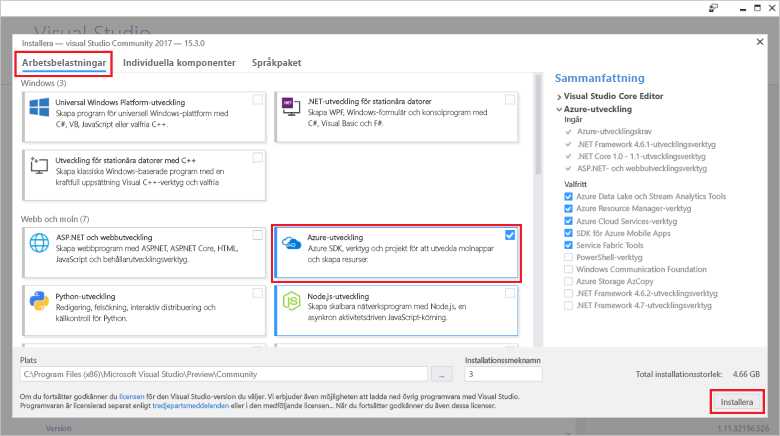

# Skapa din första funktion med Visual StudioCreate your first function using Visual Studio

Med Azure Functions kan du köra kod i en serverfri miljö utan att först behöva skapa en virtuell dator eller publicera en webbapp.Azure Functions lets you execute your code in a serverless environment without having to first create a VM or publish a web application.

Lär dig hur du använder 2017 för Visual Studio tools för Azure Functions för att skapa och testa en ”hello world”-funktionen lokalt i det här avsnittet.In this topic, you learn how to use the Visual Studio 2017 tools for Azure Functions to create and test a "hello world" function locally. Du publicerar sedan funktionskoden till Azure.You will then publish the function code to Azure. De här verktygen är tillgängliga som en del av arbetsbelastningen Azure Development i Visual Studio 2017 version 15.3, eller en senare version.These tools are available as part of the Azure development workload in Visual Studio 2017 version 15.3, or a later version.

## KravPrerequisites

För att slutföra den här självstudien installerar du:To complete this tutorial, install:

* [Visual Studio 2017 version 15.3](https://www.visualstudio.com/vs/preview/), inklusive arbetsbelastningen **Azure Development**.[Visual Studio 2017 version 15.3](https://www.visualstudio.com/vs/preview/), including the **Azure development** workload.

    
    
    >[!NOTE]  
    När du installerar eller uppgraderar till Visual Studio 2017 version 15,3 kan också behöva uppdatera 2017 för Visual Studio-verktygen för Azure Functions manuellt.After you install or upgrade to Visual Studio 2017 version 15.3, you might also need to manually update the Visual Studio 2017 tools for Azure Functions. Du kan uppdatera verktyg från den **verktyg** menyn under **tillägg och uppdateringar...**   >  **Uppdateringar** > **Visual Studio Marketplace** > **Azure Functions och Web jobb verktyg**  >  **Uppdatering**.You can update the tools from the **Tools** menu under **Extensions and Updates...** > **Updates** > **Visual Studio Marketplace** > **Azure Functions and Web Jobs Tools** > **Update**. 

[!INCLUDE [quickstarts-free-trial-note](../../includes/quickstarts-free-trial-note.md)] 

## Skapa ett Azure Functions-projekt i Visual StudioCreate an Azure Functions project in Visual Studio

[!INCLUDE [Create a project using the Azure Functions template](../../includes/functions-vstools-create.md)]

Nu när du har skapat projektet kan du skapa din första funktion.Now that you have created the project, you can create your first function.

## Skapa funktionenCreate the function

1. I **Solution Explorer** högerklickar du på projektnoden och väljer **Lägg till** > **Nytt objekt**.In **Solution Explorer**, right-click on your project node and select **Add** > **New Item**. Välj **Azure Function** och klicka på **Lägg till**.Select **Azure Function** and click **Add**.

2. Välj **HttpTrigger**, ange ett **Funktionsnamn**, välj **Anonym** för **Åtkomsträttigheter** och klicka på **Skapa**.Select **HttpTrigger**, type a **Function Name**, select **Anonymous** for **Access Rights**, and click **Create**. Funktionen som skapas kan nås av en HTTP-begäran från alla klienter.The function created is accessed by an HTTP request from any client. 

    

    En kodfil läggs till ditt projekt som innehåller en klass som implementerar din funktionskoden.A code file is added to your project that contains a class that implements your function code. Den här koden är baserad på en mall, som tar emot ett namnvärde och ta bort eko tillbaka.This code is based on a template, which receives a name value and echos it back. Den **FunctionName** attributet anger namnet på funktionen.The **FunctionName** attribute sets the name of your function. Den **HttpTrigger** attributet anger meddelandet som utlöser funktionen.The **HttpTrigger** attribute indicates the message that triggers the function. 

    

Nu när du har skapat en HTTP-utlöst funktion kan du testa den på en lokal dator.Now that you have created an HTTP-triggered function, you can test it on your local computer.

## Testa funktionen lokaltTest the function locally

Med Azure Functions Core Tools kan du köra Azure Functions-projekt på din lokala utvecklingsdator.Azure Functions Core Tools lets you run Azure Functions project on your local development computer. Du uppmanas att installera de här verktygen första gången du startar en funktion från Visual Studio.You are prompted to install these tools the first time you start a function from Visual Studio.  

1. Tryck på F5 för att testa funktionen.To test your function, press F5. Acceptera begäran från Visual Studio för att ladda ned och installera Azure Functions Core (CLI)-verktyg.If prompted, accept the request from Visual Studio to download and install Azure Functions Core (CLI) tools.  Du kan även behöva skapa ett brandväggsundantag så att verktygen kan hantera HTTP-förfrågningar.You may also need to enable a firewall exception so that the tools can handle HTTP requests.

2. Kopiera URL:en för funktionen från dina Azure Functions-utdata.Copy the URL of your function from the Azure Functions runtime output.  

    

3. Klistra in webbadressen för HTTP-begäran i webbläsarens adressfält.Paste the URL for the HTTP request into your browser's address bar. Lägg till frågesträngen `&name=<yourname>` i webbadressen och kör din begäran.Append the query string `&name=<yourname>` to this URL and execute the request. Nedan visas svaret på den lokala GET-begäran som returnerades av funktionen i webbläsaren:The following shows the response in the browser to the local GET request returned by the function: 

    

4. För att stoppa felsökningen klickar du på knappen **Stopp** i Visual Studio-verktygsfältet.To stop debugging, click the **Stop** button on the Visual Studio toolbar.

När du har kontrollerat att funktionen körs korrekt på den lokala datorn är det dags att publicera projektet på Azure.After you have verified that the function runs correctly on your local computer, it's time to publish the project to Azure.

## Publicera projektet på AzurePublish the project to Azure

Du måste ha en funktionsapp i din Azure-prenumeration innan du kan publicera projektet.You must have a function app in your Azure subscription before you can publish your project. Du kan skapa en funktionsapp direkt från Visual Studio.You can create a function app right from Visual Studio.

[!INCLUDE [Publish the project to Azure](../../includes/functions-vstools-publish.md)]

## Testa din funktion i AzureTest your function in Azure

1. Kopiera den grundläggande URL:en för funktionsappen från sidan Publicera profil.Copy the base URL of the function app from the Publish profile page. Ersätt `localhost:port`-delen av URL:en som du använde när du testade funktionen lokalt med den nya bas-URL:en.Replace the `localhost:port` portion of the URL you used when testing the function locally with the new base URL. Lägg till frågesträngen `&name=<yourname>` i URL:en som tidigare och kör din begäran.As before, make sure to append the query string `&name=<yourname>` to this URL and execute the request.

    Den URL som anropar den HTTP-utlösta funktionen ser ut så här:The URL that calls your HTTP triggered function looks like this:

        http://<functionappname>.azurewebsites.net/api/<functionname>?name=<yourname> 

2. Klistra in den nya URL:en för HTTP-begäran i webbläsarens adressfält.Paste this new URL for the HTTP request into your browser's address bar. Nedan visas svaret på fjärr-GET-begäran som returnerades av funktionen i webbläsaren:The following shows the response in the browser to the remote GET request returned by the function: 

    
 
## Nästa stegNext steps

Du har nu använt Visual Studio för att skapa en C#-funktionsapp med en enkel HTTP-utlöst funktion.You have used Visual Studio to create a C# function app with a simple HTTP triggered function. 

+ Information om hur du konfigurerar ditt projekt för att ge stöd för andra typer av utlösare och bindningar finns i [Configure the project for local development](functions-develop-vs.md#configure-the-project-for-local-development) (Konfigurera projektet för lokal utveckling) i avsnittet [Azure Functions Tools for Visual Studio](functions-develop-vs.md) (Azure Functions Tools för Visual Studio).To learn how to configure your project to support other types of triggers and bindings, see the [Configure the project for local development](functions-develop-vs.md#configure-the-project-for-local-development) section in [Azure Functions Tools for Visual Studio](functions-develop-vs.md).
+ Läs mer om lokal testning och felsökning med hjälp av Azure Functions Core Tools i [Code and test Azure Functions locally](functions-run-local.md) (Koda och testa Azure Functions lokalt).To learn more about local testing and debugging using the Azure Functions Core Tools, see [Code and test Azure Functions locally](functions-run-local.md). 
+ Mer information om hur du utvecklar fungerar som .NET-klassbibliotek finns i [Using .NET class libraries with Azure Functions](functions-dotnet-class-library.md) (Använda .NET-klassbibliotek med Azure Functions).To learn more about developing functions as .NET class libraries, see [Using .NET class libraries with Azure Functions](functions-dotnet-class-library.md). 

