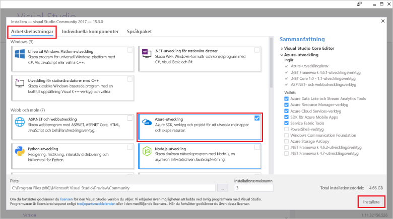

# <a name="azure-functions-tools-for-visual-studio"></a>Azure Functions Tools för Visual Studio  

Azure Functions-verktyg för Visual Studio-2017 är ett tillägg för Visual Studio som låter dig utveckla, testa och distribuera C# funktioner tooAzure. Om det här är din första upplevelse med Azure Functions kan du läsa mer i [en introduktion tooAzure fungerar](functions-overview.md).

hello Azure Functions verktyg ger hello följande fördelar: 

* Redigera, skapa och köra funktioner på lokala utvecklingsdator. 
* Publicera Azure Functions projektet direkt tooAzure. 
* Använda WebJobs attribut toodeclare funktionsbindningar direkt i hello C#-kod i stället för att upprätthålla en separat function.json för bindning definitioner.
* Utveckla och distribuera före kompilerade C#-funktioner. Före följt funktioner ge en bättre kall start prestanda än C# skript-baserad funktion. 
* Felkod dina funktioner i C# med alla hello fördelarna med Visual Studio-utveckling. 

Det här avsnittet visar hur toouse hello Azure Functions verktyg för Visual Studio 2017 toodevelop dina funktioner i C#. Du också lära dig hur toopublish ditt projekt tooAzure som en .NET-sammansättning.

## <a name="prerequisites"></a>Krav

Azure Functions-verktyg ingår i hello Azure-utveckling arbetsbelastning [Visual Studio 2017 version 15,3](https://www.visualstudio.com/vs/), eller en senare version. Kontrollera att du inkluderar hello **Azure-utveckling** arbetsbelastning i Visual Studio 2017 version 15,3 installationen:



toocreate och distribuera funktioner måste du också:

* En aktiv Azure-prenumeration. Om du inte har en Azure-prenumeration [kostnadsfria konton](https://azure.microsoft.com/free/?WT.mc_id=A261C142F) är tillgängliga.

* Ett Azure Storage-konto. toocreate ett lagringskonto finns [skapa ett lagringskonto](../storage/common/storage-create-storage-account.md#create-a-storage-account).  
## <a name="create-an-azure-functions-project"></a>Skapa ett Azure Functions-projekt 

[!INCLUDE [Create a project using hello Azure Functions](../../includes/functions-vstools-create.md)]


## <a name="configure-hello-project-for-local-development"></a>Konfigurera hello projekt för lokal utveckling

När du skapar ett nytt projekt med hjälp av hello Azure Functions mall kan få du ett tomt C#-projekt som innehåller hello följande filer:

* **Host.JSON**: kan du konfigurera hello funktioner värden. Dessa inställningar gäller både när du kör lokalt och i Azure. Mer information finns i [host.json](https://github.com/Azure/azure-webjobs-sdk-script/wiki/host.json) referensartikeln.
    
* **Local.Settings.JSON**: underhåller inställningar som används när du kör funktioner lokalt. De här inställningarna används inte av Azure, de används av hello [Azure Functions grundläggande verktyg](functions-run-local.md). Använd den här filen toospecify inställningar, till exempel anslutning strängar tooother Azure services. Lägg till en ny nyckel toohello **värden** matris för varje anslutning som krävs av funktionerna i projektet. Mer information finns i [lokala inställningsfilen](functions-run-local.md#local-settings-file) i hello Azure Functions grundläggande verktyg avsnittet.

hello Functions-runtime används internt av Azure Storage-konto. För alla utlösa typer än HTTP och webhooks, måste du ange hello **Values.AzureWebJobsStorage** nyckeln tooa giltig Azure Storage-konto anslutningssträng.

[!INCLUDE [Note toonot use local storage](../../includes/functions-local-settings-note.md)]

 anslutningssträngen för tooset hello storage-konto:

1. Öppna i Visual Studio **Cloud Explorer**, expandera **Lagringskonto** > **Your Lagringskonto**och välj **egenskaper**och kopiera hello **primära anslutningssträngen** värde.   

2. Öppna hello local.settings.json projektfilen i ditt projekt och värdet för hello hello **AzureWebJobsStorage** nyckeln toohello anslutningssträngen som du kopierade.

3. Upprepa hello föregående steg tooadd unika nycklar toohello **värden** matris för alla anslutningar som krävs av dina funktioner.  

## <a name="create-a-function"></a>Skapa en funktion

Hello-bindningar som används av hello funktionen definieras i förväg kompilerade funktioner genom att använda i hello koden. När du använder hello Azure Functions verktyg toocreate dina funktioner från hello tillhandahålls mallar tillämpas dessa attribut för dig. 

1. I **Solution Explorer** högerklickar du på projektnoden och väljer **Lägg till** > **Nytt objekt**. Välj **Azure-funktion**, ange ett **namn** hello klass och klicka på **Lägg till**.

2. Välj utlösaren, ange hello bindande egenskaperna och klicka på **skapa**. hello följande exempel visar hello inställningar när du skapar en Queue storage aktiveras funktionen. 

    
    
    En anslutning strängnyckel som heter **QueueStorage** har angetts som har definierats i hello local.settings.json-filen. 
 
3. Granska hello nyligen tillagda klass. Du ser en statisk **kör** metod som har attributet hello **FunctionName** attribut. Det här attributet anger att hello-metoden är hello startpunkt för hello-funktionen. 

    Till exempel representerar hello följande C#-klass grundläggande kön utlöses lagringsfunktionen:

    ````csharp
    using System;
    using Microsoft.Azure.WebJobs;
    using Microsoft.Azure.WebJobs.Host;
    
    namespace FunctionApp1
    {
        public static class Function1
        {
            [FunctionName("QueueTriggerCSharp")]        
            public static void Run([QueueTrigger("myqueue-items", Connection = "QueueStorage")]string myQueueItem, TraceWriter log)
            {
                log.Info($"C# Queue trigger function processed: {myQueueItem}");
            }
        }
    } 
    ````
 
    En bindning-specifika attributet är tillämpade tooeach bindning parametern toohello metoden. hello attributet tar hello bindningsinformation som parametrar. I föregående exempel hello hello första parametern har en **QueueTrigger** -attribut som används, som anger kön aktiveras funktionen. hello könamnet och namn för anslutningssträngen inställningen överförs som parametrar.  

## <a name="testing-functions"></a>Testa funktioner

Med Azure Functions Core Tools kan du köra Azure Functions-projekt på din lokala utvecklingsdator. Du kan ange tooinstall verktygen hello första gången du startar en funktion från Visual Studio.  

tootest din funktion, tryck på F5. Om du uppmanas acceptera hello begäran från Visual Studio toodownload och installera verktyg för Azure Functions kärnor (CLI).  Du kanske också måste tooenable ett undantag i brandväggen så att hello verktyg kan hantera HTTP-begäranden.

Du kan testa din kod som du vill testa distribuerade funktionen med hello-projekt som körs. Mer information finns i [strategier för att testa din kod i Azure Functions](functions-test-a-function.md). När du kör i felsökningsläge nådde brytpunkter i Visual Studio som förväntat. 

Ett exempel på hur tootest en kö aktiveras funktionen, se hello [kön aktiveras funktionen Snabbstartsguide](functions-create-storage-queue-triggered-function.md#test-the-function).  

toolearn mer information om hur du använder hello Azure Functions grundläggande verktygen finns [koden och testa Azure functions lokalt](functions-run-local.md).

## <a name="publish-tooazure"></a>Publicera tooAzure

[!INCLUDE [Publish hello project tooAzure](../../includes/functions-vstools-publish.md)]

>[!NOTE]  
>Alla inställningar som du lade till i hello local.settings.json måste också läggas toohello funktionsapp i Azure. De här inställningarna läggs inte automatiskt. Du kan lägga till nödvändiga inställningar tooyour funktionsapp i något av följande sätt:
>
>* [Med hjälp av hello Azure-portalen](functions-how-to-use-azure-function-app-settings.md#settings).
>* [Med hjälp av hello `--publish-local-settings` publicera alternativet i hello Azure Functions grundläggande verktyg](functions-run-local.md#publish).
>* [Med hjälp av hello Azure CLI](/cli/azure/functionapp/config/appsettings#set). 

## <a name="next-steps"></a>Nästa steg

Mer information om Azure Functions verktyg finns hello vanliga frågor avsnitt i hello [Visual Studio 2017 verktyg för Azure Functions](https://blogs.msdn.microsoft.com/webdev/2017/05/10/azure-function-tools-for-visual-studio-2017/) blogginlägg.

toolearn mer om hello Azure Functions grundläggande verktygen finns [koden och testa Azure functions lokalt](functions-run-local.md).  
toolearn mer information om hur du utvecklar fungerar som .NET-klassbibliotek finns [med hjälp av .NET-klassbibliotek med Azure Functions](functions-dotnet-class-library.md). Det här avsnittet innehåller också exempel på hur toouse attribut toodeclare hello olika typer av bindningar som stöds av Azure Functions.    
