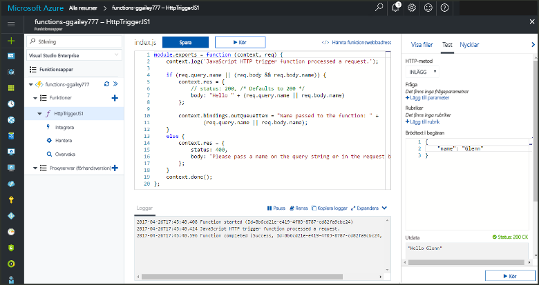
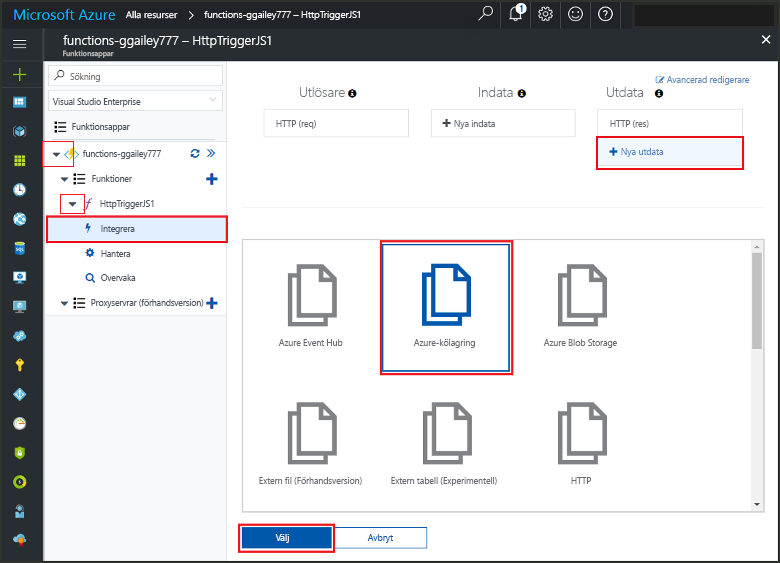
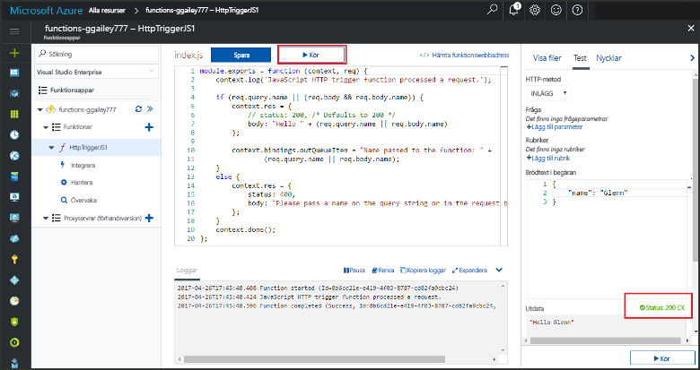
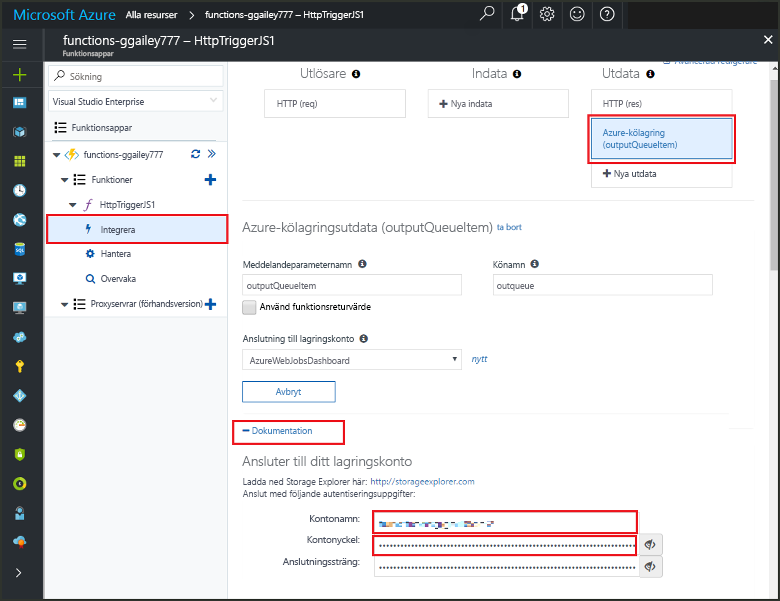
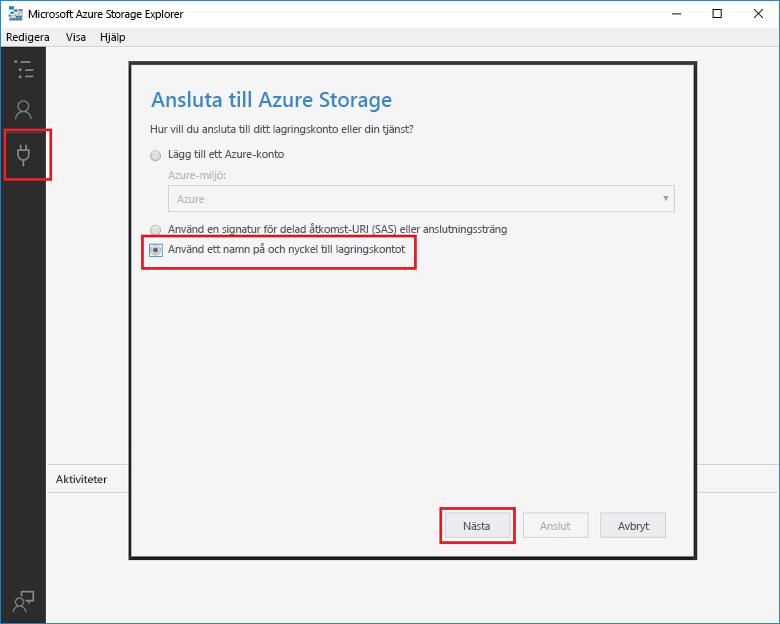

# <a name="add-messages-tooan-azure-storage-queue-using-functions"></a><span data-ttu-id="605c6-103">Lägga till meddelanden tooan Azure Storage-kö med hjälp av funktioner</span><span class="sxs-lookup"><span data-stu-id="605c6-103">Add messages tooan Azure Storage queue using Functions</span></span>

<span data-ttu-id="605c6-104">I Azure Functions ange bindningar för inkommande och utgående en deklarativ metod tooconnect tooexternal tjänstdata från din funktion.</span><span class="sxs-lookup"><span data-stu-id="605c6-104">In Azure Functions, input and output bindings provide a declarative way tooconnect tooexternal service data from your function.</span></span> <span data-ttu-id="605c6-105">I det här avsnittet lär du dig hur tooupdate en befintlig funktion genom att lägga till utdata bindning som meddelanden skickas tooAzure Queue storage.</span><span class="sxs-lookup"><span data-stu-id="605c6-105">In this topic, learn how tooupdate an existing function by adding an output binding that sends messages tooAzure Queue storage.</span></span>  



## <a name="prerequisites"></a><span data-ttu-id="605c6-107">Krav</span><span class="sxs-lookup"><span data-stu-id="605c6-107">Prerequisites</span></span> 

[!INCLUDE [Previous topics](../../includes/functions-quickstart-previous-topics.md)]

* <span data-ttu-id="605c6-108">Installera hello [Microsoft Azure Lagringsutforskaren](http://storageexplorer.com/).</span><span class="sxs-lookup"><span data-stu-id="605c6-108">Install hello [Microsoft Azure Storage Explorer](http://storageexplorer.com/).</span></span>

## <span data-ttu-id="605c6-109"><a name="add-binding"></a>Lägga till en utdatabindning</span><span class="sxs-lookup"><span data-stu-id="605c6-109"><a name="add-binding"></a>Add an output binding</span></span>
 
1. <span data-ttu-id="605c6-110">Expandera både din funktionsapp och din funktion.</span><span class="sxs-lookup"><span data-stu-id="605c6-110">Expand both your function app and your function.</span></span>

2. <span data-ttu-id="605c6-111">Välj **integrera** och **+ nya utdata**, Välj **Azure Queue storage** och välj **Välj**.</span><span class="sxs-lookup"><span data-stu-id="605c6-111">Select **Integrate** and **+ New output**, then choose **Azure Queue storage** and choose **Select**.</span></span>
    
    

3. <span data-ttu-id="605c6-113">Använda hello inställningar som anges i hello tabell:</span><span class="sxs-lookup"><span data-stu-id="605c6-113">Use hello settings as specified in hello table:</span></span> 

    

    | <span data-ttu-id="605c6-115">Inställning</span><span class="sxs-lookup"><span data-stu-id="605c6-115">Setting</span></span>      |  <span data-ttu-id="605c6-116">Föreslaget värde</span><span class="sxs-lookup"><span data-stu-id="605c6-116">Suggested value</span></span>   | <span data-ttu-id="605c6-117">Beskrivning</span><span class="sxs-lookup"><span data-stu-id="605c6-117">Description</span></span>                              |
    | ------------ |  ------- | -------------------------------------------------- |
    | <span data-ttu-id="605c6-118">**Könamn**</span><span class="sxs-lookup"><span data-stu-id="605c6-118">**Queue name**</span></span>   | <span data-ttu-id="605c6-119">myqueue-items</span><span class="sxs-lookup"><span data-stu-id="605c6-119">myqueue-items</span></span>    | <span data-ttu-id="605c6-120">hello namnet på hello kö tooconnect tooin ditt lagringskonto.</span><span class="sxs-lookup"><span data-stu-id="605c6-120">hello name of hello queue tooconnect tooin your Storage account.</span></span> |
    | <span data-ttu-id="605c6-121">**Lagringskontoanslutning**</span><span class="sxs-lookup"><span data-stu-id="605c6-121">**Storage account connection**</span></span> | <span data-ttu-id="605c6-122">AzureWebJobStorage</span><span class="sxs-lookup"><span data-stu-id="605c6-122">AzureWebJobStorage</span></span> | <span data-ttu-id="605c6-123">Du kan använda hello konto lagringsanslutning redan används av din funktionsapp eller skapa en ny.</span><span class="sxs-lookup"><span data-stu-id="605c6-123">You can use hello storage account connection already being used by your function app, or create a new one.</span></span>  |
    | <span data-ttu-id="605c6-124">**Meddelandeparameternamn**</span><span class="sxs-lookup"><span data-stu-id="605c6-124">**Message parameter name**</span></span> | <span data-ttu-id="605c6-125">outputQueueItem</span><span class="sxs-lookup"><span data-stu-id="605c6-125">outputQueueItem</span></span> | <span data-ttu-id="605c6-126">hello namnet på hello utdataparameter för bindningen.</span><span class="sxs-lookup"><span data-stu-id="605c6-126">hello name of hello output binding parameter.</span></span> | 

4. <span data-ttu-id="605c6-127">Klicka på **spara** tooadd hello bindning.</span><span class="sxs-lookup"><span data-stu-id="605c6-127">Click **Save** tooadd hello binding.</span></span>
 
<span data-ttu-id="605c6-128">Nu när du har en bindning för utdata som definierats måste tooupdate hello kod toouse hello bindning tooadd tooa kön.</span><span class="sxs-lookup"><span data-stu-id="605c6-128">Now that you have an output binding defined, you need tooupdate hello code toouse hello binding tooadd messages tooa queue.</span></span>  

## <a name="update-hello-function-code"></a><span data-ttu-id="605c6-129">Uppdatera Funktionskoden hello</span><span class="sxs-lookup"><span data-stu-id="605c6-129">Update hello function code</span></span>

1. <span data-ttu-id="605c6-130">Välj funktionen toodisplay hello Funktionskoden i hello-redigeraren.</span><span class="sxs-lookup"><span data-stu-id="605c6-130">Select your function toodisplay hello function code in hello editor.</span></span> 

2. <span data-ttu-id="605c6-131">Uppdatera din funktionsdefinitionen enligt följande tooadd hello en C# funktion **outputQueueItem** bindningsparameter för lagring.</span><span class="sxs-lookup"><span data-stu-id="605c6-131">For a C# function, update your function definition as follows tooadd hello **outputQueueItem** storage binding parameter.</span></span> <span data-ttu-id="605c6-132">Hoppa över det här steget om du använder en JavaScript-funktion.</span><span class="sxs-lookup"><span data-stu-id="605c6-132">Skip this step for a JavaScript function.</span></span>

    ```cs   
    public static async Task<HttpResponseMessage> Run(HttpRequestMessage req, 
        ICollector<string> outputQueueItem, TraceWriter log)
    {
        ....
    }
    ```

3. <span data-ttu-id="605c6-133">Lägg till följande kod toohello funktionen precis innan hello-metoden returnerar hello.</span><span class="sxs-lookup"><span data-stu-id="605c6-133">Add hello following code toohello function just before hello method returns.</span></span> <span data-ttu-id="605c6-134">Använd hello lämpliga fragment för hello språket för din funktion.</span><span class="sxs-lookup"><span data-stu-id="605c6-134">Use hello appropriate snippet for hello language of your function.</span></span>

    ```javascript
    context.bindings.outputQueueItem = "Name passed toohello function: " + 
                (req.query.name || req.body.name);
    ```

    ```cs
    outputQueueItem.Add("Name passed toohello function: " + name);     
    ```

4. <span data-ttu-id="605c6-135">Välj **spara** toosave ändringar.</span><span class="sxs-lookup"><span data-stu-id="605c6-135">Select **Save** toosave changes.</span></span>

<span data-ttu-id="605c6-136">hello-värdet som skickas toohello HTTP-utlösaren ingår i en meddelandekö tillagda toohello.</span><span class="sxs-lookup"><span data-stu-id="605c6-136">hello value passed toohello HTTP trigger is included in a message added toohello queue.</span></span>
 
## <a name="test-hello-function"></a><span data-ttu-id="605c6-137">Testa hello-funktionen</span><span class="sxs-lookup"><span data-stu-id="605c6-137">Test hello function</span></span> 

1. <span data-ttu-id="605c6-138">När hello kodändringar sparas, Välj **kör**.</span><span class="sxs-lookup"><span data-stu-id="605c6-138">After hello code changes are saved, select **Run**.</span></span> 

    

2. <span data-ttu-id="605c6-140">Kontrollera hello loggar toomake till att hello funktionen lyckades.</span><span class="sxs-lookup"><span data-stu-id="605c6-140">Check hello logs toomake sure that hello function succeeded.</span></span> <span data-ttu-id="605c6-141">En ny kö med namnet **outqueue** skapas i ditt lagringskonto av hello Functions-runtime när hello utdatabindning används först.</span><span class="sxs-lookup"><span data-stu-id="605c6-141">A new queue named **outqueue** is created in your Storage account by hello Functions runtime when hello output binding is first used.</span></span>

<span data-ttu-id="605c6-142">Därefter kan du ansluta tooyour storage-konto tooverify hello ny kö och hello-meddelande som du har lagt till tooit.</span><span class="sxs-lookup"><span data-stu-id="605c6-142">Next, you can connect tooyour storage account tooverify hello new queue and hello message you added tooit.</span></span> 

## <a name="connect-toohello-queue"></a><span data-ttu-id="605c6-143">Ansluta toohello kön</span><span class="sxs-lookup"><span data-stu-id="605c6-143">Connect toohello queue</span></span>

<span data-ttu-id="605c6-144">Hoppa över hello först tre steg om du redan har installerat Lagringsutforskaren och anslutna den tooyour storage-konto.</span><span class="sxs-lookup"><span data-stu-id="605c6-144">Skip hello first three steps if you have already installed Storage Explorer and connected it tooyour storage account.</span></span>    

1. <span data-ttu-id="605c6-145">Välj i din funktion **integrera** och hello nya **Azure Queue storage** utdatabindning och expandera sedan **dokumentationen**.</span><span class="sxs-lookup"><span data-stu-id="605c6-145">In your function, choose **Integrate** and hello new **Azure Queue storage** output binding, then expand **Documentation**.</span></span> <span data-ttu-id="605c6-146">Kopiera både **kontonamnet** och **kontonyckeln**.</span><span class="sxs-lookup"><span data-stu-id="605c6-146">Copy both **Account name** and **Account key**.</span></span> <span data-ttu-id="605c6-147">Du använder dessa autentiseringsuppgifter tooconnect toohello storage-konto.</span><span class="sxs-lookup"><span data-stu-id="605c6-147">You use these credentials tooconnect toohello storage account.</span></span>
 
    

2. <span data-ttu-id="605c6-149">Kör hello [Microsoft Azure Lagringsutforskaren](http://storageexplorer.com/) verktyget, Välj hello ansluta ikonen hello vänster, Välj **använder ett lagringskontonamn och nyckel**, och välj **nästa**.</span><span class="sxs-lookup"><span data-stu-id="605c6-149">Run hello [Microsoft Azure Storage Explorer](http://storageexplorer.com/) tool, select hello connect icon on hello left, choose **Use a storage account name and key**, and select **Next**.</span></span>

    
    
3. <span data-ttu-id="605c6-151">Klistra in hello **kontonamn** och **kontonyckel** från steg 1 till sina motsvarande fält och välj sedan **nästa**, och **Anslut**.</span><span class="sxs-lookup"><span data-stu-id="605c6-151">Paste hello **Account name** and **Account key** from step 1 into their corresponding fields, then select **Next**, and **Connect**.</span></span> 
  
    

4. <span data-ttu-id="605c6-153">Expandera hello ansluten lagringskontot, expandera **köer** och verifiera att en kö med namnet **MinKö objekt** finns.</span><span class="sxs-lookup"><span data-stu-id="605c6-153">Expand hello attached storage account, expand **Queues** and verify that a queue named **myqueue-items** exists.</span></span> <span data-ttu-id="605c6-154">Du bör också se ett meddelande redan i hello kö.</span><span class="sxs-lookup"><span data-stu-id="605c6-154">You should also see a message already in hello queue.</span></span>  
 
    
 

## <a name="clean-up-resources"></a><span data-ttu-id="605c6-156">Rensa resurser</span><span class="sxs-lookup"><span data-stu-id="605c6-156">Clean up resources</span></span>

[!INCLUDE [Next steps note](../../includes/functions-quickstart-cleanup.md)]

## <a name="next-steps"></a><span data-ttu-id="605c6-157">Nästa steg</span><span class="sxs-lookup"><span data-stu-id="605c6-157">Next steps</span></span>

<span data-ttu-id="605c6-158">Du har lagt till en befintlig funktion för utdata bindning tooan.</span><span class="sxs-lookup"><span data-stu-id="605c6-158">You have added an output binding tooan existing function.</span></span> 

[!INCLUDE [Next steps note](../../includes/functions-quickstart-next-steps.md)]

<span data-ttu-id="605c6-159">Mer information om bindningen tooQueue lagring finns [Azure Functions Storage kön bindningar](functions-bindings-storage-queue.md).</span><span class="sxs-lookup"><span data-stu-id="605c6-159">For more information about binding tooQueue storage, see [Azure Functions Storage queue bindings](functions-bindings-storage-queue.md).</span></span> 


