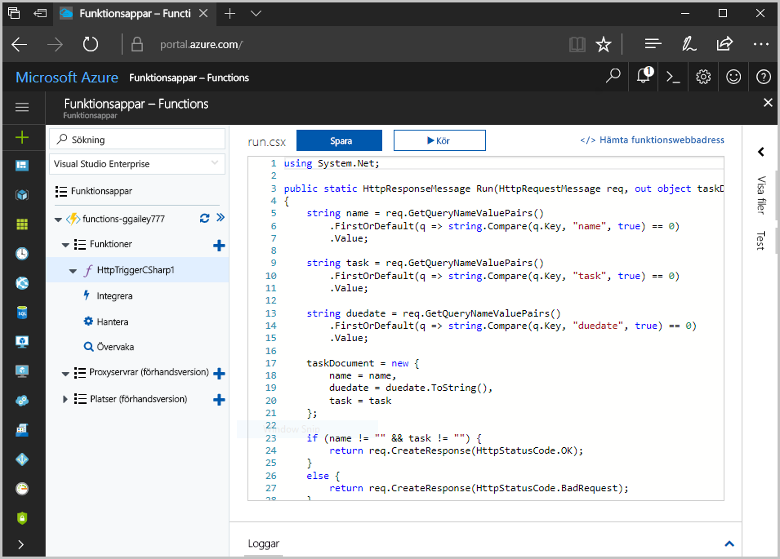
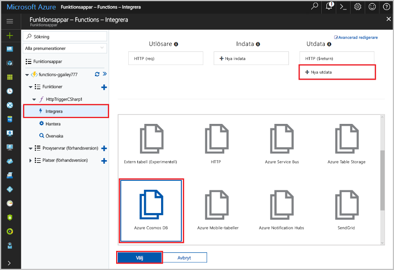
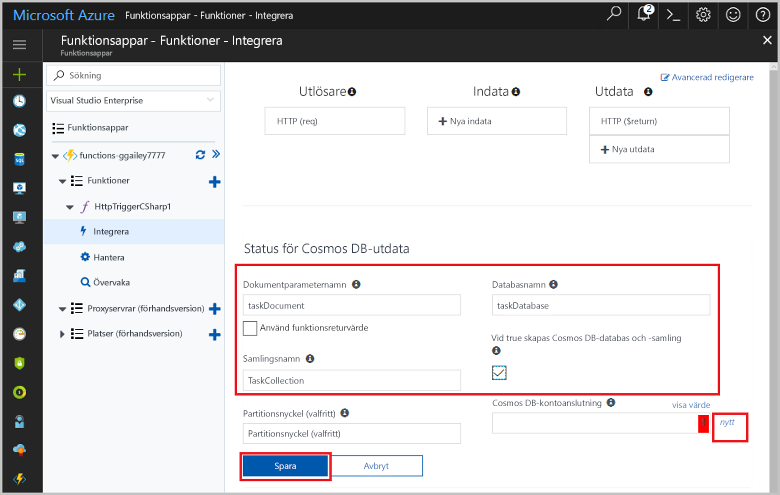
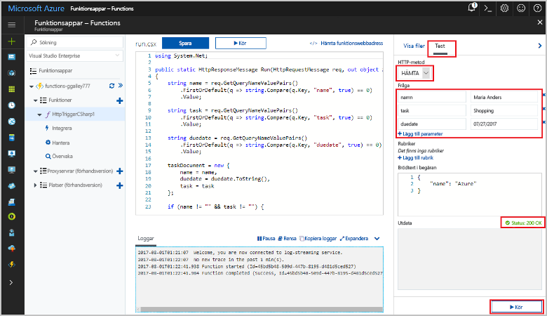
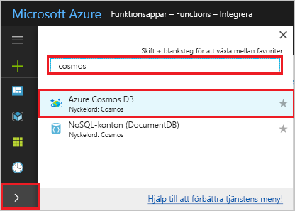
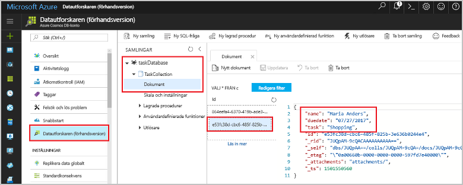

# <a name="store-unstructured-data-using-azure-functions-and-cosmos-db"></a>Lagra ostrukturerade data i Azure Cosmos-databasen med hjälp av funktioner

[Azure Cosmos-DB](https://azure.microsoft.com/services/cosmos-db/) är ett bra sätt toostore Ostrukturerade och JSON-data. I kombination med Azure Functions, gör Cosmos DB lagring av data snabbt och enkelt med mycket mindre kod än vad som krävs för att lagra data i en relationsdatabas.

I Azure Functions ange bindningar för inkommande och utgående en deklarativ metod tooconnect tooexternal tjänstdata från din funktion. I det här avsnittet lär du dig hur fungerar tooupdate en befintlig C# tooadd en bindning för utdata som lagrar Ostrukturerade data i ett Cosmos-DB-dokument. 



## <a name="prerequisites"></a>Krav

toocomplete den här kursen:

[!INCLUDE [Previous quickstart note](../../includes/functions-quickstart-previous-topics.md)]

## <a name="add-an-output-binding"></a>Lägg till en utdatabindning

1. Expandera både din funktionsapp och din funktion.

1. Välj **integrera** och **+ nya utdata**, som är hello uppifrån hello-sidan. Välj **Azure Cosmos DB** och klicka på **Välj**.

    

3. Använd hello **Azure Cosmos DB utdata** inställningar som anges i hello tabell: 

    

    | Inställning      | Föreslaget värde  | Beskrivning                                |
    | ------------ | ---------------- | ------------------------------------------ |
    | **Dokumentparameternamn** | taskDocument | Namnet som refererar toohello Cosmos DB objektet i kod. |
    | **Databasnamn** | taskDatabase | Namnet på databasen toosave dokument. |
    | **Samlingsnamn** | TaskCollection | Namnet på en Cosmos DB-databassamling. |
    | **Om värdet är true, skapas hello Cosmos-DB-databas och samling** | Markerad | hello samlingen inte redan finns, så du måste skapa den. |

4. Välj **ny** nästa toohello **Cosmos dokumentet databasanslutningen** och väljer **+ Skapa nytt**. 

5. Använd hello **nytt konto** inställningar som anges i hello tabell: 

    

    | Inställning      | Föreslaget värde  | Beskrivning                                |
    | ------------ | ---------------- | ------------------------------------------ |
    | **ID** | Namnet på databasen | Unikt ID för hello Cosmos-DB-databas  |
    | **API** | SQL (DocumentDB) | Välj hello dokumentet databasen API.  |
    | **Prenumeration** | Azure-prenumeration | Azure-prenumeration  |
    | **Resursgrupp** | myResourceGroup |  Använd hello befintlig resursgrupp som innehåller funktionsapp. |
    | **Plats**  | Västeuropa | Välj en plats nära tooeither funktionsapp eller tooother appar som använder hello lagrade dokument.  |

6. Klicka på **OK** toocreate hello-databasen. Det kan ta några minuter toocreate hello-databasen. När hello-databasen har skapats lagras hello databasanslutningssträng som en funktionen app-inställning. hello namnet på den här appinställningen infogas i **Cosmos konto databasanslutningen**. 
 
8. När hello anslutningssträngen har angetts, Välj **spara** toocreate hello bindning.

## <a name="update-hello-function-code"></a>Uppdatera Funktionskoden hello

Ersätt hello befintliga C# Funktionskoden med hello följande kod:

```csharp
using System.Net;

public static HttpResponseMessage Run(HttpRequestMessage req, out object taskDocument, TraceWriter log)
{
    string name = req.GetQueryNameValuePairs()
        .FirstOrDefault(q => string.Compare(q.Key, "name", true) == 0)
        .Value;

    string task = req.GetQueryNameValuePairs()
        .FirstOrDefault(q => string.Compare(q.Key, "task", true) == 0)
        .Value;

    string duedate = req.GetQueryNameValuePairs()
        .FirstOrDefault(q => string.Compare(q.Key, "duedate", true) == 0)
        .Value;

    taskDocument = new {
        name = name,
        duedate = duedate.ToString(),
        task = task
    };

    if (name != "" && task != "") {
        return req.CreateResponse(HttpStatusCode.OK);
    }
    else {
        return req.CreateResponse(HttpStatusCode.BadRequest);
    }
}

```
Det här kodexemplet läser hello HTTP-begäran frågesträngar och tilldelar dem toofields i hello `taskDocument` objekt. Hej `taskDocument` bindning skickar hello objektdata från den här bindningen parametern toobe som lagras i hello bundet dokument-databasen. hello-databas skapas hello första gången Hej funktionen körs.

## <a name="test-hello-function-and-database"></a>Testa hello funktionen och databas

1. Expandera hello högra fönstret och välj **Test**. Under **frågan**, klickar du på **+ Lägg till parametern** och Lägg till följande parametrar toohello frågesträngen hello:

    + `name`
    + `task`
    + `duedate`

2. Klicka på **Kör** och kontrollera att statusen 200 returneras.

    

1. Expandera hello ikonen stapel på vänster sida av hello Azure-portalen hello, typen `cosmos` i hello söka och markerar **Azure Cosmos DB**.

    

2. Välj hello-databasen som du skapade, välj sedan **Data Explorer**. Expandera hello **samlingar** noder, Välj hello nytt dokument och bekräfta att hello-dokumentet innehåller din fråga strängvärden, tillsammans med vissa ytterligare metadata. 

    

Du har lagt en bindning tooyour HTTP-utlösare som lagrar Ostrukturerade data i en Cosmos-DB-databas.

[!INCLUDE [Clean-up section](../../includes/clean-up-section-portal.md)]

## <a name="next-steps"></a>Nästa steg

[!INCLUDE [functions-quickstart-next-steps](../../includes/functions-quickstart-next-steps.md)]

Mer information om bindningen tooa Cosmos-DB-databasen finns [Azure Functions Cosmos DB bindningar](functions-bindings-documentdb.md).
