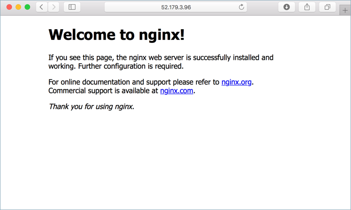

# <a name="azure-container-service-tutorial---manage-dcos"></a>Självstudiekurs för Azure Container Service - hantera DC/OS

DC/OS är en distribuerad plattform för moderna och körning av program. Med Azure Container Service är etablering av en produktion redo DC/OS-kluster snabbt och enkelt. Den här snabbstartsguide information grundläggande steg behövs toodeploy ett DC/OS-klustret och köra grundläggande arbetsbelastning.

> [!div class="checklist"]
> * Skapa ett ACS DC/OS-kluster
> * Ansluta toohello kluster
> * Installera hello DC/OS CLI
> * Distribuera ett program toohello kluster
> * Skala ett program på hello klustret
> * Skala hello DC/OS-klusternoder
> * Grundläggande DC/OS-hantering
> * Ta bort hello DC/OS-klustret

Den här kursen kräver hello Azure CLI version 2.0.4 eller senare. Kör `az --version` toofind hello version. Om du behöver tooupgrade finns [installera Azure CLI 2.0]( /cli/azure/install-azure-cli). 

## <a name="create-dcos-cluster"></a>Skapa DC/OS-klustret

Först skapar en resursgrupp med hello [az gruppen skapa](/cli/azure/group#create) kommando. En Azure-resursgrupp är en logisk behållare där Azure-resurser distribueras och hanteras. 

hello följande exempel skapar en resursgrupp med namnet *myResourceGroup* i hello *westeurope* plats.

```azurecli
az group create --name myResourceGroup --location westeurope
```

Skapa sedan ett DC/OS-kluster med hello [az acs skapa](/cli/azure/acs#create) kommando.

hello följande exempel skapas ett DC/OS-kluster med namnet *myDCOSCluster* och skapar SSH-nycklar, om de inte redan finns. toouse för en specifik uppsättning nycklar använder hello `--ssh-key-value` alternativet.  

```azurecli
az acs create \
  --orchestrator-type dcos \
  --resource-group myResourceGroup \
  --name myDCOSCluster \
  --generate-ssh-keys
```

Om några minuter hello-kommandot har slutförts och returnerar information om hello-distribution.

## <a name="connect-toodcos-cluster"></a>Ansluta tooDC/OS-klustret

När ett DC/OS-klustret har skapats, kan det vara åtkomst via en SSH-tunnel. Hello kör följande kommando tooreturn hello offentliga IP-adressen för hello DC/OS-hanteraren. Den här IP-adressen är lagrad i en variabel och användas i hello nästa steg.

```azurecli
ip=$(az network public-ip list --resource-group myResourceGroup --query "[?contains(name,'dcos-master')].[ipAddress]" -o tsv)
```

toocreate hello SSH-tunnel, kör följande kommando hello och följer hello på skärmen instruktionerna. Om port 80 används misslyckas hello kommandot. Uppdatera hello tunneldata port tooone används som `85:localhost:80`. 

```azurecli
sudo ssh -i ~/.ssh/id_rsa -fNL 80:localhost:80 -p 2200 azureuser@$ip
```

## <a name="install-dcos-cli"></a>Installera DC/OS CLI

Installera hello DC/OS cli med hello [az installera acs-DC/OS-cli](/azure/acs/dcos#install-cli) kommando. Om du använder Azure CloudShell har hello DC/OS CLI redan installerats. Om du kör hello Azure CLI på macOS- eller Linux behöva toorun hello kommandot med sudo.

```azurecli
az acs dcos install-cli
```

Innan du hello CLI kan användas med hello kluster, måste det vara konfigurerade toouse hello SSH-tunnel. toodo kör så hello följande kommando, justera hello porten om det behövs.

```azurecli
dcos config set core.dcos_url http://localhost
```

## <a name="run-an-application"></a>Köra ett program

hello standard schemaläggning mekanism för en ACS DC/OS-klustret är Marathon. Marathon är används toostart ett program och hantera hello tillståndet för programmet hello på hello DC/OS-klustret. tooschedule ett program via Marathon, skapa en fil med namnet **marathon app.json**, och kopiera hello efter innehållet i den. 

```json
{
  "id": "demo-app-private",
  "cmd": null,
  "cpus": 1,
  "mem": 32,
  "disk": 0,
  "instances": 1,
  "container": {
    "docker": {
      "image": "nginx",
      "network": "BRIDGE",
      "portMappings": [
        {
          "containerPort": 80,
          "protocol": "tcp",
          "name": "80",
          "labels": null
        }
      ]
    },
    "type": "DOCKER"
  }
}
```

Kör hello efter kommandot tooschedule hello programmet toorun hello DC/OS-klustret.

```azurecli
dcos marathon app add marathon-app.json
```

toosee hello Distributionsstatus för hello app, kör följande kommando hello.

```azurecli
dcos marathon app list
```

När hello **uppgifter** kolumnvärde växlar från *0/1* för*1/1*, programdistribution har slutförts.

```azurecli
ID     MEM  CPUS  TASKS  HEALTH  DEPLOYMENT  WAITING  CONTAINER  CMD   
/test   32   1     0/1    ---       ---      False      DOCKER   None
```

## <a name="scale-marathon-application"></a>Skala Marathon program

En enda instans-programmet skapades i föregående exempel hello. tooupdate distributionen så att tre instanser av programmet hello är tillgängliga, öppna hello **marathon app.json** filen och uppdatera hello instans egenskapen too3.

```json
{
  "id": "demo-app-private",
  "cmd": null,
  "cpus": 1,
  "mem": 32,
  "disk": 0,
  "instances": 3,
  "container": {
    "docker": {
      "image": "nginx",
      "network": "BRIDGE",
      "portMappings": [
        {
          "containerPort": 80,
          "protocol": "tcp",
          "name": "80",
          "labels": null
        }
      ]
    },
    "type": "DOCKER"
  }
}
```

Uppdatera hello program med hjälp av hello `dcos marathon app update` kommando.

```azurecli
dcos marathon app update demo-app-private < marathon-app.json
```

toosee hello Distributionsstatus för hello app, kör följande kommando hello.

```azurecli
dcos marathon app list
```

När hello **uppgifter** kolumnvärde växlar från *1/3* för*3-1*, programdistribution har slutförts.

```azurecli
ID     MEM  CPUS  TASKS  HEALTH  DEPLOYMENT  WAITING  CONTAINER  CMD   
/test   32   1     1/3    ---       ---      False      DOCKER   None
```

## <a name="run-internet-accessible-app"></a>Kör internet tillgänglig app

hello ACS DC/OS-klustret består av två mängder nod, en offentlig som kan nås på hello internet och en privat som inte är tillgänglig på hello internet. hello standarduppsättning är hello privata noder, som användes i hello sista exemplet.

toomake ett program som är tillgänglig på Hej internet, distribuera dem toohello offentliga noduppsättning har angetts. toodo så ger hello `acceptedResourceRoles` objekt värdet `slave_public`.

Skapa en fil med namnet **nginx public.json** och kopiera hello efter innehållet i den.

```json
{
  "id": "demo-app",
  "cmd": null,
  "cpus": 1,
  "mem": 32,
  "disk": 0,
  "instances": 1,
  "container": {
    "docker": {
      "image": "nginx",
      "network": "BRIDGE",
      "portMappings": [
        {
          "containerPort": 80,
          "hostPort": 80,
          "protocol": "tcp",
          "name": "80",
          "labels": null
        }
      ]
    },
    "type": "DOCKER"
  },
  "acceptedResourceRoles": [
    "slave_public"
  ]
}
```

Kör hello efter kommandot tooschedule hello programmet toorun hello DC/OS-klustret.

```azurecli 
dcos marathon app add nginx-public.json
```

Hämta hello offentliga IP-adress hello DC/OS offentliga klustret agenter.

```azurecli 
az network public-ip list --resource-group myResourceGroup --query "[?contains(name,'dcos-agent')].[ipAddress]" -o tsv
```

Bläddra toothis adress returnerar hello NGINX standardwebbplatsen.



## <a name="scale-dcos-cluster"></a>Skala DC/OS-klustret

I föregående exempel hello var ett program skalade toomultiple-instans. hello DC/OS-infrastruktur kan också vara skalade tooprovide mer eller mindre beräkningskapacitet. Detta görs med hello [az acs skala]() kommando. 

toosee hello aktuellt antal DC/OS-agenterna använda hello [az acs visa](/cli/azure/acs#show) kommando.

```azurecli
az acs show --resource-group myResourceGroup --name myDCOSCluster --query "agentPoolProfiles[0].count"
```

tooincrease hello antal too5 använder hello [az acs skala](/cli/azure/acs#scale) kommando. 

```azurecli
az acs scale --resource-group myResourceGroup --name myDCOSCluster --new-agent-count 5
```

## <a name="delete-dcos-cluster"></a>Ta bort DC/OS-klustret

När du inte längre behövs kan du använda hello [ta bort grupp az](/cli/azure/group#delete) kommandot tooremove hello resursgrupp, DC/OS-kluster och alla relaterade resurser.

```azurecli 
az group delete --name myResourceGroup --no-wait
```

## <a name="next-steps"></a>Nästa steg

I den här kursen har du lärt dig om grundläggande DC/OS-hanteringsaktivitet inklusive hello följande. 

> [!div class="checklist"]
> * Skapa ett ACS DC/OS-kluster
> * Ansluta toohello kluster
> * Installera hello DC/OS CLI
> * Distribuera ett program toohello kluster
> * Skala ett program på hello klustret
> * Skala hello DC/OS-klusternoder
> * Ta bort hello DC/OS-klustret

Avancerade toohello nästa självstudiekurs toolearn om att läsa in belastningsutjämning programmet i DC/OS på Azure. 

> [!div class="nextstepaction"]
> [Belastningsutjämna program](container-service-load-balancing.md)