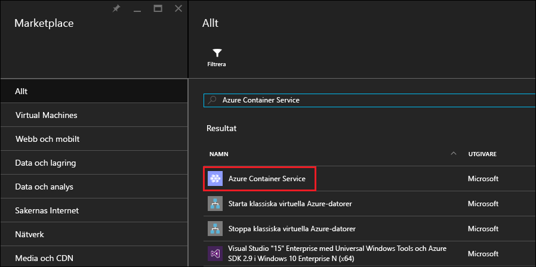
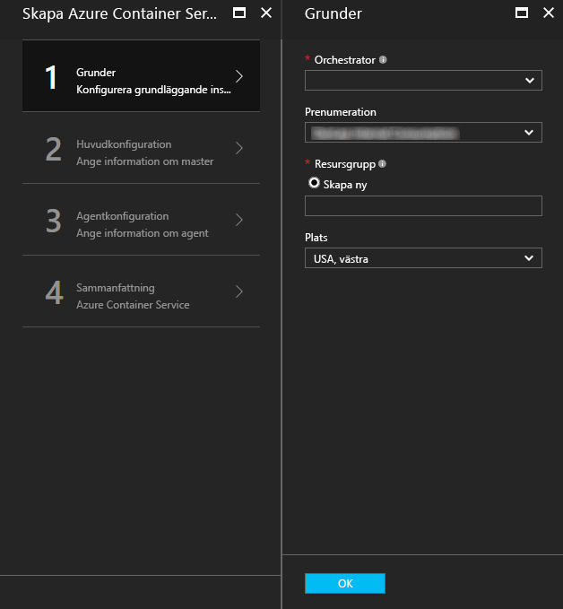
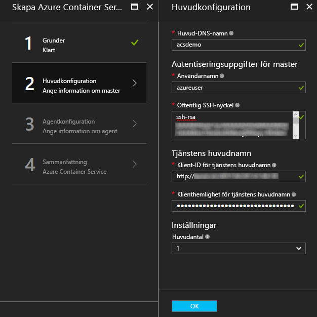
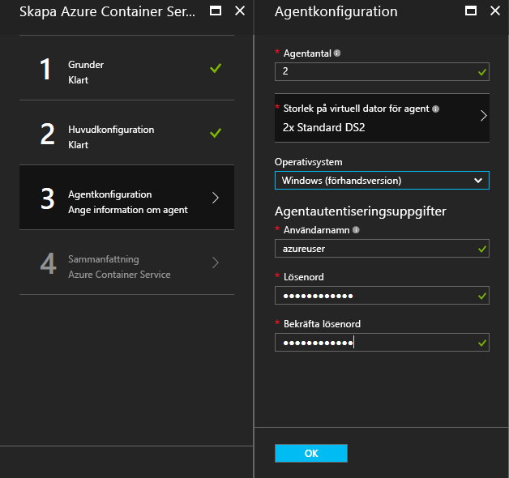
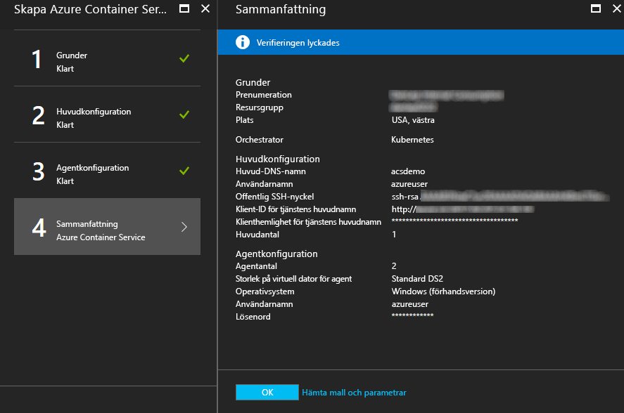
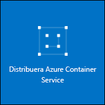

# <a name="deploy-a-docker-container-hosting-solution-using-hello-azure-portal"></a>Distribuera en dockerbehållare som värd-lösning med hjälp av hello Azure-portalen


Azure Container Service ger snabb distribution av populär behållarklustring med öppen källkod och orchestration-lösningar. Det här dokumentet vägleder dig genom att distribuera ett Azure Container Service-kluster med hjälp av hello Azure-portalen eller en mall för Azure Resource Manager-Snabbstart. 

Du kan också distribuera ett Azure Container Service-kluster med hjälp av hello [Azure CLI 2.0](container-service-create-acs-cluster-cli.md) eller hello Azure Container Service API: er.

Bakgrundsinformation finns i [Introduktion till Azure Container Service](../container-service-intro.md).


## <a name="prerequisites"></a>Krav

* **Azure-prenumeration**: Om du inte har någon kan du registrera dig för en [kostnadsfri utvärderingsversion](http://azure.microsoft.com/pricing/free-trial/?WT.mc_id=AA4C1C935). Överväg en prenumeration utan fast avgift eller andra alternativ för ett större kluster.

    > [!NOTE]
    > Din användning av Azure-prenumeration och [resurskvoter](../../azure-subscription-service-limits.md), till exempel kärnor kvoter kan begränsa hello storleken på hello-kluster som du distribuerar. toorequest ökad kvot, öppna ett [online kundsupport](../../azure-supportability/how-to-create-azure-support-request.md) utan kostnad.
    >

* **Offentlig SSH-RSA-nyckel**: när du distribuerar via hello-portalen eller en av hello Azure quickstart mallar, måste tooprovide hello offentlig nyckel för autentisering mot Azure Container Service virtuella datorer. toocreate SSH (Secure Shell) RSA-nycklar, se hello [OS X- och Linux](../../virtual-machines/linux/mac-create-ssh-keys.md) eller [Windows](../../virtual-machines/linux/ssh-from-windows.md) vägledning. 

* **Service principal klient-ID och Hemlig** (Kubernetes): Mer information och vägledning toocreate ett Azure Active Directory-tjänstens huvudnamn, se [om hello tjänstens huvudnamn för ett kluster med Kubernetes](../kubernetes/container-service-kubernetes-service-principal.md).


## <a name="create-a-cluster-by-using-hello-azure-portal"></a>Skapa ett kluster med hjälp av hello Azure-portalen
1. Logga in toohello Azure-portalen, Välj **ny**, och Sök hello Azure Marketplace för **Azure Container Service**.

      <br />

2. Klicka på **Azure Container Service** och klicka på **Skapa**.

3. På hello **grunderna** bladet ange hello följande information:

    * **Orchestrator**: Välj något av hello behållaren orchestrators toodeploy på hello klustret.
        * **DC/OS**: distribuerar ett DC/OS-kluster.
        * **Swarm**: distribuerar ett Docker Swarm-kluster.
        * **Kubernetes**: Distribuerar ett Kubernetes-kluster.
    * **Prenumeration**: Välj en Azure-prenumeration.
    * **Resursgruppen**: Anger hello namnet på en ny resursgrupp för hello-distribution.
    * **Plats**: Välj en Azure-region för hello Azure Container Service-distributionen. Om du vill kontrollera tillgänglighet läser du [Produkttillgänglighet per region](https://azure.microsoft.com/regions/services/).
    
      <br />
    
    Klicka på **OK** när du är klar tooproceed.

4. På hello **Master configuration** bladet ange hello följande inställningar för hello Linux huvudnoden eller noder i klustret för hello (vissa inställningar är särskilda tooeach orchestrator):

    * **Master DNS-namnet**: hello prefix används toocreate ett unikt fullständigt kvalificerade domännamnet (FQDN) för hello master. hello master FQDN är hello formatet *prefix*hanteringsdata*plats*. cloudapp.azure.com.
    * **Användarnamnet**: hello användarnamn för ett konto på varje hello virtuella Linux-datorer i hello kluster.
    * **Offentlig SSH-RSA-nyckel**: Lägg till hello offentliga nyckel toobe används för autentisering mot hello Linux virtuella datorer. Det är viktigt att den här nyckeln innehåller några radbrytningar och innehåller hello `ssh-rsa` prefix. Hej `username@domain` username@Domain är valfritt. hello nyckel ska se ut ungefär hello följande: **ssh-rsa AAAAB3Nz... <>...... UcyupgH azureuser@linuxvm** . 
    * **Tjänstens huvudnamn**: Ange ett Azure Active Directory om du har valt hello Kubernetes orchestrator **Service principal klient-ID** (kallas även hello appId) och **Service principal klienthemlighet** (lösenord). Mer information finns i [om hello tjänstens huvudnamn för ett kluster med Kubernetes](../kubernetes/container-service-kubernetes-service-principal.md).
    * **Master-antal**: hello antal huvudservrar i hello klustret.
    * **Diagnostik för Virtuella datorer**: för vissa orchestrators kan du aktivera diagnostik för Virtuella datorer på hello huvudservrar.

      <br />

    Klicka på **OK** när du är klar tooproceed.

5. På hello **agentkonfiguration** bladet ange hello följande information:

    * **Agentantal**: det här värdet är för Docker Swarm och Kubernetes hello inledande antalet agenter i agentskalningsuppsättningen hello. DC/OS är det hello inledande antalet agenter i en privat skalningsuppsättning. Dessutom skapas en offentlig skalningsuppsättning för DC/OS som innehåller ett förinställt antal agenter. hello antalet agenter i den här offentliga skalningsuppsättningen avgörs av hello antal huvudservrar i klustret hello: en offentlig agent för en överordnad och två offentliga agenter för tre eller fem huvudservrar.
    * **Agenten virtuella datorstorleken**: hello storleken på hello agentens virtuella datorer.
    * **Operativsystemet**: den här inställningen är för närvarande endast tillgängligt om du har valt hello Kubernetes orchestrator. Välj en Linux-distribution eller en Windows Server operativsystem toorun på hello agenter. Den här inställningen bestämmer om ditt kluster kan köra Linux- eller Windows-behållarappar. 

        > [!NOTE]
        > Stöd för Windows-behållare finns i förhandsgranskningen för Kubernetes-kluster. På DC-/OS- och Swarm-kluster stöds för närvarande endast Linux-agenter i Azure Container Service.

    * **Autentiseringsuppgifter för agenten**: Ange en administratör om du har valt hello Windows-operativsystemet **användarnamn** och **lösenord** för hello agent virtuella datorer. 

      <br />

    Klicka på **OK** när du är klar tooproceed.

6. Klicka på **OK** när tjänsteverifieringen är klar.

      <br />

7. Granska hello villkoren. Distributionsprocess för toostart hello, klickar du på **skapa**.

    Om du har valt toopin hello distribution toohello Azure-portalen kan du se hello distributionens status.

      <br />

hello distributionen tar flera minuter toocomplete. Hello Azure Container Service-kluster är redo för användning.


## <a name="create-a-cluster-by-using-a-quickstart-template"></a>Skapa ett kluster med en snabbstartsmall
Azure quickstart mallar är tillgängliga toodeploy ett kluster i Azure Container Service. hello angiven snabbstartsmallar kan vara ändrade tooinclude ytterligare eller avancerade Azure-konfiguration. toocreate ett Azure Container Service-kluster med hjälp av en mall för Azure quickstart du behöver en Azure-prenumeration. Om du inte har någon kan du registrera dig för en [kostnadsfri utvärderingsversion](http://azure.microsoft.com/pricing/free-trial/?WT.mc_id=AA4C1C935). 

Följ dessa steg toodeploy ett kluster med en mall och hello Azure CLI 2.0 (se [installations- och instruktioner](/cli/azure/install-az-cli2)).

> [!NOTE] 
> Om du är på en Windows-dator kan använda du liknande steg toodeploy en mall med hjälp av Azure PowerShell. Se anvisningarna senare i det här avsnittet. Du kan också distribuera en mall med hello [portal](../../azure-resource-manager/resource-group-template-deploy-portal.md) eller andra metoder.

1. toodeploy ett DC/OS, Docker Swarm eller Kubernetes kluster, Välj en av hello tillgängliga quickstart mallar från GitHub. En ofullständig lista finns nedan. hello DC/OS och Swarm mallar är hello samma förutom hello standardvalet av orchestrator.

    * [DC/OS-mall](https://github.com/Azure/azure-quickstart-templates/tree/master/101-acs-dcos)
    * [Swarm-mall](https://github.com/Azure/azure-quickstart-templates/tree/master/101-acs-swarm)
    * [Kubernetes-mall](https://github.com/Azure/azure-quickstart-templates/tree/master/101-acs-kubernetes)

2. Logga in tooyour Azure-konto (`az login`), och kontrollera att hello Azure CLI är anslutna tooyour Azure-prenumeration. Du kan se hello standard prenumeration med hjälp av hello följande kommando:

    ```azurecli
    az account show
    ```
    
    Om du har mer än en prenumeration och behöver tooset en annan standard prenumeration kör `az account set --subscription` och ange hello prenumerations-ID eller namn.

3. Ett bra tips är att använda en ny resursgrupp för hello-distribution. toocreate en resursgrupp, använda hello `az group create` kommando anger resursgruppens namn och plats: 

    ```azurecli
    az group create --name "RESOURCE_GROUP" --location "LOCATION"
    ```

4. Skapa en JSON-fil som innehåller hello nödvändiga parametrar. Hämta hello parameterfil som heter `azuredeploy.parameters.json` som medföljer hello Azure Container Service-mallen `azuredeploy.json` i GitHub. Ange de parametervärden som krävs för klustret. 

    Till exempel toouse hello [DC/OS-mall](https://github.com/Azure/azure-quickstart-templates/tree/master/101-acs-dcos), ange parametervärden för `dnsNamePrefix` och `sshRSAPublicKey`. Se hello beskrivningar i `azuredeploy.json` och alternativ för andra parametrar.  
 

5. Skapa ett Container Service-kluster genom att skicka hello distribution parameterfilen med hello följande kommando, där:

    * **RESOURCE_GROUP** är hello resursgrupp som du skapade i föregående steg i hello hello namn.
    * **DEPLOYMENT_NAME** (valfritt) är ett namn som du ger toohello distribution.
    * **TEMPLATE_URI** är hello platsen för distributionsfilen hello `azuredeploy.json`. Den här URI måste vara hello Raw-filen, inte en pekare toohello GitHub UI. toofind URI: N, väljer hello `azuredeploy.json` filen i GitHub och på hello **Raw** knappen.  

    ```azurecli
    az group deployment create -g RESOURCE_GROUP -n DEPLOYMENT_NAME --template-uri TEMPLATE_URI --parameters @azuredeploy.parameters.json
    ```

    Du kan också ange parametrar som en JSON-formaterad sträng på hello kommandoraden. Använd ett kommando liknande toohello följande:

    ```azurecli
    az group deployment create -g RESOURCE_GROUP -n DEPLOYMENT_NAME --template-uri TEMPLATE_URI --parameters "{ \"param1\": {\"value1\"} … }"
    ```

    > [!NOTE]
    > hello distributionen tar flera minuter toocomplete.
    > 

### <a name="equivalent-powershell-commands"></a>Motsvarande PowerShell-kommandon
Du kan även distribuera en mall för ett Azure Container Service-kluster med PowerShell. Det här dokumentet är baserad på hello version 1.0 [Azure PowerShell-modulen](https://azure.microsoft.com/blog/azps-1-0/).

1. toodeploy ett DC/OS, Docker Swarm eller Kubernetes kluster, Välj en av hello tillgängliga quickstart mallar från GitHub. En ofullständig lista finns nedan. Observera att hello DC/OS och Swarm mallar är hello detsamma, med undantag för hello av hello standardvalet av orchestrator.

    * [DC/OS-mall](https://github.com/Azure/azure-quickstart-templates/tree/master/101-acs-dcos)
    * [Swarm-mall](https://github.com/Azure/azure-quickstart-templates/tree/master/101-acs-swarm)
    * [Kubernetes-mall](https://github.com/Azure/azure-quickstart-templates/tree/master/101-acs-kubernetes)

2. Kontrollera att PowerShell-sessionen har loggats in tooAzure innan du skapar ett kluster i Azure-prenumeration. Du kan göra detta med hello `Get-AzureRMSubscription` kommando:

    ```powershell
    Get-AzureRmSubscription
    ```

3. Om du behöver toosign i tooAzure använder hello `Login-AzureRMAccount` kommando:

    ```powershell
    Login-AzureRmAccount
    ```

4. Ett bra tips är att använda en ny resursgrupp för hello-distribution. toocreate en resursgrupp, använda hello `New-AzureRmResourceGroup` kommando och ange en resurs grupp namn och mål region:

    ```powershell
    New-AzureRmResourceGroup -Name GROUP_NAME -Location REGION
    ```

5. När du har skapat en resursgrupp kan du skapa klustret med hello följande kommando. hello-URI för hello önskade mallen anges med hello `-TemplateUri` parameter. När du kör det här kommandot uppmanar PowerShell dig att ange parametervärden för distributionen.

    ```powershell
    New-AzureRmResourceGroupDeployment -Name DEPLOYMENT_NAME -ResourceGroupName RESOURCE_GROUP_NAME -TemplateUri TEMPLATE_URI
    ```

#### <a name="provide-template-parameters"></a>Ange mallparametrar
Om du är bekant med PowerShell vet du att du kan gå igenom hello tillgängliga parametrar för en cmdlet genom att skriva ett minustecken (-) och sedan trycka på TABB-tangenten hello. Den här metoden går även att använda med parametrar som du anger i mallen. Så snart du skriver hello mallnamn hello cmdlet hämtar hello mallen, Parsar hello parametrar och lägger till hello mallen parametrar toohello kommandot dynamiskt. Detta gör det enkelt toospecify hello parametervärden för mallen. Och om du glömmer ett nödvändigt parametervärde efterfrågar PowerShell hello värde.

Här är hello fullständiga kommandot inklusive parametrar. Ange egna värden för hello namnen på de hello resurser.

```powershell
New-AzureRmResourceGroupDeployment -ResourceGroupName RESOURCE_GROUP_NAME-TemplateURI TEMPLATE_URI -adminuser value1 -adminpassword value2 ....
```

## <a name="next-steps"></a>Nästa steg
Nu när du har ett fungerande kluster kan du visa dessa dokument för anslutnings- och hanteringsinformation:

* [Ansluta tooan Azure Container Service-kluster](../container-service-connect.md)
* [Arbeta med Azure Container Service och DC/OS](container-service-mesos-marathon-rest.md)
* [Arbeta med Azure Container Service och Docker Swarm](container-service-docker-swarm.md)
* [Arbeta med Azure Container Service och Kubernetes](../kubernetes/container-service-kubernetes-walkthrough.md)
