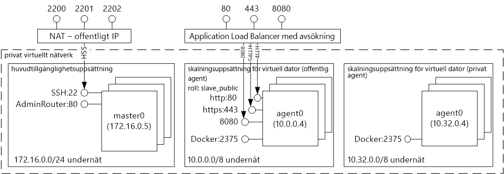
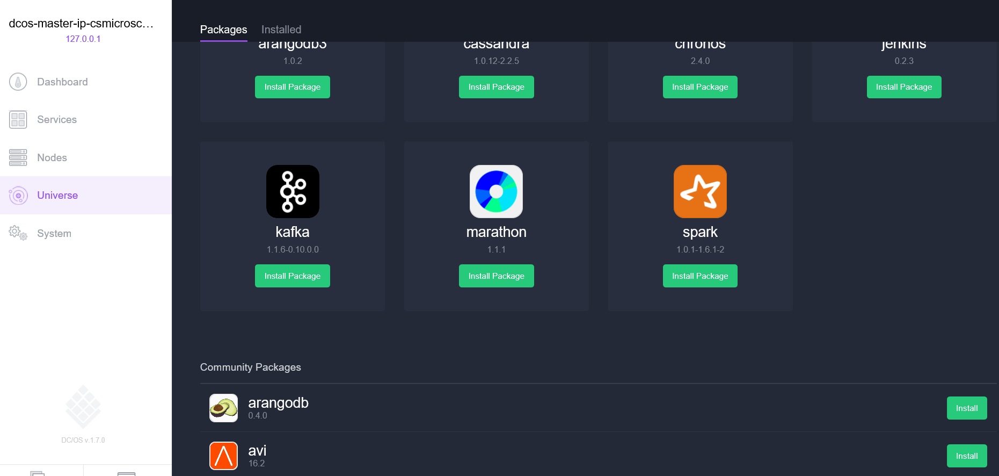
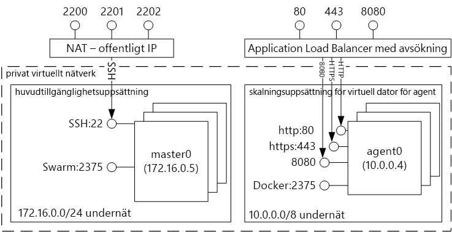
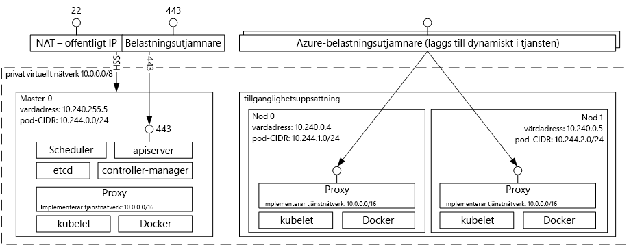

# Introduktion tooDocker behållare som är värd för lösningar med Azure Container Service 
Azure Container Service gör det enklare för dig toocreate, konfigurera och hantera kluster för virtuella datorer som är förkonfigurerad toorun av program. Det använder en optimerad konfiguration av populära verktyg för öppen källkod för schemaläggning och dirigering. Detta gör att du toouse dina befintliga kunskaper eller rita på en stor och växande uppsättning community kunskaper, toodeploy och hantera behållare-baserade program i Microsoft Azure.

Azure Container Service utnyttjar hello Docker behållare format tooensure att programmet-behållare är fullständigt anpassade. Det stöder också valet av Marathon och DC/OS, Docker Swarm eller Kubernetes så att du kan skala dessa program toothousands av behållare eller även tiotal tusentalsavgränsare.

Med Azure Container Service kan dra du nytta av företagsklass funktionerna i Azure, men har ändå programmet portabilitet - inklusive portability på hello orchestration-skikten.

## Använda Azure Container Service
Vårt mål med Azure Container Service är tooprovide värdmiljön en behållare med öppen källkod verktyg och tekniker som är populärt bland våra kunder idag. toothis end vi exponera hello standard API-slutpunkter för din valda orchestrator (DC/OS, Docker Swarm eller Kubernetes). Genom att använda dessa slutpunkter kan utnyttja du all programvara som kan prata toothose slutpunkter. Du kan till exempel välja toouse hello Docker-kommandoradsgränssnittet (CLI) i hello fallet för hello Docker Swarm-slutpunkten. Du kan välja hello DCOS CLI för DC/OS. För Kubernetes kanske du väljer `kubectl`.

## Skapa ett Docker-kluster med Azure Container Service
toobegin med Azure Container Service du distribuera ett Azure Container Service-kluster via hello-portal (Sök hello Marketplace för **Azure Container Service**), med en Azure Resource Manager-mall ([Docker Swarm](https://github.com/Azure/azure-quickstart-templates/tree/master/101-acs-swarm), [DC/OS](https://github.com/Azure/azure-quickstart-templates/tree/master/101-acs-dcos), eller [Kubernetes](https://github.com/Azure/azure-quickstart-templates/tree/master/101-acs-kubernetes)), eller med hello [Azure CLI 2.0](container-service-create-acs-cluster-cli.md). hello angiven snabbstartsmallar kan vara ändrade tooinclude ytterligare eller avancerade Azure-konfiguration. Mer information finns i [Distribuera ett Azure Container Service-kluster](container-service-deployment.md).

## Distribuera ett program
Med Azure Container Service kan du välja mellan Docker Swarm, DC/OS och Kubernetes för dirigering. Hur du distribuerar programmet beror på ditt val av dirigering.

### Använda DC/OS
DC/OS är ett distribuerat baserat på hello Apache Mesos distribuerade system kernel-operativsystem. Apache Mesos finns sparad på hello Apache Software Foundation och listar några av hello [största namn i IT](http://mesos.apache.org/documentation/latest/powered-by-mesos/) som användare och deltagare.

DC/OS och Apache Mesos har en imponerande funktionsuppsättning:

* Beprövad skalbarhet
* Feltoleranta master och slavar med Apache ZooKeeper
* Stöd för Docker-formaterade behållare
* Intern isolering mellan aktiviteter med Linux-behållare
* Schemaläggning med flera resurser (minne, CPU, disk och portar)
* Java-, Python- och C++-API:er för att utveckla nya parallella program
* Ett webbgränssnitt för att visa klustertillstånd

Som standard innehåller DC/OS som körs på Azure Container Service hello Marathon orchestration plattform för schemaläggning av arbetsbelastningar. Ingår i hello DC/OS-distributionen av ACS är dock hello Mesosphere Universe tjänster som kan läggas till tooyour-tjänsten. Tjänster i hello Universe omfattar Spark, Hadoop, Cassandra och mycket mer.

#### Använda Marathon
Marathon är en hela init och kontrollsystem för tjänster i cgroups-- eller hello gäller Azure Container Service Docker-formaterad behållare. Marathon tillhandahåller ett webbgränssnitt som du kan distribuera dina program från. Du kan komma åt det via en URL-adress som ser ut ungefär som `http://DNS_PREFIX.REGION.cloudapp.azure.com` där DNS\_PREFIX och REGION definieras vid tidpunkten för distribution. Du kan naturligtvis också ange ett eget DNS-namn. Mer information om hur du kör en behållare med hello Marathons webbgränssnitt finns [DC/OS-hantering av behållare via hello Marathons webbgränssnitt](container-service-mesos-marathon-ui.md).

Du kan också använda hello REST API: er för att kommunicera med Marathon. Det finns ett antal klientbibliotek som är tillgängliga för varje verktyg. De omfattar en mängd olika språk, och naturligtvis kan du använda hello HTTP-protokollet i valfritt språk. Dessutom har många DevOps-verktyg stöd för Marathon. Detta ger maximal flexibilitet för driftsgruppen när du arbetar med Azure Container Service-kluster. Mer information om hur du kör en behållare med Marathon REST API för hello finns [DC/OS hantering av behållare via Marathon REST API för hello](container-service-mesos-marathon-rest.md).

### Använda Docker Swarm
Docker Swarm tillhandahåller interna kluster för Docker. Eftersom Docker Swarm fungerar Hej Docker API: et, ett verktyg som redan kommunicerar med en Docker-daemon kan använda Swarm tootransparently skala toomultiple värdar på Azure Container Service.

[!INCLUDE [container-service-swarm-mode-note](../../../includes/container-service-swarm-mode-note.md)]

Verktyg för att hantera behållare på ett Swarm-kluster inkludera, men är inte begränsade till hello följande:

* Dokku
* Docker CLI och Docker Compose
* Krane
* Jenkins

### Använda Kubernetes
Kubernetes är ett populärt dirigeringsverktyg för behållare i produktionsklass med öppen källkod. Kubernetes automatiserar distributionen, skalningen och hanteringen av program som använder behållare. Eftersom det är en lösning för öppen källkod och styrs av hello öppen källkod community körs sömlöst på Azure Container Service och kan vara används toodeploy behållare i stor skala på Azure Container Service.

Det har en omfattande uppsättning funktioner. Till exempel:
* Horisontell skalning
* Tjänstidentifiering och belastningsutjämning
* Hemligheter och konfigurationshantering
* API-baserade automatiserade distributioner och återställningar
* Självåterställning

## Videoklipp
Komma igång med Azure Container Service (101):  

> [!VIDEO https://channel9.msdn.com/Shows/Azure-Friday/Azure-Container-Service-101/player]
>
>

Skapa program med hjälp av hello Azure Container Service (Build 2016)

> [!VIDEO https://channel9.msdn.com/Events/Build/2016/B822/player]
>
>

## Nästa steg

Distribuera ett container service-kluster med hjälp av hello [portal](container-service-deployment.md) eller [Azure CLI 2.0](container-service-create-acs-cluster-cli.md).
