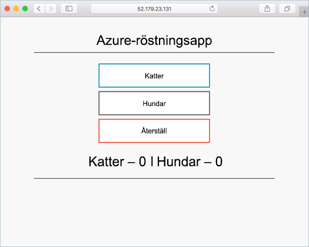

# <a name="deploy-kubernetes-cluster-for-linux-containers"></a>Distribuera Kubernets-kluster för Linux-behållare

I den här snabbstartsguide distribueras ett Kubernetes kluster med hjälp av hello Azure CLI. Ett program för flera behållare som består av frontwebb och en Redis-instans distribueras sedan och köra på hello kluster. När klar hello programmet är tillgänglig över hello internet. 

hello exempelprogram som används i det här dokumentet har skrivits i Python. hello begreppen och stegen som beskrivs här kan vara används toodeploy alla behållare bild i ett Kubernetes kluster. hello kod, Dockerfile och förskapade Kubernetes manifestfiler relaterade toothis projektet är tillgängliga på [GitHub](https://github.com/Azure-Samples/azure-voting-app-redis.git).



Den här snabbstartsguide förutsätter grundläggande kunskaper om Kubernetes begrepp, detaljerad information om Kubernetes finns hello [Kubernetes dokumentationen]( https://kubernetes.io/docs/home/).

Om du inte har en Azure-prenumeration kan du skapa ett [kostnadsfritt konto](https://azure.microsoft.com/free/?WT.mc_id=A261C142F) innan du börjar.

[!INCLUDE [cloud-shell-try-it.md](../../../includes/cloud-shell-try-it.md)]

Om du väljer tooinstall och använda hello CLI lokalt denna Snabbstart kräver att du kör hello Azure CLI version 2.0.4 eller senare. Kör `az --version` toofind hello version. Om du behöver tooinstall eller uppgradering, se [installera Azure CLI 2.0]( /cli/azure/install-azure-cli). 

## <a name="create-a-resource-group"></a>Skapa en resursgrupp

Skapa en resursgrupp med hello [az gruppen skapa](/cli/azure/group#create) kommando. En Azure-resursgrupp är en logisk grupp där Azure-resurser distribueras och hanteras. 

hello följande exempel skapar en resursgrupp med namnet *myResourceGroup* i hello *westeurope* plats.

```azurecli-interactive 
az group create --name myResourceGroup --location westeurope
```

Resultat:

```json
{
  "id": "/subscriptions/00000000-0000-0000-0000-000000000000/resourceGroups/myResourceGroup",
  "location": "westeurope",
  "managedBy": null,
  "name": "myResourceGroup",
  "properties": {
    "provisioningState": "Succeeded"
  },
  "tags": null
}
```

## <a name="create-kubernetes-cluster"></a>Skapa Kubernetes-kluster

Skapa ett Kubernetes-kluster i Azure Container Service med hello [az acs skapa](/cli/azure/acs#create) kommando. hello följande exempel skapar ett kluster med namnet *myK8sCluster* med en Linux master-nod och tre noder för Linux-agenten.

```azurecli-interactive 
az acs create --orchestrator-type kubernetes --resource-group myResourceGroup --name myK8sCluster --generate-ssh-keys 
```

Om några minuter hello-kommandot har slutförts och returnerar json-formaterade information om hello-klustret. 

## <a name="connect-toohello-cluster"></a>Ansluta toohello kluster

toomanage ett Kubernetes kluster, använda [kubectl](https://kubernetes.io/docs/user-guide/kubectl/), hello Kubernetes kommandorads-klient. 

Om du använder Azure CloudShell är kubectl redan installerat. Om du vill tooinstall lokalt, du kan använda hello [az acs kubernetes install-cli](/cli/azure/acs/kubernetes#install-cli) kommando.

tooconfigure kubectl tooconnect tooyour Kubernetes klustret, kör hello [az acs kubernetes get-autentiseringsuppgifter](/cli/azure/acs/kubernetes#get-credentials) kommando. Det här steget hämtar autentiseringsuppgifter och konfigurerar hello Kubernetes CLI toouse dem.

```azurecli-interactive 
az acs kubernetes get-credentials --resource-group=myResourceGroup --name=myK8sCluster
```

tooverify hello anslutning tooyour kluster, Använd hello [kubectl hämta](https://kubernetes.io/docs/user-guide/kubectl/v1.6/#get) kommandot tooreturn en lista över hello klusternoder.

```azurecli-interactive
kubectl get nodes
```

Resultat:

```bash
NAME                    STATUS                     AGE       VERSION
k8s-agent-14ad53a1-0    Ready                      10m       v1.6.6
k8s-agent-14ad53a1-1    Ready                      10m       v1.6.6
k8s-agent-14ad53a1-2    Ready                      10m       v1.6.6
k8s-master-14ad53a1-0   Ready,SchedulingDisabled   10m       v1.6.6
```

## <a name="run-hello-application"></a>Kör programmet hello

En manifestfil Kubernetes definierar en alterntiv hello klustret, inklusive vad behållaren bilder ska köras. I det här exemplet är ett manifest används toocreate alla objekt behövs toorun hello Azure rösten program. 

Skapa en fil med namnet `azure-vote.yml` och kopiera in hello följande YAML. Om du arbetar i Azure Cloud Shell, kan du skapa filen med vi eller Nano som i ett virtuellt eller fysiskt system.

```yaml
apiVersion: apps/v1beta1
kind: Deployment
metadata:
  name: azure-vote-back
spec:
  replicas: 1
  template:
    metadata:
      labels:
        app: azure-vote-back
    spec:
      containers:
      - name: azure-vote-back
        image: redis
        ports:
        - containerPort: 6379
          name: redis
---
apiVersion: v1
kind: Service
metadata:
  name: azure-vote-back
spec:
  ports:
  - port: 6379
  selector:
    app: azure-vote-back
---
apiVersion: apps/v1beta1
kind: Deployment
metadata:
  name: azure-vote-front
spec:
  replicas: 1
  template:
    metadata:
      labels:
        app: azure-vote-front
    spec:
      containers:
      - name: azure-vote-front
        image: microsoft/azure-vote-front:redis-v1
        ports:
        - containerPort: 80
        env:
        - name: REDIS
          value: "azure-vote-back"
---
apiVersion: v1
kind: Service
metadata:
  name: azure-vote-front
spec:
  type: LoadBalancer
  ports:
  - port: 80
  selector:
    app: azure-vote-front
```

Använd hello [kubectl skapa](https://kubernetes.io/docs/user-guide/kubectl/v1.6/#create) kommandot toorun hello program.

```azurecli-interactive
kubectl create -f azure-vote.yml
```

Resultat:

```bash
deployment "azure-vote-back" created
service "azure-vote-back" created
deployment "azure-vote-front" created
service "azure-vote-front" created
```

## <a name="test-hello-application"></a>Testa programmet hello

Eftersom hello programmet körs är en [Kubernetes service](https://kubernetes.io/docs/concepts/services-networking/service/) skapas som visar hello programmet klientdelen toohello internet. Den här processen kan ta några minuter toocomplete. 

toomonitor pågår, Använd hello [kubectl hämta service](https://kubernetes.io/docs/user-guide/kubectl/v1.6/#get) med hello `--watch` argumentet.

```azurecli-interactive
kubectl get service azure-vote-front --watch
```

Ursprungligen hello **externa IP-** för hello *azure rösten sista* tjänsten visas som *väntande*. När hello extern IP-adress har ändrats från *väntande* tooan *IP-adress*, använda `CTRL-C` toostop hello kubectl titta på processen. 
  
```bash
azure-vote-front   10.0.34.242   <pending>     80:30676/TCP   7s
azure-vote-front   10.0.34.242   52.179.23.131   80:30676/TCP   2m
```

Du kan nu bläddra toohello externa IP-adress toosee hello Azure rösten App.

  

## <a name="delete-cluster"></a>Ta bort klustret
När hello klustret inte längre behövs, kan du använda hello [ta bort grupp az](/cli/azure/group#delete) kommandot tooremove hello resursgrupp, behållartjänsten och alla relaterade resurser.

```azurecli-interactive 
az group delete --name myResourceGroup --yes --no-wait
```

## <a name="get-hello-code"></a>Hämta hello kod

I den här snabbstartsguide har skapats i förväg behållaren bilder används toocreate en Kubernetes-distribution. hello relaterade programkod, Dockerfile, och Kubernetes manifestfilen är tillgängliga på GitHub.

[https://github.com/Azure-Samples/azure-voting-app-redis](https://github.com/Azure-Samples/azure-voting-app-redis.git)

## <a name="next-steps"></a>Nästa steg

I den här snabbstartsguide distribueras ett Kubernetes kluster och distribuerat en tooit för flera program. 

toolearn mer om Azure Container Service och gå igenom ett fullständigt toodeployment kodexempel, fortsätta toohello Kubernetes klustret kursen.

> [!div class="nextstepaction"]
> [Hantera ett ACS Kubernets-kluster](./container-service-tutorial-kubernetes-prepare-app.md)
