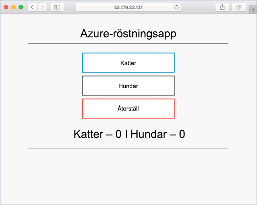

# <a name="create-container-images-toobe-used-with-azure-container-service"></a>Skapa behållaren bilder toobe används med Azure Container Service

I den här självstudiekursen, del 1 av sju, har ett program för flera behållare förberetts för användning i Kubernetes. Slutfört stegen innefattar:  

> [!div class="checklist"]
> * Klona programkällan från GitHub  
> * Skapar en behållare avbildning från hello programmet källa
> * Testa hello program i en lokal Docker-miljö

När slutförd är hello följande program tillgängligt i din lokala utvecklingsmiljö.



I efterföljande självstudiekurser hello behållaren bilden är överförda tooan Azure Container registret, och sedan köras i en Azure värd Kubernetes klustret.

## <a name="before-you-begin"></a>Innan du börjar

Den här självstudien förutsätter grundläggande kunskaper om grundläggande Docker-begrepp som behållare, behållaravbildningar och grundläggande docker-kommandon. Om det behövs kan du läsa [Get started with Docker]( https://docs.docker.com/get-started/) (Komma igång med Docker) för att få en genomgång av grunden för behållare. 

toocomplete den här kursen behöver du en Docker-utvecklingsmiljö. Docker innehåller paket som enkelt kan konfigurera Docker på en [Mac-](https://docs.docker.com/docker-for-mac/), [Windows-](https://docs.docker.com/docker-for-windows/) eller [Linux-](https://docs.docker.com/engine/installation/#supported-platforms)dator.

## <a name="get-application-code"></a>Hämta programkod

hello exempelprogrammet används i den här kursen är en grundläggande röstning app. hello program består av en frontend-webbservrar komponent och en serverdel Redis-instans. hello webbkomponenten paketeras till en bild med anpassade container. Hej Redis instans använder en oförändrad bild från Docker-hubben.  

Använda git toodownload en kopia av hello programmet tooyour utvecklingsmiljö.

```bash
git clone https://github.com/Azure-Samples/azure-voting-app-redis.git
```

I hello klonade directory hello programmets källkod, en förskapad Docker compose fil- och en Kubernetes manifestfil. Dessa filer är används toocreate tillgångar i hela hello självstudiekursen uppsättningen. 

## <a name="create-container-images"></a>Skapa avbildningar av behållare

[Docker Compose](https://docs.docker.com/compose/) kan vara används tooautomate hello build från behållaren avbildningar och hello distribution av flera behållare program.

Kör hello docker-compose.yml fil toocreate hello behållaren bild, hämta hello Redis avbildningen och starta programmet hello.

```bash
docker-compose -f ./azure-voting-app-redis/docker-compose.yml up -d
```

När du är klar, Använd hello [docker bilder](https://docs.docker.com/engine/reference/commandline/images/) kommandot toosee hello skapa avbildningar.

```bash
docker images
```

Observera att tre bilder har hämtat eller skapat. Hej *azure rösten sista* bilden innehåller hello program. Det har härletts från hello *nginx flask* bild. Hej Redis avbildningen hämtades från Docker-hubben.

```bash
REPOSITORY                   TAG        IMAGE ID            CREATED             SIZE
azure-vote-front             latest     9cc914e25834        40 seconds ago      694MB
redis                        latest     a1b99da73d05        7 days ago          106MB
tiangolo/uwsgi-nginx-flask   flask      788ca94b2313        9 months ago        694MB
```

Kör hello [docker ps](https://docs.docker.com/engine/reference/commandline/ps/) kommandot toosee hello behållare som körs.

```bash
docker ps
```

Resultat:

```bash
CONTAINER ID        IMAGE             COMMAND                  CREATED             STATUS              PORTS                           NAMES
82411933e8f9        azure-vote-front  "/usr/bin/supervisord"   57 seconds ago      Up 30 seconds       443/tcp, 0.0.0.0:8080->80/tcp   azure-vote-front
b68fed4b66b6        redis             "docker-entrypoint..."   57 seconds ago      Up 30 seconds       0.0.0.0:6379->6379/tcp          azure-vote-back
```

## <a name="test-application-locally"></a>Testa programmet lokalt

Bläddra toohttp://localhost:8080 toosee hello program körs.


## <a name="clean-up-resources"></a>Rensa resurser

Nu när programfunktionen har verifierats, hello behållare som körs stoppas och tas bort. Ta inte bort hello behållaren bilder. Hej *azure rösten sista* bilden är överförda tooan Azure Container registret instans i nästa kurs i hello.

Kör hello följande toostop hello behållare som körs.

```bash
docker-compose -f ./azure-voting-app-redis/docker-compose.yml stop
```

Ta bort hello stoppats behållare med hello följande kommando.

```bash
docker-compose -f ./azure-voting-app-redis/docker-compose.yml rm
```

Vid färdigställande har du en avbildning av behållare som innehåller hello Azure rösten program.

## <a name="next-steps"></a>Nästa steg

Ett program har testats och behållare avbildningar som skapats för programmet hello i den här självstudiekursen. hello följande steg har slutförts:

> [!div class="checklist"]
> * Kloningen hello programmet källa från GitHub  
> * Skapa en avbildning av behållare från programmet källa
> * Testad hello program i en lokal Docker-miljö

Avancera toohello nästa självstudiekurs toolearn om att lagra behållaren bilder i ett Azure Container registret.

> [!div class="nextstepaction"]
> [Push-avbildningar tooAzure behållare registret](./container-service-tutorial-kubernetes-prepare-acr.md)
