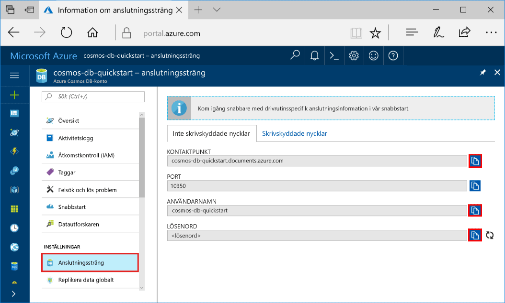
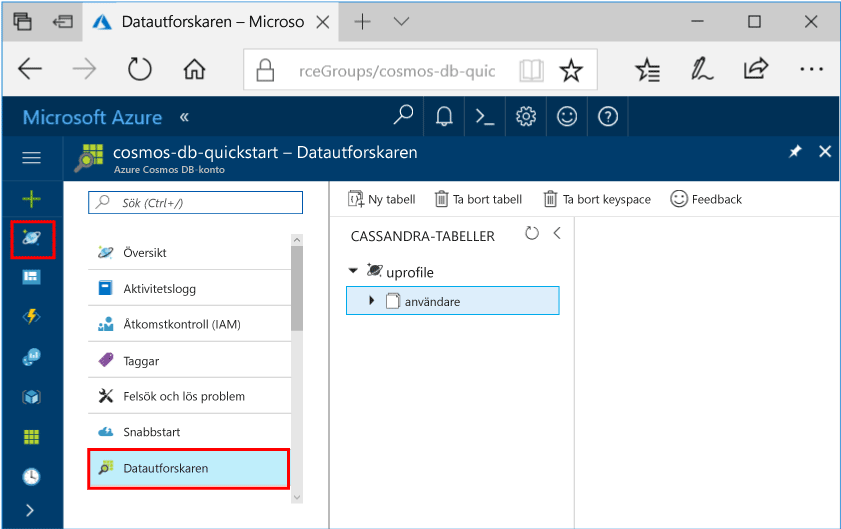

# <a name="quickstart-build-a-cassandra-app-with-python-and-azure-cosmos-db"></a>Snabbstart: Skapa en Cassandra-app med Python och Azure Cosmos DB

Den här snabbstarten visar hur du använder [Cassandra API](cassandra-introduction.md) i Python och Azure Cosmos DB för att skapa en profilapp genom att klona ett exempel från GitHub. Denna snabbstart visar dig också hur man skapar ett Azure Cosmos DB-konto med hjälp av den webbaserade Azure-portalen.

Azure Cosmos DB är Microsofts globalt distribuerade databastjänst för flera datamodeller. Du kan snabbt skapa och ställa frågor mot databaser med dokument, tabeller, nyckel/värde-par och grafer. Du får fördelar av den globala distributionen och den horisontella skalningsförmågan som ligger i grunden hos Azure Cosmos DB.   

## <a name="prerequisites"></a>Krav

[!INCLUDE [quickstarts-free-trial-note](../../includes/quickstarts-free-trial-note.md)] Du kan även [Testa Azure Cosmos DB kostnadsfritt](https://azure.microsoft.com/try/cosmosdb/) utan en Azure-prenumeration, utan kostnad och åtaganden.

Åtkomst till förhandsgranskningsprogrammet för Azure Cosmos DB Cassandra API. Om du inte har ansökt om åtkomst än kan du [registrera dig nu](cassandra-introduction.md#sign-up-now).

Följande gäller också:
* [Python](https://www.python.org/downloads/) version v2.7.14
* [Git](http://git-scm.com/)
* [Python-drivrutin för Apache Cassandra](https://github.com/datastax/python-driver)

## <a name="create-a-database-account"></a>Skapa ett databaskonto

Innan du kan börja skapa en dokumentdatabas måste du skapa ett Cassandra-konto med Azure Cosmos DB.

[!INCLUDE [cosmos-db-create-dbaccount-cassandra](../../includes/cosmos-db-create-dbaccount-cassandra.md)]

## <a name="clone-the-sample-application"></a>Klona exempelprogrammet

Nu ska vi klona en Cassandra API-app från github, ange anslutningssträngen och köra appen. Du kommer att se hur lätt det är att arbeta med data programmässigt. 

1. Öppna ett git-terminalfönster, t.ex. git bash, och använd kommandot `cd` för att ändra till en mapp där du vill installera exempelappen. 

    ```bash
    cd "C:\git-samples"
    ```

2. Klona exempellagringsplatsen med följande kommando. Detta kommando skapar en kopia av exempelappen på din dator. 

    ```bash
    git clone https://github.com/Azure-Samples/azure-cosmos-db-cassandra-python-getting-started.git
    ```

## <a name="review-the-code"></a>Granska koden

Det här steget är valfritt. Om du vill lära dig hur databasresurserna skapas i koden kan du granska följande kodavsnitt. Alla kodavsnitten kommer från filen `pyquickstart.py`. Annars kan du gå vidare till [Uppdatera din anslutningssträng](#update-your-connection-string). 

* Användarnamn och lösenord anges med hjälp av anslutningssträngsidan i Azure-portalen. Du ersätter path\to\cert med sökvägen till ditt X509-certifikat.

   ```python
    ssl_opts = {
            'ca_certs': 'path\to\cert',
            'ssl_version': ssl.PROTOCOL_TLSv1_2
            }
    auth_provider = PlainTextAuthProvider( username=cfg.config['username'], password=cfg.config['password'])
    cluster = Cluster([cfg.config['contactPoint']], port = cfg.config['port'], auth_provider=auth_provider, ssl_options=ssl_opts)
    session = cluster.connect()
   
   ```

* `cluster` har initierats med contactPoint-information. contactPoint hämtas från Azure-portalen.

    ```python
   cluster = Cluster([cfg.config['contactPoint']], port = cfg.config['port'], auth_provider=auth_provider)
    ```

* `cluster` ansluter till Azure Cosmos DB Cassandra API.

    ```python
    session = cluster.connect()
    ```

* Ett nytt keyspace skapas.

    ```python
   session.execute('CREATE KEYSPACE IF NOT EXISTS uprofile WITH replication = {\'class\': \'NetworkTopologyStrategy\', \'datacenter1\' : \'1\' }')
    ```

* En ny tabell skapas.

   ```
   session.execute('CREATE TABLE IF NOT EXISTS uprofile.user (user_id int PRIMARY KEY, user_name text, user_bcity text)');
   ```

* Nyckel/värde-entiteter infogas.

    ```Python
    insert_data = session.prepare("INSERT INTO  uprofile.user  (user_id, user_name , user_bcity) VALUES (?,?,?)")
    batch = BatchStatement()
    batch.add(insert_data, (1, 'LyubovK', 'Dubai'))
    batch.add(insert_data, (2, 'JiriK', 'Toronto'))
    batch.add(insert_data, (3, 'IvanH', 'Mumbai'))
    batch.add(insert_data, (4, 'YuliaT', 'Seattle'))
    ....
    session.execute(batch)
    ```

* Fråga för att hämta alla nyckelvärden.

    ```Python
    rows = session.execute('SELECT * FROM uprofile.user')
    ```  
    
* Fråga för att hämta ett nyckelvärde.

    ```Python
    
    rows = session.execute('SELECT * FROM uprofile.user where user_id=1')
    ```  

## <a name="update-your-connection-string"></a>Uppdatera din anslutningssträng

Gå nu tillbaka till Azure Portal för att hämta information om din anslutningssträng och kopiera den till appen. På så vis kan appen kommunicera med den värdbaserade databasen.

1. I [Azure-portalen](http://portal.azure.com/) klickar du på **Anslutningssträng**. 

    Använd  knappen på höger sida av skärmen för att kopiera det övre värdet, KONTAKTPUNKT.

    

2. Öppna filen `config.py`. 

3. Klistra in KONTAKTPUNKT-värdet från portalen över `<FILLME>` på rad 10.

    Rad 10 bör nu se ut ungefär som 

    `'contactPoint': 'cosmos-db-quickstarts.documents.azure.com:10350'`

4. Kopiera ANVÄNDARNAMN från portalen och klistra in det över `<FILLME>` på rad 6.

    Rad 6 bör nu se ut ungefär som 

    `'username': 'cosmos-db-quickstart',`
    
5. Kopiera LÖSENORD från portalen och klistra in det över `<FILLME>` på rad 8.

    Rad 8 bör nu se ut ungefär som

    `'password' = '2Ggkr662ifxz2Mg==`';`

6. Spara filen config.py.
    
## <a name="use-the-x509-certificate"></a>Använd X509-certifikatet

1. Om du behöver lägga till Baltimore CyberTrust Root har den serienummer 02:00:00:b9 och SHA1-fingeravtrycket d4🇩🇪20:d0:5e:66:fc:53:fe:1a:50:88:2c:78:db:28:52:ca:e4:74. Den kan hämtas från https://cacert.omniroot.com/bc2025.crt och sparas som en lokal fil med filtillägget .cer

2. Öppna pyquickstart.py och ändra ”path\to\cert” så att det leder till det nya certifikatet.

3. Spara pyquickstart.py.

## <a name="run-the-app"></a>Kör appen

1. Använd cd-kommandot i git-terminalen för att ändra till mappen azure-cosmos-db-cassandra-python-getting-started. 

2. Installera modulerna som krävs med hjälp av följande kommandon:

    ```python
    python -m pip install cassandra-driver
    python -m pip install prettytable
    python -m pip install requests
    python -m pip install pyopenssl
    ```

2. Kör följande kommando för att starta nodprogrammet:

    ```
    python pyquickstart.py
    ```

3. Kontrollera att resultatet är som förväntat från kommandoraden.

    Tryck på CTRL + C om du vill stoppa körning av programmet och stänga konsolfönstret. 

    
    
    Du kan nu öppna Datautforskaren i Azure-portalen och se frågan, ändra och arbeta med dessa nya data. 

    

## <a name="review-slas-in-the-azure-portal"></a>Granska serviceavtal i Azure Portal

[!INCLUDE [cosmosdb-tutorial-review-slas](../../includes/cosmos-db-tutorial-review-slas.md)]

## <a name="clean-up-resources"></a>Rensa resurser

[!INCLUDE [cosmosdb-delete-resource-group](../../includes/cosmos-db-delete-resource-group.md)]

## <a name="next-steps"></a>Nästa steg

I den här snabbstarten har du lärt dig hur man skapar ett Azure Cosmos DB-konto, skapar en samling med datautforskaren och kör en app. Du kan nu importera ytterligare data till ditt Cosmos DB-konto. 

> [!div class="nextstepaction"]
> [Importera Cassandra-data till Azure Cosmos DB](cassandra-import-data.md)

