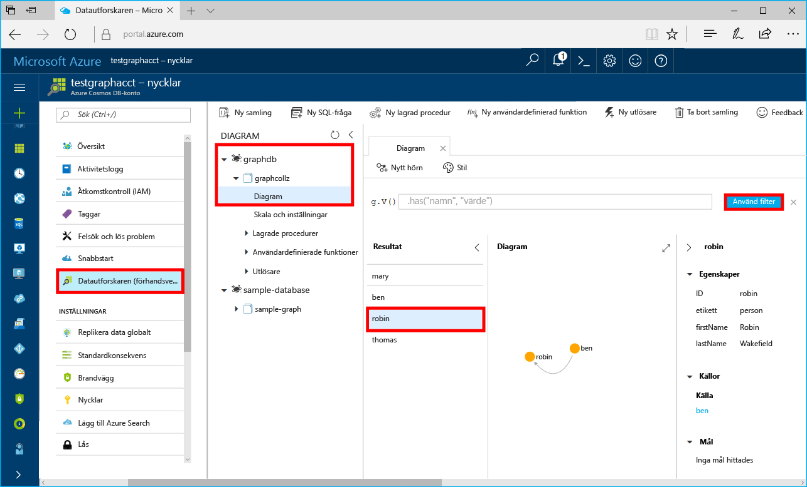

# <a name="azure-cosmos-db-build-a-net-application-using-hello-graph-api"></a><span data-ttu-id="5b60e-103">Azure Cosmos DB: Skapa ett .NET-program med hjälp av hello Graph API</span><span class="sxs-lookup"><span data-stu-id="5b60e-103">Azure Cosmos DB: Build a .NET application using hello Graph API</span></span>

<span data-ttu-id="5b60e-104">Azure Cosmos DB är Microsofts globalt distribuerade databastjänst för flera datamodeller.</span><span class="sxs-lookup"><span data-stu-id="5b60e-104">Azure Cosmos DB is Microsoft’s globally distributed multi-model database service.</span></span> <span data-ttu-id="5b60e-105">Du kan snabbt skapa och fråga dokument och nyckel/värde-diagrammet databaser, som omfattas av hello global distributionsplatsen och skala horisontellt funktionerna i hello kärnan i Azure Cosmos DB.</span><span class="sxs-lookup"><span data-stu-id="5b60e-105">You can quickly create and query document, key/value, and graph databases, all of which benefit from hello global distribution and horizontal scale capabilities at hello core of Azure Cosmos DB.</span></span> 

<span data-ttu-id="5b60e-106">Den här snabbstartsguide visar hur toocreate Azure DB som Cosmos-kontot, databas och diagram (behållaren) med hjälp av hello Azure-portalen.</span><span class="sxs-lookup"><span data-stu-id="5b60e-106">This quick start demonstrates how toocreate an Azure Cosmos DB account, database, and graph (container) using hello Azure portal.</span></span> <span data-ttu-id="5b60e-107">Du sedan skapa och köra en konsolapp som bygger på hello [Graph API](graph-sdk-dotnet.md) (förhandsversion).</span><span class="sxs-lookup"><span data-stu-id="5b60e-107">You then build and run a console app built on hello [Graph API](graph-sdk-dotnet.md) (preview).</span></span>  

## <a name="prerequisites"></a><span data-ttu-id="5b60e-108">Krav</span><span class="sxs-lookup"><span data-stu-id="5b60e-108">Prerequisites</span></span>

<span data-ttu-id="5b60e-109">Om du inte redan har Visual Studio 2017 installerat, du kan hämta och använda hello **ledigt** [Visual Studio 2017 Community Edition](https://www.visualstudio.com/downloads/).</span><span class="sxs-lookup"><span data-stu-id="5b60e-109">If you don’t already have Visual Studio 2017 installed, you can download and use hello **free** [Visual Studio 2017 Community Edition](https://www.visualstudio.com/downloads/).</span></span> <span data-ttu-id="5b60e-110">Kontrollera att du aktiverar **Azure-utveckling** under installationen av hello Visual Studio.</span><span class="sxs-lookup"><span data-stu-id="5b60e-110">Make sure that you enable **Azure development** during hello Visual Studio setup.</span></span>

[!INCLUDE [quickstarts-free-trial-note](../../includes/quickstarts-free-trial-note.md)]

## <a name="create-a-database-account"></a><span data-ttu-id="5b60e-111">Skapa ett databaskonto</span><span class="sxs-lookup"><span data-stu-id="5b60e-111">Create a database account</span></span>

[!INCLUDE [cosmos-db-create-dbaccount-graph](../../includes/cosmos-db-create-dbaccount-graph.md)]

## <a name="add-a-graph"></a><span data-ttu-id="5b60e-112">Lägga till en graf</span><span class="sxs-lookup"><span data-stu-id="5b60e-112">Add a graph</span></span>

[!INCLUDE [cosmos-db-create-graph](../../includes/cosmos-db-create-graph.md)]

## <a name="clone-hello-sample-application"></a><span data-ttu-id="5b60e-113">Klona hello exempelprogrammet</span><span class="sxs-lookup"><span data-stu-id="5b60e-113">Clone hello sample application</span></span>

<span data-ttu-id="5b60e-114">Nu ska vi klona Graph-API-app från github, ange hello anslutningssträngen och kör den.</span><span class="sxs-lookup"><span data-stu-id="5b60e-114">Now let's clone a Graph API app from github, set hello connection string, and run it.</span></span> <span data-ttu-id="5b60e-115">Du ser hur enkelt som det är att toowork med data programmässigt.</span><span class="sxs-lookup"><span data-stu-id="5b60e-115">You'll see how easy it is toowork with data programmatically.</span></span> 

1. <span data-ttu-id="5b60e-116">Öppna ett git terminalfönster, till exempel git bash och `cd` tooa arbetskatalogen.</span><span class="sxs-lookup"><span data-stu-id="5b60e-116">Open a git terminal window, such as git bash, and `cd` tooa working directory.</span></span>  

2. <span data-ttu-id="5b60e-117">Hello kör följande kommando tooclone hello exempel lagringsplatsen.</span><span class="sxs-lookup"><span data-stu-id="5b60e-117">Run hello following command tooclone hello sample repository.</span></span> 

    ```bash
    git clone https://github.com/Azure-Samples/azure-cosmos-db-graph-dotnet-getting-started.git
    ```

3. <span data-ttu-id="5b60e-118">Öppna Visual Studio och öppna hello lösningsfilen.</span><span class="sxs-lookup"><span data-stu-id="5b60e-118">Then open Visual Studio and open hello solution file.</span></span> 

## <a name="review-hello-code"></a><span data-ttu-id="5b60e-119">Granska hello kod</span><span class="sxs-lookup"><span data-stu-id="5b60e-119">Review hello code</span></span>

<span data-ttu-id="5b60e-120">Låt oss göra en snabb genomgång av vad som händer i hello app.</span><span class="sxs-lookup"><span data-stu-id="5b60e-120">Let's make a quick review of what's happening in hello app.</span></span> <span data-ttu-id="5b60e-121">Öppna hello Program.cs-filen och du hittar att dessa rader med kod skapar hello Azure Cosmos DB resurser.</span><span class="sxs-lookup"><span data-stu-id="5b60e-121">Open hello Program.cs file and you'll find that these lines of code create hello Azure Cosmos DB resources.</span></span> 

* <span data-ttu-id="5b60e-122">Hej DocumentClient har initierats.</span><span class="sxs-lookup"><span data-stu-id="5b60e-122">hello DocumentClient is initialized.</span></span> <span data-ttu-id="5b60e-123">I hello preview vi har lagt till ett tillägg för graph API på hello Azure DB som Cosmos-klienten.</span><span class="sxs-lookup"><span data-stu-id="5b60e-123">In hello preview, we added a graph extension API on hello Azure Cosmos DB client.</span></span> <span data-ttu-id="5b60e-124">Vi arbetar på en fristående diagrammet klient frikopplad från hello Azure Cosmos DB-klient och resurser.</span><span class="sxs-lookup"><span data-stu-id="5b60e-124">We are working on a standalone graph client decoupled from hello Azure Cosmos DB client and resources.</span></span>

    ```csharp
    using (DocumentClient client = new DocumentClient(
        new Uri(endpoint),
        authKey,
        new ConnectionPolicy { ConnectionMode = ConnectionMode.Direct, ConnectionProtocol = Protocol.Tcp }))
    ```

* <span data-ttu-id="5b60e-125">En ny databas skapas.</span><span class="sxs-lookup"><span data-stu-id="5b60e-125">A new database is created.</span></span>

    ```csharp
    Database database = await client.CreateDatabaseIfNotExistsAsync(new Database { Id = "graphdb" });
    ```

* <span data-ttu-id="5b60e-126">En ny graf skapas.</span><span class="sxs-lookup"><span data-stu-id="5b60e-126">A new graph is created.</span></span>

    ```csharp
    DocumentCollection graph = await client.CreateDocumentCollectionIfNotExistsAsync(
        UriFactory.CreateDatabaseUri("graphdb"),
        new DocumentCollection { Id = "graph" },
        new RequestOptions { OfferThroughput = 1000 });
    ```
* <span data-ttu-id="5b60e-127">En serie Gremlin steg utförs med hjälp av hello `CreateGremlinQuery` metod.</span><span class="sxs-lookup"><span data-stu-id="5b60e-127">A series of Gremlin steps are executed using hello `CreateGremlinQuery` method.</span></span>

    ```csharp
    // hello CreateGremlinQuery method extensions allow you tooexecute Gremlin queries and iterate
    // results asychronously
    IDocumentQuery<dynamic> query = client.CreateGremlinQuery<dynamic>(graph, "g.V().count()");
    while (query.HasMoreResults)
    {
        foreach (dynamic result in await query.ExecuteNextAsync())
        {
            Console.WriteLine($"\t {JsonConvert.SerializeObject(result)}");
        }
    }

    ```

## <a name="update-your-connection-string"></a><span data-ttu-id="5b60e-128">Uppdatera din anslutningssträng</span><span class="sxs-lookup"><span data-stu-id="5b60e-128">Update your connection string</span></span>

<span data-ttu-id="5b60e-129">Gå tillbaka toohello Azure portal tooget din Anslutningssträngsinformation nu och kopierar den till hello app.</span><span class="sxs-lookup"><span data-stu-id="5b60e-129">Now go back toohello Azure portal tooget your connection string information and copy it into hello app.</span></span>

1. <span data-ttu-id="5b60e-130">Öppna hello App.config-filen i Visual Studio 2017.</span><span class="sxs-lookup"><span data-stu-id="5b60e-130">In Visual Studio 2017, open hello App.config file.</span></span> 

2. <span data-ttu-id="5b60e-131">I hello Azure-portalen i ditt Azure DB som Cosmos-konto, klickar du på **nycklar** i hello vänstra navigeringsrutan.</span><span class="sxs-lookup"><span data-stu-id="5b60e-131">In hello Azure portal, in your Azure Cosmos DB account, click **Keys** in hello left navigation.</span></span> 

    

3. <span data-ttu-id="5b60e-133">Kopiera ditt **URI** värdet från hello-portalen och gör den hello värdet för hello Endpoint nyckeln i App.config. Du kan använda hello kopieringsknappen enligt hello föregående skärmbild toocopy hello värde.</span><span class="sxs-lookup"><span data-stu-id="5b60e-133">Copy your **URI** value from hello portal and make it hello value of hello Endpoint key in App.config. You can use hello copy button as shown in hello preceding screenshot toocopy hello value.</span></span>

    `<add key="Endpoint" value="https://FILLME.documents.azure.com:443" />`

4. <span data-ttu-id="5b60e-134">Kopiera ditt **PRIMÄRNYCKEL** värdet från hello-portalen och gör den hello värdet för hello auktoriseringsnyckel nyckeln i App.config och sedan spara ändringarna.</span><span class="sxs-lookup"><span data-stu-id="5b60e-134">Copy your **PRIMARY KEY** value from hello portal, and make it hello value of hello AuthKey key in App.config, then save your changes.</span></span> 

    `<add key="AuthKey" value="FILLME" />`

<span data-ttu-id="5b60e-135">Du har nu uppdaterat din app med alla hello information som behövs för toocommunicate med Azure Cosmos DB.</span><span class="sxs-lookup"><span data-stu-id="5b60e-135">You've now updated your app with all hello info it needs toocommunicate with Azure Cosmos DB.</span></span> 

## <a name="run-hello-console-app"></a><span data-ttu-id="5b60e-136">Kör hello-konsolprogram</span><span class="sxs-lookup"><span data-stu-id="5b60e-136">Run hello console app</span></span>

1. <span data-ttu-id="5b60e-137">I Visual Studio högerklickar du på hello **GraphGetStarted** projektet i **Solution Explorer** och klicka sedan på **hantera NuGet-paket**.</span><span class="sxs-lookup"><span data-stu-id="5b60e-137">In Visual Studio, right-click on hello **GraphGetStarted** project in **Solution Explorer** and then click **Manage NuGet Packages**.</span></span> 

2. <span data-ttu-id="5b60e-138">I hello NuGet **Bläddra** skriver *Microsoft.Azure.Graphs* och kontrollera hello **innehåller förhandsversion** rutan.</span><span class="sxs-lookup"><span data-stu-id="5b60e-138">In hello NuGet **Browse** box, type *Microsoft.Azure.Graphs* and check hello **Includes prerelease** box.</span></span> 

3. <span data-ttu-id="5b60e-139">Hello resultat för att installera hello **Microsoft.Azure.Graphs** bibliotek.</span><span class="sxs-lookup"><span data-stu-id="5b60e-139">From hello results, install hello **Microsoft.Azure.Graphs** library.</span></span> <span data-ttu-id="5b60e-140">Detta installerar hello Azure Cosmos DB graph filnamnstillägget biblioteket paket och alla beroenden.</span><span class="sxs-lookup"><span data-stu-id="5b60e-140">This installs hello Azure Cosmos DB graph extension library package and all dependencies.</span></span>

    <span data-ttu-id="5b60e-141">Om du får ett meddelande om att granska ändringar toohello lösning, klickar du på **OK**.</span><span class="sxs-lookup"><span data-stu-id="5b60e-141">If you get a message about reviewing changes toohello solution, click **OK**.</span></span> <span data-ttu-id="5b60e-142">Om du får ett meddelande om godkännande av licens klickar du på **Jag godkänner**.</span><span class="sxs-lookup"><span data-stu-id="5b60e-142">If you get a message about license acceptance, click **I accept**.</span></span>

4. <span data-ttu-id="5b60e-143">Klicka på CTRL + F5 toorun hello program.</span><span class="sxs-lookup"><span data-stu-id="5b60e-143">Click CTRL + F5 toorun hello application.</span></span>

   <span data-ttu-id="5b60e-144">hello konsolfönstret visar hello brytpunkter och kanter som läggs till toohello diagram.</span><span class="sxs-lookup"><span data-stu-id="5b60e-144">hello console window displays hello vertexes and edges being added toohello graph.</span></span> <span data-ttu-id="5b60e-145">När hello skriptet har slutförts, tryck på RETUR två gånger tooclose hello konsolfönstret.</span><span class="sxs-lookup"><span data-stu-id="5b60e-145">When hello script completes, press ENTER twice tooclose hello console window.</span></span> 

## <a name="browse-using-hello-data-explorer"></a><span data-ttu-id="5b60e-146">Bläddra med hello Data Explorer</span><span class="sxs-lookup"><span data-stu-id="5b60e-146">Browse using hello Data Explorer</span></span>

<span data-ttu-id="5b60e-147">Du kan nu gå tillbaka tooData Explorer i hello Azure-portalen och bläddra och fråga din nya diagramdata.</span><span class="sxs-lookup"><span data-stu-id="5b60e-147">You can now go back tooData Explorer in hello Azure portal and browse and query your new graph data.</span></span>

1. <span data-ttu-id="5b60e-148">I Data Explorer visas hello ny databas hello diagram i fönstret.</span><span class="sxs-lookup"><span data-stu-id="5b60e-148">In Data Explorer, hello new database appears in hello Graphs pane.</span></span> <span data-ttu-id="5b60e-149">Expandera **graphdb**, **graphcollz** och klicka på **Diagram**.</span><span class="sxs-lookup"><span data-stu-id="5b60e-149">Expand **graphdb**, **graphcollz**, and then click **Graph**.</span></span>

2. <span data-ttu-id="5b60e-150">Klicka på hello **Använd Filter** knappen toouse hello standard fråga tooview alla hello verticies i hello graph.</span><span class="sxs-lookup"><span data-stu-id="5b60e-150">Click hello **Apply Filter** button toouse hello default query tooview all hello verticies in hello graph.</span></span> <span data-ttu-id="5b60e-151">hello-data som genereras av hello exempelapp visas hello diagram i fönstret.</span><span class="sxs-lookup"><span data-stu-id="5b60e-151">hello data generated by hello sample app is displayed in hello Graphs pane.</span></span>

    <span data-ttu-id="5b60e-152">Du kan zooma in och ut hello diagram, kan du expandera hello diagrammet skärmutrymmet, lägga till ytterligare verticies och flytta verticies på hello visa yta.</span><span class="sxs-lookup"><span data-stu-id="5b60e-152">You can zoom in and out of hello graph, you can expand hello graph display space, add additional verticies, and move verticies on hello display surface.</span></span>

    

## <a name="review-slas-in-hello-azure-portal"></a><span data-ttu-id="5b60e-154">Granska SLA: er i hello Azure-portalen</span><span class="sxs-lookup"><span data-stu-id="5b60e-154">Review SLAs in hello Azure portal</span></span>

[!INCLUDE [cosmosdb-tutorial-review-slas](../../includes/cosmos-db-tutorial-review-slas.md)]

## <a name="clean-up-resources"></a><span data-ttu-id="5b60e-155">Rensa resurser</span><span class="sxs-lookup"><span data-stu-id="5b60e-155">Clean up resources</span></span>

<span data-ttu-id="5b60e-156">Om du inte kommer toocontinue toouse den här appen, tar du bort alla resurser som skapats av denna Snabbstart i hello Azure-portalen med hello följande steg:</span><span class="sxs-lookup"><span data-stu-id="5b60e-156">If you're not going toocontinue toouse this app, delete all resources created by this quickstart in hello Azure portal with hello following steps:</span></span> 

1. <span data-ttu-id="5b60e-157">Hello vänstra menyn i hello Azure-portalen klickar du på **resursgrupper** och klicka sedan på hello namnet på hello resurs du skapat.</span><span class="sxs-lookup"><span data-stu-id="5b60e-157">From hello left-hand menu in hello Azure portal, click **Resource groups** and then click hello name of hello resource you created.</span></span> 
2. <span data-ttu-id="5b60e-158">På din resurs gruppen klickar du på **ta bort**typnamn hello för hello resurs toodelete i hello textrutan och klicka sedan på **ta bort**.</span><span class="sxs-lookup"><span data-stu-id="5b60e-158">On your resource group page, click **Delete**, type hello name of hello resource toodelete in hello text box, and then click **Delete**.</span></span>

## <a name="next-steps"></a><span data-ttu-id="5b60e-159">Nästa steg</span><span class="sxs-lookup"><span data-stu-id="5b60e-159">Next steps</span></span>

<span data-ttu-id="5b60e-160">Du har lärt dig hur toocreate ett Azure DB som Cosmos-konto och skapa diagram med hello Data Explorer och kör en app i denna Snabbstart.</span><span class="sxs-lookup"><span data-stu-id="5b60e-160">In this quickstart, you've learned how toocreate an Azure Cosmos DB account, create a graph using hello Data Explorer, and run an app.</span></span> <span data-ttu-id="5b60e-161">Nu kan du skapa mer komplexa frågor och implementera kraftfull logik för grafbläddring med Gremlin.</span><span class="sxs-lookup"><span data-stu-id="5b60e-161">You can now build more complex queries and implement powerful graph traversal logic using Gremlin.</span></span> 

> [!div class="nextstepaction"]
> [<span data-ttu-id="5b60e-162">Fråga med hjälp av Gremlin</span><span class="sxs-lookup"><span data-stu-id="5b60e-162">Query using Gremlin</span></span>](tutorial-query-graph.md)

