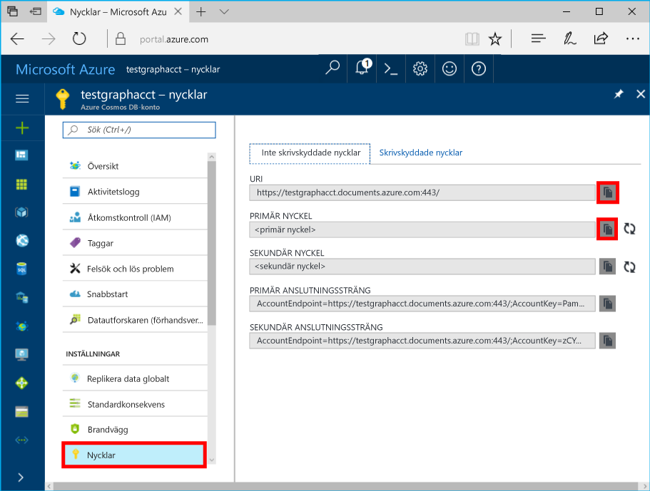

# <a name="azure-cosmos-db-create-query-and-traverse-a-graph-in-hello-gremlin-console"></a>Azure Cosmos DB: Skapa, fråga, och bläddra i ett diagram i hello Gremlin-konsolen

Azure Cosmos DB är Microsofts globalt distribuerade databastjänst för flera datamodeller. Du kan snabbt skapa och fråga dokument och nyckel/värde-diagrammet databaser, som omfattas av hello global distributionsplatsen och skala horisontellt funktionerna i hello kärnan i Azure Cosmos DB. 

Den här snabbstartsguide visar hur toocreate Azure DB som Cosmos-kontot, databas och diagram (behållaren) med hjälp av hello Azure-portalen och Använd hello [Gremlin konsolen](https://tinkerpop.apache.org/docs/current/reference/#gremlin-console) från [Apache TinkerPop](http://tinkerpop.apache.org) toowork med Diagramdata API (förhandsversion). I kursen får du skapa och läsa formhörnen och kanter, uppdaterar en vertex-egenskap, fråga formhörnen passerar hello diagram och ta bort en nod.


Hej Gremlin konsolen är Groovy/Java-baserad och körs på Linux, Mac och Windows. Du kan ladda ned det från hello [Apache TinkerPop plats](https://www.apache.org/dyn/closer.lua/tinkerpop/3.2.5/apache-tinkerpop-gremlin-console-3.2.5-bin.zip).

## <a name="prerequisites"></a>Krav

Du behöver toohave en Azure-prenumeration toocreate ett Azure DB som Cosmos-konto för denna Snabbstart.

[!INCLUDE [quickstarts-free-trial-note](../../includes/quickstarts-free-trial-note.md)]

Du måste också tooinstall hello [Gremlin konsolen](http://tinkerpop.apache.org/). Använd version 3.2.5 eller senare.

## <a name="create-a-database-account"></a>Skapa ett databaskonto

[!INCLUDE [cosmos-db-create-dbaccount-graph](../../includes/cosmos-db-create-dbaccount-graph.md)]

## <a name="add-a-graph"></a>Lägga till en graf

[!INCLUDE [cosmos-db-create-graph](../../includes/cosmos-db-create-graph.md)]

## <a id="ConnectAppService"></a>Ansluta tooyour apptjänst
1. Hej Gremlin konsolen innan du startar, skapa eller ändra hello remote secure.yaml konfigurationsfilen i hello apache-tinkerpop-gremlin-console-3.2.5/conf directory.
2. Fyll i din *värd*, *port*, *användarnamn*, *lösenord*, *connectionPool* och *serialiserarens* konfigurationer:

    Inställning|Föreslaget värde|Beskrivning
    ---|---|---
    värdar|[***.graphs.azure.com]|Se skärmbilden nedan. Detta är hello Gremlin URI-värde på översiktssidan för hello av hello Azure-portalen inom hakparenteser med hello avslutande: 443 / tas bort.<br><br>Det här värdet kan också hämtas från hello nycklar på fliken med hello URI-värde genom att ta bort https://, ändra dokument toographs och tar bort avslutande hello: 443 /.
    port|443|Ange too443.
    användarnamn|*Ditt användarnamn*|Hej resurs hello formatet `/dbs/<db>/colls/<coll>` där `<db>` är databasnamnet och `<coll>` är samlingens namn.
    lösenord|*Din primärnyckel*| Se andra skärmbilden nedan. Det här är ditt primära nyckel som du kan hämta hello nycklar sidan för hello Azure-portalen hello primärnyckel i rutan. Använd kopieringsknappen hello hello vänster på hello toocopy hello värde.
    ConnectionPool|{enableSsl: true}|Din anslutningspoolinställning för SSL.
    Serialiserare|{ className: org.apache.tinkerpop.gremlin.<br>driver.ser.GraphSONMessageSerializerV1d0,<br> config: { serializeResultToString: true }}|Värdet för toothis och ta bort de `\n` radbrytningar när den klistras in i hello-värdet.

    Kopiera hello för hello värdar värdet **Gremlin URI** värde från hello **översikt** sida: 

    Kopiera hello för hello lösenordsvärdet **primärnyckel** från hello **nycklar** sida: 


3. I terminalen kör `bin/gremlin.bat` eller `bin/gremlin.sh` toostart hello [Gremlin konsolen](http://tinkerpop.apache.org/docs/3.2.5/tutorials/getting-started/).
4. I terminalen kör `:remote connect tinkerpop.server conf/remote-secure.yaml` tooconnect tooyour apptjänst.

    > [!TIP]
    > Om felmeddelandet hello `No appenders could be found for logger` se till att uppdateras hello serialiseraren värdet i hello remote secure.yaml filen enligt beskrivningen i steg 2. 

Bra! Nu när vi avslutat hello inställningarna Låt oss börja med vissa kommandon.

Prova med ett enkelt count()-kommando. Skriv följande hello i hello konsolen hello i Kommandotolken:
```
:> g.V().count()
```

> [!TIP]
> Meddelande hello `:>` som föregår hello `g.V().count()` text? 
>
> Detta är en del av hello-kommando som du behöver tootype. Det är viktigt när du använder hello Gremlin konsolen med Azure Cosmos DB.  
>
> Om du utesluter detta `:>` prefix instruerar hello konsolen tooexecute hello kommando lokalt, ofta mot en InMemory-diagram.
> Med den här `:>` talar om hello konsolen tooexecute fjärrkommandot, i det här fallet mot Cosmos DB (antingen localhost emulatorn hello eller en > Azure-instans).


## <a name="create-vertices-and-edges"></a>Skapa hörn och gränser

Vi börjar med att lägga till fem personhörn för *Thomas*, *Mary Kay*, *Robin*, *Ben* och *Jack*.

Indata (Thomas):

```
:> g.addV('person').property('firstName', 'Thomas').property('lastName', 'Andersen').property('age', 44).property('userid', 1)
```

Resultat:

```
==>[id:796cdccc-2acd-4e58-a324-91d6f6f5ed6d,label:person,type:vertex,properties:[firstName:[[id:f02a749f-b67c-4016-850e-910242d68953,value:Thomas]],lastName:[[id:f5fa3126-8818-4fda-88b0-9bb55145ce5c,value:Andersen]],age:[[id:f6390f9c-e563-433e-acbf-25627628016e,value:44]],userid:[[id:796cdccc-2acd-4e58-a324-91d6f6f5ed6d|userid,value:1]]]]
```
Indata (Mary Kay):

```
:> g.addV('person').property('firstName', 'Mary Kay').property('lastName', 'Andersen').property('age', 39).property('userid', 2)

```

Resultat:

```
==>[id:0ac9be25-a476-4a30-8da8-e79f0119ea5e,label:person,type:vertex,properties:[firstName:[[id:ea0604f8-14ee-4513-a48a-1734a1f28dc0,value:Mary Kay]],lastName:[[id:86d3bba5-fd60-4856-9396-c195ef7d7f4b,value:Andersen]],age:[[id:bc81b78d-30c4-4e03-8f40-50f72eb5f6da,value:39]],userid:[[id:0ac9be25-a476-4a30-8da8-e79f0119ea5e|userid,value:2]]]]

```

Indata (Robin):

```
:> g.addV('person').property('firstName', 'Robin').property('lastName', 'Wakefield').property('userid', 3)
```

Resultat:

```
==>[id:8dc14d6a-8683-4a54-8d74-7eef1fb43a3e,label:person,type:vertex,properties:[firstName:[[id:ec65f078-7a43-4cbe-bc06-e50f2640dc4e,value:Robin]],lastName:[[id:a3937d07-0e88-45d3-a442-26fcdfb042ce,value:Wakefield]],userid:[[id:8dc14d6a-8683-4a54-8d74-7eef1fb43a3e|userid,value:3]]]]
```

Indata (Ben):

```
:> g.addV('person').property('firstName', 'Ben').property('lastName', 'Miller').property('userid', 4)

```

Resultat:

```
==>[id:ee86b670-4d24-4966-9a39-30529284b66f,label:person,type:vertex,properties:[firstName:[[id:a632469b-30fc-4157-840c-b80260871e9a,value:Ben]],lastName:[[id:4a08d307-0719-47c6-84ae-1b0b06630928,value:Miller]],userid:[[id:ee86b670-4d24-4966-9a39-30529284b66f|userid,value:4]]]]
```

Indata (Jack):

```
:> g.addV('person').property('firstName', 'Jack').property('lastName', 'Connor').property('userid', 5)
```

Resultat:

```
==>[id:4c835f2a-ea5b-43bb-9b6b-215488ad8469,label:person,type:vertex,properties:[firstName:[[id:4250824e-4b72-417f-af98-8034aa15559f,value:Jack]],lastName:[[id:44c1d5e1-a831-480a-bf94-5167d133549e,value:Connor]],userid:[[id:4c835f2a-ea5b-43bb-9b6b-215488ad8469|userid,value:5]]]]
```


Nu ska vi lägga till gränser för personernas relationer.

Indata (Thomas -> Mary Kay):

```
:> g.V().hasLabel('person').has('firstName', 'Thomas').addE('knows').to(g.V().hasLabel('person').has('firstName', 'Mary Kay'))
```

Resultat:

```
==>[id:c12bf9fb-96a1-4cb7-a3f8-431e196e702f,label:knows,type:edge,inVLabel:person,outVLabel:person,inV:0d1fa428-780c-49a5-bd3a-a68d96391d5c,outV:1ce821c6-aa3d-4170-a0b7-d14d2a4d18c3]
```

Indata (Thomas -> Robin):

```
:> g.V().hasLabel('person').has('firstName', 'Thomas').addE('knows').to(g.V().hasLabel('person').has('firstName', 'Robin'))
```

Resultat:

```
==>[id:58319bdd-1d3e-4f17-a106-0ddf18719d15,label:knows,type:edge,inVLabel:person,outVLabel:person,inV:3e324073-ccfc-4ae1-8675-d450858ca116,outV:1ce821c6-aa3d-4170-a0b7-d14d2a4d18c3]
```

Indata (Robin -> Ben):

```
:> g.V().hasLabel('person').has('firstName', 'Robin').addE('knows').to(g.V().hasLabel('person').has('firstName', 'Ben'))
```

Resultat:

```
==>[id:889c4d3c-549e-4d35-bc21-a3d1bfa11e00,label:knows,type:edge,inVLabel:person,outVLabel:person,inV:40fd641d-546e-412a-abcc-58fe53891aab,outV:3e324073-ccfc-4ae1-8675-d450858ca116]
```

## <a name="update-a-vertex"></a>Uppdatera ett hörn

Vi uppdaterar hello *Thomas* hörn med nya tidens *45*.

Indata:
```
:> g.V().hasLabel('person').has('firstName', 'Thomas').property('age', 45)
```
Resultat:

```
==>[id:ae36f938-210e-445a-92df-519f2b64c8ec,label:person,type:vertex,properties:[firstName:[[id:872090b6-6a77-456a-9a55-a59141d4ebc2,value:Thomas]],lastName:[[id:7ee7a39a-a414-4127-89b4-870bc4ef99f3,value:Andersen]],age:[[id:a2a75d5a-ae70-4095-806d-a35abcbfe71d,value:45]]]]
```

## <a name="query-your-graph"></a>Fråga diagrammet

Nu ska vi köra en mängd olika frågor mot grafen.

Först prova med en fråga med ett filter tooreturn endast personer som är äldre än 40 år gammal.

Indata (filterfråga):

```
:> g.V().hasLabel('person').has('age', gt(40))
```

Resultat:

```
==>[id:ae36f938-210e-445a-92df-519f2b64c8ec,label:person,type:vertex,properties:[firstName:[[id:872090b6-6a77-456a-9a55-a59141d4ebc2,value:Thomas]],lastName:[[id:7ee7a39a-a414-4127-89b4-870bc4ef99f3,value:Andersen]],age:[[id:a2a75d5a-ae70-4095-806d-a35abcbfe71d,value:45]]]]
```

Därefter går vi project hello förnamn för hello människor som är äldre än 40 år gammal.

Indata (filter + projektionsfråga):

```
:> g.V().hasLabel('person').has('age', gt(40)).values('firstName')
```

Resultat:

```
==>Thomas
```

## <a name="traverse-your-graph"></a>Bläddra i grafen

Vi passerar hello diagram tooreturn alla Thomass vänner.

Indata (Thomas vänner):

```
:> g.V().hasLabel('person').has('firstName', 'Thomas').outE('knows').inV().hasLabel('person')
```

Resultat: 

```
==>[id:f04bc00b-cb56-46c4-a3bb-a5870c42f7ff,label:person,type:vertex,properties:[firstName:[[id:14feedec-b070-444e-b544-62be15c7167c,value:Mary Kay]],lastName:[[id:107ab421-7208-45d4-b969-bbc54481992a,value:Andersen]],age:[[id:4b08d6e4-58f5-45df-8e69-6b790b692e0a,value:39]]]]
==>[id:91605c63-4988-4b60-9a30-5144719ae326,label:person,type:vertex,properties:[firstName:[[id:f760e0e6-652a-481a-92b0-1767d9bf372e,value:Robin]],lastName:[[id:352a4caa-bad6-47e3-a7dc-90ff342cf870,value:Wakefield]]]]
```

Nu ska vi gå hello nästa säkerhetslager formhörnen. Passerar hello diagram tooreturn alla hello vänners Thomass vänner.

Indata (Thomas vänners vänner):

```
:> g.V().hasLabel('person').has('firstName', 'Thomas').outE('knows').inV().hasLabel('person').outE('knows').inV().hasLabel('person')
```
Resultat:

```
==>[id:a801a0cb-ee85-44ee-a502-271685ef212e,label:person,type:vertex,properties:[firstName:[[id:b9489902-d29a-4673-8c09-c2b3fe7f8b94,value:Ben]],lastName:[[id:e084f933-9a4b-4dbc-8273-f0171265cf1d,value:Miller]]]]
```

## <a name="drop-a-vertex"></a>Släppa ett hörn

Vi bort en nod från hello graph-databasen.

Indata (drop Jack vertex):

```
:> g.V().hasLabel('person').has('firstName', 'Jack').drop()
```

## <a name="clear-your-graph"></a>Rensa diagrammet

Slutligen ska vi Rensa hello databasen alla hörn och kanter.

Indata:

```
:> g.E().drop()
:> g.V().drop()
```

Grattis! Du har slutfört den här självstudien om Azure Cosmos DB: Graph API!

## <a name="review-slas-in-hello-azure-portal"></a>Granska SLA: er i hello Azure-portalen

[!INCLUDE [cosmosdb-tutorial-review-slas](../../includes/cosmos-db-tutorial-review-slas.md)]

## <a name="clean-up-resources"></a>Rensa resurser

Om du inte kommer toocontinue toouse den här appen, tar du bort alla resurser som skapats av denna Snabbstart i hello Azure-portalen med hello följande steg:  

1. Hello vänstra menyn i hello Azure-portalen klickar du på **resursgrupper** och klicka sedan på hello namnet på hello resurs du skapat. 
2. På din resurs gruppen klickar du på **ta bort**typnamn hello för hello resurs toodelete i hello textrutan och klicka sedan på **ta bort**.

## <a name="next-steps"></a>Nästa steg

Du har lärt dig hur toocreate ett Azure DB som Cosmos-konto, skapa diagram med hello Data Explorer, skapa hörn och kanter och passerar diagrammet med hello Gremlin konsolen i denna Snabbstart. Nu kan du skapa mer komplexa frågor och implementera kraftfull logik för grafbläddring med Gremlin. 

> [!div class="nextstepaction"]
> [Fråga med hjälp av Gremlin](tutorial-query-graph.md)
