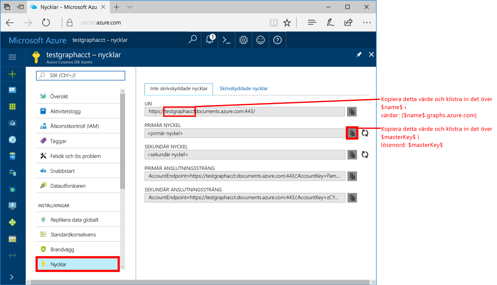
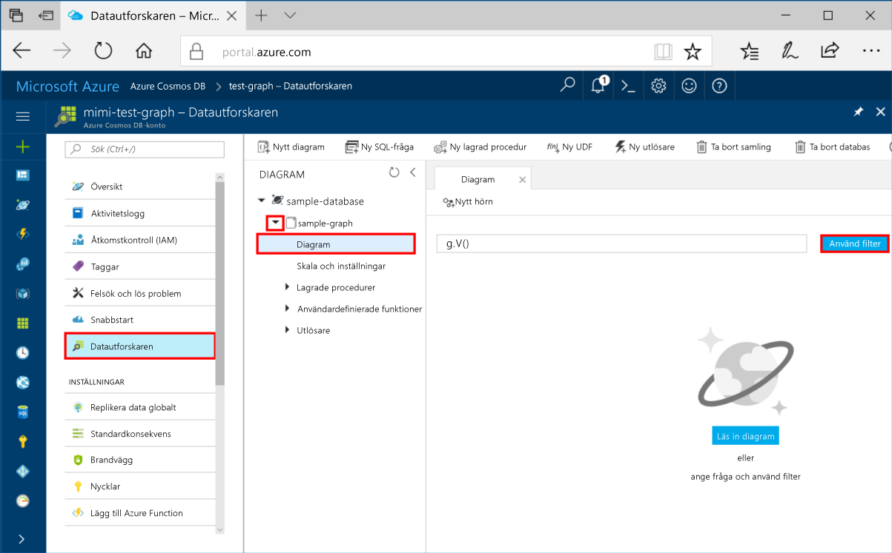
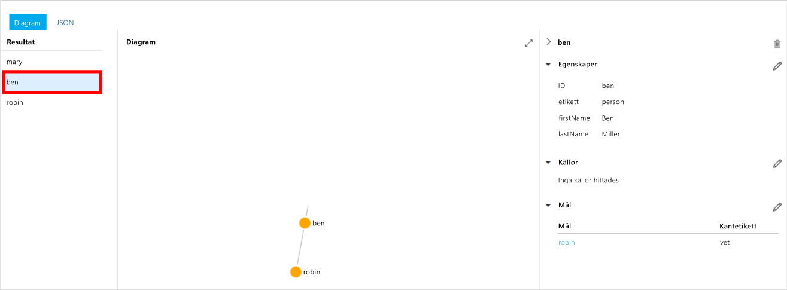
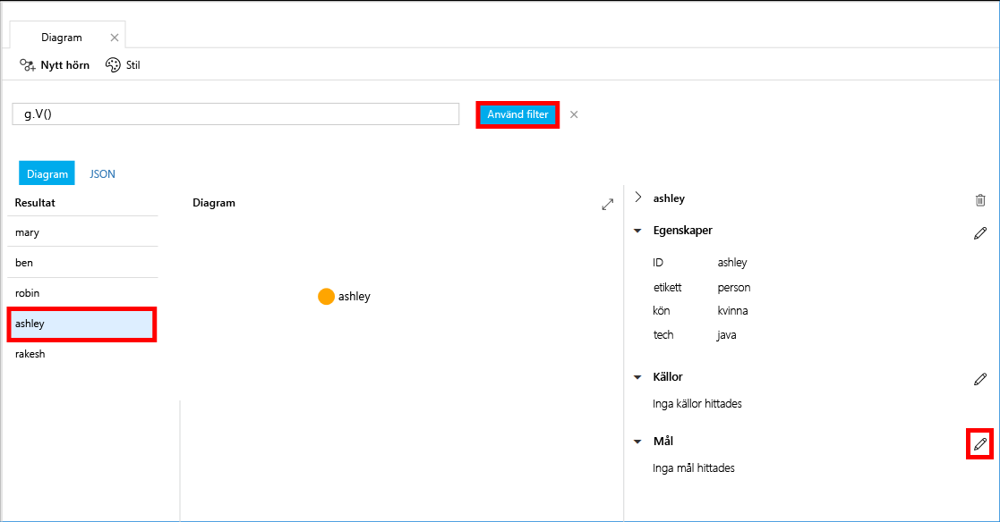
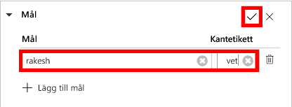
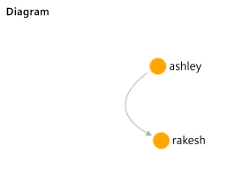

# <a name="azure-cosmos-db-create-a-graph-database-using-java-and-hello-azure-portal"></a>Azure DB Cosmos: Skapa en graph-databas som använder Java och hello Azure-portalen

Azure Cosmos DB är Microsofts globalt distribuerade databastjänst för flera datamodeller. Du kan snabbt skapa och fråga dokument och nyckel/värde-diagrammet databaser, som omfattas av hello global distributionsplatsen och skala horisontellt funktionerna i hello kärnan i Azure Cosmos DB. 

Denna Snabbstart skapar ett diagram hello databas med hjälp av Azure portal-verktyg för Azure Cosmos DB. Den här snabbstarten visar också hur tooquickly skapar en Java-konsolapp med hjälp av en graph-databas med hello OSS [Gremlin Java](https://mvnrepository.com/artifact/org.apache.tinkerpop/gremlin-driver) drivrutin. hello anvisningarna i den här snabbstarten kan tillämpas på alla operativsystem som kan köra Java. Denna Snabbstart lär du dig att skapa och ändra diagram resurser i hello Användargränssnittet eller programmässigt, beroende på vilket som är dina inställningar. 

## <a name="prerequisites"></a>Krav

* [Java Development Kit (JDK) 1.7+](http://www.oracle.com/technetwork/java/javase/downloads/jdk8-downloads-2133151.html)
    * Ubuntu, kör `apt-get install default-jdk` tooinstall hello JDK.
    * Vara säker på att tooset hello JAVA_HOME miljö variabeln toopoint toohello mapp där hello JDK är installerad.
* [Ladda ned](http://maven.apache.org/download.cgi) och [installera](http://maven.apache.org/install.html) ett [Maven](http://maven.apache.org/)-binärarkiv
    * Ubuntu, du kan köra `apt-get install maven` tooinstall Maven.
* [Git](https://www.git-scm.com/)
    * Ubuntu, du kan köra `sudo apt-get install git` tooinstall Git.

[!INCLUDE [quickstarts-free-trial-note](../../includes/quickstarts-free-trial-note.md)]

## <a name="create-a-database-account"></a>Skapa ett databaskonto

Innan du kan skapa en graph-databas måste toocreate ett databaskonto i Gremlin (diagram) med Azure Cosmos DB.

[!INCLUDE [cosmos-db-create-dbaccount-graph](../../includes/cosmos-db-create-dbaccount-graph.md)]

## <a name="add-a-graph"></a>Lägga till en graf

Du kan nu använda hello Data Explorer verktyget i hello Azure portal toocreate en graph-databas. 

1. Klicka på hello Azure-portalen i hello vänstra navigeringsmenyn **Data Explorer (förhandsgranskning)**. 
2. I hello **Data Explorer (förhandsgranskning)** bladet, klickar du på **nytt diagram**, fyll sedan i hello sida med hello följande information:

    

    Inställning|Föreslaget värde|Beskrivning
    ---|---|---
    Databas-id|sample-database|hello-ID för den nya databasen. Databasnamn måste innehålla mellan 1 och 255 tecken och får inte innehålla `/ \ # ?` eller avslutande blanksteg.
    Graf-id|sample-graph|hello-ID för nya diagrammet. Diagrammet namn har hello samma tecken krav som databas-ID: n.
    Lagringskapacitet| 10 GB|Lämna hello standardvärdet. Detta är hello lagringskapaciteten för hello-databasen.
    Dataflöde|400 RU:er|Lämna hello standardvärdet. Du kan skala upp hello genomströmning senare om du vill tooreduce svarstid.
    Partitionsnyckeln|Lämna tomt|För hello syftet med den här snabbstarten, inget hello partitionsnyckel.

3. När hello formuläret, klickar du på **OK**.

## <a name="clone-hello-sample-application"></a>Klona hello exempelprogrammet

Nu ska vi klona en graph-app från github, ange hello anslutningssträngen och kör den. Du ser hur enkelt är det toowork med data programmässigt. 

1. Öppna ett git terminalfönster, till exempel git bash och `cd` tooa arbetskatalogen.  

2. Hello kör följande kommando tooclone hello exempel lagringsplatsen. 

    ```bash
    git clone https://github.com/Azure-Samples/azure-cosmos-db-graph-java-getting-started.git
    ```

## <a name="review-hello-code"></a>Granska hello kod

Låt oss göra en snabb genomgång av vad som händer i hello app. Öppna hello `Program.java` från hello \src\GetStarted mapp och söka efter dessa rader med kod. 

* Hej Gremlin `Client` har initierats från hello konfigurationen i `src/remote.yaml`.

    ```java
    cluster = Cluster.build(new File("src/remote.yaml")).create();
    ...
    client = cluster.connect();
    ```

* En serie Gremlin steg utförs med hjälp av hello `client.submit` metod.

    ```java
    ResultSet results = client.submit(gremlin);

    CompletableFuture<List<Result>> completableFutureResults = results.all();
    List<Result> resultList = completableFutureResults.get();

    for (Result result : resultList) {
        System.out.println(result.toString());
    }
    ```

## <a name="update-your-connection-string"></a>Uppdatera din anslutningssträng

1. Öppna hello src/remote.yaml fil. 

3. Fyll i din *värdar*, *användarnamn*, och *lösenord* värden i hello src/remote.yaml filen. hello resten av inställningarna för hello behöver inte toobe ändras.

    Inställning|Föreslaget värde|Beskrivning
    ---|---|---
    Värdar|[***.graphs.azure.com]|Se hello skärmbilden nedan. Det här värdet är hello Gremlin URI-värde på översiktssidan för hello av hello Azure-portalen inom hakparenteser med hello avslutande: 443 / tas bort.<br><br>Det här värdet kan också hämtas från hello nycklar på fliken med hello URI-värde genom att ta bort https://, ändra dokument toographs och tar bort avslutande hello: 443 /.
    Användarnamn|/dbs/sample-database/colls/sample-graph|hello resurs hello formatet `/dbs/<db>/colls/<coll>` där `<db>` är befintliga databasnamnet och `<coll>` är ditt befintliga samlingsnamn.
    Lösenord|*Din primära huvudnyckel*|Se hello andra skärmbilden nedan. Det här värdet är ditt primära nyckel som du kan hämta hello nycklar sidan för hello Azure-portalen hello primärnyckel i rutan. Kopiera hello-värde med hjälp av hello kopieringsknappen hello höger på hello rutan.

    Kopiera hello för hello värdar värdet **Gremlin URI** värde från hello **översikt** sidan. Om den är tom finns hello instruktionerna i hello värdar rad i föregående tabell om hur du skapar hello Gremlin URI från bladet nycklar för hello hello.


    Kopiera hello för hello lösenordsvärdet **primärnyckel** från hello **nycklar** bladet: 

## <a name="run-hello-console-app"></a>Kör hello-konsolprogram

1. I hello git terminalfönster, `cd` toohello azure-cosmos-db-graph-java-getting-started mapp.

2. Skriv i hello git terminalfönster, `mvn package` tooinstall hello krävs Java-paket.

3. Kör i hello git terminalfönster, `mvn exec:java -D exec.mainClass=GetStarted.Program` hello terminalfönster toostart Java-programmet.

hello terminalfönster visar hello formhörnen läggs toohello diagram. När programmet hello är klar kan du växla tillbaka toohello Azure-portalen i webbläsaren. 

<a id="add-sample-data"></a>
## <a name="review-and-add-sample-data"></a>Granska och lägg till exempeldata

Du kan nu gå tillbaka tooData Explorer och se hello formhörnen läggs toohello diagram och lägga till ytterligare datapunkter.

1. Data Explorer, expandera hello **exempeldatabasen**/**exempel diagram**, klickar du på **diagram**, och klicka sedan på **Använd Filter**. 

   

2. I hello **resultat** listan, Lägg märke till hello nya användare läggs till toohello diagram. Välj **ben** och Observera att han har anslutit toorobin. Du kan flytta hello formhörnen på hello diagrammet explorer, Zooma in och ut och expandera hello storleken på hello diagrammet explorer yta. 

   

3. Lägg till några nya användare toohello-diagrammet med hello Data Explorer. Klicka på hello **nya Vertex** knappen tooadd data tooyour diagram.

   

4. Ange en etikett för *person* ange hello följande nycklar och värden toocreate hello första hörn i hello graph. Tänk på att du kan skapa unika egenskaper för varje person i grafen. Endast hello id nyckeln är obligatorisk.

    key|värde|Anteckningar
    ----|----|----
    id|ashley|hello Unik identifierare för hello hörn. Om du inte anger något id skapas ett automatiskt.
    kön|kvinna| 
    teknik | Java | 

    > [!NOTE]
    > I den här snabbstartsguiden skapar vi en icke-partitionerad samling. Men om du skapar en partitionerad samling genom att ange en partitionsnyckel när hello samling skapas måste tooinclude hello partitionsnyckel som en nyckel i varje ny hörn. 

5. Klicka på **OK**. Du kan behöva tooexpand skärmen-toosee **OK** på hello ned hello-skärmen.

6. Klicka på **Nytt hörn** igen och lägg till ytterligare en ny användare. Ange en etikett för *person* ange hello följande nycklar och värden:

    key|värde|Anteckningar
    ----|----|----
    id|rakesh|hello Unik identifierare för hello hörn. Om du inte anger något id skapas ett automatiskt.
    kön|man| 
    skola|MIT| 

7. Klicka på **OK**. 

8. Klicka på **Använd Filter** med hello standard `g.V()` filter. Alla hello användare visas nu i hello **resultat** lista. När du lägger till mer data kan du använda filter toolimit resultat. Som standard använder Data Explorer `g.V()` tooretrieve alla formhörnen i ett diagram, men du kan ändra den olika tooa [diagram frågan](tutorial-query-graph.md), som `g.V().count()`, tooreturn en uppräkning av alla hello formhörnen i hello diagram i JSON-format.

9. Nu kan vi koppla ihop Rakesh och Ashley. Se till att **Anita** valde hello i **resultat** listan och klicka sedan på hello Redigera bredvid för**mål** nedre höger. Du kan behöva toowiden din fönstret toosee hello **egenskaper** område.

   

10. I hello **mål** skriver *rakesh*, och i hello **kant etikett** skriver *vet*, och klicka sedan på hello kryssrutan.

   

11. Nu välja **rakesh** från hello resultatlistan och se att Anita och rakesh är anslutna. 

   

    Du kan också använda Data Explorer toocreate lagrade procedurer, UDF: er och utlösare tooperform serversidan affärslogik samt som skala genomflöde. Data Explorer visar alla hello inbyggda programmatisk åtkomst till data i hello API: er, men ger enkel åtkomst tooyour data i hello Azure-portalen.


## <a name="review-slas-in-hello-azure-portal"></a>Granska SLA: er i hello Azure-portalen

[!INCLUDE [cosmosdb-tutorial-review-slas](../../includes/cosmos-db-tutorial-review-slas.md)]

## <a name="clean-up-resources"></a>Rensa resurser

Om du inte kommer toocontinue toouse den här appen, tar du bort alla resurser som skapats av denna Snabbstart i hello Azure-portalen med hello följande steg: 

1. Hello vänstra menyn i hello Azure-portalen klickar du på **resursgrupper** och klicka sedan på hello namnet på hello resurs du skapat. 
2. På din resurs gruppen klickar du på **ta bort**typnamn hello för hello resurs toodelete i hello textrutan och klicka sedan på **ta bort**.

## <a name="next-steps"></a>Nästa steg

Du har lärt dig hur toocreate ett Azure DB som Cosmos-konto och skapa diagram med hello Data Explorer och kör en app i denna Snabbstart. Nu kan du skapa mer komplexa frågor och implementera kraftfull logik för grafbläddring med Gremlin. 

> [!div class="nextstepaction"]
> [Fråga med hjälp av Gremlin](tutorial-query-graph.md)

