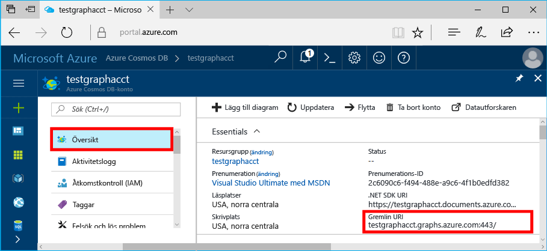

# <a name="azure-cosmos-db-create-a-graph-database-using-java-and-the-azure-portal"></a><span data-ttu-id="3d4bb-103">Azure Cosmos DB: Skapa en grafdatabas med Java och Azure Portal</span><span class="sxs-lookup"><span data-stu-id="3d4bb-103">Azure Cosmos DB: Create a graph database using Java and the Azure portal</span></span>

<span data-ttu-id="3d4bb-104">Azure Cosmos DB är Microsofts globalt distribuerade databastjänst för flera datamodeller.</span><span class="sxs-lookup"><span data-stu-id="3d4bb-104">Azure Cosmos DB is Microsoft’s globally distributed multi-model database service.</span></span> <span data-ttu-id="3d4bb-105">Du kan snabbt skapa och ställa frågor mot databaser med dokument, nyckel/värde-par och grafer. Du får fördelar av den globala distributionen och den horisontella skalningsförmågan som ligger i grunden hos Azure Cosmos DB.</span><span class="sxs-lookup"><span data-stu-id="3d4bb-105">You can quickly create and query document, key/value, and graph databases, all of which benefit from the global distribution and horizontal scale capabilities at the core of Azure Cosmos DB.</span></span> 

<span data-ttu-id="3d4bb-106">I den här snabbstarten skapar vi en grafdatabas med hjälp av Azure Portal-verktyg för Azure Cosmos DB.</span><span class="sxs-lookup"><span data-stu-id="3d4bb-106">This quickstart creates a graph database using the Azure portal tools for Azure Cosmos DB.</span></span> <span data-ttu-id="3d4bb-107">Här visas också hur du snabbt skapar en Java-konsolapp med hjälp av en grafdatabas med OSS-drivrutinen [Gremlin Java](https://mvnrepository.com/artifact/org.apache.tinkerpop/gremlin-driver).</span><span class="sxs-lookup"><span data-stu-id="3d4bb-107">This quickstart also shows you how to quickly create a Java console app using a graph database using the OSS [Gremlin Java](https://mvnrepository.com/artifact/org.apache.tinkerpop/gremlin-driver) driver.</span></span> <span data-ttu-id="3d4bb-108">Anvisningarna i den här snabbstartsguiden gäller alla operativsystem som kan köra Java.</span><span class="sxs-lookup"><span data-stu-id="3d4bb-108">The instructions in this quickstart can be followed on any operating system that is capable of running Java.</span></span> <span data-ttu-id="3d4bb-109">Den här snabbstarten visar hur du skapar och ändrar grafresurser, antingen i användargränssnittet eller programmässigt, beroende på vad du föredrar.</span><span class="sxs-lookup"><span data-stu-id="3d4bb-109">This quickstart familiarizes you with creating and modifying graph resources in either the UI or programmatically, whichever is your preference.</span></span> 

## <a name="prerequisites"></a><span data-ttu-id="3d4bb-110">Krav</span><span class="sxs-lookup"><span data-stu-id="3d4bb-110">Prerequisites</span></span>

* [<span data-ttu-id="3d4bb-111">Java Development Kit (JDK) 1.7+</span><span class="sxs-lookup"><span data-stu-id="3d4bb-111">Java Development Kit (JDK) 1.7+</span></span>](http://www.oracle.com/technetwork/java/javase/downloads/jdk8-downloads-2133151.html)
    * <span data-ttu-id="3d4bb-112">I Ubuntu kör du `apt-get install default-jdk` för att installera JDK-paketet.</span><span class="sxs-lookup"><span data-stu-id="3d4bb-112">On Ubuntu, run `apt-get install default-jdk` to install the JDK.</span></span>
    * <span data-ttu-id="3d4bb-113">Tänk på att ställa in miljövariabeln JAVA_HOME så att den pekar på den mapp där JDK-paketet är installerat.</span><span class="sxs-lookup"><span data-stu-id="3d4bb-113">Be sure to set the JAVA_HOME environment variable to point to the folder where the JDK is installed.</span></span>
* <span data-ttu-id="3d4bb-114">[Ladda ned](http://maven.apache.org/download.cgi) och [installera](http://maven.apache.org/install.html) ett [Maven](http://maven.apache.org/)-binärarkiv</span><span class="sxs-lookup"><span data-stu-id="3d4bb-114">[Download](http://maven.apache.org/download.cgi) and [install](http://maven.apache.org/install.html) a [Maven](http://maven.apache.org/) binary archive</span></span>
    * <span data-ttu-id="3d4bb-115">I Ubuntu kan du köra `apt-get install maven` för att installera Maven.</span><span class="sxs-lookup"><span data-stu-id="3d4bb-115">On Ubuntu, you can run `apt-get install maven` to install Maven.</span></span>
* [<span data-ttu-id="3d4bb-116">Git</span><span class="sxs-lookup"><span data-stu-id="3d4bb-116">Git</span></span>](https://www.git-scm.com/)
    * <span data-ttu-id="3d4bb-117">I Ubuntu kan du köra `sudo apt-get install git` för att installera Git.</span><span class="sxs-lookup"><span data-stu-id="3d4bb-117">On Ubuntu, you can run `sudo apt-get install git` to install Git.</span></span>

[!INCLUDE [quickstarts-free-trial-note](../../includes/quickstarts-free-trial-note.md)]

## <a name="create-a-database-account"></a><span data-ttu-id="3d4bb-118">Skapa ett databaskonto</span><span class="sxs-lookup"><span data-stu-id="3d4bb-118">Create a database account</span></span>

<span data-ttu-id="3d4bb-119">Innan du kan börja skapa en grafdatabas måste du skapa ett Gremlin-databaskonto (Graph) med Azure Cosmos DB.</span><span class="sxs-lookup"><span data-stu-id="3d4bb-119">Before you can create a graph database, you need to create a Gremlin (Graph) database account with Azure Cosmos DB.</span></span>

[!INCLUDE [cosmos-db-create-dbaccount-graph](../../includes/cosmos-db-create-dbaccount-graph.md)]

## <a name="add-a-graph"></a><span data-ttu-id="3d4bb-120">Lägga till en graf</span><span class="sxs-lookup"><span data-stu-id="3d4bb-120">Add a graph</span></span>

<span data-ttu-id="3d4bb-121">Nu kan du använda datautforskarverktyget i Azure Portal för att skapa en grafdatabas.</span><span class="sxs-lookup"><span data-stu-id="3d4bb-121">You can now use the Data Explorer tool in the Azure portal to create a graph database.</span></span> 

1. <span data-ttu-id="3d4bb-122">Klicka på **Data Explorer (förhandsversion)** på den vänstra navigeringsmenyn i Azure Portal.</span><span class="sxs-lookup"><span data-stu-id="3d4bb-122">In the Azure portal, in the left navigation menu, click **Data Explorer (Preview)**.</span></span> 
2. <span data-ttu-id="3d4bb-123">På bladet **Datautforskaren (förhandsversion)** klickar du på **New Graph** (Ny graf) och fyller sedan i sidan med följande information:</span><span class="sxs-lookup"><span data-stu-id="3d4bb-123">In the **Data Explorer (Preview)** blade, click **New Graph**, then fill in the page using the following information:</span></span>

    

    <span data-ttu-id="3d4bb-125">Inställning</span><span class="sxs-lookup"><span data-stu-id="3d4bb-125">Setting</span></span>|<span data-ttu-id="3d4bb-126">Föreslaget värde</span><span class="sxs-lookup"><span data-stu-id="3d4bb-126">Suggested value</span></span>|<span data-ttu-id="3d4bb-127">Beskrivning</span><span class="sxs-lookup"><span data-stu-id="3d4bb-127">Description</span></span>
    ---|---|---
    <span data-ttu-id="3d4bb-128">Databas-id</span><span class="sxs-lookup"><span data-stu-id="3d4bb-128">Database ID</span></span>|<span data-ttu-id="3d4bb-129">sample-database</span><span class="sxs-lookup"><span data-stu-id="3d4bb-129">sample-database</span></span>|<span data-ttu-id="3d4bb-130">ID för din nya databas.</span><span class="sxs-lookup"><span data-stu-id="3d4bb-130">The ID for your new database.</span></span> <span data-ttu-id="3d4bb-131">Databasnamn måste innehålla mellan 1 och 255 tecken och får inte innehålla `/ \ # ?` eller avslutande blanksteg.</span><span class="sxs-lookup"><span data-stu-id="3d4bb-131">Database names must be between 1 and 255 characters, and cannot contain `/ \ # ?` or a trailing space.</span></span>
    <span data-ttu-id="3d4bb-132">Graf-id</span><span class="sxs-lookup"><span data-stu-id="3d4bb-132">Graph ID</span></span>|<span data-ttu-id="3d4bb-133">sample-graph</span><span class="sxs-lookup"><span data-stu-id="3d4bb-133">sample-graph</span></span>|<span data-ttu-id="3d4bb-134">ID för din nya graf.</span><span class="sxs-lookup"><span data-stu-id="3d4bb-134">The ID for your new graph.</span></span> <span data-ttu-id="3d4bb-135">Samma teckenkrav gäller för grafnamn som databas-id.</span><span class="sxs-lookup"><span data-stu-id="3d4bb-135">Graph names have the same character requirements as database ids.</span></span>
    <span data-ttu-id="3d4bb-136">Lagringskapacitet</span><span class="sxs-lookup"><span data-stu-id="3d4bb-136">Storage Capacity</span></span>| <span data-ttu-id="3d4bb-137">10 GB</span><span class="sxs-lookup"><span data-stu-id="3d4bb-137">10 GB</span></span>|<span data-ttu-id="3d4bb-138">Låt standardvärdet vara kvar.</span><span class="sxs-lookup"><span data-stu-id="3d4bb-138">Leave the default value.</span></span> <span data-ttu-id="3d4bb-139">Det här är databasens lagringskapacitet.</span><span class="sxs-lookup"><span data-stu-id="3d4bb-139">This is the storage capacity of the database.</span></span>
    <span data-ttu-id="3d4bb-140">Dataflöde</span><span class="sxs-lookup"><span data-stu-id="3d4bb-140">Throughput</span></span>|<span data-ttu-id="3d4bb-141">400 RU:er</span><span class="sxs-lookup"><span data-stu-id="3d4bb-141">400 RUs</span></span>|<span data-ttu-id="3d4bb-142">Låt standardvärdet vara kvar.</span><span class="sxs-lookup"><span data-stu-id="3d4bb-142">Leave the default value.</span></span> <span data-ttu-id="3d4bb-143">Du kan skala upp dataflödet senare om du vill minska svarstiden.</span><span class="sxs-lookup"><span data-stu-id="3d4bb-143">You can scale up the throughput later if you want to reduce latency.</span></span>
    <span data-ttu-id="3d4bb-144">Partitionsnyckeln</span><span class="sxs-lookup"><span data-stu-id="3d4bb-144">Partition key</span></span>|<span data-ttu-id="3d4bb-145">Lämna tomt</span><span class="sxs-lookup"><span data-stu-id="3d4bb-145">Leave blank</span></span>|<span data-ttu-id="3d4bb-146">Lämna partitionsnyckelfältet tomt i den här snabbstarten.</span><span class="sxs-lookup"><span data-stu-id="3d4bb-146">For the purpose of this quickstart, leave the partition key blank.</span></span>

3. <span data-ttu-id="3d4bb-147">När formuläret är ifyllt klickar du på **OK**.</span><span class="sxs-lookup"><span data-stu-id="3d4bb-147">Once the form is filled out, click **OK**.</span></span>

## <a name="clone-the-sample-application"></a><span data-ttu-id="3d4bb-148">Klona exempelprogrammet</span><span class="sxs-lookup"><span data-stu-id="3d4bb-148">Clone the sample application</span></span>

<span data-ttu-id="3d4bb-149">Nu ska vi klona en grafapp från github, ange anslutningssträngen och köra appen.</span><span class="sxs-lookup"><span data-stu-id="3d4bb-149">Now let's clone a graph app from github, set the connection string, and run it.</span></span> <span data-ttu-id="3d4bb-150">Du kommer att se hur lätt det är att arbeta med data programmässigt.</span><span class="sxs-lookup"><span data-stu-id="3d4bb-150">You see how easy it is to work with data programmatically.</span></span> 

1. <span data-ttu-id="3d4bb-151">Öppna ett git-terminalfönster, till exempel git bash, och `cd` till en arbetskatalog.</span><span class="sxs-lookup"><span data-stu-id="3d4bb-151">Open a git terminal window, such as git bash, and `cd` to a working directory.</span></span>  

2. <span data-ttu-id="3d4bb-152">Klona exempellagringsplatsen med följande kommando.</span><span class="sxs-lookup"><span data-stu-id="3d4bb-152">Run the following command to clone the sample repository.</span></span> 

    ```bash
    git clone https://github.com/Azure-Samples/azure-cosmos-db-graph-java-getting-started.git
    ```

## <a name="review-the-code"></a><span data-ttu-id="3d4bb-153">Granska koden</span><span class="sxs-lookup"><span data-stu-id="3d4bb-153">Review the code</span></span>

<span data-ttu-id="3d4bb-154">Vi gör en snabb genomgång av vad som händer i appen.</span><span class="sxs-lookup"><span data-stu-id="3d4bb-154">Let's make a quick review of what's happening in the app.</span></span> <span data-ttu-id="3d4bb-155">Öppna filen`Program.java` från mappen \src\GetStarted folder och leta upp följande kodrader.</span><span class="sxs-lookup"><span data-stu-id="3d4bb-155">Open the `Program.java` file from the \src\GetStarted folder and find these lines of code.</span></span> 

* <span data-ttu-id="3d4bb-156">Gremlin-`Client`en initieras från konfigurationen i `src/remote.yaml`.</span><span class="sxs-lookup"><span data-stu-id="3d4bb-156">The Gremlin `Client` is initialized from the configuration in `src/remote.yaml`.</span></span>

    ```java
    cluster = Cluster.build(new File("src/remote.yaml")).create();
    ...
    client = cluster.connect();
    ```

* <span data-ttu-id="3d4bb-157">En mängd Gremlin-steg utförs med metoden `client.submit`.</span><span class="sxs-lookup"><span data-stu-id="3d4bb-157">A series of Gremlin steps are executed using the `client.submit` method.</span></span>

    ```java
    ResultSet results = client.submit(gremlin);

    CompletableFuture<List<Result>> completableFutureResults = results.all();
    List<Result> resultList = completableFutureResults.get();

    for (Result result : resultList) {
        System.out.println(result.toString());
    }
    ```

## <a name="update-your-connection-string"></a><span data-ttu-id="3d4bb-158">Uppdatera din anslutningssträng</span><span class="sxs-lookup"><span data-stu-id="3d4bb-158">Update your connection string</span></span>

1. <span data-ttu-id="3d4bb-159">Öppna filen src/remote.yaml.</span><span class="sxs-lookup"><span data-stu-id="3d4bb-159">Open the src/remote.yaml file.</span></span> 

3. <span data-ttu-id="3d4bb-160">Fyll i värden för *värdar*, *användarnamn* och *lösenord* i filen src/remote.yaml.</span><span class="sxs-lookup"><span data-stu-id="3d4bb-160">Fill in your *hosts*, *username*, and *password* values in the src/remote.yaml file.</span></span> <span data-ttu-id="3d4bb-161">Resterande inställningar behöver inte ändras.</span><span class="sxs-lookup"><span data-stu-id="3d4bb-161">The rest of the settings do not need to be changed.</span></span>

    <span data-ttu-id="3d4bb-162">Inställning</span><span class="sxs-lookup"><span data-stu-id="3d4bb-162">Setting</span></span>|<span data-ttu-id="3d4bb-163">Föreslaget värde</span><span class="sxs-lookup"><span data-stu-id="3d4bb-163">Suggested value</span></span>|<span data-ttu-id="3d4bb-164">Beskrivning</span><span class="sxs-lookup"><span data-stu-id="3d4bb-164">Description</span></span>
    ---|---|---
    <span data-ttu-id="3d4bb-165">Värdar</span><span class="sxs-lookup"><span data-stu-id="3d4bb-165">Hosts</span></span>|<span data-ttu-id="3d4bb-166">[***.graphs.azure.com]</span><span class="sxs-lookup"><span data-stu-id="3d4bb-166">[***.graphs.azure.com]</span></span>|<span data-ttu-id="3d4bb-167">Se skärmbilden under tabellen.</span><span class="sxs-lookup"><span data-stu-id="3d4bb-167">See the screenshot following this table.</span></span> <span data-ttu-id="3d4bb-168">Det här är värdet för Gremlin-URI på översiktssidan för Azure Portal, inom hakparenteser och utan : 443/ på slutet.</span><span class="sxs-lookup"><span data-stu-id="3d4bb-168">This value is the Gremlin URI value on the Overview page of the Azure portal, in square brackets, with the trailing :443/ removed.</span></span><br><br><span data-ttu-id="3d4bb-169">Det här värdet kan också hämtas från fliken Nycklar med hjälp av URI-värdet utan https://, eller genom att ändra dokument till grafer och ta bort avslutande: 443/.</span><span class="sxs-lookup"><span data-stu-id="3d4bb-169">This value can also be retrieved from the Keys tab, using the URI value by removing https://, changing documents to graphs, and removing the trailing :443/.</span></span>
    <span data-ttu-id="3d4bb-170">Användarnamn</span><span class="sxs-lookup"><span data-stu-id="3d4bb-170">Username</span></span>|<span data-ttu-id="3d4bb-171">/dbs/sample-database/colls/sample-graph</span><span class="sxs-lookup"><span data-stu-id="3d4bb-171">/dbs/sample-database/colls/sample-graph</span></span>|<span data-ttu-id="3d4bb-172">Resursen i formuläret `/dbs/<db>/colls/<coll>` där `<db>` är det befintliga databasnamnet och `<coll>` är den befintliga samlingens namn.</span><span class="sxs-lookup"><span data-stu-id="3d4bb-172">The resource of the form `/dbs/<db>/colls/<coll>` where `<db>` is your existing database name and `<coll>` is your existing collection name.</span></span>
    <span data-ttu-id="3d4bb-173">Lösenord</span><span class="sxs-lookup"><span data-stu-id="3d4bb-173">Password</span></span>|<span data-ttu-id="3d4bb-174">*Din primära huvudnyckel*</span><span class="sxs-lookup"><span data-stu-id="3d4bb-174">*Your primary master key*</span></span>|<span data-ttu-id="3d4bb-175">Se den andra skärmbilden under tabellen.</span><span class="sxs-lookup"><span data-stu-id="3d4bb-175">See the second screenshot following this table.</span></span> <span data-ttu-id="3d4bb-176">Det här värdet är din primärnyckel som du kan hämta från sidan Nycklar i Azure Portal i rutan Primärnyckel.</span><span class="sxs-lookup"><span data-stu-id="3d4bb-176">This value is your primary key, which you can retrieve from the Keys page of the Azure portal, in the Primary Key box.</span></span> <span data-ttu-id="3d4bb-177">Kopiera värdet med kopieringsknappen till höger om rutan.</span><span class="sxs-lookup"><span data-stu-id="3d4bb-177">Copy the value using the copy button on the right side of the box.</span></span>

    <span data-ttu-id="3d4bb-178">För värdet Värdar kopierar du värdet **Gremlin-URI** från **översiktssidan**.</span><span class="sxs-lookup"><span data-stu-id="3d4bb-178">For the Hosts value, copy the **Gremlin URI** value from the **Overview** page.</span></span> <span data-ttu-id="3d4bb-179">Om det är tomt läser du instruktionerna på raden Värdar i föregående tabell om hur du skapar Gremlin-URI från bladet Nycklar.</span><span class="sxs-lookup"><span data-stu-id="3d4bb-179">If it's empty, see the instructions in the Hosts row in the preceding table about creating the Gremlin URI from the Keys blade.</span></span>
<span data-ttu-id="3d4bb-180"></span><span class="sxs-lookup"><span data-stu-id="3d4bb-180"></span></span>

    <span data-ttu-id="3d4bb-181">För lösenordsvärdet, kopierar du **Primärnyckel** från sidan **Nycklar**: </span><span class="sxs-lookup"><span data-stu-id="3d4bb-181">For the Password value, copy the **Primary key** from the **Keys** blade: </span></span>

## <a name="run-the-console-app"></a><span data-ttu-id="3d4bb-182">Kör konsolappen</span><span class="sxs-lookup"><span data-stu-id="3d4bb-182">Run the console app</span></span>

1. <span data-ttu-id="3d4bb-183">I git-terminalfönstret `cd` till mappen azure-cosmos-db-graph-java-getting-started.</span><span class="sxs-lookup"><span data-stu-id="3d4bb-183">In the git terminal window, `cd` to the azure-cosmos-db-graph-java-getting-started folder.</span></span>

2. <span data-ttu-id="3d4bb-184">I git-terminalfönstret skriver du `mvn package` för att installera de Java-paket som krävs.</span><span class="sxs-lookup"><span data-stu-id="3d4bb-184">In the git terminal window, type `mvn package` to install the required Java packages.</span></span>

3. <span data-ttu-id="3d4bb-185">I git-terminalfönstret kör du `mvn exec:java -D exec.mainClass=GetStarted.Program` i terminalfönstret för att starta ditt Java-program.</span><span class="sxs-lookup"><span data-stu-id="3d4bb-185">In the git terminal window, run `mvn exec:java -D exec.mainClass=GetStarted.Program` in the terminal window to start your Java application.</span></span>

<span data-ttu-id="3d4bb-186">I terminalfönstret visas de hörn som läggs till i tabellen.</span><span class="sxs-lookup"><span data-stu-id="3d4bb-186">The terminal window displays the vertices being added to the graph.</span></span> <span data-ttu-id="3d4bb-187">När programmet har slutförts kan du växla tillbaka till Azure Portal i webbläsaren.</span><span class="sxs-lookup"><span data-stu-id="3d4bb-187">Once the program completes, switch back to the Azure portal in your internet browser.</span></span> 

<a id="add-sample-data"></a>
## <a name="review-and-add-sample-data"></a><span data-ttu-id="3d4bb-188">Granska och lägg till exempeldata</span><span class="sxs-lookup"><span data-stu-id="3d4bb-188">Review and add sample data</span></span>

<span data-ttu-id="3d4bb-189">Nu kan du gå tillbaka till datautforskaren och se de hörn som lagts till i grafen, och lägga till ytterligare datapunkter.</span><span class="sxs-lookup"><span data-stu-id="3d4bb-189">You can now go back to Data Explorer and see the vertices added to the graph, and add additional data points.</span></span>

1. <span data-ttu-id="3d4bb-190">I datautforskaren expanderar du **exempeldatabasen**/**exempelgrafen**, klickar på **Graf** och sedan på **Använd filter**.</span><span class="sxs-lookup"><span data-stu-id="3d4bb-190">In Data Explorer, expand the **sample-database**/**sample-graph**, click **Graph**, and then click **Apply Filter**.</span></span> 

   

2. <span data-ttu-id="3d4bb-192">I listan **Resultat** kan du se nya användare som har lagts till i grafen.</span><span class="sxs-lookup"><span data-stu-id="3d4bb-192">In the **Results** list, notice the new users added to the graph.</span></span> <span data-ttu-id="3d4bb-193">Välj **Ben** och lägg märke till att han är kopplad till Robin.</span><span class="sxs-lookup"><span data-stu-id="3d4bb-193">Select **ben** and notice that he's connected to robin.</span></span> <span data-ttu-id="3d4bb-194">Du kan flytta runt hörnen i grafutforskaren, zooma in och ut och öka storleken på grafutforskaren.</span><span class="sxs-lookup"><span data-stu-id="3d4bb-194">You can move the vertices around on the graph explorer, zoom in and out, and expand the size of the graph explorer surface.</span></span> 

   

3. <span data-ttu-id="3d4bb-196">Nu ska vi lägga till några nya användare i grafen med hjälp av datautforskaren.</span><span class="sxs-lookup"><span data-stu-id="3d4bb-196">Let's add a few new users to the graph using the Data Explorer.</span></span> <span data-ttu-id="3d4bb-197">Klicka på **Nytt hörn** om du vill lägga till data i grafen.</span><span class="sxs-lookup"><span data-stu-id="3d4bb-197">Click the **New Vertex** button to add data to your graph.</span></span>

   

4. <span data-ttu-id="3d4bb-199">Ange en etikett för *person* och ange sedan följande nycklar och värden för att skapa det första hörnet i grafen.</span><span class="sxs-lookup"><span data-stu-id="3d4bb-199">Enter a label of *person* then enter the following keys and values to create the first vertex in the graph.</span></span> <span data-ttu-id="3d4bb-200">Tänk på att du kan skapa unika egenskaper för varje person i grafen.</span><span class="sxs-lookup"><span data-stu-id="3d4bb-200">Notice that you can create unique properties for each person in your graph.</span></span> <span data-ttu-id="3d4bb-201">Endast id-nyckeln krävs.</span><span class="sxs-lookup"><span data-stu-id="3d4bb-201">Only the id key is required.</span></span>

    <span data-ttu-id="3d4bb-202">key</span><span class="sxs-lookup"><span data-stu-id="3d4bb-202">key</span></span>|<span data-ttu-id="3d4bb-203">värde</span><span class="sxs-lookup"><span data-stu-id="3d4bb-203">value</span></span>|<span data-ttu-id="3d4bb-204">Anteckningar</span><span class="sxs-lookup"><span data-stu-id="3d4bb-204">Notes</span></span>
    ----|----|----
    <span data-ttu-id="3d4bb-205">id</span><span class="sxs-lookup"><span data-stu-id="3d4bb-205">id</span></span>|<span data-ttu-id="3d4bb-206">ashley</span><span class="sxs-lookup"><span data-stu-id="3d4bb-206">ashley</span></span>|<span data-ttu-id="3d4bb-207">Den unika identifieraren för hörnet.</span><span class="sxs-lookup"><span data-stu-id="3d4bb-207">The unique identifier for the vertex.</span></span> <span data-ttu-id="3d4bb-208">Om du inte anger något id skapas ett automatiskt.</span><span class="sxs-lookup"><span data-stu-id="3d4bb-208">If you don't specify an id, one is generated for you.</span></span>
    <span data-ttu-id="3d4bb-209">kön</span><span class="sxs-lookup"><span data-stu-id="3d4bb-209">gender</span></span>|<span data-ttu-id="3d4bb-210">kvinna</span><span class="sxs-lookup"><span data-stu-id="3d4bb-210">female</span></span>| 
    <span data-ttu-id="3d4bb-211">teknik</span><span class="sxs-lookup"><span data-stu-id="3d4bb-211">tech</span></span> | <span data-ttu-id="3d4bb-212">Java</span><span class="sxs-lookup"><span data-stu-id="3d4bb-212">java</span></span> | 

    > [!NOTE]
    > <span data-ttu-id="3d4bb-213">I den här snabbstartsguiden skapar vi en icke-partitionerad samling.</span><span class="sxs-lookup"><span data-stu-id="3d4bb-213">In this quickstart we create a non-partitioned collection.</span></span> <span data-ttu-id="3d4bb-214">Men om du skapar en partitionerad samling genom att ange en partitionsnyckel när samlingen skapas, måste du lägga till partitionsnyckeln som nyckel i varje nytt hörn.</span><span class="sxs-lookup"><span data-stu-id="3d4bb-214">However, if you create a partitioned collection by specifying a partition key during the collection creation, then you need to include the partition key as a key in each new vertex.</span></span> 

5. <span data-ttu-id="3d4bb-215">Klicka på **OK**.</span><span class="sxs-lookup"><span data-stu-id="3d4bb-215">Click **OK**.</span></span> <span data-ttu-id="3d4bb-216">Du kan behöva expandera skärmen för att se **OK** längst ned på skärmen.</span><span class="sxs-lookup"><span data-stu-id="3d4bb-216">You may need to expand your screen to see **OK** on the bottom of the screen.</span></span>

6. <span data-ttu-id="3d4bb-217">Klicka på **Nytt hörn** igen och lägg till ytterligare en ny användare.</span><span class="sxs-lookup"><span data-stu-id="3d4bb-217">Click **New Vertex** again and add an additional new user.</span></span> <span data-ttu-id="3d4bb-218">Ange en etikett för *person* och ange sedan följande nycklar och värden:</span><span class="sxs-lookup"><span data-stu-id="3d4bb-218">Enter a label of *person* then enter the following keys and values:</span></span>

    <span data-ttu-id="3d4bb-219">key</span><span class="sxs-lookup"><span data-stu-id="3d4bb-219">key</span></span>|<span data-ttu-id="3d4bb-220">värde</span><span class="sxs-lookup"><span data-stu-id="3d4bb-220">value</span></span>|<span data-ttu-id="3d4bb-221">Anteckningar</span><span class="sxs-lookup"><span data-stu-id="3d4bb-221">Notes</span></span>
    ----|----|----
    <span data-ttu-id="3d4bb-222">id</span><span class="sxs-lookup"><span data-stu-id="3d4bb-222">id</span></span>|<span data-ttu-id="3d4bb-223">rakesh</span><span class="sxs-lookup"><span data-stu-id="3d4bb-223">rakesh</span></span>|<span data-ttu-id="3d4bb-224">Den unika identifieraren för hörnet.</span><span class="sxs-lookup"><span data-stu-id="3d4bb-224">The unique identifier for the vertex.</span></span> <span data-ttu-id="3d4bb-225">Om du inte anger något id skapas ett automatiskt.</span><span class="sxs-lookup"><span data-stu-id="3d4bb-225">If you don't specify an id, one is generated for you.</span></span>
    <span data-ttu-id="3d4bb-226">kön</span><span class="sxs-lookup"><span data-stu-id="3d4bb-226">gender</span></span>|<span data-ttu-id="3d4bb-227">man</span><span class="sxs-lookup"><span data-stu-id="3d4bb-227">male</span></span>| 
    <span data-ttu-id="3d4bb-228">skola</span><span class="sxs-lookup"><span data-stu-id="3d4bb-228">school</span></span>|<span data-ttu-id="3d4bb-229">MIT</span><span class="sxs-lookup"><span data-stu-id="3d4bb-229">MIT</span></span>| 

7. <span data-ttu-id="3d4bb-230">Klicka på **OK**.</span><span class="sxs-lookup"><span data-stu-id="3d4bb-230">Click **OK**.</span></span> 

8. <span data-ttu-id="3d4bb-231">Klicka på **Använd filter** med standardfiltret `g.V()`.</span><span class="sxs-lookup"><span data-stu-id="3d4bb-231">Click **Apply Filter** with the default `g.V()` filter.</span></span> <span data-ttu-id="3d4bb-232">Nu visas alla användare i listan **Resultat**.</span><span class="sxs-lookup"><span data-stu-id="3d4bb-232">All of the users now show in the **Results** list.</span></span> <span data-ttu-id="3d4bb-233">Allteftersom du lägger till data kan du använda filter för att begränsa resultaten.</span><span class="sxs-lookup"><span data-stu-id="3d4bb-233">As you add more data, you can use filters to limit your results.</span></span> <span data-ttu-id="3d4bb-234">I datautforskaren används som standard `g.V()` för att hämta alla hörn i en graf, men du kan ändra till en annan [graffråga](tutorial-query-graph.md), till exempel `g.V().count()`, för att returnera det totala antalet hörn i grafen i JSON-format.</span><span class="sxs-lookup"><span data-stu-id="3d4bb-234">By default, Data Explorer uses `g.V()` to retrieve all vertices in a graph, but you can change that to a different [graph query](tutorial-query-graph.md), such as `g.V().count()`, to return a count of all the vertices in the graph in JSON format.</span></span>

9. <span data-ttu-id="3d4bb-235">Nu kan vi koppla ihop Rakesh och Ashley.</span><span class="sxs-lookup"><span data-stu-id="3d4bb-235">Now we can connect rakesh and ashley.</span></span> <span data-ttu-id="3d4bb-236">Se till att **ashley** är markerat i listan**Resultat** och klicka sedan på redigeringsknappen bredvid **Mål** nere till höger.</span><span class="sxs-lookup"><span data-stu-id="3d4bb-236">Ensure **ashley** in selected in the **Results** list, then click the edit button next to **Targets** on lower right side.</span></span> <span data-ttu-id="3d4bb-237">Du kan behöva bredda fönstret för att se området **Egenskaper**.</span><span class="sxs-lookup"><span data-stu-id="3d4bb-237">You may need to widen your window to see the **Properties** area.</span></span>

   

10. <span data-ttu-id="3d4bb-239">I rutan **Mål** skriver du *rakesh* och i rutan **Edge label**  (Kantetikett) skriver du *känner* och markerar sedan kryssrutan.</span><span class="sxs-lookup"><span data-stu-id="3d4bb-239">In the **Target** box type *rakesh*, and in the **Edge label** box type *knows*, and then click the check box.</span></span>

   

11. <span data-ttu-id="3d4bb-241">Markera nu **rakesh** i resultatlistan och se att Ashley och Rakesh är anslutna.</span><span class="sxs-lookup"><span data-stu-id="3d4bb-241">Now select **rakesh** from the results list and see that ashley and rakesh are connected.</span></span> 

   

    <span data-ttu-id="3d4bb-243">Du kan även använda datautforskaren för att skapa lagrade procedurer, UDF:er och utlösare för att utföra affärslogik på serversidan såväl som att skala genomflödet.</span><span class="sxs-lookup"><span data-stu-id="3d4bb-243">You can also use Data Explorer to create stored procedures, UDFs, and triggers to perform server-side business logic as well as scale throughput.</span></span> <span data-ttu-id="3d4bb-244">Datautforskaren visar all den inbyggda programmässiga dataåtkomsten som finns tillgänglig i API:erna, men ger enkel åtkomst till dina data i Azure-portalen.</span><span class="sxs-lookup"><span data-stu-id="3d4bb-244">Data Explorer exposes all of the built-in programmatic data access available in the APIs, but provides easy access to your data in the Azure portal.</span></span>


## <a name="review-slas-in-the-azure-portal"></a><span data-ttu-id="3d4bb-245">Granska serviceavtal i Azure Portal</span><span class="sxs-lookup"><span data-stu-id="3d4bb-245">Review SLAs in the Azure portal</span></span>

[!INCLUDE [cosmosdb-tutorial-review-slas](../../includes/cosmos-db-tutorial-review-slas.md)]

## <a name="clean-up-resources"></a><span data-ttu-id="3d4bb-246">Rensa resurser</span><span class="sxs-lookup"><span data-stu-id="3d4bb-246">Clean up resources</span></span>

<span data-ttu-id="3d4bb-247">Om du inte planerar att fortsätta använda den här appen tar du bort alla resurser som skapades i snabbstarten i Azure Portal med följande steg:</span><span class="sxs-lookup"><span data-stu-id="3d4bb-247">If you're not going to continue to use this app, delete all resources created by this quickstart in the Azure portal with the following steps:</span></span> 

1. <span data-ttu-id="3d4bb-248">Klicka på **Resursgrupper** på den vänstra menyn i Azure Portal och sedan på namnet på den resurs du skapade.</span><span class="sxs-lookup"><span data-stu-id="3d4bb-248">From the left-hand menu in the Azure portal, click **Resource groups** and then click the name of the resource you created.</span></span> 
2. <span data-ttu-id="3d4bb-249">På sidan med resursgrupper klickar du på **Ta bort**, skriver in namnet på resursen att ta bort i textrutan och klickar sedan på **Ta bort**.</span><span class="sxs-lookup"><span data-stu-id="3d4bb-249">On your resource group page, click **Delete**, type the name of the resource to delete in the text box, and then click **Delete**.</span></span>

## <a name="next-steps"></a><span data-ttu-id="3d4bb-250">Nästa steg</span><span class="sxs-lookup"><span data-stu-id="3d4bb-250">Next steps</span></span>

<span data-ttu-id="3d4bb-251">I den här snabbstarten har du fått lära dig att skapa ett Azure Cosmos DB-konto, skapa en graf med datautforskaren och att köra en app.</span><span class="sxs-lookup"><span data-stu-id="3d4bb-251">In this quickstart, you've learned how to create an Azure Cosmos DB account, create a graph using the Data Explorer, and run an app.</span></span> <span data-ttu-id="3d4bb-252">Nu kan du skapa mer komplexa frågor och implementera kraftfull logik för grafbläddring med Gremlin.</span><span class="sxs-lookup"><span data-stu-id="3d4bb-252">You can now build more complex queries and implement powerful graph traversal logic using Gremlin.</span></span> 

> [!div class="nextstepaction"]
> [<span data-ttu-id="3d4bb-253">Fråga med hjälp av Gremlin</span><span class="sxs-lookup"><span data-stu-id="3d4bb-253">Query using Gremlin</span></span>](tutorial-query-graph.md)

