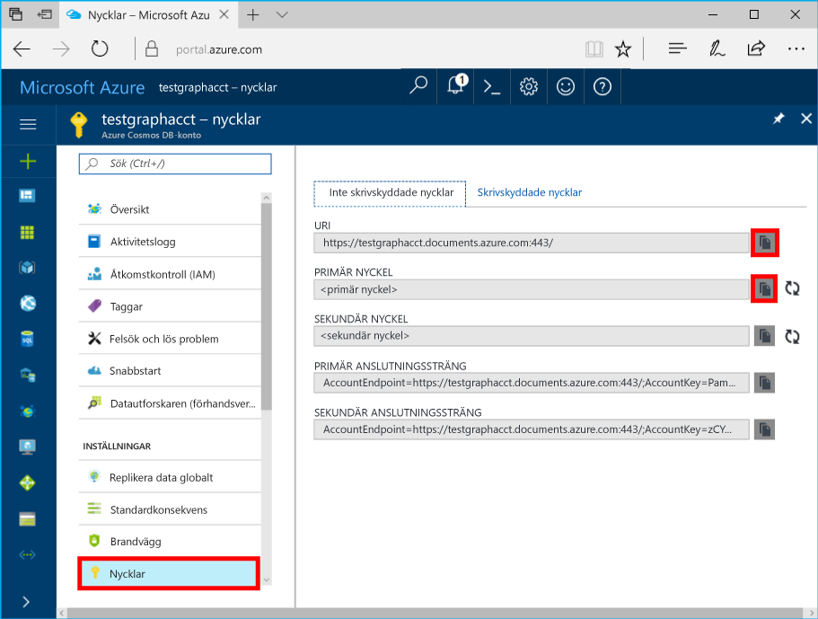

# <a name="azure-cosmos-db-build-a-nodejs-application-by-using-graph-api"></a><span data-ttu-id="db2c7-103">Azure Cosmos DB: Skapa en Node.js-app med Graph API</span><span class="sxs-lookup"><span data-stu-id="db2c7-103">Azure Cosmos DB: Build a Node.js application by using Graph API</span></span>

<span data-ttu-id="db2c7-104">Azure Cosmos-DB är hello globalt distribueras med flera modeller databastjänst från Microsoft.</span><span class="sxs-lookup"><span data-stu-id="db2c7-104">Azure Cosmos DB is hello globally distributed multi-model database service from Microsoft.</span></span> <span data-ttu-id="db2c7-105">Du kan snabbt skapa och fråga dokument och nyckel/värde-diagrammet databaser, som omfattas av hello global distributionsplatsen och skala horisontellt funktionerna i hello kärnan i Azure Cosmos DB.</span><span class="sxs-lookup"><span data-stu-id="db2c7-105">You can quickly create and query document, key/value, and graph databases, all of which benefit from hello global distribution and horizontal scale capabilities at hello core of Azure Cosmos DB.</span></span> 

<span data-ttu-id="db2c7-106">Den här Snabbkurs artikeln visar hur toocreate en Azure-Cosmos-DB konto för Graph API (förhandsgranskning), databas och diagram med hjälp av hello Azure-portalen.</span><span class="sxs-lookup"><span data-stu-id="db2c7-106">This quick-start article demonstrates how toocreate an Azure Cosmos DB account for Graph API (preview), database, and graph by using hello Azure portal.</span></span> <span data-ttu-id="db2c7-107">Du sedan skapa och köra en konsolapp med hjälp av hello öppen källkod [Gremlin Node.js](https://www.npmjs.com/package/gremlin-secure) drivrutin.</span><span class="sxs-lookup"><span data-stu-id="db2c7-107">You then build and run a console app by using hello open-source [Gremlin Node.js](https://www.npmjs.com/package/gremlin-secure) driver.</span></span>  

> [!NOTE]
> <span data-ttu-id="db2c7-108">Hej npm-modulen `gremlin-secure` är en modifierad version av `gremlin` modul, med stöd för SSL och SASL som krävs för att ansluta med Azure Cosmos DB.</span><span class="sxs-lookup"><span data-stu-id="db2c7-108">hello npm module `gremlin-secure` is a modified version of `gremlin` module, with support for SSL and SASL required for connecting with Azure Cosmos DB.</span></span> <span data-ttu-id="db2c7-109">Källkoden finns på [GitHub](https://github.com/CosmosDB/gremlin-javascript).</span><span class="sxs-lookup"><span data-stu-id="db2c7-109">Source code is available on [GitHub](https://github.com/CosmosDB/gremlin-javascript).</span></span>
>

## <a name="prerequisites"></a><span data-ttu-id="db2c7-110">Krav</span><span class="sxs-lookup"><span data-stu-id="db2c7-110">Prerequisites</span></span>

<span data-ttu-id="db2c7-111">Innan du kan köra det här exemplet måste du ha hello följande krav:</span><span class="sxs-lookup"><span data-stu-id="db2c7-111">Before you can run this sample, you must have hello following prerequisites:</span></span>
* <span data-ttu-id="db2c7-112">[Node.js](https://nodejs.org/en/)-version v0.10.29 eller senare</span><span class="sxs-lookup"><span data-stu-id="db2c7-112">[Node.js](https://nodejs.org/en/) version v0.10.29 or later</span></span>
* [<span data-ttu-id="db2c7-113">Git</span><span class="sxs-lookup"><span data-stu-id="db2c7-113">Git</span></span>](http://git-scm.com/)

[!INCLUDE [quickstarts-free-trial-note](../../includes/quickstarts-free-trial-note.md)]

## <a name="create-a-database-account"></a><span data-ttu-id="db2c7-114">Skapa ett databaskonto</span><span class="sxs-lookup"><span data-stu-id="db2c7-114">Create a database account</span></span>

[!INCLUDE [cosmos-db-create-dbaccount-graph](../../includes/cosmos-db-create-dbaccount-graph.md)]

## <a name="add-a-graph"></a><span data-ttu-id="db2c7-115">Lägga till en graf</span><span class="sxs-lookup"><span data-stu-id="db2c7-115">Add a graph</span></span>

[!INCLUDE [cosmos-db-create-graph](../../includes/cosmos-db-create-graph.md)]

## <a name="clone-hello-sample-application"></a><span data-ttu-id="db2c7-116">Klona hello exempelprogrammet</span><span class="sxs-lookup"><span data-stu-id="db2c7-116">Clone hello sample application</span></span>

<span data-ttu-id="db2c7-117">Nu ska vi klona Graph-API-app från GitHub, ange hello anslutningssträngen och kör den.</span><span class="sxs-lookup"><span data-stu-id="db2c7-117">Now let's clone a Graph API app from GitHub, set hello connection string, and run it.</span></span> <span data-ttu-id="db2c7-118">Du ser hur enkelt som det är att toowork med data programmässigt.</span><span class="sxs-lookup"><span data-stu-id="db2c7-118">You'll see how easy it is toowork with data programmatically.</span></span> 

1. <span data-ttu-id="db2c7-119">Öppna en Git-terminalfönster, till exempel Git Bash och ändra (via `cd` kommando) tooa arbetskatalogen.</span><span class="sxs-lookup"><span data-stu-id="db2c7-119">Open a Git terminal window, such as Git Bash, and change (via `cd` command) tooa working directory.</span></span>  

2. <span data-ttu-id="db2c7-120">Hello kör följande kommando tooclone hello exempel lagringsplatsen.</span><span class="sxs-lookup"><span data-stu-id="db2c7-120">Run hello following command tooclone hello sample repository.</span></span> 

    ```bash
    git clone https://github.com/Azure-Samples/azure-cosmos-db-graph-nodejs-getting-started.git
    ```

3. <span data-ttu-id="db2c7-121">Öppna hello lösningsfilen i Visual Studio.</span><span class="sxs-lookup"><span data-stu-id="db2c7-121">Open hello solution file in Visual Studio.</span></span> 

## <a name="review-hello-code"></a><span data-ttu-id="db2c7-122">Granska hello kod</span><span class="sxs-lookup"><span data-stu-id="db2c7-122">Review hello code</span></span>

<span data-ttu-id="db2c7-123">Låt oss göra en snabb genomgång av vad som händer i hello app.</span><span class="sxs-lookup"><span data-stu-id="db2c7-123">Let's make a quick review of what's happening in hello app.</span></span> <span data-ttu-id="db2c7-124">Öppna hello `app.js` fil, och du hittar hello följande rader med kod.</span><span class="sxs-lookup"><span data-stu-id="db2c7-124">Open hello `app.js` file, and you'll find hello following lines of code.</span></span> 

* <span data-ttu-id="db2c7-125">Hej Gremlin klient skapas.</span><span class="sxs-lookup"><span data-stu-id="db2c7-125">hello Gremlin client is created.</span></span>

    ```nodejs
    const client = Gremlin.createClient(
        443, 
        config.endpoint, 
        { 
            "session": false, 
            "ssl": true, 
            "user": `/dbs/${config.database}/colls/${config.collection}`,
            "password": config.primaryKey
        });
    ```

  <span data-ttu-id="db2c7-126">hello konfigurationer finns i `config.js`, som vi redigera i hello efter avsnittet.</span><span class="sxs-lookup"><span data-stu-id="db2c7-126">hello configurations are all in `config.js`, which we edit in hello following section.</span></span>

* <span data-ttu-id="db2c7-127">En serie Gremlin steg utförs med hello `client.execute` metod.</span><span class="sxs-lookup"><span data-stu-id="db2c7-127">A series of Gremlin steps are executed with hello `client.execute` method.</span></span>

    ```nodejs
    console.log('Running Count'); 
    client.execute("g.V().count()", { }, (err, results) => {
        if (err) return console.error(err);
        console.log(JSON.stringify(results));
        console.log();
    });
    ```

## <a name="update-your-connection-string"></a><span data-ttu-id="db2c7-128">Uppdatera din anslutningssträng</span><span class="sxs-lookup"><span data-stu-id="db2c7-128">Update your connection string</span></span>

1. <span data-ttu-id="db2c7-129">Öppna hello config.js-fil.</span><span class="sxs-lookup"><span data-stu-id="db2c7-129">Open hello config.js file.</span></span> 

2. <span data-ttu-id="db2c7-130">Fyll i hello config.endpoint nyckel med hello i config.js, **Gremlin URI** värde från hello **översikt** sidan hello Azure-portalen.</span><span class="sxs-lookup"><span data-stu-id="db2c7-130">In config.js, fill in hello config.endpoint key with hello **Gremlin URI** value from hello **Overview** page of hello Azure portal.</span></span> 

    `config.endpoint = "GRAPHENDPOINT";`

    

   <span data-ttu-id="db2c7-132">Om hello **Gremlin URI** värdet är tomt, du kan generera hello värdet från hello **nycklar** sidan hello-portalen, med hello **URI** värde, ta bort https:// och ändra dokument toographs.</span><span class="sxs-lookup"><span data-stu-id="db2c7-132">If hello **Gremlin URI** value is blank, you can generate hello value from hello **Keys** page in hello portal, using hello **URI** value, removing https://, and changing documents toographs.</span></span>

   <span data-ttu-id="db2c7-133">Hej Gremlin slutpunkt måste vara endast hello värdnamn utan hello protocol/portnummer som `mygraphdb.graphs.azure.com` (inte `https://mygraphdb.graphs.azure.com` eller `mygraphdb.graphs.azure.com:433`).</span><span class="sxs-lookup"><span data-stu-id="db2c7-133">hello Gremlin endpoint must be only hello host name without hello protocol/port number, like `mygraphdb.graphs.azure.com` (not `https://mygraphdb.graphs.azure.com` or `mygraphdb.graphs.azure.com:433`).</span></span>

3. <span data-ttu-id="db2c7-134">I config.js, fyller du i hello config.primaryKey värdet in med hello **primärnyckel** värde från hello **nycklar** sidan hello Azure-portalen.</span><span class="sxs-lookup"><span data-stu-id="db2c7-134">In config.js, fill in hello config.primaryKey value in with hello **Primary Key** value from hello **Keys** page of hello Azure portal.</span></span> 

    `config.primaryKey = "PRIMARYKEY";`

   

4. <span data-ttu-id="db2c7-136">Ange hello databasnamnet och (behållaren) diagramnamn för hello värdet av config.database och config.collection.</span><span class="sxs-lookup"><span data-stu-id="db2c7-136">Enter hello database name, and graph (container) name for hello value of config.database and config.collection.</span></span> 

<span data-ttu-id="db2c7-137">Här är ett exempel på hur din färdiga config.js-fil ska se ut:</span><span class="sxs-lookup"><span data-stu-id="db2c7-137">Here is an example of what your completed config.js file should look like:</span></span>

```nodejs
var config = {}

// Note that this must not have HTTPS or hello port number
config.endpoint = "testgraphacct.graphs.azure.com";
config.primaryKey = "Pams6e7LEUS7LJ2Qk0fjZf3eGo65JdMWHmyn65i52w8ozPX2oxY3iP0yu05t9v1WymAHNcMwPIqNAEv3XDFsEg==";
config.database = "graphdb"
config.collection = "Persons"

module.exports = config;
```

## <a name="run-hello-console-app"></a><span data-ttu-id="db2c7-138">Kör hello-konsolprogram</span><span class="sxs-lookup"><span data-stu-id="db2c7-138">Run hello console app</span></span>

1. <span data-ttu-id="db2c7-139">Öppna ett terminalfönster och ändra (via `cd` kommando) toohello installationskatalogen för hello package.json fil som ingår i hello-projekt.</span><span class="sxs-lookup"><span data-stu-id="db2c7-139">Open a terminal window and change (via `cd` command) toohello installation directory for hello package.json file that's included in hello project.</span></span>  

2. <span data-ttu-id="db2c7-140">Kör `npm install` tooinstall hello krävs npm-modulerna, inklusive `gremlin-secure`.</span><span class="sxs-lookup"><span data-stu-id="db2c7-140">Run `npm install` tooinstall hello required npm modules, including `gremlin-secure`.</span></span>

3. <span data-ttu-id="db2c7-141">Kör `node app.js` i en terminal toostart node-App.</span><span class="sxs-lookup"><span data-stu-id="db2c7-141">Run `node app.js` in a terminal toostart your node application.</span></span>

## <a name="browse-with-data-explorer"></a><span data-ttu-id="db2c7-142">Bläddra med datautforskaren</span><span class="sxs-lookup"><span data-stu-id="db2c7-142">Browse with Data Explorer</span></span>

<span data-ttu-id="db2c7-143">Du kan nu gå tillbaka tooData Explorer i hello Azure portal tooview, fråga, ändra och arbeta med den nya informationen i diagrammet.</span><span class="sxs-lookup"><span data-stu-id="db2c7-143">You can now go back tooData Explorer in hello Azure portal tooview, query, modify, and work with your new graph data.</span></span>

<span data-ttu-id="db2c7-144">Data Explorer hello ny databas visas i hello **diagram** fönstret.</span><span class="sxs-lookup"><span data-stu-id="db2c7-144">In Data Explorer, hello new database appears in hello **Graphs** pane.</span></span> <span data-ttu-id="db2c7-145">Expandera hello-databasen, följt av hello samling, och klicka sedan på **diagram**.</span><span class="sxs-lookup"><span data-stu-id="db2c7-145">Expand hello database, followed by hello collection, then click **Graph**.</span></span>

<span data-ttu-id="db2c7-146">hello-data som genereras av hello sample-appen visas i hello nästa ruta inom hello **diagram** fliken när du klickar på **Använd Filter**.</span><span class="sxs-lookup"><span data-stu-id="db2c7-146">hello data generated by hello sample app is displayed in hello next pane within hello **Graph** tab when you click **Apply Filter**.</span></span>

<span data-ttu-id="db2c7-147">Försök att slutföra `g.V()` med `.has('firstName', 'Thomas')` tootest hello filter.</span><span class="sxs-lookup"><span data-stu-id="db2c7-147">Try completing `g.V()` with `.has('firstName', 'Thomas')` tootest hello filter.</span></span> <span data-ttu-id="db2c7-148">Observera att värdet för hello är skiftlägeskänsliga.</span><span class="sxs-lookup"><span data-stu-id="db2c7-148">Do note that hello value is case sensitive.</span></span>

## <a name="review-slas-in-hello-azure-portal"></a><span data-ttu-id="db2c7-149">Granska SLA: er i hello Azure-portalen</span><span class="sxs-lookup"><span data-stu-id="db2c7-149">Review SLAs in hello Azure portal</span></span>

[!INCLUDE [cosmosdb-tutorial-review-slas](../../includes/cosmos-db-tutorial-review-slas.md)]

## <a name="clean-up-your-resources"></a><span data-ttu-id="db2c7-150">Rensa dina resurser</span><span class="sxs-lookup"><span data-stu-id="db2c7-150">Clean up your resources</span></span>

<span data-ttu-id="db2c7-151">Om du inte planerar toocontinue som använder den här appen kan du ta bort alla resurser som du skapade i den här artikeln hello följande:</span><span class="sxs-lookup"><span data-stu-id="db2c7-151">If you do not plan toocontinue using this app, delete all resources that you created in this article by doing hello following:</span></span> 

1. <span data-ttu-id="db2c7-152">Klicka på hello Azure-portalen på hello vänstra navigeringsmenyn **resursgrupper**, och klicka sedan på hello namnet på hello resursen som du skapade.</span><span class="sxs-lookup"><span data-stu-id="db2c7-152">In hello Azure portal, on hello left navigation menu, click **Resource groups**, and then click hello name of hello resource that you created.</span></span> 
2. <span data-ttu-id="db2c7-153">På din resurs gruppen klickar du på **ta bort**hello typnamn för hello resurs toobe tas bort och klicka sedan på **ta bort**.</span><span class="sxs-lookup"><span data-stu-id="db2c7-153">On your resource group page, click **Delete**, type hello name of hello resource toobe deleted, and then click **Delete**.</span></span>

## <a name="next-steps"></a><span data-ttu-id="db2c7-154">Nästa steg</span><span class="sxs-lookup"><span data-stu-id="db2c7-154">Next steps</span></span>

<span data-ttu-id="db2c7-155">Du har lärt dig hur toocreate ett Azure DB som Cosmos-konto, skapa ett diagram med hjälp av Data Explorer och kör en app i den här artikeln.</span><span class="sxs-lookup"><span data-stu-id="db2c7-155">In this article, you've learned how toocreate an Azure Cosmos DB account, create a graph by using Data Explorer, and run an app.</span></span> <span data-ttu-id="db2c7-156">Nu kan du skapa mer komplexa frågor och implementera kraftfull logik för grafbläddring med Gremlin.</span><span class="sxs-lookup"><span data-stu-id="db2c7-156">You can now build more complex queries and implement powerful graph traversal logic by using Gremlin.</span></span> 

> [!div class="nextstepaction"]
> [<span data-ttu-id="db2c7-157">Fråga med hjälp av Gremlin</span><span class="sxs-lookup"><span data-stu-id="db2c7-157">Query using Gremlin</span></span>](tutorial-query-graph.md)
