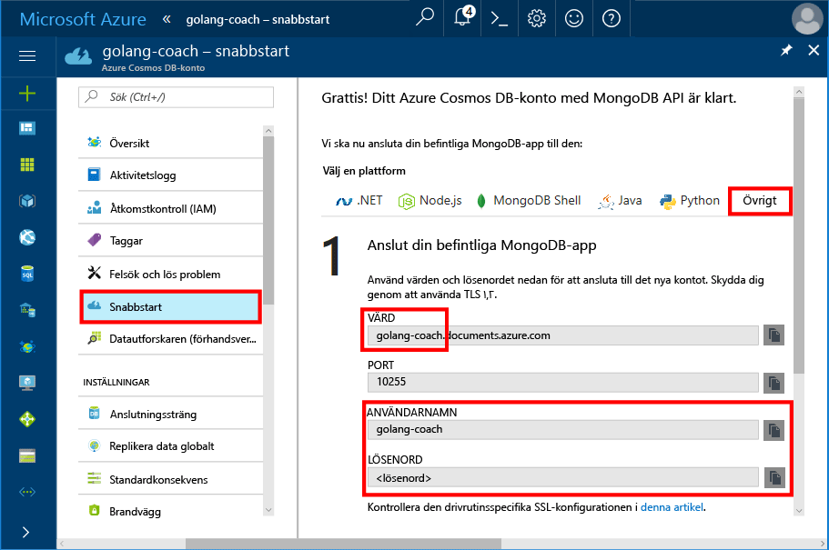
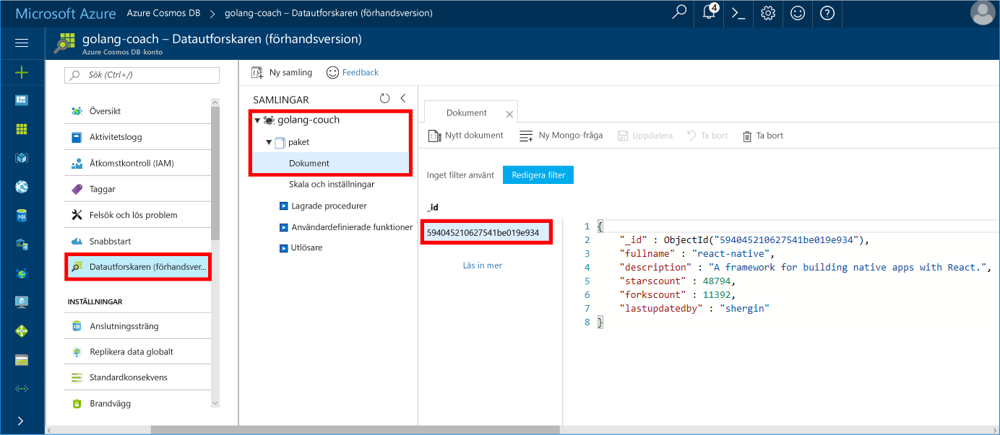

# <a name="azure-cosmos-db-build-a-mongodb-api-console-app-with-golang-and-hello-azure-portal"></a>Azure DB Cosmos: Skapa en MongoDB-API-konsolapp med Golang och hello Azure-portalen

Azure Cosmos DB är Microsofts globalt distribuerade databastjänst för flera datamodeller. Du kan snabbt skapa och fråga dokument och nyckel/värde-diagrammet databaser, som omfattas av hello global distributionsplatsen och skala horisontellt funktionerna i hello kärnan i Azure Cosmos DB.

Den här Snabbkurs visar hur toouse som en befintlig [MongoDB](https://docs.microsoft.com/en-us/azure/cosmos-db/mongodb-introduction) app skriven i [Golang](https://golang.org/) och anslut den tooyour Azure DB som Cosmos-databasen, som har stöd för MongoDB-klientanslutningar.

Med andra ord, vet Golang programmet bara att den ansluter tooa databasen med MongoDB APIs. Den är öppet toohello program som hello data lagras i Azure Cosmos DB.

## <a name="prerequisites"></a>Krav

- En Azure-prenumeration. Om du inte har en Azure-prenumeration kan du skapa ett [kostnadsfritt konto](https://azure.microsoft.com/free) innan du börjar.
- [Gå](https://golang.org/dl/) och grundläggande kunskaper om hello [Gå](https://golang.org/) språk.
- En IDE — [Gogland](https://www.jetbrains.com/go/) från Jetbrains, [Visual Studio Code](https://code.visualstudio.com/) från Microsoft eller [Atom](https://atom.io/). Jag använder Goglang i den här självstudiekursen.

<a id="create-account"></a>
## <a name="create-a-database-account"></a>Skapa ett databaskonto

[!INCLUDE [cosmos-db-create-dbaccount](../../includes/cosmos-db-create-dbaccount-mongodb.md)]

## <a name="clone-hello-sample-application"></a>Klona hello exempelprogrammet

Klona hello exempelprogrammet och installera paket hello krävs.

1. Skapa en mapp med namnet CosmosDBSample hello GOROOT\src mappen som är C:\Go\ som standard.
2. Kör följande kommando med ett terminalfönster git exempelvis git bash tooclone hello exempel lagringsplatsen till hello CosmosDBSample mapp hello. 

    ```bash
    git clone https://github.com/Azure-Samples/azure-cosmos-db-mongodb-golang-getting-started.git
    ```
3.  Kör följande kommando tooget hello mgo paketet hello. 

    ```
    go get gopkg.in/mgo.v2
    ```

Hej [mgo](http://labix.org/mgo) drivrutin (uttalas som *mango*) är en [MongoDB](http://www.mongodb.org/) drivrutin för hello [gå språk](http://golang.org/) som implementerar en komplett och väl testas val av funktioner under ett väldigt enkelt API som följer standard gå idioms.

<a id="connection-string"></a>

## <a name="update-your-connection-string"></a>Uppdatera din anslutningssträng

Gå tillbaka toohello Azure portal tooget din Anslutningssträngsinformation nu och kopierar den till hello app.

1. Klicka på **Snabbstart** i hello vänstra navigeringsmenyn och klicka sedan på **andra** tooview hello Anslutningssträngsinformation krävs av hello gå program.

2. Öppna hello main.go fil i hello GOROOT\CosmosDBSample katalog i Goglang, och uppdatera hello följande rader med kod med hjälp av informationen i anslutningssträngen hello från hello Azure-portalen som visas i följande skärmbild hello. 

    hello databasnamnet är hello prefixet hello **värden** värdet hello Azure portal anslutning sträng i fönstret. För hello-konto som visas i hello bilden nedan är hello databasnamnet golang-buss.

    ```go
    Database: "hello prefix of hello Host value in hello Azure portal",
    Username: "hello Username in hello Azure portal",
    Password: "hello Password in hello Azure portal",
    ```

    

3. Spara hello main.go filen.

## <a name="review-hello-code"></a>Granska hello kod

Låt oss göra en snabb genomgång av vad som händer i hello main.go fil. 

### <a name="connecting-hello-go-app-tooazure-cosmos-db"></a>Ansluta hello gå app tooAzure Cosmos DB

Azure Cosmos-DB stöder hello SSL-aktiverade MongoDB. tooconnect tooan SSL-aktiverade MongoDB, behöver du toodefine hello **DialServer** fungera i [mgo. DialInfo](http://gopkg.in/mgo.v2#DialInfo), och användning av hello [tls. *Ring* ](http://golang.org/pkg/crypto/tls#Dial) fungerar tooperform hello anslutning.

hello följande kodavsnitt Golang ansluter hello gå app med Azure Cosmos DB MongoDB API. Hej *DialInfo* klassen innehåller alternativ för att upprätta en session med ett MongoDB-kluster.

```go
// DialInfo holds options for establishing a session with a MongoDB cluster.
dialInfo := &mgo.DialInfo{
    Addrs:    []string{"golang-couch.documents.azure.com:10255"}, // Get HOST + PORT
    Timeout:  60 * time.Second,
    Database: "database", // It can be anything
    Username: "username", // Username
    Password: "Azure database connect password from Azure Portal", // PASSWORD
    DialServer: func(addr *mgo.ServerAddr) (net.Conn, error) {
        return tls.Dial("tcp", addr.String(), &tls.Config{})
    },
}

// Create a session which maintains a pool of socket connections
// tooour Azure Cosmos DB MongoDB database.
session, err := mgo.DialWithInfo(dialInfo)

if err != nil {
    fmt.Printf("Can't connect toomongo, go error %v\n", err)
    os.Exit(1)
}

defer session.Close()

// SetSafe changes hello session safety mode.
// If hello safe parameter is nil, hello session is put in unsafe mode, 
// and writes become fire-and-forget,
// without error checking. hello unsafe mode is faster since operations won't hold on waiting for a confirmation.
// 
session.SetSafe(&mgo.Safe{})
```

Hej **mgo. Dial()** metoden används när det finns ingen SSL-anslutning. En SSL-anslutning hello **mgo. DialWithInfo()** metod krävs.

En instans av hello **DialWIthInfo {}** objektet är används toocreate hello session-objektet. När hello-sessionen har upprättats kan du komma åt hello samling med hello följande kodutdrag:

```go
collection := session.DB(“database”).C(“package”)
```

<a id="create-document"></a>

### <a name="create-a-document"></a>Skapa ett dokument

```go
// Model
type Package struct {
    Id bson.ObjectId  `bson:"_id,omitempty"`
    FullName      string
    Description   string
    StarsCount    int
    ForksCount    int
    LastUpdatedBy string
}

// insert Document in collection
err = collection.Insert(&Package{
    FullName:"react",
    Description:"A framework for building native apps with React.",
    ForksCount: 11392,
    StarsCount:48794,
    LastUpdatedBy:"shergin",

})

if err != nil {
    log.Fatal("Problem inserting data: ", err)
    return
}
```

### <a name="query-or-read-a-document"></a>Fråga eller läsa ett dokument

Azure Cosmos DB stöder komplexa frågor mot JSON-dokument som lagras i varje samling. hello visar följande exempelkod en fråga som du kan köra mot hello dokument i samlingen.

```go
// Get a Document from hello collection
result := Package{}
err = collection.Find(bson.M{"fullname": "react"}).One(&result)
if err != nil {
    log.Fatal("Error finding record: ", err)
    return
}

fmt.Println("Description:", result.Description)
```


### <a name="update-a-document"></a>Uppdatera ett dokument

```go
// Update a document
updateQuery := bson.M{"_id": result.Id}
change := bson.M{"$set": bson.M{"fullname": "react-native"}}
err = collection.Update(updateQuery, change)
if err != nil {
    log.Fatal("Error updating record: ", err)
    return
}
```

### <a name="delete-a-document"></a>Ta bort ett dokument

Azure Cosmos DB har stöd för borttagning av JSON-dokument.

```go
// Delete a document
query := bson.M{"_id": result.Id}
err = collection.Remove(query)
if err != nil {
   log.Fatal("Error deleting record: ", err)
   return
}
```
    
## <a name="run-hello-app"></a>Kör hello-appen

1. I Goglang, kontrollerar du att din GOPATH (tillgängliga under **filen**, **inställningar**, **Gå**, **GOPATH**) Inkludera hello platsen i vilka hello gopkg har installerats, vilket är USERPROFILE\go som standard. 
2. Kommentera ut hello rader som tas bort hello dokument, rader 91-96, så att du kan se hello dokument efter hello-app som körs.
3. Klicka på **Run** (Kör) i Goglang och sedan på **Run 'Build main.go and run'** (Bygg och kör main.go).

    hello app har slutförts och visar hello beskrivning av hello dokument som skapats i [skapa ett dokument](#create-document).
    
    ```
    Description: A framework for building native apps with React.
    
    Process finished with exit code 0
    ```

    
    
## <a name="review-your-document-in-data-explorer"></a>Granska dokumentet i Datautforskaren

Gå tillbaka toohello Azure portal toosee dokumentet i Data Explorer.

1. Klicka på **Data Explorer (förhandsgranskning)** Expandera i hello vänstra navigeringsmenyn **golang buss**, **paketet**, och klicka sedan på **dokument**. I hello **dokument** klickar du på hello \_id toodisplay hello dokument i hello högra rutan. 

    
    
2. Du kan sedan arbeta med hello dokumentet infogade och klicka på **uppdatering** toosave den. Du kan också ta bort hello dokument eller skapa nya dokument eller frågor.

## <a name="review-slas-in-hello-azure-portal"></a>Granska SLA: er i hello Azure-portalen

[!INCLUDE [cosmosdb-tutorial-review-slas](../../includes/cosmos-db-tutorial-review-slas.md)]

## <a name="clean-up-resources"></a>Rensa resurser

Om du inte kommer toocontinue toouse den här appen, tar du bort alla resurser som skapats av denna Snabbstart i hello Azure-portalen med hello följande steg:

1. Hello vänstra menyn i hello Azure-portalen klickar du på **resursgrupper** och klicka sedan på hello namnet på hello resurs du skapat. 
2. På din resurs gruppen klickar du på **ta bort**typnamn hello för hello resurs toodelete i hello textrutan och klicka sedan på **ta bort**.

## <a name="next-steps"></a>Nästa steg

I den här snabbstarten du har lärt dig hur toocreate ett Azure DB som Cosmos-konto och kör en Golang appen med hello API för MongoDB. Nu kan du importera ytterligare data tooyour Cosmos-DB-konto. 

> [!div class="nextstepaction"]
> [Importera data till Azure Cosmos DB för hello MongoDB-API](mongodb-migrate.md)
