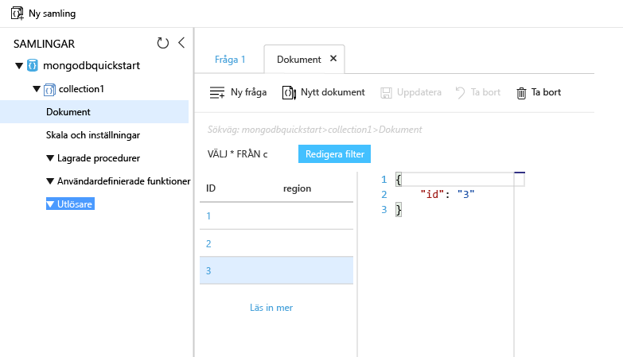

# <a name="azure-cosmos-db-migrate-an-existing-nodejs-mongodb-web-app"></a>Azure Cosmos DB: Migrera en befintlig Node.js MongoDB-webbapp 

Azure Cosmos DB är Microsofts globalt distribuerade databastjänst för flera datamodeller. Du kan snabbt skapa och fråga dokument och nyckel/värde-diagrammet databaser, som omfattas av hello global distributionsplatsen och skala horisontellt funktionerna i hello kärnan i Azure Cosmos DB. 

Den här snabbstarten visar hur en befintlig toouse [MongoDB](mongodb-introduction.md) app skriven i Node.js och anslut den tooyour Azure DB som Cosmos-databasen, som har stöd för MongoDB-klientanslutningar. Med andra ord, vet Node.js-programmet bara att den ansluter tooa databasen med MongoDB APIs. Den är öppet toohello program som hello data lagras i Azure Cosmos DB.

När du är klar har du ett MEAN-program (MongoDB, Express, AngularJS och Node.js) som kör på [Azure Cosmos DB](https://azure.microsoft.com/services/cosmos-db/). 


[!INCLUDE [cloud-shell-try-it](../../includes/cloud-shell-try-it.md)]

Om du väljer tooinstall och använda hello CLI lokalt kräver i det här avsnittet att du kör hello Azure CLI version 2.0 eller senare. Kör `az --version` toofind hello version. Om du behöver tooinstall eller uppgradering, se [installera Azure CLI 2.0]( /cli/azure/install-azure-cli). 

## <a name="prerequisites"></a>Krav 
Dessutom tooAzure CLI, behöver du [Node.js](https://nodejs.org/) och [Git](http://www.git-scm.com/downloads) installeras lokalt toorun `npm` och `git` kommandon.

Du bör ha kunskaper inom Node.js. Denna Snabbstart är inte avsedda toohelp du utvecklar Node.js-program i allmänhet.

## <a name="clone-hello-sample-application"></a>Klona hello exempelprogrammet

Öppna ett git terminalfönster, till exempel git bash och `cd` tooa arbetskatalogen.  

Kör hello följande kommandon tooclone hello exempel lagringsplatsen. Det här exemplet lagringsplatsen innehåller hello standard [MEAN.js](http://meanjs.org/) program. 

```bash
git clone https://github.com/prashanthmadi/mean
```

## <a name="run-hello-application"></a>Kör programmet hello

Installera hello krävs paket och starta programmet hello.

```bash
cd mean
npm install
npm start
```

## <a name="log-in-tooazure"></a>Logga in tooAzure

Om du använder en installerade Azure CLI, logga in tooyour Azure-prenumeration med hello [az inloggningen](/cli/azure/#login) kommando och följ hello på skärmen riktningar. Du kan hoppa över det här steget om du använder hello Azure Cloud-gränssnittet.

```azurecli
az login 
``` 
   
## <a name="add-hello-azure-cosmos-db-module"></a>Lägg till hello Azure DB som Cosmos-modul

Om du använder en installerade Azure CLI, kontrollera toosee om hello `cosmosdb` komponent har installerats genom att köra hello `az` kommando. Om `cosmosdb` är i Hej lista över grundläggande kommandon, fortsätta toohello nästa kommando. Du kan hoppa över det här steget om du använder hello Azure Cloud-gränssnittet.

Om `cosmosdb` är inte i hello lista över grundläggande kommandon, installera om [Azure CLI 2.0]( /cli/azure/install-azure-cli).

## <a name="create-a-resource-group"></a>Skapa en resursgrupp

Skapa en [resursgruppen](../azure-resource-manager/resource-group-overview.md) med hello [az gruppen skapa](/cli/azure/group#create). En Azure-resursgrupp är en logisk behållare som Azure-resurser (t.ex. webbappar, databaser och lagringskonton) distribueras och hanteras i. 

hello följande exempel skapas en resursgrupp i hello Västeuropa region. Välj ett unikt namn för hello resursgrupp.

Om du använder Azure Cloud Shell, klickar du på **prova**, följ hello anvisningarna toologin och sedan kopiera hello-kommando i Kommandotolken för hello.

```azurecli-interactive
az group create --name myResourceGroup --location "West Europe"
```

## <a name="create-an-azure-cosmos-db-account"></a>Skapa ett Azure Cosmos DB-konto

Skapa ett Azure DB som Cosmos-konto med hello [az cosmosdb skapa](/cli/azure/cosmosdb#create) kommando.

I hello du följande kommando, ersätta dina egna unika Azure DB som Cosmos-kontonamnet där du ser hello `<cosmosdb-name>` platshållare. Detta unika namn som ska användas som en del av din Azure DB som Cosmos-slutpunkt (`https://<cosmosdb-name>.documents.azure.com/`), så hello namn måste toobe unikt över alla Azure DB som Cosmos-konton i Azure. 

```azurecli-interactive
az cosmosdb create --name <cosmosdb-name> --resource-group myResourceGroup --kind MongoDB
```

Hej `--kind MongoDB` parametern aktiverar MongoDB-klientanslutningar.

När hello Azure Cosmos DB konto skapas visar hello Azure CLI information liknande toohello följande exempel. 

> [!NOTE]
> Det här exemplet använder JSON som hello Azure CLI utdataformat, vilket är hello som standard. toouse en annan utdata format, se [utdataformat för Azure CLI 2.0 kommandon](https://docs.microsoft.com/cli/azure/format-output-azure-cli).

```json
{
  "databaseAccountOfferType": "Standard",
  "documentEndpoint": "https://<cosmosdb-name>.documents.azure.com:443/",
  "id": "/subscriptions/00000000-0000-0000-0000-000000000000/resourceGroups/myResourceGroup/providers/Microsoft.Document
DB/databaseAccounts/<cosmosdb-name>",
  "kind": "MongoDB",
  "location": "West Europe",
  "name": "<cosmosdb-name>",
  "readLocations": [
    {
      "documentEndpoint": "https://<cosmosdb-name>-westeurope.documents.azure.com:443/",
      "failoverPriority": 0,
      "id": "<cosmosdb-name>-westeurope",
      "locationName": "West Europe",
      "provisioningState": "Succeeded"
    }
  ],
  "resourceGroup": "myResourceGroup",
  "type": "Microsoft.DocumentDB/databaseAccounts",
  "writeLocations": [
    {
      "documentEndpoint": "https://<cosmosdb-name>-westeurope.documents.azure.com:443/",
      "failoverPriority": 0,
      "id": "<cosmosdb-name>-westeurope",
      "locationName": "West Europe",
      "provisioningState": "Succeeded"
    }
  ]
} 
```

## <a name="connect-your-nodejs-application-toohello-database"></a>Ansluta toohello för Node.js programdatabasen

I det här steget kan ansluta du din MEAN.js programmet tooan Azure Cosmos DB exempeldatabasen du precis skapade, med hjälp av en anslutningssträng för MongoDB. 

<a name="devconfig"></a>
## <a name="configure-hello-connection-string-in-your-nodejs-application"></a>Konfigurera hello anslutningssträngen i Node.js-programmet

I din MEAN.js-lagringsplats, öppnar du `config/env/local-development.js`.

Ersätt hello innehållet i den här filen med hello följande kod. Glöm inte tooalso ersätta hello två `<cosmosdb-name>` platshållarna med namnet på ditt Azure Cosmos DB.

```javascript
'use strict';

module.exports = {
  db: {
    uri: 'mongodb://<cosmosdb-name>:<primary_master_key>@<cosmosdb-name>.documents.azure.com:10255/mean-dev?ssl=true&sslverifycertificate=false'
  }
};
```

## <a name="retrieve-hello-key"></a>Hämta hello nyckel

I ordning tooconnect tooan Azure DB som Cosmos-databasen behöver du hello databasnyckeln. Använd hello [az cosmosdb lista nycklar](/cli/azure/cosmosdb#list-keys) kommandot tooretrieve hello primärnyckel.

```azurecli-interactive
az cosmosdb list-keys --name <cosmosdb-name> --resource-group myResourceGroup --query "primaryMasterKey"
```

hello Azure CLI matar ut information liknande toohello följande exempel. 

```json
"RUayjYjixJDWG5xTqIiXjC..."
```

Kopiera hello värdet för `primaryMasterKey`. Klistra in det över hello `<primary_master_key>` i `local-development.js`.

Spara ändringarna.

### <a name="run-hello-application-again"></a>Kör hello programmet igen.

Kör `npm start` igen. 

```bash
npm start
```

Ett konsolmeddelande bör nu meddelar att hello utvecklingsmiljö är igång. 

Navigera för`http://localhost:3000` i en webbläsare. Klicka på **registrera dig** i hello översta menyn och försök toocreate två dummy användare. 

Hej MEAN.js exempelprogrammet lagrar användardata i hello-databasen. Om du lyckas och MEAN.js automatiskt loggar in på hello användare och Azure Cosmos DB anslutningen fungerar. 


## <a name="view-data-in-data-explorer"></a>Visa data i datautforskaren

Data som lagras av en Azure-Cosmos-databas är tillgängliga tooview frågan och kör affärslogik på hello Azure-portalen.

tooview, fråga och arbeta med hello användardata som skapats i hello föregående steg, inloggning toohello [Azure-portalen](https://portal.azure.com) i webbläsaren.

Ange Azure Cosmos DB i hello övre sökrutan. När ditt Cosmos DB-kontoblad öppnas, väljer du ditt Cosmos DB-konto. I vänster navigeringsfält hello, klickar du på Data Explorer. Utöka din samling hello samlingar i fönstret och sedan du kan visa hello dokument i hello samling, fråga hello data, och även skapa och köra lagrade procedurer, utlösare och UDF: er. 




## <a name="deploy-hello-nodejs-application-tooazure"></a>Distribuera hello Node.js-program tooAzure

I det här steget kan distribuera du din MongoDB-anslutna Node.js-programmet tooAzure Cosmos DB.

Kanske såg du att hello-konfigurationsfil som du tidigare har ändrat finns för hello utvecklingsmiljö (`/config/env/local-development.js`). När du distribuerar ditt program tooApp Service körs i produktionsmiljö hello som standard. Så nu behöver du toomake hello samma ändra toohello respektive konfigurationsfilen.

I din MEAN.js-lagringsplats, öppnar du `config/env/production.js`.

I hello `db` objekt, Ersätt hello värdet för `uri` som visas i följande exempel hello. Vara säker på att tooreplace hello platshållare som innan.

```javascript
'mongodb://<cosmosdb-name>:<primary_master_key>@<cosmosdb-name>.documents.azure.com:10255/mean?ssl=true&sslverifycertificate=false',
```

> [!NOTE] 
> Hej `ssl=true` alternativet är viktigt eftersom [Azure Cosmos DB kräver SSL](connect-mongodb-account.md#connection-string-requirements). 
>
>

I hello terminal, genomför du alla dina ändringar i Git. Du kan kopiera båda kommandon toorun dem tillsammans.

```bash
git add .
git commit -m "configured MongoDB connection string"
```
## <a name="clean-up-resources"></a>Rensa resurser

Om du inte kommer toocontinue toouse den här appen, tar du bort alla resurser som skapats av denna Snabbstart i hello Azure-portalen med hello följande steg:

1. Hello vänstra menyn i hello Azure-portalen klickar du på **resursgrupper** och klicka sedan på hello namnet på hello resurs du skapat. 
2. På din resurs gruppen klickar du på **ta bort**typnamn hello för hello resurs toodelete i hello textrutan och klicka sedan på **ta bort**.

## <a name="next-steps"></a>Nästa steg

I den här snabbstarten du har lärt dig hur toocreate en Cosmos-databas med Azure-konto och skapa en MongoDB-samling med hello Data Explorer. Nu kan du migrera din MongoDB data tooAzure Cosmos DB.  

> [!div class="nextstepaction"]
> [Importera MongoDB-data till Azure Cosmos DB](mongodb-migrate.md)
