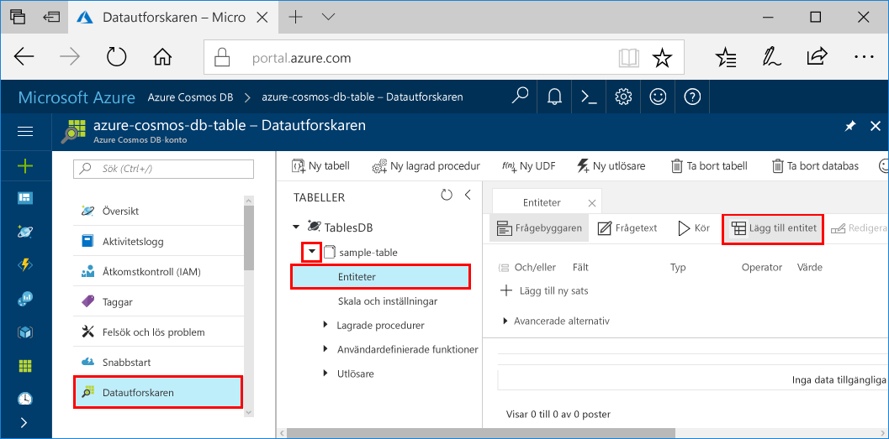

# <a name="azure-cosmos-db-build-a-net-application-using-hello-table-api"></a>Azure Cosmos DB: Skapa ett .NET-program med hjälp av hello tabell-API

Azure Cosmos DB är Microsofts globalt distribuerade databastjänst för flera datamodeller. Du kan snabbt skapa och fråga dokument och nyckel/värde-diagrammet databaser, som omfattas av hello global distributionsplatsen och skala horisontellt funktionerna i hello kärnan i Azure Cosmos DB. 

Denna Snabbstart visar hur toocreate en Cosmos-databas med Azure-konto och skapa en tabell i kontot med hello Azure-portalen. Du sedan skriva kod tooinsert, uppdatera och ta bort entiteter och köra några frågor med hello nya [Windows Azure-Lagringstabellen Premium](https://aka.ms/premiumtablenuget) (förhandsgranskning) paket från NuGet. Det här biblioteket har hello samma klasser och metoden signaturer som hello offentliga [Windows Azure Storage SDK: N](https://www.nuget.org/packages/WindowsAzure.Storage), men har även hello möjlighet tooconnect tooAzure Cosmos DB konton med hjälp av hello [tabell API](table-introduction.md) (förhandsversion). 

## <a name="prerequisites"></a>Krav

Om du inte redan har Visual Studio 2017 installerat, du kan hämta och använda hello **ledigt** [Visual Studio 2017 Community Edition](https://www.visualstudio.com/downloads/). Kontrollera att du aktiverar **Azure-utveckling** under installationen av hello Visual Studio.

[!INCLUDE [quickstarts-free-trial-note](../../includes/quickstarts-free-trial-note.md)]

## <a name="create-a-database-account"></a>Skapa ett databaskonto

[!INCLUDE [cosmos-db-create-dbaccount-table](../../includes/cosmos-db-create-dbaccount-table.md)]

## <a name="add-a-table"></a>Lägg till en tabell

[!INCLUDE [cosmos-db-create-table](../../includes/cosmos-db-create-table.md)]

## <a name="add-sample-data"></a>Lägg till exempeldata

Du kan nu lägga till data tooyour ny tabell med hjälp av Data Explorer (förhandsversion).

1. Öppna Datautforskaren, expandera **sample-table**, klicka på **Entiteter** och klicka sedan på **Lägg till entitet**.

   
2. Nu lägga data toohello PartitionKey värde och RowKey värdet och klicka på **lägga till entiteten**.

   
  
    Du kan nu lägga till fler enheter tooyour tabell, redigera entiteter eller fråga din data i Data Explorer. Data Explorer är också där du kan skala din genomflöde och lägga till lagrade procedurer, användardefinierade funktioner och utlösare tooyour tabell.

## <a name="clone-hello-sample-application"></a>Klona hello exempelprogrammet

Nu ska vi klona en tabell app från github, ange hello anslutningssträngen och kör den. Du ser hur enkelt som det är att toowork med data programmässigt. 

1. Öppna ett git terminalfönster, till exempel git bash och `cd` tooa arbetskatalogen.  

2. Hello kör följande kommando tooclone hello exempel lagringsplatsen. 

    ```bash
    git clone https://github.com/Azure-Samples/azure-cosmos-db-table-dotnet-getting-started.git
    ```

3. Öppna sedan hello lösningsfilen i Visual Studio. 

## <a name="review-hello-code"></a>Granska hello kod

Låt oss göra en snabb genomgång av vad som händer i hello app. Öppna hello Program.cs-filen och du hittar att dessa rader med kod skapar hello Azure Cosmos DB resurser. 

* Hej CloudTableClient har initierats.

    ```csharp
    CloudStorageAccount storageAccount = CloudStorageAccount.Parse(connectionString); 
    CloudTableClient tableClient = storageAccount.CreateCloudTableClient();
    ```

* En ny tabell skapas om det inte finns någon.

    ```csharp
    CloudTable table = tableClient.GetTableReference("people");
    table.CreateIfNotExists();
    ```

* En ny tabellbehållare skapas. Du ser den här koden mycket lik tooregular Azure Table storage SDK. 

    ```csharp
    CustomerEntity item = new CustomerEntity()
                {
                    PartitionKey = Guid.NewGuid().ToString(),
                    RowKey = Guid.NewGuid().ToString(),
                    Email = $"{GetRandomString(6)}@contoso.com",
                    PhoneNumber = "425-555-0102",
                    Bio = GetRandomString(1000)
                };
    ```

## <a name="update-your-connection-string"></a>Uppdatera din anslutningssträng

Nu ska vi uppdatera hello Anslutningssträngsinformation så att din app kan prata tooAzure Cosmos DB. 

1. Öppna hello app.config-filen i Visual Studio. 

2. I hello [Azure-portalen](http://portal.azure.com/), i hello Azure Cosmos DB kvar navigeringsmenyn, klicka på **anslutningssträngen**. Klicka på hello kopieringsknappen för hello anslutningssträngen i hello nya rutan. 

    

3. Klistra in hello värdet i hello app.config-fil som hello värde för hello PremiumStorageConnectionString. 

    `<add key="PremiumStorageConnectionString" 
        value="DefaultEndpointsProtocol=https;AccountName=MYSTORAGEACCOUNT;AccountKey=AUTHKEY;TableEndpoint=https://COSMOSDB.documents.azure.com" />`    

    Du kan lämna hello StandardStorageConnectionString är.

Du har nu uppdaterat din app med alla hello information som behövs för toocommunicate med Azure Cosmos DB. 

## <a name="run-hello-web-app"></a>Köra hello-webbprogram

1. I Visual Studio högerklickar du på hello **PremiumTableGetStarted** projektet i **Solution Explorer** och klicka sedan på **hantera NuGet-paket**. 

2. I hello NuGet **Bläddra** skriver *WindowsAzure.Storage PremiumTable*.

3. Kontrollera hello **inkludera förhandsversion** rutan. 

4. Hello resultat för att installera hello **WindowsAzure.Storage PremiumTable** bibliotek. Detta installerar hello Förhandsgranska Azure Cosmos DB tabell API paket samt alla beroenden. Observera att detta är ett annat NuGet-paket än hello Windows Azure Storage-paketet som används av Azure Table storage. 

5. Klicka på CTRL + F5 toorun hello program.

    hello konsolfönstret visar hello data läggs till, hämta, efterfrågas, ersättas och tas bort från hello tabell. Tryck på några viktiga tooclose hello konsolfönstret när hello skriptet har slutförts. 
    
    

6. Om du vill toosee hello nya enheter i bara kommentera ut rader 188 208 i program.cs så att de inte bort Data Explorer kör hello exempel igen. 

    Du kan nu gå tillbaka tooData Explorer, klicka på **uppdatera**, expandera hello **personer** tabell och klicka på **entiteter**, och sedan arbeta med dessa nya data. 

    

## <a name="review-slas-in-hello-azure-portal"></a>Granska SLA: er i hello Azure-portalen

[!INCLUDE [cosmosdb-tutorial-review-slas](../../includes/cosmos-db-tutorial-review-slas.md)]

## <a name="clean-up-resources"></a>Rensa resurser

Om du inte kommer toocontinue toouse den här appen, tar du bort alla resurser som skapats av denna Snabbstart i hello Azure-portalen med hello följande steg: 

1. Hello vänstra menyn i hello Azure-portalen klickar du på **resursgrupper** och klicka sedan på hello namnet på hello resurs du skapat. 
2. På din resurs gruppen klickar du på **ta bort**typnamn hello för hello resurs toodelete i hello textrutan och klicka sedan på **ta bort**.

## <a name="next-steps"></a>Nästa steg

Du har lärt dig hur toocreate ett Azure DB som Cosmos-konto, skapa en tabell med hello Data Explorer och kör en app i denna Snabbstart.  Nu kan du fråga data med hello tabell API.  

> [!div class="nextstepaction"]
> [Frågan med hello tabell-API](tutorial-query-table.md)

