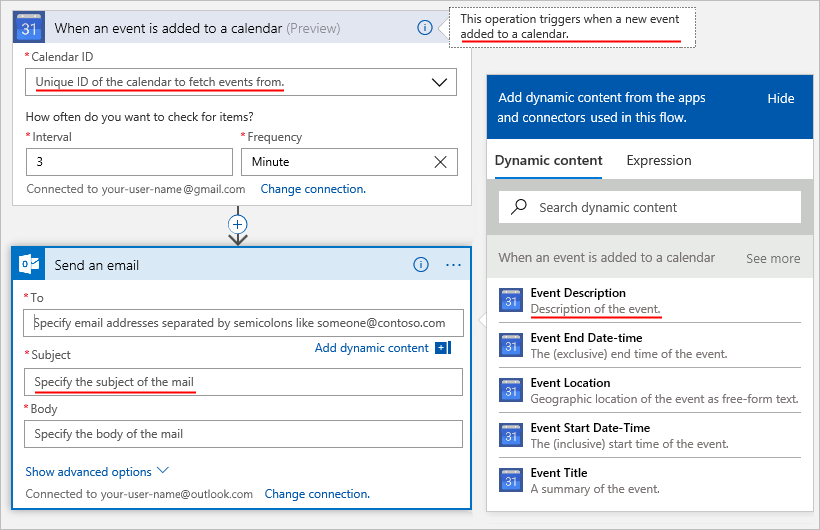
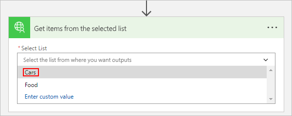
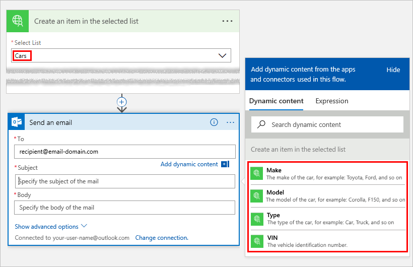

# <a name="extend-your-custom-connectors-openapi-with-advanced-functionality"></a>Utöka din anpassad koppling OpenAPI med avancerade funktioner

Om du vill skapa egna kopplingar för Logikappar i Azure, Microsoft Flow eller Microsoft PowerApps, måste du ange definitionsfilen OpenAPI som är ett språkoberoende maskinläsbar dokument som beskriver ditt API åtgärder och parametrar. Tillsammans med Openapi's out box-funktion kan inkludera du dessa OpenAPI tillägg när du skapar anpassade kopplingar för Logic Apps och flöde:

* [`summary`](#summary)
* [`x-ms-summary`](#x-ms-summary)
* [`description`](#description)
* [`x-ms-visibility`](#x-ms-visibility)
* [`x-ms-dynamic-values`](#x-ms-dynamic-values)
* [`x-ms-dynamic-schema`](#x-ms-dynamic-schema)

Här finns mer information om dessa tillägg:

<a name="summary"></a>

## <a name="summary"></a>Sammanfattning

Anger namnet för åtgärden (åtgärden). </br>
Gäller för: åtgärder </br>
Rekommenderat: Använda *inledande versal i mening* för `summary`. </br>
Exempel ”: när en händelse har lagts till i kalender” eller ”skicka ett e-postmeddelande”


``` json
"actions" {
  "Send_an_email": {
    /// Other action properties here...
    "summary": "Send an email",
    /// Other action properties here...
  }
},
```

<a name="x-ms-summary"></a>

## <a name="x-ms-summary"></a>x-ms-sammanfattning

Anger namnet för en entitet. </br>
Gäller för: parametrar, svarsschema </br>
Rekommenderat: Använda *title fallet* för `x-ms-summary`. </br>
Exempel: ”Kalender-ID”, ”ämne”, ”händelsebeskrivning” och så vidare


``` json
"actions" {
  "Send_an_email": {
    /// Other action properties here...
    "parameters": [ 
      {
        /// Other parameters here...
        "x-ms-summary": "Subject",
        /// Other parameters here...
      }
    ]
  }
},
```

<a name="description"></a>

## <a name="description"></a>description

Anger en utförlig förklaring av åtgärdens funktioner eller en entitet format och funktion. </br>
Gäller för: åtgärder, parametrar, svarsschema </br>
Rekommenderat: Använda *inledande versal i mening* för `description`. </br>
Exempel: ”den här åtgärden startar när en ny händelse har lagts till i kalendern”, ”ange ämnet för e-postmeddelandet” och så vidare



``` json
"actions" {
  "Send_an_email": {
     "description": "Specify the subject of the mail",
     /// Other action properties here...
  }
},
```

<a name="visibility"></a>

## <a name="x-ms-visibility"></a>x-ms-synlighet

Anger synligheten användarinriktad för en entitet. </br>
Möjliga värden: `important`, `advanced`, och`internal` </br>
Gäller för: åtgärder, parametrar, scheman

* `important`åtgärder och parametrar visas alltid för användaren först.
* `advanced`åtgärder och parametrar är dolda under en ytterligare meny.
* `internal`åtgärder och parametrar är dolda från användaren.

> [!NOTE] 
> Om parametrar som är `internal` och `required`, du **måste** ange standardvärden för dessa parametrar.

Exempel: Den **se mer** menyn och **visa avancerade alternativ** menyn döljer `advanced` åtgärder och parametrar.


``` json
"actions" {
  "Send_an_email": {
     /// Other action properties here...
     "parameters": [
         {
           "name": "Subject",
           "type": "string",
           "description": "Specify the subject of the mail",
           "x-ms-summary": "Subject",
           "x-ms-visibility": "important",
           /// Other parameter properties here...
         }
     ]
     /// Other action properties here...
  }
},
```

<a name="x-ms-dynamic-values"></a>

## <a name="x-ms-dynamic-values"></a>x-ms-dynamic-värden

Visar en lista för användaren så att de kan välja indataparametrar för en åtgärd. </br>
Gäller för: parametrar </br>
Hur du använder: lägga till den `x-ms-dynamic-values` objekt till parameterns definition. Till exempel visas [OpenAPI exempel](https://procsi.blob.core.windows.net/blog-images/sampleDynamicSwagger.json).



### <a name="properties-for-x-ms-dynamic-values"></a>Egenskaper för x-ms-dynamic-värden

| Namn | Obligatorisk eller valfri | Beskrivning | 
| ---- | -------------------- | ----------- | 
| **Åtgärds-ID** | Krävs | Åtgärden att anropa för att fylla listan | 
| **värdet sökväg** | Krävs | En sökvägssträng i objektet inuti `value-collection` som refererar till parametervärdet. </br>Om `value-collection` har inte angetts, svaret utvärderas som en matris. | 
| **Rubrik** | Valfri | En sökvägssträng i objektet inuti `value-collection` som refererar till den värde beskrivning. </br>Om `value-collection` har inte angetts, svaret utvärderas som en matris. | 
| **värdet samling** | Valfri | Sökvägssträngen som resulterar i en matris med objekt i nyttolasten svar | 
| **parametrar** | Valfri | Ett objekt vars egenskaper ange indataparametrar som krävs för att anropa en dynamisk värden igen | 
|||| 

Här är ett exempel som visar egenskaper i `x-ms-dynamic-values`:

``` json
"x-ms-dynamic-values": {
  "operationId": "PopulateDropdown",
  "value-path": "name",
  "value-title": "properties/displayName",
  "value-collection": "value",
  "parameters": {
     "staticParameter": "<value>",
     "dynamicParameter": {
        "parameter": "<value-to-pass-to-dynamicParameter>"
     }
  }
}
```

## <a name="example-all-the-openapi-extensions-up-to-this-point"></a>Exempel: Alla OpenAPI tilläggen i det här läget

``` json
"/api/lists/{listID-dynamic}": {
    "get": {
        "description": "Get items from a single list - uses dynamic values and outputs dynamic schema",
        "summary": "Gets items from the selected list",
        "operationID": "GetListItems",
        "parameters": [
           {
             "name": "listID-dynamic",
             "type": "string",
             "in": "path",
             "description": "Select the list from where you want outputs",
             "required": true,
             "x-ms-summary": "Select List",
             "x-ms-dynamic-values": {
                "operationID": "GetLists",
                "value-path": "id",
                "value-title": "name"
             }
           }
        ]
    }
}
```

<a name="x-ms-dynamic schema"></a>

## <a name="x-ms-dynamic-schema"></a>x-ms-dynamic-schema

Anger att schemat för den aktuella parametern eller svar är dynamisk. Det här objektet kan anropa en åtgärd som definieras av värdet för det här fältet kan dynamiskt identifiera schemat, och visar rätt Användargränssnittet för att samla in indata från användare eller visa tillgängliga fält. 

Gäller för: parametrar, svar

Hur du använder: lägga till den `x-ms-dynamic-schema` objekt till en begäran om parametern eller svar brödtext definition. Ett exempel finns [OpenAPI exempel](https://procsi.blob.core.windows.net/blog-images/sampleDynamicSwagger.json).

Det här exemplet illustrerar hur formuläret inkommande ändras baserat på det objekt som användaren väljer den nedrullningsbara listan:


Och det här exemplet illustrerar hur utdata ändras baserat på det objekt som användaren väljer den nedrullningsbara listan. Användaren väljer ”bilar” i den här versionen:



Användaren väljer ”mat” i den här versionen:


### <a name="properties-for-x-ms-dynamic-schema"></a>Egenskaper för x-ms-dynamic-schema

| Namn | Obligatorisk eller valfri | Beskrivning | 
| ---- | -------------------- | ----------- | 
| **Åtgärds-ID** | Krävs | Åtgärden att anropa för hämtning av schemat | 
| **parametrar** | Krävs | Ett objekt vars egenskaper ange indataparametrar som krävs för att anropa en dynamisk-schema-åtgärd | 
| **värdet sökväg** |Valfri | En sträng för sökväg som refererar till egenskapen med schemat. </br>Om inget annat anges, antas svaret innehåller schemat i rot-objektets egenskaper. | 
|||| 

Här är ett exempel på en dynamisk parameter:

``` json
{
  "name": "dynamicListSchema",
  "in": "body",
  "description": "Dynamic schema for items in the selected list",
  "schema": {
    "type": "object",
    "x-ms-dynamic-schema": {
        "operationID": "GetListSchema",
        "parameters": {
          "listID": {
            "parameter": "listID-dynamic"
          }
        },
        "value-path": "items"
    }
  }
}
```

Här är ett exempel för dynamiska svar:

``` json
"DynamicResponseGetListSchema": {
   "type": "object",
   "x-ms-dynamic-schema": {
      "operationID": "GetListSchema",
      "parameters": {
         "listID": {
            "parameter": "listID-dynamic"
         }
      },
      "value-path": "items"
    }
}
```

## <a name="next-steps"></a>Nästa steg

* [Beskriv din anpassade API: er och kopplingar](../logic-apps/custom-connector-api-postman-collection.md)
* [Logic Apps: Registrera ditt connector](../logic-apps/logic-apps-custom-connector-register.md)
* [Flöde: Registrera ditt connector](https://ms.flow.microsoft.com/documentation/register-custom-api/#register-your-custom-connector)