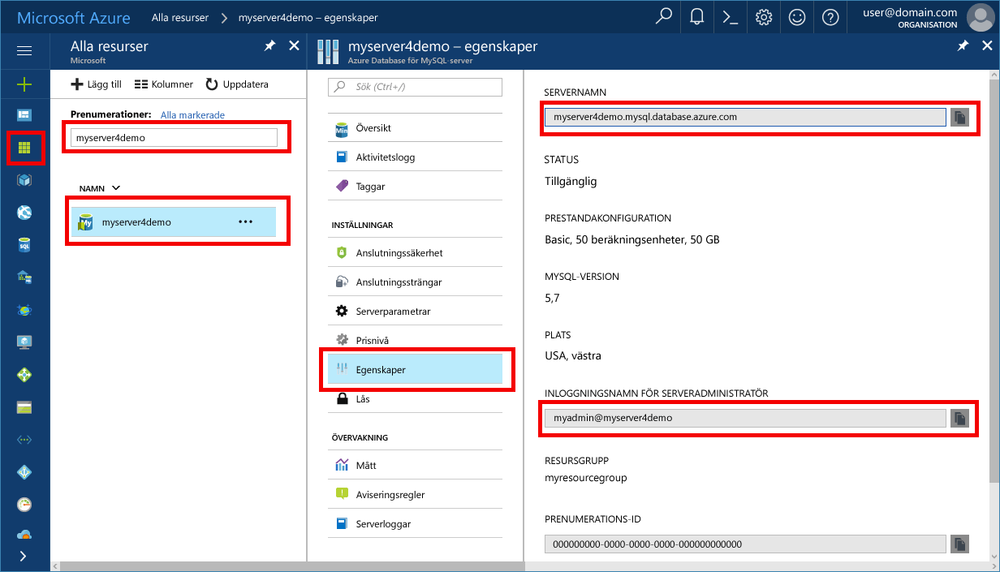

# <a name="azure-database-for-mysql-use-connectorc-tooconnect-and-query-data"></a>Azure-databas för MySQL: Använd Connector/C++ tooconnect och fråga data
Den här snabbstarten visar hur tooconnect tooan Azure-databas för MySQL med C++-program. Den visar hur toouse SQL-instruktioner tooquery infoga, uppdatera och ta bort data i hello-databas. hello förutsätter stegen i den här artikeln att du är bekant med att utveckla med C++ och att du är ny tooworking med Azure-databas för MySQL.

## <a name="prerequisites"></a>Krav
Denna Snabbstart använder hello resurser som skapades i någon av dessa guider som utgångspunkt:
- [Skapa en Azure Database för MySQL med Azure Portal](./quickstart-create-mysql-server-database-using-azure-portal.md)
- [Skapa en Azure Database för MySQL-server med Azure CLI](./quickstart-create-mysql-server-database-using-azure-cli.md)

Du måste också:
- Installera [.NET Framework](https://www.microsoft.com/net/download)
- Installera [Visual Studio](https://www.visualstudio.com/downloads/)
- Installera [MySQL Connector/C++](https://dev.mysql.com/downloads/connector/cpp/) 
- Installera [Boost](http://www.boost.org/)

## <a name="install-visual-studio-and-net"></a>Installera Visual Studio och .NET
hello stegen i det här avsnittet förutsätter att du är bekant med att utveckla med hjälp av .NET.

### <a name="windows"></a>**Windows**
1. Installera Visual Studio 2017 Community, en komplett, utbyggbar och kostnadsfri IDE som du kan använda för att skapa moderna program för Android, iOS, Windows, samt webb- och databasprogram och molntjänster. Du kan installera antingen hello fullständig .NET Framework eller bara .NET Core. Hej kodfragment i hello Quickstart arbeta med antingen. Hoppa över hello nästa två steg om du redan har Visual Studio installerat på datorn.
   - Hämta hello [Visual Studio 2017 installer](https://www.visualstudio.com/thank-you-downloading-visual-studio/?sku=Community&rel=15). 
   - Kör installationsprogrammet för hello och följ hello installationen prompter toocomplete hello installationen.

### <a name="configure-visual-studio"></a>**Konfigurera Visual Studio**
1. Projektet egenskapen från Visual Studio > konfigurationsegenskaper > C/C++ > linker > Allmänt > ytterligare bibliotek kataloger, lägga till hello lib\opt katalog (dvs: C:\Program Files (x86) \MySQL\MySQL Connector C++ 1.1.9\lib\opt) av hello c ++ koppling.
2. Från Visual Studio, projektegenskap > konfigurationsegenskaper > C/C++ > allmänt > ytterligare inkluderingskataloger
   - Lägg till katalog include/ för c++ connector (t.ex.: C:\Program Files (x86)\MySQL\MySQL Connector C++ 1.1.9\include\)
   - Lägg till Boost-biblioteksrotkatalog (t.ex.: C:\boost_1_64_0\)
3. Projektet egenskapen från Visual Studio > konfigurationsegenskaper > C/C++ > linker > indata > ytterligare beroenden, Lägg till mysqlcppconn.lib hello textfält
4. Antingen kopiera mysqlcppconn.dll från hello c ++ connector biblioteksmapp i steg 3 toohello samma katalog som hello körbar Programdel eller lägga till den toohello miljövariabeln så att programmet kan hitta den.

## <a name="get-connection-information"></a>Hämta anslutningsinformation
Hämta hello anslutning information som behövs för tooconnect toohello Azure-databas för MySQL. Du måste hello server fullständigt kvalificerade namnet och autentiseringsuppgifterna för inloggning.

1. Logga in toohello [Azure-portalen](https://portal.azure.com/).
2. Hello vänstra menyn i Azure-portalen klickar du på **alla resurser** och Sök efter hello-server som du har skapat, exempelvis **myserver4demo**.
3. Klicka på hello servernamn.
4. Välj hello server **egenskaper** sidan. Anteckna hello **servernamn** och **serverinloggningsnamnet för admin**.
 
5. Om du glömmer bort inloggningsinformationen server navigera toohello **översikt** sidan tooview hello admin serverinloggningsnamnet och, om nödvändigt återställa hello lösenord.

## <a name="connect-create-table-and-insert-data"></a>Ansluta, skapa tabell och infoga data
Använd hello följande kod tooconnect och läsa in hello data med hjälp av **CREATE TABLE** och **INSERT INTO** SQL-instruktioner. hello koden använder sql::Driver klass med hello connect() metoden tooestablish tooMySQL en anslutning. Hello koden använder sedan metoden createStatement() och execute() toorun hello databasen kommandon. 

Ersätt hello värden, DBName, användare och lösenord parametrar med hello värden som du angav när du skapade hello-server och databas. 

```c++
#include <stdlib.h>
#include <iostream>
#include "stdafx.h"

#include "mysql_connection.h"
#include <cppconn/driver.h>
#include <cppconn/exception.h>
#include <cppconn/prepared_statement.h>
using namespace std;

int main()
{
    sql::Driver *driver;
    sql::Connection *con;
    sql::Statement *stmt;
    sql::PreparedStatement *pstmt;

    try
    {
        driver = get_driver_instance();
        //for demonstration only. never save password in hello code!
        con = driver>connect("tcp://myserver4demo.mysql.database.azure.com:3306/quickstartdb", "myadmin@myserver4demo", "server_admin_password");
    }
    catch (sql::SQLException e)
    {
        cout << "Could not connect toodatabase. Error message: " << e.what() << endl;
        system("pause");
        exit(1);
    }

    stmt = con>createStatement();
    stmt>execute("DROP TABLE IF EXISTS inventory");
    cout << "Finished dropping table (if existed)" << endl;
    stmt>execute("CREATE TABLE inventory (id serial PRIMARY KEY, name VARCHAR(50), quantity INTEGER);");
    cout << "Finished creating table" << endl;
    delete stmt;

    pstmt = con>prepareStatement("INSERT INTO inventory(name, quantity) VALUES(?,?)");
    pstmt>setString(1, "banana");
    pstmt>setInt(2, 150);
    pstmt>execute();
    cout << "One row inserted." << endl;

    pstmt>setString(1, "orange");
    pstmt>setInt(2, 154);
    pstmt>execute();
    cout << "One row inserted." << endl;

    pstmt>setString(1, "apple");
    pstmt>setInt(2, 100);
    pstmt>execute();
    cout << "One row inserted." << endl;
    
    delete pstmt;   
    delete con;
    system("pause");
    return 0;

```

## <a name="read-data"></a>Läsa data

Använd hello följande kod tooconnect och läsa hello data med hjälp av en **Välj** SQL-instruktionen. hello koden använder sql::Driver klass med hello connect() metoden tooestablish tooMySQL en anslutning. Sedan hello koden använder metoden prepareStatement() och executeQuery() toorun hello Välj kommandon. Slutligen använder hello kod efter tooadvance toohello poster i hello resultat. Hello koden använder sedan getInt() och getString() tooparse hello värden i hello-post.

Ersätt hello värden, DBName, användare och lösenord parametrar med hello värden som du angav när du skapade hello-server och databas. 

```csharp
#include <stdlib.h>
#include <iostream>
#include "stdafx.h"

#include "mysql_connection.h"
#include <cppconn/driver.h>
#include <cppconn/exception.h>
#include <cppconn/resultset.h>
#include <cppconn/prepared_statement.h>
using namespace std;

int main()
{
    sql::Driver *driver;
    sql::Connection *con;
    sql::PreparedStatement *pstmt;
    sql::ResultSet *result;

    try
    {
        driver = get_driver_instance();
        //for demonstration only. never save password in hello code!
        con = driver>connect("tcp://myserver4demo.mysql.database.azure.com:3306/quickstartdb", "myadmin@myserver4demo", "server_admin_password");
    }
    catch (sql::SQLException e)
    {
        cout << "Could not connect toodatabase. Error message: " << e.what() << endl;
        system("pause");
        exit(1);
    }   

//  select  
    pstmt = con>prepareStatement("SELECT * FROM inventory;");
    result = pstmt>executeQuery();  
    
    while (result>next())
        printf("Reading from table=(%d, %s, %d)\n", result>getInt(1), result>getString(2).c_str(), result>getInt(3));   
    
    delete result;
    delete pstmt;   
    delete con;
    system("pause");
    return 0;
}
```

## <a name="update-data"></a>Uppdatera data
Använd hello följande kod tooconnect och läsa hello data med hjälp av en **uppdatering** SQL-instruktionen. hello koden använder sql::Driver klass med hello connect() metoden tooestablish tooMySQL en anslutning. Hello koden använder sedan metoden prepareStatement() och executeQuery() toorun hello update-kommandon. 

Ersätt hello värden, DBName, användare och lösenord parametrar med hello värden som du angav när du skapade hello-server och databas. 

```csharp
#include <stdlib.h>
#include <iostream>
#include "stdafx.h"

#include "mysql_connection.h"
#include <cppconn/driver.h>
#include <cppconn/exception.h>
#include <cppconn/prepared_statement.h>
using namespace std;

int main()
{
    sql::Driver *driver;
    sql::Connection *con;
    sql::PreparedStatement *pstmt;

    try
    {
        driver = get_driver_instance();
        //for demonstration only. never save password in hello code!
        con = driver>connect("tcp://myserver4demo.mysql.database.azure.com:3306/quickstartdb", "myadmin@myserver4demo", "server_admin_password");
    }
    catch (sql::SQLException e)
    {
        cout << "Could not connect toodatabase. Error message: " << e.what() << endl;
        system("pause");
        exit(1);
    }   

    //update
    pstmt = con>prepareStatement("UPDATE inventory SET quantity = ? WHERE name = ?");
    pstmt>setInt(1, 200);
    pstmt>setString(2, "banana");
    pstmt>executeQuery();
    printf("Row updated\n");
    
    delete con;
    delete pstmt;
    system("pause");
    return 0;
}
```


## <a name="delete-data"></a>Ta bort data
Använd hello följande kod tooconnect och läsa hello data med hjälp av en **ta bort** SQL-instruktionen. hello koden använder sql::Driver klass med hello connect() metoden tooestablish tooMySQL en anslutning. Hello koden använder sedan metoden prepareStatement() och executeQuery() toorun hello ta bort kommandon.

Ersätt hello värden, DBName, användare och lösenord parametrar med hello värden som du angav när du skapade hello-server och databas. 

```csharp
#include <stdlib.h>
#include <iostream>
#include "stdafx.h"

#include "mysql_connection.h"
#include <cppconn/driver.h>
#include <cppconn/exception.h>
#include <cppconn/resultset.h>
#include <cppconn/prepared_statement.h>
using namespace std;

int main()
{
    sql::Driver *driver;
    sql::Connection *con;
    sql::PreparedStatement *pstmt;
    sql::ResultSet *result;

    try
    {
        driver = get_driver_instance();
        //for demonstration only. never save password in hello code!
        con = driver>connect("tcp://myserver4demo.mysql.database.azure.com:3306/quickstartdb", "myadmin@myserver4demo", "server_admin_password");
    }
    catch (sql::SQLException e)
    {
        cout << "Could not connect toodatabase. Error message: " << e.what() << endl;
        system("pause");
        exit(1);
    }
        
    //delete
    pstmt = con>prepareStatement("DELETE FROM inventory WHERE name = ?");
    pstmt>setString(1, "orange");
    result = pstmt>executeQuery();
    printf("Row deleted\n");    
    
    delete pstmt;
    delete con;
    delete result;
    system("pause");
    return 0;
}
```

## <a name="next-steps"></a>Nästa steg
> [!div class="nextstepaction"]
> [Migrera din MySQL-databas tooAzure databas för MySQL med dump och återställning](concepts-migrate-dump-restore.md)
