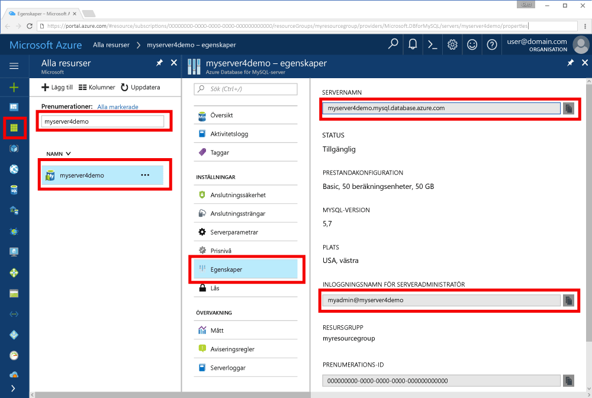

# <a name="azure-database-for-mysql-use-go-language-tooconnect-and-query-data"></a>Azure-databas för MySQL: använda gå språk tooconnect och fråga data
Den här snabbstarten visar hur tooconnect tooan Azure Database för att använda MySQL code skriven i hello [Gå](https://golang.org/) språk från Windows-, Ubuntu Linux- och Apple macOS-plattformar. Den visar hur toouse SQL-instruktioner tooquery infoga, uppdatera och ta bort data i hello-databas. Den här artikeln förutsätter att du är bekant med utveckling med hjälp av gå, men som du är ny tooworking med Azure-databas för MySQL.

## <a name="prerequisites"></a>Krav
Denna Snabbstart använder hello resurser som skapades i någon av dessa guider som utgångspunkt:
- [Skapa en Azure Database för MySQL med Azure Portal](./quickstart-create-mysql-server-database-using-azure-portal.md)
- [Skapa en Azure Database för MySQL-server med Azure CLI](./quickstart-create-mysql-server-database-using-azure-cli.md)

## <a name="install-go-and-mysql-connector"></a>Installera en anslutningsapp för Go och MySQL
Installera [Gå](https://golang.org/doc/install) och hello [gå-sql-drivrutin för MySQL](https://github.com/go-sql-driver/mysql#installation) på din egen dator. Beroende på din plattform gör hello:

### <a name="windows"></a>Windows
1. [Hämta](https://golang.org/dl/) och installera gå för Microsoft Windows enligt toohello [Installationsinstruktioner](https://golang.org/doc/install).
2. Starta hello kommandotolk från hello start-menyn.
3. Skapa en mapp för ditt projekt, till exempel. `mkdir  %USERPROFILE%\go\src\mysqlgo`.
4. Ändra katalogen till hello projektmappen som `cd %USERPROFILE%\go\src\mysqlgo`.
5. Ange hello miljövariabeln efter koden för GOPATH toopoint toohello källkatalogen. `set GOPATH=%USERPROFILE%\go`.
6. Installera hello [gå-sql-drivrutin för mysql](https://github.com/go-sql-driver/mysql#installation) genom att köra hello `go get github.com/go-sql-driver/mysql` kommando.

   Installera gå i sammanfattningen, och sedan köra dessa kommandon i Kommandotolken för hello:
   ```cmd
   mkdir  %USERPROFILE%\go\src\mysqlgo
   cd %USERPROFILE%\go\src\mysqlgo
   set GOPATH=%USERPROFILE%\go
   go get github.com/go-sql-driver/mysql
   ```

### <a name="linux-ubuntu"></a>Linux (Ubuntu)
1. Starta hello Bash-gränssnitt. 
2. Installera Go genom att köra `sudo apt-get install golang-go`.
3. Skapa en mapp för ditt projekt i arbetskatalogen, t.ex `mkdir -p ~/go/src/mysqlgo/`.
4. Ändra katalogen till hello mapp som `cd ~/go/src/mysqlgo/`.
5. Ange hello GOPATH miljö variabeln toopoint tooa giltig källa katalog, t.ex ditt aktuella hem katalogens gå mapp. Kör vid hello bash shell `export GOPATH=~/go` tooadd hello går directory som hello GOPATH för hello shell-sessionen.
6. Installera hello [gå-sql-drivrutin för mysql](https://github.com/go-sql-driver/mysql#installation) genom att köra hello `go get github.com/go-sql-driver/mysql` kommando.

   Sammanfattningsvis ska du köra dessa bash-kommandon:
   ```bash
   sudo apt-get install golang-go
   mkdir -p ~/go/src/mysqlgo/
   cd ~/go/src/mysqlgo/
   export GOPATH=~/go/
   go get github.com/go-sql-driver/mysql
   ```

### <a name="apple-macos"></a>Apple macOS
1. Hämta och installera gå enligt toohello [Installationsinstruktioner](https://golang.org/doc/install) matchar din plattform. 
2. Starta hello Bash-gränssnitt. 
3. Skapa en mapp för ditt projekt i arbetskatalogen, t.ex `mkdir -p ~/go/src/mysqlgo/`.
4. Ändra katalogen till hello mapp som `cd ~/go/src/mysqlgo/`.
5. Ange hello GOPATH miljö variabeln toopoint tooa giltig källa katalog, t.ex ditt aktuella hem katalogens gå mapp. Kör vid hello bash shell `export GOPATH=~/go` tooadd hello går directory som hello GOPATH för hello shell-sessionen.
6. Installera hello [gå-sql-drivrutin för mysql](https://github.com/go-sql-driver/mysql#installation) genom att köra hello `go get github.com/go-sql-driver/mysql` kommando.

   Sammanfattningsvis ska du installera Go och sedan köra dessa bash-kommandon:
   ```bash
   mkdir -p ~/go/src/mysqlgo/
   cd ~/go/src/mysqlgo/
   export GOPATH=~/go/
   go get github.com/go-sql-driver/mysql
   ```

## <a name="get-connection-information"></a>Hämta anslutningsinformation
Hämta hello anslutning information som behövs för tooconnect toohello Azure-databas för MySQL. Du måste hello server fullständigt kvalificerade namnet och autentiseringsuppgifterna för inloggning.

1. Logga in toohello [Azure-portalen](https://portal.azure.com/).
2. Hello vänstra menyn i Azure-portalen klickar du på **alla resurser** och Sök efter hello-server som du har creased, som **myserver4demo**.
3. Klicka på servernamnet för hello **myserver4demo**.
4. Välj hello server **egenskaper** sidan. Anteckna hello **servernamn** och **serverinloggningsnamnet för admin**.
 
5. Om du glömmer bort inloggningsinformationen server navigera toohello **översikt** sidan tooview hello admin serverinloggningsnamnet och, om nödvändigt återställa hello lösenord.
   

## <a name="build-and-run-go-code"></a>Skapa och köra Go-kod 
1. toowrite Golang kod som du kan använda en enkel textredigerare, till exempel Anteckningar i Microsoft Windows [vi](http://manpages.ubuntu.com/manpages/xenial/man1/nvi.1.html#contenttoc5) eller [Nano](https://www.nano-editor.org/) i Ubuntu eller TextEdit i macOS. Om du föredrar en mer omfattande IDE (Interactive Development Environment) kan du prova [Gogland](https://www.jetbrains.com/go/) från Jetbrains, [Visual Studio Code](https://code.visualstudio.com/) från Microsoft eller [Atom](https://atom.io/).
2. Klistra in hello gå kod från hello avsnitt nedan i textfiler och spara i projektmappen med filnamnstillägget \*.go, till exempel Windows sökväg `%USERPROFILE%\go\src\mysqlgo\createtable.go` eller Linux-sökvägen `~/go/src/mysqlgo/createtable.go`.
3. Leta upp hello `HOST`, `DATABASE`, `USER`, och `PASSWORD` konstanter i hello kod och Ersätt hello exempelvärden med egna värden. 
4. Starta Kommandotolken hello eller bash shell. Ändra katalog till din projektmapp. I Windows kan du till exempel använda `cd %USERPROFILE%\go\src\mysqlgo\`. I Linux kan du använda `cd ~/go/src/mysqlgo/`.  Vissa av hello IDE redigeringsprogram nämns erbjuder funktioner för felsökning och körning utan shell-kommandon.
5. Köra hello kod genom att ange hello kommando `go run createtable.go` toocompile hello programmet och kör den. 
6. Alternativt toobuild hello kod i en programspecifika `go build createtable.go`, starta `createtable.exe` toorun hello program.

## <a name="connect-create-table-and-insert-data"></a>Ansluta, skapa tabell och infoga data
Använd hello följande code tooconnect toohello server, skapa en tabell och läsa in hello data med hjälp av en **infoga** SQL-instruktionen. 

hello kod importerar tre paket: hello [sql paketet](https://golang.org/pkg/database/sql/), hello [gå sql-drivrutin för mysql](https://github.com/go-sql-driver/mysql#installation) som en drivrutin toocommunicate med hello Azure-databas för MySQL och hello [fmt paketet](https://golang.org/pkg/fmt/)för utskrivna indata och utdata på hello-kommandoraden.

hello koden anropar metoden [sql. Open()](http://go-database-sql.org/accessing.html) tooconnect tooAzure databas för MySQL och kontrollerar hello anslutning med hjälp av metoden [db. Ping()](https://golang.org/pkg/database/sql/#DB.Ping). En [referensen](https://golang.org/pkg/database/sql/#DB) används i hela, hålla hello anslutningspoolen för hello databasserver. hello koden anropar hello [Exec()](https://golang.org/pkg/database/sql/#DB.Exec) metoden flera gånger toorun flera DDL-kommandon. hello koden används även hello [Prepare()](http://go-database-sql.org/prepared.html) och Exec() toorun förberedda instruktioner med olika parametrar tooinsert tre rader. Varje gång en anpassad checkError() metod är används toocheck om ett fel uppstod och oroa dig tooexit.

Ersätt hello `host`, `database`, `user`, och `password` konstanter med egna värden. 

```Go
package main

import (
    "database/sql"
    "fmt"

    _ "github.com/go-sql-driver/mysql"
)

const (
    host     = "myserver4demo.mysql.database.azure.com"
    database = "quickstartdb"
    user     = "myadmin@myserver4demo"
    password = "yourpassword"
)

func checkError(err error) {
    if err != nil {
        panic(err)
    }
}

func main() {

    // Initialize connection string.
    var connectionString = fmt.Sprintf("%s:%s@tcp(%s:3306)/%s?allowNativePasswords=true", user, password, host, database)

    // Initialize connection object.
    db, err := sql.Open("mysql", connectionString)
    checkError(err)
    defer db.Close()

    err = db.Ping()
    checkError(err)
    fmt.Println("Successfully created connection toodatabase.")

    // Drop previous table of same name if one exists.
    _, err = db.Exec("DROP TABLE IF EXISTS inventory;")
    checkError(err)
    fmt.Println("Finished dropping table (if existed).")

    // Create table.
    _, err = db.Exec("CREATE TABLE inventory (id serial PRIMARY KEY, name VARCHAR(50), quantity INTEGER);")
    checkError(err)
    fmt.Println("Finished creating table.")

    // Insert some data into table.
    sqlStatement, err := db.Prepare("INSERT INTO inventory (name, quantity) VALUES (?, ?);")
    res, err := sqlStatement.Exec("banana", 150)
    checkError(err)
    rowCount, err := res.RowsAffected()
    fmt.Printf("Inserted %d row(s) of data.\n", rowCount)

    res, err = sqlStatement.Exec("orange", 154)
    checkError(err)
    rowCount, err = res.RowsAffected()
    fmt.Printf("Inserted %d row(s) of data.\n", rowCount)

    res, err = sqlStatement.Exec("apple", 100)
    checkError(err)
    rowCount, err = res.RowsAffected()
    fmt.Printf("Inserted %d row(s) of data.\n", rowCount)
    fmt.Println("Done.")
}

```

## <a name="read-data"></a>Läsa data
Använd hello följande kod tooconnect och läsa hello data med hjälp av en **Välj** SQL-instruktionen. 

hello kod importerar tre paket: hello [sql paketet](https://golang.org/pkg/database/sql/), hello [gå sql-drivrutin för mysql](https://github.com/go-sql-driver/mysql#installation) som en drivrutin toocommunicate med hello Azure-databas för MySQL och hello [fmt paketet](https://golang.org/pkg/fmt/)för utskrivna indata och utdata på hello-kommandoraden.

hello koden anropar metoden [sql. Open()](http://go-database-sql.org/accessing.html) tooconnect tooAzure databas för MySQL och kontrollerar hello anslutning med hjälp av metoden [db. Ping()](https://golang.org/pkg/database/sql/#DB.Ping). En [referensen](https://golang.org/pkg/database/sql/#DB) används i hela, hålla hello anslutningspoolen för hello databasserver. hello koden anropar hello [Query()](https://golang.org/pkg/database/sql/#DB.Query) metoden toorun hello select-kommandot. Sedan körs [efter](https://golang.org/pkg/database/sql/#Rows.Next) tooiterate genom hello resultatuppsättning och [Scan()](https://golang.org/pkg/database/sql/#Rows.Scan) tooparse hello kolumnvärdena, spara hello-värdet till variabler. Varje gång en anpassad checkError() metod är används toocheck om ett fel uppstod och oroa dig tooexit.

Ersätt hello `host`, `database`, `user`, och `password` konstanter med egna värden. 

```Go
package main

import (
    "database/sql"
    "fmt"

    _ "github.com/go-sql-driver/mysql"
)

const (
    host     = "myserver4demo.mysql.database.azure.com"
    database = "quickstartdb"
    user     = "myadmin@myserver4demo"
    password = "yourpassword"
)

func checkError(err error) {
    if err != nil {
        panic(err)
    }
}

func main() {

    // Initialize connection string.
    var connectionString = fmt.Sprintf("%s:%s@tcp(%s:3306)/%s?allowNativePasswords=true", user, password, host, database)

    // Initialize connection object.
    db, err := sql.Open("mysql", connectionString)
    checkError(err)
    defer db.Close()

    err = db.Ping()
    checkError(err)
    fmt.Println("Successfully created connection toodatabase.")

    // Variables for printing column data when scanned.
    var (
        id       int
        name     string
        quantity int
    )

    // Read some data from hello table.
    rows, err := db.Query("SELECT id, name, quantity from inventory;")
    checkError(err)
    defer rows.Close()
    fmt.Println("Reading data:")
    for rows.Next() {
        err := rows.Scan(&id, &name, &quantity)
        checkError(err)
        fmt.Printf("Data row = (%d, %s, %d)\n", id, name, quantity)
    }
    err = rows.Err()
    checkError(err)
    fmt.Println("Done.")
}
```

## <a name="update-data"></a>Uppdatera data
Använd hello följande kod tooconnect och uppdatera hello data med hjälp av en **uppdatera** SQL-instruktionen. 

hello kod importerar tre paket: hello [sql paketet](https://golang.org/pkg/database/sql/), hello [gå sql-drivrutin för mysql](https://github.com/go-sql-driver/mysql#installation) som en drivrutin toocommunicate med hello Azure-databas för MySQL och hello [fmt paketet](https://golang.org/pkg/fmt/)för utskrivna indata och utdata på hello-kommandoraden.

hello koden anropar metoden [sql. Open()](http://go-database-sql.org/accessing.html) tooconnect tooAzure databas för MySQL och kontrollerar hello anslutning med hjälp av metoden [db. Ping()](https://golang.org/pkg/database/sql/#DB.Ping). En [referensen](https://golang.org/pkg/database/sql/#DB) används i hela, hålla hello anslutningspoolen för hello databasserver. hello koden anropar hello [Exec()](https://golang.org/pkg/database/sql/#DB.Exec) metoden toorun hello update-kommandot. Varje gång en anpassad checkError() metod är används toocheck om ett fel uppstod och oroa dig tooexit.

Ersätt hello `host`, `database`, `user`, och `password` konstanter med egna värden. 

```Go
package main

import (
    "database/sql"
    "fmt"

    _ "github.com/go-sql-driver/mysql"
)

const (
    host     = "myserver4demo.mysql.database.azure.com"
    database = "quickstartdb"
    user     = "myadmin@myserver4demo"
    password = "yourpassword"
)

func checkError(err error) {
    if err != nil {
        panic(err)
    }
}

func main() {

    // Initialize connection string.
    var connectionString = fmt.Sprintf("%s:%s@tcp(%s:3306)/%s?allowNativePasswords=true", user, password, host, database)

    // Initialize connection object.
    db, err := sql.Open("mysql", connectionString)
    checkError(err)
    defer db.Close()

    err = db.Ping()
    checkError(err)
    fmt.Println("Successfully created connection toodatabase.")

    // Modify some data in table.
    rows, err := db.Exec("UPDATE inventory SET quantity = ? WHERE name = ?", 200, "banana")
    checkError(err)
    rowCount, err := rows.RowsAffected()
    fmt.Printf("Deleted %d row(s) of data.\n", rowCount)
    fmt.Println("Done.")
}
```

## <a name="delete-data"></a>Ta bort data
Använd hello följande kod tooconnect och ta bort data med hjälp av en **ta bort** SQL-instruktionen. 

hello kod importerar tre paket: hello [sql paketet](https://golang.org/pkg/database/sql/), hello [gå sql-drivrutin för mysql](https://github.com/go-sql-driver/mysql#installation) som en drivrutin toocommunicate med hello Azure-databas för MySQL och hello [fmt paketet](https://golang.org/pkg/fmt/)för utskrivna indata och utdata på hello-kommandoraden.

hello koden anropar metoden [sql. Open()](http://go-database-sql.org/accessing.html) tooconnect tooAzure databas för MySQL och kontrollerar hello anslutning med hjälp av metoden [db. Ping()](https://golang.org/pkg/database/sql/#DB.Ping). En [referensen](https://golang.org/pkg/database/sql/#DB) används i hela, hålla hello anslutningspoolen för hello databasserver. hello koden anropar hello [Exec()](https://golang.org/pkg/database/sql/#DB.Exec) metoden toorun hello ta bort kommando. Varje gång en anpassad checkError() metod är används toocheck om ett fel uppstod och oroa dig tooexit.

Ersätt hello `host`, `database`, `user`, och `password` konstanter med egna värden. 

```Go
package main

import (
    "database/sql"
    "fmt"
    _ "github.com/go-sql-driver/mysql"
)

const (
    host     = "myserver4demo.mysql.database.azure.com"
    database = "quickstartdb"
    user     = "myadmin@myserver4demo"
    password = "yourpassword"
)

func checkError(err error) {
    if err != nil {
        panic(err)
    }
}

func main() {

    // Initialize connection string.
    var connectionString = fmt.Sprintf("%s:%s@tcp(%s:3306)/%s?allowNativePasswords=true", user, password, host, database)

    // Initialize connection object.
    db, err := sql.Open("mysql", connectionString)
    checkError(err)
    defer db.Close()

    err = db.Ping()
    checkError(err)
    fmt.Println("Successfully created connection toodatabase.")

    // Modify some data in table.
    rows, err := db.Exec("DELETE FROM inventory WHERE name = ?", "orange")
    checkError(err)
    rowCount, err := rows.RowsAffected()
    fmt.Printf("Deleted %d row(s) of data.\n", rowCount)
    fmt.Println("Done.")
}
```

## <a name="next-steps"></a>Nästa steg
> [!div class="nextstepaction"]
> [Migrera din databas med Exportera och importera](./concepts-migrate-import-export.md)
