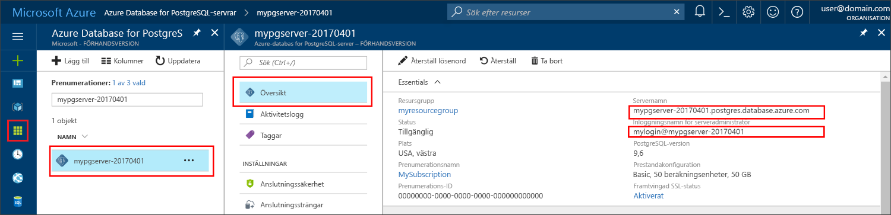

# <a name="azure-database-for-postgresql-use-php-to-connect-and-query-data"></a><span data-ttu-id="88bfe-103">Azure Database för PostgreSQL: Använda PHP för att ansluta och fråga efter data</span><span class="sxs-lookup"><span data-stu-id="88bfe-103">Azure Database for PostgreSQL: Use PHP to connect and query data</span></span>
<span data-ttu-id="88bfe-104">Den här snabbstarten visar hur du ansluter till en Azure Database för PostgreSQL med hjälp av ett [PHP](http://php.net/manual/intro-whatis.php)-program.</span><span class="sxs-lookup"><span data-stu-id="88bfe-104">This quickstart demonstrates how to connect to an Azure Database for PostgreSQL using a [PHP](http://php.net/manual/intro-whatis.php) application.</span></span> <span data-ttu-id="88bfe-105">Den visar hur du använder SQL-instruktioner för att fråga, infoga, uppdatera och ta bort data i databasen.</span><span class="sxs-lookup"><span data-stu-id="88bfe-105">It shows how to use SQL statements to query, insert, update, and delete data in the database.</span></span> <span data-ttu-id="88bfe-106">Den här artikeln förutsätter att du är van att utveckla i PHP, men saknar erfarenhet av Azure Database för PostgreSQL.</span><span class="sxs-lookup"><span data-stu-id="88bfe-106">This article assumes you are familiar with development using PHP, but that you are new to working with Azure Database for PostgreSQL.</span></span>

## <a name="prerequisites"></a><span data-ttu-id="88bfe-107">Krav</span><span class="sxs-lookup"><span data-stu-id="88bfe-107">Prerequisites</span></span>
<span data-ttu-id="88bfe-108">I den här snabbstarten används de resurser som skapades i någon av följande guider som utgångspunkt:</span><span class="sxs-lookup"><span data-stu-id="88bfe-108">This quickstart uses the resources created in either of these guides as a starting point:</span></span>
- [<span data-ttu-id="88bfe-109">Skapa DB – Portal</span><span class="sxs-lookup"><span data-stu-id="88bfe-109">Create DB - Portal</span></span>](quickstart-create-server-database-portal.md)
- [<span data-ttu-id="88bfe-110">Skapa DB – Azure CLI</span><span class="sxs-lookup"><span data-stu-id="88bfe-110">Create DB - Azure CLI</span></span>](quickstart-create-server-database-azure-cli.md)

## <a name="install-php"></a><span data-ttu-id="88bfe-111">Installera PHP</span><span class="sxs-lookup"><span data-stu-id="88bfe-111">Install PHP</span></span>
<span data-ttu-id="88bfe-112">Installera PHP på din server, eller skapa en Azure-[webbapp](https://docs.microsoft.com/en-us/azure/app-service-web/app-service-web-overview) som innehåller PHP.</span><span class="sxs-lookup"><span data-stu-id="88bfe-112">Install PHP on your own server, or create an Azure [web app](https://docs.microsoft.com/en-us/azure/app-service-web/app-service-web-overview) that includes PHP.</span></span>

### <a name="windows"></a><span data-ttu-id="88bfe-113">Windows</span><span class="sxs-lookup"><span data-stu-id="88bfe-113">Windows</span></span>
- <span data-ttu-id="88bfe-114">Hämta [PHP 7.1.4 (x64), ej trådsäker version](http://windows.php.net/download#php-7.1)</span><span class="sxs-lookup"><span data-stu-id="88bfe-114">Download [PHP 7.1.4 non-thread safe (x64) version](http://windows.php.net/download#php-7.1)</span></span>
- <span data-ttu-id="88bfe-115">Installera PHP och se [PHP-handboken](http://php.net/manual/install.windows.php) för ytterligare konfiguration</span><span class="sxs-lookup"><span data-stu-id="88bfe-115">Install PHP and refer to the [PHP manual](http://php.net/manual/install.windows.php) for further configuration</span></span>
- <span data-ttu-id="88bfe-116">Koden använder klassen **pgsql** (ext/php_pgsql.dll) som ingår i PHP-installationen.</span><span class="sxs-lookup"><span data-stu-id="88bfe-116">The code uses the **pgsql** class (ext/php_pgsql.dll)  that is included in the PHP installation.</span></span> 
- <span data-ttu-id="88bfe-117">Tillägget **pgsql** aktiveras genom att redigera konfigurationsfilen php.ini, som vanligtvis finns i `C:\Program Files\PHP\v7.1\php.ini`.</span><span class="sxs-lookup"><span data-stu-id="88bfe-117">Enabled the **pgsql** extension by editing the php.ini configuration file, typically located at `C:\Program Files\PHP\v7.1\php.ini`.</span></span> <span data-ttu-id="88bfe-118">Konfigurationsfilen ska innehålla en rad med texten `extension=php_pgsql.so`.</span><span class="sxs-lookup"><span data-stu-id="88bfe-118">The configuration file should contain a line with the text `extension=php_pgsql.so`.</span></span> <span data-ttu-id="88bfe-119">Om texten inte visas lägger du till den och sparar sedan filen.</span><span class="sxs-lookup"><span data-stu-id="88bfe-119">If it is not shown, add the text and save the file.</span></span> <span data-ttu-id="88bfe-120">Om texten finns, men har kommenterats med ett semikolonprefix, avkommenterar du texten genom att ta bort semikolonet.</span><span class="sxs-lookup"><span data-stu-id="88bfe-120">If the text is present, but commented with a semicolon prefix, uncomment the text by removing the semicolon.</span></span>

### <a name="linux-ubuntu"></a><span data-ttu-id="88bfe-121">Linux (Ubuntu)</span><span class="sxs-lookup"><span data-stu-id="88bfe-121">Linux (Ubuntu)</span></span>
- <span data-ttu-id="88bfe-122">Hämta [PHP 7.1.4 (x64), ej trådsäker version](http://php.net/downloads.php)</span><span class="sxs-lookup"><span data-stu-id="88bfe-122">Download [PHP 7.1.4 non-thread safe (x64) version](http://php.net/downloads.php)</span></span> 
- <span data-ttu-id="88bfe-123">Installera PHP och se [PHP-handboken](http://php.net/manual/install.unix.php) för ytterligare konfiguration</span><span class="sxs-lookup"><span data-stu-id="88bfe-123">Install PHP and refer to the [PHP manual](http://php.net/manual/install.unix.php) for further configuration</span></span>
- <span data-ttu-id="88bfe-124">Koden använder klassen **pgsql** (php_pgsql.so).</span><span class="sxs-lookup"><span data-stu-id="88bfe-124">The code uses the **pgsql** class (php_pgsql.so).</span></span> <span data-ttu-id="88bfe-125">Installera den genom att köra `sudo apt-get install php-pgsql`.</span><span class="sxs-lookup"><span data-stu-id="88bfe-125">Install it by running `sudo apt-get install php-pgsql`.</span></span>
- <span data-ttu-id="88bfe-126">Tillägget **pgsql** aktiveras genom att redigera konfigurationsfilen `/etc/php/7.0/mods-available/pgsql.ini`.</span><span class="sxs-lookup"><span data-stu-id="88bfe-126">Enabled the **pgsql** extension by editing the `/etc/php/7.0/mods-available/pgsql.ini` configuration file.</span></span> <span data-ttu-id="88bfe-127">Konfigurationsfilen ska innehålla en rad med texten `extension=php_pgsql.so`.</span><span class="sxs-lookup"><span data-stu-id="88bfe-127">The configuration file should contain a line with the text `extension=php_pgsql.so`.</span></span> <span data-ttu-id="88bfe-128">Om texten inte visas lägger du till den och sparar sedan filen.</span><span class="sxs-lookup"><span data-stu-id="88bfe-128">If it is not shown, add the text and save the file.</span></span> <span data-ttu-id="88bfe-129">Om texten finns, men har kommenterats med ett semikolonprefix, avkommenterar du texten genom att ta bort semikolonet.</span><span class="sxs-lookup"><span data-stu-id="88bfe-129">If the text is present, but commented with a semicolon prefix, uncomment the text by removing the semicolon.</span></span>

### <a name="macos"></a><span data-ttu-id="88bfe-130">MacOS</span><span class="sxs-lookup"><span data-stu-id="88bfe-130">MacOS</span></span>
- <span data-ttu-id="88bfe-131">Hämta [PHP 7.1.4](http://php.net/downloads.php)</span><span class="sxs-lookup"><span data-stu-id="88bfe-131">Download [PHP 7.1.4 version](http://php.net/downloads.php)</span></span>
- <span data-ttu-id="88bfe-132">Installera PHP och se [PHP-handboken](http://php.net/manual/install.macosx.php) för ytterligare konfiguration</span><span class="sxs-lookup"><span data-stu-id="88bfe-132">Install PHP and refer to the [PHP manual](http://php.net/manual/install.macosx.php) for further configuration</span></span>

## <a name="get-connection-information"></a><span data-ttu-id="88bfe-133">Hämta anslutningsinformation</span><span class="sxs-lookup"><span data-stu-id="88bfe-133">Get connection information</span></span>
<span data-ttu-id="88bfe-134">Hämta den information som du behöver för att ansluta till Azure Database för PostgreSQL.</span><span class="sxs-lookup"><span data-stu-id="88bfe-134">Get the connection information needed to connect to the Azure Database for PostgreSQL.</span></span> <span data-ttu-id="88bfe-135">Du behöver det fullständiga servernamnet och inloggningsuppgifter.</span><span class="sxs-lookup"><span data-stu-id="88bfe-135">You need the fully qualified server name and login credentials.</span></span>

1. <span data-ttu-id="88bfe-136">Logga in på [Azure-portalen](https://portal.azure.com/).</span><span class="sxs-lookup"><span data-stu-id="88bfe-136">Log in to the [Azure portal](https://portal.azure.com/).</span></span>
2. <span data-ttu-id="88bfe-137">På den vänstra menyn i Azure Portal klickar du på **Alla resurser** och söker efter den server som du nyss skapade, till exempel **mypgserver-20170401**.</span><span class="sxs-lookup"><span data-stu-id="88bfe-137">From the left-hand menu in Azure portal, click **All resources** and search for the server you have created, such as **mypgserver-20170401**.</span></span>
3. <span data-ttu-id="88bfe-138">Klicka på servernamnet **mypgserver-20170401**.</span><span class="sxs-lookup"><span data-stu-id="88bfe-138">Click the server name **mypgserver-20170401**.</span></span>
4. <span data-ttu-id="88bfe-139">Välj serverns **översikt**-sida.</span><span class="sxs-lookup"><span data-stu-id="88bfe-139">Select the server's **Overview** page.</span></span> <span data-ttu-id="88bfe-140">Anteckna **servernamn** och **inloggningsnamnet för serveradministratören**.</span><span class="sxs-lookup"><span data-stu-id="88bfe-140">Make a note of the **Server name** and **Server admin login name**.</span></span>
 <span data-ttu-id="88bfe-141"></span><span class="sxs-lookup"><span data-stu-id="88bfe-141"></span></span>
5. <span data-ttu-id="88bfe-142">Om du glömmer inloggningsinformationen för servern öppnar du sidan **Översikt** för att se inloggningsnamnet för serveradministratören. Om det behövs kan du återställa lösenordet.</span><span class="sxs-lookup"><span data-stu-id="88bfe-142">If you forget your server login information, navigate to the **Overview** page to view the Server admin login name and, if necessary, reset the password.</span></span>

## <a name="connect-and-create-a-table"></a><span data-ttu-id="88bfe-143">Ansluta och skapa en tabell</span><span class="sxs-lookup"><span data-stu-id="88bfe-143">Connect and create a table</span></span>
<span data-ttu-id="88bfe-144">Använd följande kod för att ansluta och skapa en tabell med hjälp av **CREATE TABLE**-SQL-instruktionen följt av **INSERT INTO**-SQL-instruktioner för att lägga till rader i tabellen.</span><span class="sxs-lookup"><span data-stu-id="88bfe-144">Use the following code to connect and create a table using **CREATE TABLE** SQL statement, followed by **INSERT INTO** SQL statements to add rows into the table.</span></span>

<span data-ttu-id="88bfe-145">Metoden [pg_connect()](http://php.net/manual/en/function.pg-connect.php) anropas för att ansluta till Azure Database för PostgreSQL.</span><span class="sxs-lookup"><span data-stu-id="88bfe-145">The code call method [pg_connect()](http://php.net/manual/en/function.pg-connect.php) to connect to Azure Database for PostgreSQL.</span></span> <span data-ttu-id="88bfe-146">Sedan anropas metoden [pg_query()](http://php.net/manual/en/function.pg-query.php) flera gånger för att köra flera kommandon. Varje gång körs metoden [pg_last_error()](http://php.net/manual/en/function.pg-last-error.php) för att kontrollera om ett fel uppstått.</span><span class="sxs-lookup"><span data-stu-id="88bfe-146">Then it calls method [pg_query()](http://php.net/manual/en/function.pg-query.php) several times to run several commands, and [pg_last_error()](http://php.net/manual/en/function.pg-last-error.php) to check the details if an error occurred each time.</span></span> <span data-ttu-id="88bfe-147">Sedan anropas metoden [pg_close()](http://php.net/manual/en/function.pg-close.php) för att stänga anslutningen.</span><span class="sxs-lookup"><span data-stu-id="88bfe-147">Then it calls method [pg_close()](http://php.net/manual/en/function.pg-close.php) to close the connection.</span></span>

<span data-ttu-id="88bfe-148">Ersätt parametrarna `$host`, `$database`, `$user` och `$password` med egna värden.</span><span class="sxs-lookup"><span data-stu-id="88bfe-148">Replace the `$host`, `$database`, `$user`, and `$password` parameters with your own values.</span></span> 

```php
<?php
    // Initialize connection variables.
    $host = "mypgserver-20170401.postgres.database.azure.com";
    $database = "mypgsqldb";
    $user = "mylogin@mypgserver-20170401";
    $password = "<server_admin_password>";

    // Initialize connection object.
    $connection = pg_connect("host=$host dbname=$database user=$user password=$password") 
        or die("Failed to create connection to database: ". pg_last_error(). "<br/>");
    print "Successfully created connection to database.<br/>";

    // Drop previous table of same name if one exists.
    $query = "DROP TABLE IF EXISTS inventory;";
    pg_query($connection, $query) 
        or die("Encountered an error when executing given sql statement: ". pg_last_error(). "<br/>");
    print "Finished dropping table (if existed).<br/>";

    // Create table.
    $query = "CREATE TABLE inventory (id serial PRIMARY KEY, name VARCHAR(50), quantity INTEGER);";
    pg_query($connection, $query) 
        or die("Encountered an error when executing given sql statement: ". pg_last_error(). "<br/>");
    print "Finished creating table.<br/>";

    // Insert some data into table.
    $name = '\'banana\'';
    $quantity = 150;
    $query = "INSERT INTO inventory (name, quantity) VALUES ($1, $2);";
    pg_query($connection, $query) 
        or die("Encountered an error when executing given sql statement: ". pg_last_error(). "<br/>");

    $name = '\'orange\'';
    $quantity = 154;
    $query = "INSERT INTO inventory (name, quantity) VALUES ($name, $quantity);";
    pg_query($connection, $query) 
        or die("Encountered an error when executing given sql statement: ". pg_last_error(). "<br/>");

    $name = '\'apple\'';
    $quantity = 100;
    $query = "INSERT INTO inventory (name, quantity) VALUES ($name, $quantity);";
    pg_query($connection, $query) 
        or die("Encountered an error when executing given sql statement: ". pg_last_error()). "<br/>";

    print "Inserted 3 rows of data.<br/>";

    // Closing connection
    pg_close($connection);
?>
```

## <a name="read-data"></a><span data-ttu-id="88bfe-149">Läsa data</span><span class="sxs-lookup"><span data-stu-id="88bfe-149">Read data</span></span>
<span data-ttu-id="88bfe-150">Använd följande kod för att ansluta och läsa data med en **SELECT**-SQL-instruktion.</span><span class="sxs-lookup"><span data-stu-id="88bfe-150">Use the following code to connect and read the data using a **SELECT** SQL statement.</span></span> 

 <span data-ttu-id="88bfe-151">Metoden [pg_connect()](http://php.net/manual/en/function.pg-connect.php) anropas för att ansluta till Azure Database för PostgreSQL.</span><span class="sxs-lookup"><span data-stu-id="88bfe-151">The code call method [pg_connect()](http://php.net/manual/en/function.pg-connect.php) to connect to Azure Database for PostgreSQL.</span></span> <span data-ttu-id="88bfe-152">Sedan anropas metoden [pg_query()](http://php.net/manual/en/function.pg-query.php) för att köra SELECT-kommandot, för att förvara resultatet i en resultatuppsättning, och metoden [pg_last_error()](http://php.net/manual/en/function.pg-last-error.php) anropas för att kontrollera om ett fel har uppstått.</span><span class="sxs-lookup"><span data-stu-id="88bfe-152">Then it calls method [pg_query()](http://php.net/manual/en/function.pg-query.php) to run the SELECT command, keeping the results in a result set, and [pg_last_error()](http://php.net/manual/en/function.pg-last-error.php) to check the details if an error occurred.</span></span>  <span data-ttu-id="88bfe-153">För att läsa resultatuppsättningen anropas metoden [pg_fetch_row()](http://php.net/manual/en/function.pg-fetch-row.php) i en loop, en gång per rad, och raddata hämtas i en `$row`-matris med ett datavärde per kolumn i varje matrisposition.</span><span class="sxs-lookup"><span data-stu-id="88bfe-153">To read the result set, method [pg_fetch_row()](http://php.net/manual/en/function.pg-fetch-row.php) is called in a loop, once per row, and the row data is retrieved in an array `$row`, with one data value per column in each array position.</span></span>  <span data-ttu-id="88bfe-154">Metoden [pg_free_result()](http://php.net/manual/en/function.pg-free-result.php) anropas för att frigöra resultatuppsättningen.</span><span class="sxs-lookup"><span data-stu-id="88bfe-154">To free the result set, method [pg_free_result()](http://php.net/manual/en/function.pg-free-result.php) is called.</span></span> <span data-ttu-id="88bfe-155">Sedan anropas metoden [pg_close()](http://php.net/manual/en/function.pg-close.php) för att stänga anslutningen.</span><span class="sxs-lookup"><span data-stu-id="88bfe-155">Then it calls method [pg_close()](http://php.net/manual/en/function.pg-close.php) to close the connection.</span></span>

<span data-ttu-id="88bfe-156">Ersätt parametrarna `$host`, `$database`, `$user` och `$password` med egna värden.</span><span class="sxs-lookup"><span data-stu-id="88bfe-156">Replace the `$host`, `$database`, `$user`, and `$password` parameters with your own values.</span></span> 

```php
<?php
    // Initialize connection variables.
    $host = "mypgserver-20170401.postgres.database.azure.com";
    $database = "mypgsqldb";
    $user = "mylogin@mypgserver-20170401";
    $password = "<server_admin_password>";
    
    // Initialize connection object.
    $connection = pg_connect("host=$host dbname=$database user=$user password=$password")
                or die("Failed to create connection to database: ". pg_last_error(). "<br/>");

    print "Successfully created connection to database. <br/>";

    // Perform some SQL queries over the connection.
    $query = "SELECT * from inventory";
    $result_set = pg_query($connection, $query) 
        or die("Encountered an error when executing given sql statement: ". pg_last_error(). "<br/>");
    while ($row = pg_fetch_row($result_set))
    {
        print "Data row = ($row[0], $row[1], $row[2]). <br/>";
    }

    // Free result_set
    pg_free_result($result_set);

    // Closing connection
    pg_close($connection);
?>
```

## <a name="update-data"></a><span data-ttu-id="88bfe-157">Uppdatera data</span><span class="sxs-lookup"><span data-stu-id="88bfe-157">Update data</span></span>
<span data-ttu-id="88bfe-158">Använd följande kod för att ansluta och uppdatera data med en **UPDATE**-SQL-instruktion.</span><span class="sxs-lookup"><span data-stu-id="88bfe-158">Use the following code to connect and update the data using a **UPDATE** SQL statement.</span></span>

<span data-ttu-id="88bfe-159">Metoden [pg_connect()](http://php.net/manual/en/function.pg-connect.php) anropas för att ansluta till Azure Database för PostgreSQL.</span><span class="sxs-lookup"><span data-stu-id="88bfe-159">The code call method [pg_connect()](http://php.net/manual/en/function.pg-connect.php) to connect to Azure Database for PostgreSQL.</span></span> <span data-ttu-id="88bfe-160">Sedan anropas metoden [pg_query()](http://php.net/manual/en/function.pg-query.php) flera gånger för att köra ett kommando, och [pg_last_error()](http://php.net/manual/en/function.pg-last-error.php) anropas för att kontrollera om ett fel uppstått.</span><span class="sxs-lookup"><span data-stu-id="88bfe-160">Then it calls method [pg_query()](http://php.net/manual/en/function.pg-query.php) to run a command, and [pg_last_error()](http://php.net/manual/en/function.pg-last-error.php) to check the details if an error occurred.</span></span> <span data-ttu-id="88bfe-161">Sedan anropas metoden [pg_close()](http://php.net/manual/en/function.pg-close.php) för att stänga anslutningen.</span><span class="sxs-lookup"><span data-stu-id="88bfe-161">Then it calls method [pg_close()](http://php.net/manual/en/function.pg-close.php) to close the connection.</span></span>

<span data-ttu-id="88bfe-162">Ersätt parametrarna `$host`, `$database`, `$user` och `$password` med egna värden.</span><span class="sxs-lookup"><span data-stu-id="88bfe-162">Replace the `$host`, `$database`, `$user`, and `$password` parameters with your own values.</span></span> 

```php
<?php
    // Initialize connection variables.
    $host = "mypgserver-20170401.postgres.database.azure.com";
    $database = "mypgsqldb";
    $user = "mylogin@mypgserver-20170401";
    $password = "<server_admin_password>";

    // Initialize connection object.
    $connection = pg_connect("host=$host dbname=$database user=$user password=$password")
                or die("Failed to create connection to database: ". pg_last_error(). ".<br/>");

    print "Successfully created connection to database. <br/>";

    // Modify some data in table.
    $new_quantity = 200;
    $name = '\'banana\'';
    $query = "UPDATE inventory SET quantity = $new_quantity WHERE name = $name;";
    pg_query($connection, $query) 
        or die("Encountered an error when executing given sql statement: ". pg_last_error(). ".<br/>");
    print "Updated 1 row of data. </br>";

    // Closing connection
    pg_close($connection);
?>
```


## <a name="delete-data"></a><span data-ttu-id="88bfe-163">Ta bort data</span><span class="sxs-lookup"><span data-stu-id="88bfe-163">Delete data</span></span>
<span data-ttu-id="88bfe-164">Använd följande kod för att ansluta och läsa data med en **DELETE**-SQL-instruktion.</span><span class="sxs-lookup"><span data-stu-id="88bfe-164">Use the following code to connect and read the data using a **DELETE** SQL statement.</span></span> 

 <span data-ttu-id="88bfe-165">Metoden [pg_connect()](http://php.net/manual/en/function.pg-connect.php) anropas för att ansluta till Azure Database för PostgreSQL.</span><span class="sxs-lookup"><span data-stu-id="88bfe-165">The code call method [pg_connect()](http://php.net/manual/en/function.pg-connect.php) to connect to  Azure Database for PostgreSQL.</span></span> <span data-ttu-id="88bfe-166">Sedan anropas metoden [pg_query()](http://php.net/manual/en/function.pg-query.php) flera gånger för att köra ett kommando, och [pg_last_error()](http://php.net/manual/en/function.pg-last-error.php) anropas för att kontrollera om ett fel uppstått.</span><span class="sxs-lookup"><span data-stu-id="88bfe-166">Then it calls method [pg_query()](http://php.net/manual/en/function.pg-query.php) to run a command, and [pg_last_error()](http://php.net/manual/en/function.pg-last-error.php) to check the details if an error occurred.</span></span> <span data-ttu-id="88bfe-167">Sedan anropas metoden [pg_close()](http://php.net/manual/en/function.pg-close.php) för att stänga anslutningen.</span><span class="sxs-lookup"><span data-stu-id="88bfe-167">Then it calls method [pg_close()](http://php.net/manual/en/function.pg-close.php) to close the connection.</span></span>

<span data-ttu-id="88bfe-168">Ersätt parametrarna `$host`, `$database`, `$user` och `$password` med egna värden.</span><span class="sxs-lookup"><span data-stu-id="88bfe-168">Replace the `$host`, `$database`, `$user`, and `$password` parameters with your own values.</span></span> 

```php
<?php
    // Initialize connection variables.
    $host = "mypgserver-20170401.postgres.database.azure.com";
    $database = "mypgsqldb";
    $user = "mylogin@mypgserver-20170401";
    $password = "<server_admin_password>";

    // Initialize connection object.
    $connection = pg_connect("host=$host dbname=$database user=$user password=$password")
            or die("Failed to create connection to database: ". pg_last_error(). ". </br>");

    print "Successfully created connection to database. <br/>";

    // Delete some data from table.
    $name = '\'orange\'';
    $query = "DELETE FROM inventory WHERE name = $name;";
    pg_query($connection, $query) 
        or die("Encountered an error when executing given sql statement: ". pg_last_error(). ". <br/>");
    print "Deleted 1 row of data. <br/>";

    // Closing connection
    pg_close($connection);
?>
```

## <a name="next-steps"></a><span data-ttu-id="88bfe-169">Nästa steg</span><span class="sxs-lookup"><span data-stu-id="88bfe-169">Next steps</span></span>
> [!div class="nextstepaction"]
> [<span data-ttu-id="88bfe-170">Migrera din databas med Exportera och importera</span><span class="sxs-lookup"><span data-stu-id="88bfe-170">Migrate your database using Export and Import</span></span>](./howto-migrate-using-export-and-import.md)
