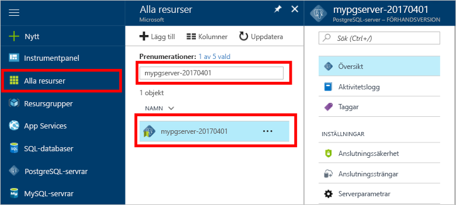

# Hur tooBackup och återställa en server i Azure-databas för att använda PostgreSQL hello Azure-portalenHow tooBackup and Restore a server in Azure Database for PostgreSQL using hello Azure portal

## Säkerhetskopieringen sker automatisktBackup happens Automatically
När du använder Azure-databas för PostgreSQL görs hello databastjänsten en säkerhetskopia av hello tjänsten var femte minut.When using Azure Database for PostgreSQL, hello database service automatically makes a backup of hello service every 5 minutes. 

hello säkerhetskopior är tillgängliga för 7 dagar vid användning av grundläggande nivån och 35 dagar när du använder standardnivån.hello backups are available for 7 days when using Basic Tier, and 35 days when using Standard Tier. Mer information finns i [Azure-databas för PostgreSQL-servicenivåer](concepts-service-tiers.md)For more information, see [Azure Database for PostgreSQL service tiers](concepts-service-tiers.md)

Med hjälp av funktionen för automatisk säkerhetskopiering kan du återställa hello server och alla databaser i en ny server tooan tidigare punkt i tiden.Using this automatic backup feature you may restore hello server and all its databases into a new server tooan earlier point-in-time.

## Återställa hello Azure-portalenRestore in hello Azure portal
Azure PostgreSQL-databas kan du toorestore hello servern tillbaka tooa punkt i tiden och till tooa nya kopian av hello server.Azure Database for PostgreSQL allows you toorestore hello server back tooa point in time and into tooa new copy of hello server. Du kan använda den här nya servern toorecover dina data.You can use this new server toorecover your data. 

Till exempel om en tabell av misstag kan bort kl. tolv idag, du återställa toohello gång innan på dagen och hämta hello saknas tabellen och data från den nya kopian av hello-server.For example, if a table was accidentally dropped at noon today, you could restore toohello time just before noon and retrieve hello missing table and data from that new copy of hello server.

hello återställningspunkt följande hello exempel server tooa i tid:hello following steps restore hello sample server tooa point in time:
1. Logga in på hello [Azure-portalen](https://portal.azure.com/)Sign into hello [Azure portal](https://portal.azure.com/)
2. Hitta din Azure-databas för PostgreSQL-servern.Locate your Azure Database for PostgreSQL server. I hello Azure-portalen klickar du på **alla resurser** från hello vänstra menyn och Skriv hello namn som **mypgserver 20170401**, toosearch för din befintliga server.In hello Azure portal, click **All Resources** from hello left-hand menu and type in hello name, such as **mypgserver-20170401**, toosearch for your existing server. Klicka på hello servernamn som anges i hello sökresultatet.Click hello server name listed in hello search result. Hej **översikt** sidan för servern öppnas och visar alternativ för ytterligare konfiguration.hello **Overview** page for your server opens and provides options for further configuration.

   

3. Klicka på hello överkant hello serverblad översikt **återställa** hello i verktygsfältet.On hello top of hello server overview blade, click **Restore** on hello toolbar. hello återställning blad öppnas.hello Restore blade opens.

   

4. Fyll i hello återställning formuläret med hello krävs information:Fill out hello Restore form with hello required information:

   
  - **Återställningspunkt**: Välj en i tidpunkt som inträffar innan hello-servern har ändrats**Restore point**: Select a point-in-time that occurs before hello server was changed
  - **Målservern**: Ange ett nytt servernamn som du vill toorestore till**Target server**: Provide a new server name you want toorestore to
  - **Plats**: du kan inte välja hello region, som standard är det samma som källservern hello**Location**: You cannot select hello region, by default it is same as hello source server
  - **Prisnivån**: du kan inte ändra det här värdet när du återställer en server.**Pricing tier**: You cannot change this value when restoring a server. Det är samma som hello källservern.It is same as hello source server. 

5. Klicka på **OK** toorestore hello server toorestore tooa tidpunkt.Click **OK** toorestore hello server toorestore tooa point in time. 

6. Leta upp hello nya server som skapas tooverify hello data har återställts korrekt när hello återställning har slutförts.Once hello restore finishes, locate hello new server that is created tooverify hello data was restored as expected.

## Nästa stegNext steps
- [Anslutningsbibliotek för Azure-databas för PostgreSQLConnection libraries for Azure Database for PostgreSQL](concepts-connection-libraries.md)
