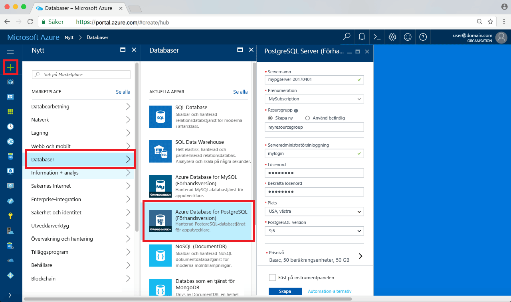

# <a name="create-an-azure-database-for-postgresql-in-the-azure-portal"></a><span data-ttu-id="f613e-103">Skapa en Azure Database för PostgreSQL i Azure-portalen</span><span class="sxs-lookup"><span data-stu-id="f613e-103">Create an Azure Database for PostgreSQL in the Azure portal</span></span>

<span data-ttu-id="f613e-104">Azure Database för PostgreSQL är en hanterad tjänst som låter dig köra, hantera och skala högtillgängliga PostgreSQL-databaser i molnet.</span><span class="sxs-lookup"><span data-stu-id="f613e-104">Azure Database for PostgreSQL is a managed service that enables you to run, manage, and scale highly available PostgreSQL databases in the cloud.</span></span> <span data-ttu-id="f613e-105">Den här snabbstarten visar hur du skapar en Azure Database för PostgreSQL-server med Azure Portal på ungefär fem minuter.</span><span class="sxs-lookup"><span data-stu-id="f613e-105">This quickstart shows you how to create an Azure Database for PostgreSQL server using the Azure portal in about five minutes.</span></span>

<span data-ttu-id="f613e-106">Om du inte har en Azure-prenumeration kan du skapa ett [kostnadsfritt](https://azure.microsoft.com/free/) konto innan du börjar.</span><span class="sxs-lookup"><span data-stu-id="f613e-106">If you don't have an Azure subscription, create a [free](https://azure.microsoft.com/free/) account before you begin.</span></span>

## <a name="log-in-to-the-azure-portal"></a><span data-ttu-id="f613e-107">Logga in på Azure Portal</span><span class="sxs-lookup"><span data-stu-id="f613e-107">Log in to the Azure portal</span></span>
<span data-ttu-id="f613e-108">Öppna webbläsaren och gå till [Microsoft Azure Portal](https://portal.azure.com/).</span><span class="sxs-lookup"><span data-stu-id="f613e-108">Open your web browser, and navigate to the [Microsoft Azure portal](https://portal.azure.com/).</span></span> <span data-ttu-id="f613e-109">Ange dina autentiseringsuppgifter och logga in på portalen.</span><span class="sxs-lookup"><span data-stu-id="f613e-109">Enter your credentials to sign in to the portal.</span></span> <span data-ttu-id="f613e-110">Standardvyn är instrumentpanelen.</span><span class="sxs-lookup"><span data-stu-id="f613e-110">The default view is your service dashboard.</span></span>

## <a name="create-an-azure-database-for-postgresql"></a><span data-ttu-id="f613e-111">Skapa en Azure Database för PostgreSQL</span><span class="sxs-lookup"><span data-stu-id="f613e-111">Create an Azure Database for PostgreSQL</span></span>

<span data-ttu-id="f613e-112">En Azure Database för PostgreSQL-server skapas med en definierad uppsättning [compute- och lagringsresurser](./concepts-compute-unit-and-storage.md).</span><span class="sxs-lookup"><span data-stu-id="f613e-112">An Azure Database for PostgreSQL server is created with a defined set of [compute and storage resources](./concepts-compute-unit-and-storage.md).</span></span> <span data-ttu-id="f613e-113">Servern skapas inom en [Azure-resursgrupp](../azure-resource-manager/resource-group-overview.md).</span><span class="sxs-lookup"><span data-stu-id="f613e-113">The server is created within an [Azure resource group](../azure-resource-manager/resource-group-overview.md).</span></span>

<span data-ttu-id="f613e-114">Följ de här stegen för att skapa en Azure Database för PostgreSQL-server:</span><span class="sxs-lookup"><span data-stu-id="f613e-114">Follow these steps to create an Azure Database for PostgreSQL server:</span></span>
1.  <span data-ttu-id="f613e-115">Klicka på knappen **New** (Nytt) längst upp till vänster i Azure Portal.</span><span class="sxs-lookup"><span data-stu-id="f613e-115">Click the **New** button (+) found on the upper left-hand corner of the Azure portal.</span></span>
2.  <span data-ttu-id="f613e-116">Välj **databaser** från sidan **Nytt** och välj **Azure Database för PostgreSQL** från sidan **databaser**.</span><span class="sxs-lookup"><span data-stu-id="f613e-116">Select **Databases** from the **New** page, and select **Azure Database for PostgreSQL** from the **Databases** page.</span></span>
 <span data-ttu-id="f613e-117"></span><span class="sxs-lookup"><span data-stu-id="f613e-117"></span></span>

3.  <span data-ttu-id="f613e-118">Fyll i detaljformuläret för den nya server med följande information, som det visas i föregående bil:</span><span class="sxs-lookup"><span data-stu-id="f613e-118">Fill out the new server details form with the following information, as shown on the preceding image:</span></span>

    <span data-ttu-id="f613e-119">Inställning</span><span class="sxs-lookup"><span data-stu-id="f613e-119">Setting</span></span>|<span data-ttu-id="f613e-120">Föreslaget värde</span><span class="sxs-lookup"><span data-stu-id="f613e-120">Suggested value</span></span>|<span data-ttu-id="f613e-121">Beskrivning</span><span class="sxs-lookup"><span data-stu-id="f613e-121">Description</span></span>
    ---|---|---
    <span data-ttu-id="f613e-122">servernamn</span><span class="sxs-lookup"><span data-stu-id="f613e-122">Server name</span></span> |<span data-ttu-id="f613e-123">*mypgserver-20170401*</span><span class="sxs-lookup"><span data-stu-id="f613e-123">*mypgserver-20170401*</span></span>|<span data-ttu-id="f613e-124">Välj ett unikt namn för Azure Database för PostgreSQL-server.</span><span class="sxs-lookup"><span data-stu-id="f613e-124">Choose a unique name that identifies your Azure Database for PostgreSQL server.</span></span> <span data-ttu-id="f613e-125">Domännamnet *postgres.database.azure.com* läggs till i det servernamn du anger som program ska ansluta till.</span><span class="sxs-lookup"><span data-stu-id="f613e-125">The domain name *postgres.database.azure.com* is appended to the server name you provide for applications to connect to.</span></span> <span data-ttu-id="f613e-126">Ditt servernamn får bara innehålla gemener, siffror och bindestreck och måste innehålla mellan 3 och 63 tecken.</span><span class="sxs-lookup"><span data-stu-id="f613e-126">The server name can contain only lowercase letters, numbers, and the hyphen (-) character, and it must contain from 3 through 63 characters.</span></span>
    <span data-ttu-id="f613e-127">Prenumeration</span><span class="sxs-lookup"><span data-stu-id="f613e-127">Subscription</span></span>|<span data-ttu-id="f613e-128">*Din prenumeration*</span><span class="sxs-lookup"><span data-stu-id="f613e-128">*Your subscription*</span></span>|<span data-ttu-id="f613e-129">Den Azure-prenumeration som ska användas för servern.</span><span class="sxs-lookup"><span data-stu-id="f613e-129">The Azure subscription that you want to use for your server.</span></span> <span data-ttu-id="f613e-130">Om du har flera prenumerationer, väljer du lämplig prenumeration som resursen ska debiteras till.</span><span class="sxs-lookup"><span data-stu-id="f613e-130">If you have multiple subscriptions, choose the appropriate subscription in which the resource is billed for.</span></span>
    <span data-ttu-id="f613e-131">Resursgrupp</span><span class="sxs-lookup"><span data-stu-id="f613e-131">Resource Group</span></span>|<span data-ttu-id="f613e-132">*myresourcegroup*</span><span class="sxs-lookup"><span data-stu-id="f613e-132">*myresourcegroup*</span></span>| <span data-ttu-id="f613e-133">Du kan skapa ett nytt resursgruppnamn eller använda ett befintligt namn i prenumerationen.</span><span class="sxs-lookup"><span data-stu-id="f613e-133">You may make a new resource group name, or use an existing one from your subscription.</span></span>
    <span data-ttu-id="f613e-134">inloggning för serveradministratör</span><span class="sxs-lookup"><span data-stu-id="f613e-134">Server admin login</span></span> |<span data-ttu-id="f613e-135">*mylogin*</span><span class="sxs-lookup"><span data-stu-id="f613e-135">*mylogin*</span></span>| <span data-ttu-id="f613e-136">Skapa ett eget inloggningskonto att använda när du ansluter till servern.</span><span class="sxs-lookup"><span data-stu-id="f613e-136">Make your own login account to use when connecting to the server.</span></span> <span data-ttu-id="f613e-137">Inloggningsnamnet för administratören får inte vara azure_superuser, azure_pg_admin, admin, administrator, root, guest, eller public och får inte börja med pg_.</span><span class="sxs-lookup"><span data-stu-id="f613e-137">The admin login name cannot be 'azure_superuser', 'azure_pg_admin', 'admin', 'administrator', 'root', 'guest', or 'public', and cannot start with 'pg_'.</span></span>
    <span data-ttu-id="f613e-138">Lösenord</span><span class="sxs-lookup"><span data-stu-id="f613e-138">Password</span></span> |<span data-ttu-id="f613e-139">*Ditt val*</span><span class="sxs-lookup"><span data-stu-id="f613e-139">*Your choice*</span></span> | <span data-ttu-id="f613e-140">Skapa ett nytt lösenord för serverns administratörskonto.</span><span class="sxs-lookup"><span data-stu-id="f613e-140">Create a new password for the server admin account.</span></span> <span data-ttu-id="f613e-141">Måste innehålla mellan 8 och 128 tecken.</span><span class="sxs-lookup"><span data-stu-id="f613e-141">Must contain from 8 to 128 characters.</span></span> <span data-ttu-id="f613e-142">Lösenordet måste innehålla tecken från tre av följande kategorier: engelska versala bokstäver, engelska gemena bokstäver, siffror (0-9) och icke-alfanumeriska tecken (!, $, #, % osv).</span><span class="sxs-lookup"><span data-stu-id="f613e-142">Your password must contain characters from three of the following categories – English uppercase letters, English lowercase letters, numbers (0-9), and non-alphanumeric characters (!, $, #, %, etc.).</span></span>
    <span data-ttu-id="f613e-143">Plats</span><span class="sxs-lookup"><span data-stu-id="f613e-143">Location</span></span>|<span data-ttu-id="f613e-144">*Regionen som ligger närmast dina användare*</span><span class="sxs-lookup"><span data-stu-id="f613e-144">*The region closest to your users*</span></span>| <span data-ttu-id="f613e-145">Välj den plats som är närmast dina användare.</span><span class="sxs-lookup"><span data-stu-id="f613e-145">Choose the location that's closest to your users.</span></span>
    <span data-ttu-id="f613e-146">PostgreSQL-version</span><span class="sxs-lookup"><span data-stu-id="f613e-146">PostgreSQL Version</span></span>|<span data-ttu-id="f613e-147">*Välj den senaste versionen*</span><span class="sxs-lookup"><span data-stu-id="f613e-147">*Choose the latest version*</span></span>| <span data-ttu-id="f613e-148">Välj den senaste versionen såvida du inte har särskilda krav.</span><span class="sxs-lookup"><span data-stu-id="f613e-148">Choose the latest version unless you have specific requirements.</span></span>
    <span data-ttu-id="f613e-149">Prisnivå</span><span class="sxs-lookup"><span data-stu-id="f613e-149">Pricing Tier</span></span> | <span data-ttu-id="f613e-150">**Basic**, **50 Compute-enheter** **50 GB**</span><span class="sxs-lookup"><span data-stu-id="f613e-150">**Basic**, **50 Compute Units** **50 GB**</span></span> | <span data-ttu-id="f613e-151">Klicka på **Prisnivå** för att ange tjänstenivå och prestandanivå för den nya databasen.</span><span class="sxs-lookup"><span data-stu-id="f613e-151">Click **Pricing tier** to specify the service tier and performance level for your new database.</span></span> <span data-ttu-id="f613e-152">Välj Basic-nivån på fliken längst upp.</span><span class="sxs-lookup"><span data-stu-id="f613e-152">Choose Basic tier in the tab at the top.</span></span> <span data-ttu-id="f613e-153">Klicka längst ut till vänster på skjutreglaget för Compute-enheter och justera värdet till minsta tillgängliga mängd för den här snabbstarten.</span><span class="sxs-lookup"><span data-stu-id="f613e-153">Click the left end of the Compute Units slider to adjust the value to the least amount available for this quickstart.</span></span> <span data-ttu-id="f613e-154">Spara den valda prisnivån genom att klicka på **OK**.</span><span class="sxs-lookup"><span data-stu-id="f613e-154">Click **Ok** to save the pricing tier selection.</span></span> <span data-ttu-id="f613e-155">Se följande skärmbild.</span><span class="sxs-lookup"><span data-stu-id="f613e-155">See the following screenshot.</span></span>
    | <span data-ttu-id="f613e-156">Fäst vid instrumentpanelen</span><span class="sxs-lookup"><span data-stu-id="f613e-156">Pin to dashboard</span></span> | <span data-ttu-id="f613e-157">Markera</span><span class="sxs-lookup"><span data-stu-id="f613e-157">Check</span></span> | <span data-ttu-id="f613e-158">Markera alternativet **Fäst vid instrumentpanel** för att tillåta enkel spårning av servern på den främre instrumentpanelen på Azure Portal.</span><span class="sxs-lookup"><span data-stu-id="f613e-158">Check the **Pin to dashboard** option to allow easy tracking of your server on the front dashboard page of your Azure portal.</span></span>

  > [!IMPORTANT]
  > <span data-ttu-id="f613e-159">Det användarnamn och lösenord för serveradministration du anger här krävs för inloggning på servern och databaserna senare i den här snabbstarten.</span><span class="sxs-lookup"><span data-stu-id="f613e-159">The server admin login and password that you specify here are required to log in to the server and its databases later in this quick start.</span></span> <span data-ttu-id="f613e-160">Kom ihåg eller skriv ned den här informationen så att du kan använda den senare.</span><span class="sxs-lookup"><span data-stu-id="f613e-160">Remember or record this information for later use.</span></span>

    

4.  <span data-ttu-id="f613e-162">Klicka på **Skapa** för att etablera servern.</span><span class="sxs-lookup"><span data-stu-id="f613e-162">Click **Create** to provision the server.</span></span> <span data-ttu-id="f613e-163">Det tar några minuter, högst 20, att slutföra etableringen.</span><span class="sxs-lookup"><span data-stu-id="f613e-163">Provisioning takes a few minutes, up to 20 minutes maximum.</span></span>

5.  <span data-ttu-id="f613e-164">Klicka på **Aviseringar** i verktygsfältet för att övervaka distributionsprocessen.</span><span class="sxs-lookup"><span data-stu-id="f613e-164">On the toolbar, click **Notifications** to monitor the deployment process.</span></span>
 <span data-ttu-id="f613e-165"></span><span class="sxs-lookup"><span data-stu-id="f613e-165"></span></span>
   
  <span data-ttu-id="f613e-166">Som standard skapas **postgres**-databasen under din server.</span><span class="sxs-lookup"><span data-stu-id="f613e-166">By default, **postgres** database gets created under your server.</span></span> <span data-ttu-id="f613e-167">[Postgres](https://www.postgresql.org/docs/9.6/static/app-initdb.html)-databasen är en standarddatabas som är avsedd för användare, verktyg och tredje parts program.</span><span class="sxs-lookup"><span data-stu-id="f613e-167">The [postgres](https://www.postgresql.org/docs/9.6/static/app-initdb.html) database is a default database meant for use by users, utilities, and third-party applications.</span></span> 

## <a name="configure-a-server-level-firewall-rule"></a><span data-ttu-id="f613e-168">Konfigurera en brandväggsregel på servernivå</span><span class="sxs-lookup"><span data-stu-id="f613e-168">Configure a server-level firewall rule</span></span>

<span data-ttu-id="f613e-169">Azure Database för PostgreSQL-tjänsten skapar en brandvägg på server-nivå.</span><span class="sxs-lookup"><span data-stu-id="f613e-169">The Azure Database for PostgreSQL service creates a firewall at the server-level.</span></span> <span data-ttu-id="f613e-170">Brandväggen förhindrar att externa program och verktyg ansluter till servern eller databaser på servern, om inte en brandväggsregel konfigureras som öppnar brandväggen för specifika IP-adresser.</span><span class="sxs-lookup"><span data-stu-id="f613e-170">This firewall prevents external applications and tools from connecting to the server and any databases on the server, unless a firewall rule is created to open the firewall for specific IP addresses.</span></span> 

1.  <span data-ttu-id="f613e-171">Leta upp servern när distributionen är klar.</span><span class="sxs-lookup"><span data-stu-id="f613e-171">Locate your server after the deployment completes.</span></span> <span data-ttu-id="f613e-172">Om det behövs kan du söka efter den.</span><span class="sxs-lookup"><span data-stu-id="f613e-172">If needed, you can search for it.</span></span> <span data-ttu-id="f613e-173">Klicka exempelvis på **Alla resurser** på vänster meny och skriv in servernamnet (till exempel *mypgserver-20170401*) för att söka efter den nya servern.</span><span class="sxs-lookup"><span data-stu-id="f613e-173">For example, click **All Resources** from the left-hand menu and type in the server name (such as the example *mypgserver-20170401*) to search for your newly created server.</span></span> <span data-ttu-id="f613e-174">Klicka på servernamnet i sökresultatlistan.</span><span class="sxs-lookup"><span data-stu-id="f613e-174">Click on your server name listed in the search result.</span></span> <span data-ttu-id="f613e-175">**Översikt**-sidan för din server öppnas och innehåller alternativ ytterligare konfiguration.</span><span class="sxs-lookup"><span data-stu-id="f613e-175">The **Overview** page for your server opens and provides options for further configuration.</span></span>
 
    

2.  <span data-ttu-id="f613e-177">På serversidan väljer du **Anslutningssäkerhet**.</span><span class="sxs-lookup"><span data-stu-id="f613e-177">On the server page, select **Connection security**.</span></span> 
    <span data-ttu-id="f613e-178"></span><span class="sxs-lookup"><span data-stu-id="f613e-178"></span></span>

3.  <span data-ttu-id="f613e-179">Under **Brandväggsregler** klickar du i den tomma textrutan i kolumnen **Regelnamn** och börjar skapa brandväggsregeln.</span><span class="sxs-lookup"><span data-stu-id="f613e-179">Under the **Firewall rules** heading, click in the blank text box in the **Rule Name** column to begin creating the firewall rule.</span></span> 

    <span data-ttu-id="f613e-180">I den här snabbstartsguiden ska vi tillåta alla ip-adresser till servern genom att fylla i textrutan i varje kolumn med följande värden:</span><span class="sxs-lookup"><span data-stu-id="f613e-180">For this quick start, let's allow all IP addresses into the server by filling in the text box in each column with the following values:</span></span>

    <span data-ttu-id="f613e-181">Regelnamn</span><span class="sxs-lookup"><span data-stu-id="f613e-181">Rule Name</span></span> | <span data-ttu-id="f613e-182">Start-ip</span><span class="sxs-lookup"><span data-stu-id="f613e-182">Start IP</span></span> | <span data-ttu-id="f613e-183">Slut-ip</span><span class="sxs-lookup"><span data-stu-id="f613e-183">End IP</span></span> 
    ---|---|---
    <span data-ttu-id="f613e-184">AllowAllIps</span><span class="sxs-lookup"><span data-stu-id="f613e-184">AllowAllIps</span></span> |  <span data-ttu-id="f613e-185">0.0.0.0</span><span class="sxs-lookup"><span data-stu-id="f613e-185">0.0.0.0</span></span> | <span data-ttu-id="f613e-186">255.255.255.255</span><span class="sxs-lookup"><span data-stu-id="f613e-186">255.255.255.255</span></span>

4. <span data-ttu-id="f613e-187">I det övre verktygsfältet på sidan Anslutningssäkerhet klickar du på **Spara**.</span><span class="sxs-lookup"><span data-stu-id="f613e-187">On the upper toolbar of the Connection security page, click **Save**.</span></span> <span data-ttu-id="f613e-188">Vänta en stund tills du ser meddelandet om att uppdateringen av anslutningssäkerhet har slutförts innan du fortsätter.</span><span class="sxs-lookup"><span data-stu-id="f613e-188">Wait for a few moments and notice the notification showing that updating connection security has finished successfully before continuing.</span></span>

    > [!NOTE]
    > <span data-ttu-id="f613e-189">Anslutningar till din Azure Database för PostgreSQL-server kommunicerar via port 5432.</span><span class="sxs-lookup"><span data-stu-id="f613e-189">Connections to your Azure Database for PostgreSQL server communicate over port 5432.</span></span> <span data-ttu-id="f613e-190">Om du försöker ansluta inifrån ett företagsnätverk, kan utgående trafik via port 5432 bli nekad av nätverkets brandvägg.</span><span class="sxs-lookup"><span data-stu-id="f613e-190">If you are trying to connect from within a corporate network, outbound traffic over port 5432 may not be allowed by your network's firewall.</span></span> <span data-ttu-id="f613e-191">I så fall kommer du inte att kunna ansluta till din server om inte din IT-avdelning öppnar port 5432.</span><span class="sxs-lookup"><span data-stu-id="f613e-191">If so, you will not be able to connect to your server unless your IT department opens port 5432.</span></span>
    >

## <a name="get-the-connection-information"></a><span data-ttu-id="f613e-192">Hämta anslutningsinformationen</span><span class="sxs-lookup"><span data-stu-id="f613e-192">Get the connection information</span></span>

<span data-ttu-id="f613e-193">När vi skapade vår Azure Database för PostgreSQL-server, skapades även en standarddatabas med namnet **postgres**.</span><span class="sxs-lookup"><span data-stu-id="f613e-193">When we created our Azure Database for PostgreSQL server, a default database named **postgres** gets created.</span></span> <span data-ttu-id="f613e-194">Du måste komma ihåg det fullständiga servernamnet och inloggningsuppgifterna för administratör för att ansluta till databasservern.</span><span class="sxs-lookup"><span data-stu-id="f613e-194">To connect to your database server, you need to remember the full server name and admin login credentials.</span></span> <span data-ttu-id="f613e-195">Du kan ha antecknat de här värdena tidigare i snabbstartsartikeln.</span><span class="sxs-lookup"><span data-stu-id="f613e-195">You may have noted those values earlier in the quick start article.</span></span> <span data-ttu-id="f613e-196">I annat fall hittar du enkelt servernamnet och inloggningsuppgifterna på sidan Översikt på Azure Portal.</span><span class="sxs-lookup"><span data-stu-id="f613e-196">In case you did not, you can easily find the server name and login information from the server Overview page in the Azure portal.</span></span>

1. <span data-ttu-id="f613e-197">Öppna serverns **Översikt**-sida.</span><span class="sxs-lookup"><span data-stu-id="f613e-197">Open your server's **Overview** page.</span></span> <span data-ttu-id="f613e-198">Anteckna **servernamn** och **inloggningsnamnet för serveradministratören**.</span><span class="sxs-lookup"><span data-stu-id="f613e-198">Make a note of the **Server name** and **Server admin login name**.</span></span>
    <span data-ttu-id="f613e-199">Håll markören över varje fält så att kopieringssymbolen visas till höger om texten.</span><span class="sxs-lookup"><span data-stu-id="f613e-199">Hover your cursor over each field, and the copy icon appears to the right of the text.</span></span> <span data-ttu-id="f613e-200">Klicka på kopieringssymbolen för att kopiera värdena.</span><span class="sxs-lookup"><span data-stu-id="f613e-200">Click the copy icon as needed to copy the values.</span></span>

 

## <a name="connect-to-postgresql-database-using-psql-in-cloud-shell"></a><span data-ttu-id="f613e-202">Anslut till PostgreSQL-databasen med psql i Cloud Shell</span><span class="sxs-lookup"><span data-stu-id="f613e-202">Connect to PostgreSQL database using psql in Cloud Shell</span></span>

<span data-ttu-id="f613e-203">Det finns ett antal program som du kan använda för att ansluta till Azure Database för PostgreSQL-servern.</span><span class="sxs-lookup"><span data-stu-id="f613e-203">There are a number of applications you can use to connect to your Azure Database for PostgreSQL server.</span></span> <span data-ttu-id="f613e-204">Först använder vi psql-kommandoradsverktyget för att visa hur man ansluter till servern.</span><span class="sxs-lookup"><span data-stu-id="f613e-204">Let's first use the psql command-line utility to illustrate how to connect to the server.</span></span>  <span data-ttu-id="f613e-205">Du kan använda en webbläsare och Azure Cloud Shell enligt nedan utan att behöva installera ytterligare programvara.</span><span class="sxs-lookup"><span data-stu-id="f613e-205">You can use a web browser and the Azure Cloud Shell as described here without the need to install any additional software.</span></span> <span data-ttu-id="f613e-206">Om psql-verktyget är installerat lokalt på din dator kan du ansluta därifrån också.</span><span class="sxs-lookup"><span data-stu-id="f613e-206">If you have the psql utility installed locally on your own machine, you can connect from there as well.</span></span>

1. <span data-ttu-id="f613e-207">Starta Azure Cloud Shell via terminalikonen överst i navigeringsfönstret.</span><span class="sxs-lookup"><span data-stu-id="f613e-207">Launch the Azure Cloud Shell via the terminal icon on the top navigation pane.</span></span>

   

2. <span data-ttu-id="f613e-209">Azure Cloud Shell öppnas i webbläsaren så att du kan skriva bash shell-kommandon.</span><span class="sxs-lookup"><span data-stu-id="f613e-209">The Azure Cloud Shell opens in your browser, enabling you to type bash shell commands.</span></span>

   

3. <span data-ttu-id="f613e-211">I Cloud Shell-kommandotolken ansluter du till din Azure Database för PostgreSQL-server genom att skriva in psql-kommandoraden i den gröna kommandotolken.</span><span class="sxs-lookup"><span data-stu-id="f613e-211">At the Cloud Shell prompt, connect to a database in your Azure Database for PostgreSQL server by typing the psql command line at the green prompt.</span></span>

    <span data-ttu-id="f613e-212">Följande format används för att ansluta till en Azure Database för PostgreSQL-server med [psql](https://www.postgresql.org/docs/9.6/static/app-psql.html)-verktyget:</span><span class="sxs-lookup"><span data-stu-id="f613e-212">The following format is used to connect to an Azure Database for PostgreSQL server with the [psql](https://www.postgresql.org/docs/9.6/static/app-psql.html) utility:</span></span>
    ```bash
    psql --host=<yourserver> --port=<port> --username=<server admin login> --dbname=<database name>
    ```

    <span data-ttu-id="f613e-213">Till exempel ansluter följande kommando till en exempelserver:</span><span class="sxs-lookup"><span data-stu-id="f613e-213">For example, the following command connects to an example server:</span></span>

    ```bash
    psql --host=mypgserver-20170401.postgres.database.azure.com --port=5432 --username=mylogin@mypgserver-20170401 --dbname=postgres
    ```

    <span data-ttu-id="f613e-214">psql-parameter</span><span class="sxs-lookup"><span data-stu-id="f613e-214">psql parameter</span></span> |<span data-ttu-id="f613e-215">Föreslaget värde</span><span class="sxs-lookup"><span data-stu-id="f613e-215">Suggested value</span></span>|<span data-ttu-id="f613e-216">Beskrivning</span><span class="sxs-lookup"><span data-stu-id="f613e-216">Description</span></span>
    ---|---|---
    <span data-ttu-id="f613e-217">--host</span><span class="sxs-lookup"><span data-stu-id="f613e-217">--host</span></span> | <span data-ttu-id="f613e-218">*servernamn*</span><span class="sxs-lookup"><span data-stu-id="f613e-218">*server name*</span></span> | <span data-ttu-id="f613e-219">Ange det värde för servernamn som användes när du tidigare skapade Azure Database för PostgreSQL.</span><span class="sxs-lookup"><span data-stu-id="f613e-219">Specify the server name value that was used when you created the Azure Database for PostgreSQL earlier.</span></span> <span data-ttu-id="f613e-220">Exempelservern som visas är mypgserver-20170401.postgres.database.azure.com. Använd det fullständiga domännamnet (\*.postgres.database.azure.com) som i det här exemplet.</span><span class="sxs-lookup"><span data-stu-id="f613e-220">Our example server shown is mypgserver-20170401.postgres.database.azure.com. Use the fully qualified domain name (\*.postgres.database.azure.com) as shown in the example.</span></span> <span data-ttu-id="f613e-221">Följ anvisningarna i föregående avsnitt för att hitta anslutningsinformation om du inte kommer ihåg namnet på servern.</span><span class="sxs-lookup"><span data-stu-id="f613e-221">Follow the steps in the previous section to get the connection information if you do not remember your server name.</span></span> 
    <span data-ttu-id="f613e-222">--port</span><span class="sxs-lookup"><span data-stu-id="f613e-222">--port</span></span> | <span data-ttu-id="f613e-223">**5432**</span><span class="sxs-lookup"><span data-stu-id="f613e-223">**5432**</span></span> | <span data-ttu-id="f613e-224">Använd alltid port 5432 när du ansluter till Azure Database för PostgreSQL.</span><span class="sxs-lookup"><span data-stu-id="f613e-224">Always use port 5432 when connecting to Azure Database for PostgreSQL.</span></span> 
    <span data-ttu-id="f613e-225">--username</span><span class="sxs-lookup"><span data-stu-id="f613e-225">--username</span></span> | <span data-ttu-id="f613e-226">*inloggning för serveradministratör*</span><span class="sxs-lookup"><span data-stu-id="f613e-226">*server admin login name*</span></span> |<span data-ttu-id="f613e-227">Ange det användarnamn för serveradministratörsinloggning som användes när du tidigare skapade Azure Database för PostgreSQL.</span><span class="sxs-lookup"><span data-stu-id="f613e-227">Type in the  server admin login username supplied when you created the Azure Database for PostgreSQL earlier.</span></span> <span data-ttu-id="f613e-228">Följ anvisningarna i föregående avsnitt för att hitta anslutningsinformation om du inte kommer ihåg användarnamnet.</span><span class="sxs-lookup"><span data-stu-id="f613e-228">Follow the steps in the previous section to get the connection information if you do not remember the username.</span></span>  <span data-ttu-id="f613e-229">Formatet är *username@servername*.</span><span class="sxs-lookup"><span data-stu-id="f613e-229">The format is *username@servername*.</span></span>
    <span data-ttu-id="f613e-230">--dbname</span><span class="sxs-lookup"><span data-stu-id="f613e-230">--dbname</span></span> | <span data-ttu-id="f613e-231">**postgres**</span><span class="sxs-lookup"><span data-stu-id="f613e-231">**postgres**</span></span> | <span data-ttu-id="f613e-232">Använd det systemgenererade standarddatabasnamnet *postgres* för den första anslutningen.</span><span class="sxs-lookup"><span data-stu-id="f613e-232">Use the default system generated database name *postgres* for the first connection.</span></span> <span data-ttu-id="f613e-233">Senare kan du skapa en egen databas.</span><span class="sxs-lookup"><span data-stu-id="f613e-233">Later you create your own database.</span></span>

    <span data-ttu-id="f613e-234">När du har kört psql-kommandot med egna parametervärden uppmanas du att ange lösenordet för serveradministratören.</span><span class="sxs-lookup"><span data-stu-id="f613e-234">After running the psql command, with your own parameter values, you are prompted to type the server admin password.</span></span> <span data-ttu-id="f613e-235">Det här är det lösenord som du angav när du skapade servern.</span><span class="sxs-lookup"><span data-stu-id="f613e-235">This password is the same that you provided when you created the server.</span></span> 

    <span data-ttu-id="f613e-236">psql-parameter</span><span class="sxs-lookup"><span data-stu-id="f613e-236">psql parameter</span></span> |<span data-ttu-id="f613e-237">Föreslaget värde</span><span class="sxs-lookup"><span data-stu-id="f613e-237">Suggested value</span></span>|<span data-ttu-id="f613e-238">Beskrivning</span><span class="sxs-lookup"><span data-stu-id="f613e-238">Description</span></span>
    ---|---|---
    <span data-ttu-id="f613e-239">lösenord</span><span class="sxs-lookup"><span data-stu-id="f613e-239">password</span></span> | <span data-ttu-id="f613e-240">*ditt administratörslösenord*</span><span class="sxs-lookup"><span data-stu-id="f613e-240">*your admin password*</span></span> | <span data-ttu-id="f613e-241">Tänk på att det angivna lösenordet inte visas i bash-kommandotolken.</span><span class="sxs-lookup"><span data-stu-id="f613e-241">Note, the typed password characters are not shown on the bash prompt.</span></span> <span data-ttu-id="f613e-242">Tryck på Retur när du har skrivit alla tecken för att autentisera och ansluta.</span><span class="sxs-lookup"><span data-stu-id="f613e-242">Press enter after you have typed all the characters to authenticate and connect.</span></span>

    <span data-ttu-id="f613e-243">När du är ansluten visas i psql-verktyget en postgres-kommandotolk där du skriver sql-kommandon.</span><span class="sxs-lookup"><span data-stu-id="f613e-243">Once connected, the psql utility displays a postgres prompt where you type sql commands.</span></span> <span data-ttu-id="f613e-244">Vid den första anslutningen kanske en varning visas eftersom psql i Azure Cloud Shell kan vara en annan version än Azure Databas för PostgreSQL-serverversionen.</span><span class="sxs-lookup"><span data-stu-id="f613e-244">In the initial connection output, a warning may be displayed since the psql in the Azure Cloud Shell may be a different  version than the Azure Database for PostgreSQL server version.</span></span> 
    
    <span data-ttu-id="f613e-245">Exempel på psql-utdata:</span><span class="sxs-lookup"><span data-stu-id="f613e-245">Example psql output:</span></span>
    ```bash
    psql (9.5.7, server 9.6.2)
    WARNING: psql major version 9.5, server major version 9.6.
        Some psql features might not work.
    SSL connection (protocol: TLSv1.2, cipher: ECDHE-RSA-AES256-SHA384, bits: 256, compression: off)
    Type "help" for help.
   
    postgres=> 
    ```

    > [!TIP]
    > <span data-ttu-id="f613e-246">Om brandväggen inte är konfigurerad att tillåta IP-adressen för Azure Cloud Shell uppstår följande fel:</span><span class="sxs-lookup"><span data-stu-id="f613e-246">If the firewall is not configured to allow the IP address of the Azure Cloud Shell, the following error occurs:</span></span>
    > 
    > <span data-ttu-id="f613e-247">"psql: FATAL:  no pg_hba.conf entry for host "138.91.195.82", user "mylogin", database "postgres", SSL on FATAL:  SSL connection is required.</span><span class="sxs-lookup"><span data-stu-id="f613e-247">"psql: FATAL:  no pg_hba.conf entry for host "138.91.195.82", user "mylogin", database "postgres", SSL on FATAL:  SSL connection is required.</span></span> <span data-ttu-id="f613e-248">Please specify SSL options and retry.</span><span class="sxs-lookup"><span data-stu-id="f613e-248">Please specify SSL options and retry.</span></span>
    > 
    > <span data-ttu-id="f613e-249">Lös felet genom att se till att serverkonfigurationen matchar stegen i avsnittet *Konfigurera en brandväggsregel på servernivå* i artikeln.</span><span class="sxs-lookup"><span data-stu-id="f613e-249">To resolve the error, make sure the server configuration matches the steps in the *Configure a server-level firewall rule* section of the article.</span></span>

4.  <span data-ttu-id="f613e-250">Skapa en tom databas i kommandotolken genom att skriva följande kommando:</span><span class="sxs-lookup"><span data-stu-id="f613e-250">Create a blank database at the prompt by typing the following command:</span></span>
    ```bash
    CREATE DATABASE mypgsqldb;
    ```
    <span data-ttu-id="f613e-251">Kommandot kan ta en stund att slutföra.</span><span class="sxs-lookup"><span data-stu-id="f613e-251">The command may take a few moments to complete.</span></span> 

5.  <span data-ttu-id="f613e-252">I prompten kör du följande kommando för att växla anslutning till den nyligen skapade databasen **mypgsqldb**.</span><span class="sxs-lookup"><span data-stu-id="f613e-252">At the prompt, execute the following command to switch connection to the newly created database **mypgsqldb**.</span></span>
    ```bash
    \c mypgsqldb
    ```

6.  <span data-ttu-id="f613e-253">Skriv \q och tryck sedan på RETUR för att avsluta psql.</span><span class="sxs-lookup"><span data-stu-id="f613e-253">Type \q and then press ENTER to quit psql.</span></span> <span data-ttu-id="f613e-254">När du är klar kan du stänga Azure Cloud Shell.</span><span class="sxs-lookup"><span data-stu-id="f613e-254">You can close the Azure Cloud Shell after you are done.</span></span>

<span data-ttu-id="f613e-255">Nu har du anslutit till Azure Database för PostgreSQL och skapat en tom användardatabas.</span><span class="sxs-lookup"><span data-stu-id="f613e-255">Now you have connected to the Azure Database for PostgreSQL and created a blank user database.</span></span> <span data-ttu-id="f613e-256">Fortsätt till nästa avsnitt för att ansluta med hjälp av ett annat vanligt verktyg pgAdmin.</span><span class="sxs-lookup"><span data-stu-id="f613e-256">Continue to the next section to connect using another common tool, pgAdmin.</span></span>

## <a name="connect-to-postgresql-database-using-pgadmin"></a><span data-ttu-id="f613e-257">Anslut till PostgreSQL-databasen med pgAdmin</span><span class="sxs-lookup"><span data-stu-id="f613e-257">Connect to PostgreSQL database using pgAdmin</span></span>

<span data-ttu-id="f613e-258">Om du vill ansluta till Azure PostgreSQL-servern med GUI-verktyget _pgAdmin_</span><span class="sxs-lookup"><span data-stu-id="f613e-258">To connect to Azure PostgreSQL server using the GUI tool _pgAdmin_</span></span>
1.  <span data-ttu-id="f613e-259">Starta _pgAdmin_-programmet på din klientdator.</span><span class="sxs-lookup"><span data-stu-id="f613e-259">Launch the _pgAdmin_ application on your client computer.</span></span> <span data-ttu-id="f613e-260">Du kan installera _pgAdmin_ från http://www.pgadmin.org/.</span><span class="sxs-lookup"><span data-stu-id="f613e-260">You can install _pgAdmin_ from http://www.pgadmin.org/.</span></span>
2.  <span data-ttu-id="f613e-261">Klicka på ikonen **Lägg till ny server** från avsnittet **Snabblänkar** i mitten av instrumentpanelssidan.</span><span class="sxs-lookup"><span data-stu-id="f613e-261">Click the **Add New Server** icon from the **Quick Links** section in the center of the Dashboard page.</span></span>
3.  <span data-ttu-id="f613e-262">I dialogrutan **skapa – server** i fliken **allmänt**, anger du ett unikt eget namn för servern, som **Azure PostgreSQL-server**.</span><span class="sxs-lookup"><span data-stu-id="f613e-262">In the **Create - Server** dialog box **General** tab, enter a unique friendly Name for the server, such as **Azure PostgreSQL Server**.</span></span>
<span data-ttu-id="f613e-263"></span><span class="sxs-lookup"><span data-stu-id="f613e-263"></span></span>
4.  <span data-ttu-id="f613e-264">I dialogrutan **skapa – server** i fliken **anslutning**, använder du de angivna inställningarna och klickar på **spara**.</span><span class="sxs-lookup"><span data-stu-id="f613e-264">In the **Create - Server** dialog box, **Connection** tab, use the settings as specified and click **Save**.</span></span>
   <span data-ttu-id="f613e-265"></span><span class="sxs-lookup"><span data-stu-id="f613e-265"></span></span>

    <span data-ttu-id="f613e-266">pgAdmin-parameter</span><span class="sxs-lookup"><span data-stu-id="f613e-266">pgAdmin parameter</span></span> |<span data-ttu-id="f613e-267">Föreslaget värde</span><span class="sxs-lookup"><span data-stu-id="f613e-267">Suggested value</span></span>|<span data-ttu-id="f613e-268">Beskrivning</span><span class="sxs-lookup"><span data-stu-id="f613e-268">Description</span></span>
    ---|---|---
    <span data-ttu-id="f613e-269">Värdnamn/-adress</span><span class="sxs-lookup"><span data-stu-id="f613e-269">Host Name/Address</span></span> | <span data-ttu-id="f613e-270">*servernamn*</span><span class="sxs-lookup"><span data-stu-id="f613e-270">*server name*</span></span> | <span data-ttu-id="f613e-271">Ange det värde för servernamn som användes när du tidigare skapade Azure Database för PostgreSQL.</span><span class="sxs-lookup"><span data-stu-id="f613e-271">Specify the server name value that was used when you created the Azure Database for PostgreSQL earlier.</span></span> <span data-ttu-id="f613e-272">Exempelservern som visas är mypgserver-20170401.postgres.database.azure.com. Använd det fullständiga domännamnet (\*.postgres.database.azure.com) som i det här exemplet.</span><span class="sxs-lookup"><span data-stu-id="f613e-272">Our example server shown is mypgserver-20170401.postgres.database.azure.com. Use the fully qualified domain name (\*.postgres.database.azure.com) as shown in the example.</span></span> <span data-ttu-id="f613e-273">Följ anvisningarna i föregående avsnitt för att hitta anslutningsinformation om du inte kommer ihåg namnet på servern.</span><span class="sxs-lookup"><span data-stu-id="f613e-273">Follow the steps in the previous section to get the connection information if you do not remember your server name.</span></span> 
    <span data-ttu-id="f613e-274">Port</span><span class="sxs-lookup"><span data-stu-id="f613e-274">Port</span></span> | <span data-ttu-id="f613e-275">**5432**</span><span class="sxs-lookup"><span data-stu-id="f613e-275">**5432**</span></span> | <span data-ttu-id="f613e-276">Använd alltid port 5432 när du ansluter till Azure Database för PostgreSQL.</span><span class="sxs-lookup"><span data-stu-id="f613e-276">Always use port 5432 when connecting to Azure Database for PostgreSQL.</span></span>  
    <span data-ttu-id="f613e-277">Underhållsdatabas</span><span class="sxs-lookup"><span data-stu-id="f613e-277">Maintenance Database</span></span> | <span data-ttu-id="f613e-278">**postgres**</span><span class="sxs-lookup"><span data-stu-id="f613e-278">**postgres**</span></span> | <span data-ttu-id="f613e-279">Använd det systemgenererade standardnamnet för databasen, *postgres*.</span><span class="sxs-lookup"><span data-stu-id="f613e-279">Use the default system generated database name *postgres*.</span></span>
    <span data-ttu-id="f613e-280">Användarnamn</span><span class="sxs-lookup"><span data-stu-id="f613e-280">User Name</span></span> | <span data-ttu-id="f613e-281">*inloggning för serveradministratör*</span><span class="sxs-lookup"><span data-stu-id="f613e-281">*server admin login name*</span></span> | <span data-ttu-id="f613e-282">Ange det användarnamn för serveradministratörsinloggning som användes när du tidigare skapade Azure Database för PostgreSQL.</span><span class="sxs-lookup"><span data-stu-id="f613e-282">Type in the server admin login username supplied when you created the Azure Database for PostgreSQL earlier.</span></span> <span data-ttu-id="f613e-283">Följ anvisningarna i föregående avsnitt för att hitta anslutningsinformation om du inte kommer ihåg användarnamnet.</span><span class="sxs-lookup"><span data-stu-id="f613e-283">Follow the steps in the previous section to get the connection information if you do not remember the username.</span></span> <span data-ttu-id="f613e-284">Formatet är *username@servername*.</span><span class="sxs-lookup"><span data-stu-id="f613e-284">The format is *username@servername*.</span></span>
    <span data-ttu-id="f613e-285">Lösenord</span><span class="sxs-lookup"><span data-stu-id="f613e-285">Password</span></span> | <span data-ttu-id="f613e-286">*ditt administratörslösenord*</span><span class="sxs-lookup"><span data-stu-id="f613e-286">*your admin password*</span></span> |  <span data-ttu-id="f613e-287">Det lösenord du angav när du skapade servern tidigare i den här snabbstarten.</span><span class="sxs-lookup"><span data-stu-id="f613e-287">The password you chose when you created the server earlier in this quickstart.</span></span>
    <span data-ttu-id="f613e-288">Roll</span><span class="sxs-lookup"><span data-stu-id="f613e-288">Role</span></span> | <span data-ttu-id="f613e-289">*lämna tomt*</span><span class="sxs-lookup"><span data-stu-id="f613e-289">*leave blank*</span></span> | <span data-ttu-id="f613e-290">Du behöver inte ange ett rollnamn nu.</span><span class="sxs-lookup"><span data-stu-id="f613e-290">No need to provide a role name at this point.</span></span> <span data-ttu-id="f613e-291">Lämna fältet tomt.</span><span class="sxs-lookup"><span data-stu-id="f613e-291">Leave the field blank.</span></span>
    <span data-ttu-id="f613e-292">SSL-läge</span><span class="sxs-lookup"><span data-stu-id="f613e-292">SSL Mode</span></span> | <span data-ttu-id="f613e-293">Kräv</span><span class="sxs-lookup"><span data-stu-id="f613e-293">Require</span></span> | <span data-ttu-id="f613e-294">Som standard skapas alla Azure PostgreSQL-servrar med SSL tvingande aktiverat.</span><span class="sxs-lookup"><span data-stu-id="f613e-294">By default, all Azure PostgreSQL servers are created with SSL enforcing turned ON.</span></span> <span data-ttu-id="f613e-295">Om du vill inaktivera SSL tvingande, se informationen i [tvingande SSL](./concepts-ssl-connection-security.md).</span><span class="sxs-lookup"><span data-stu-id="f613e-295">To turn OFF SSL enforcing, see details in [Enforcing SSL](./concepts-ssl-connection-security.md).</span></span>
    
5.  <span data-ttu-id="f613e-296">Klicka på **Spara**.</span><span class="sxs-lookup"><span data-stu-id="f613e-296">Click **Save**.</span></span>
6.  <span data-ttu-id="f613e-297">I webbläsarens vänstra fönster expanderar du noden **Servrar**.</span><span class="sxs-lookup"><span data-stu-id="f613e-297">In the Browser left pane, expand the **Servers** node.</span></span> <span data-ttu-id="f613e-298">Välj din server, till exempel **Azure PostgreSQL Server**, och klicka för att ansluta till den.</span><span class="sxs-lookup"><span data-stu-id="f613e-298">Choose your server, for example **Azure PostgreSQL Server** and click to connect to it.</span></span>
7. <span data-ttu-id="f613e-299">Expandera servernoden och expandera sedan **Databaser** under den.</span><span class="sxs-lookup"><span data-stu-id="f613e-299">Expand the server node, and then expand **Databases** under it.</span></span> <span data-ttu-id="f613e-300">Listan ska innehålla din befintliga *postgres*-databas och alla eventuella nyligen skapade användardatabaser, som *mypgsqldb*, som vi skapade i föregående avsnitt.</span><span class="sxs-lookup"><span data-stu-id="f613e-300">The list should include your existing *postgres* database, and any newly created user database, such as *mypgsqldb*, that we created in the previous section.</span></span> <span data-ttu-id="f613e-301">Observera att du kan skapa flera databaser per server med Azure Database för PostgreSQL.</span><span class="sxs-lookup"><span data-stu-id="f613e-301">Notice that you may create multiple databases per server with Azure Database for PostgreSQL.</span></span>
8. <span data-ttu-id="f613e-302">Högerklicka på **Databaser**, välj menyn **Skapa** och klicka på **Databas**.</span><span class="sxs-lookup"><span data-stu-id="f613e-302">Right-click on **Databases**, choose the **Create** menu, and click **Database**.</span></span>
9.  <span data-ttu-id="f613e-303">Skriv valfritt databasnamn i fältet **Databas**, till exempel *mypgsqldb* som i exemplet.</span><span class="sxs-lookup"><span data-stu-id="f613e-303">Type a database name of your choice in the **Database** field, such as *mypgsqldb* shown in the example.</span></span> 
10. <span data-ttu-id="f613e-304">Välj **Ägare** för databasen från den nedrullningsbara listan.</span><span class="sxs-lookup"><span data-stu-id="f613e-304">Select the **Owner** for the database from the drop-down box.</span></span> <span data-ttu-id="f613e-305">Välj ditt inloggningsnamn som administratör för servern, som vårt exempel *mylogin*.</span><span class="sxs-lookup"><span data-stu-id="f613e-305">Choose your server admin login name, such as our example *mylogin*.</span></span>
10. <span data-ttu-id="f613e-306">Klicka på **Spara** för att skapa en tom databas.</span><span class="sxs-lookup"><span data-stu-id="f613e-306">Click **Save** to create a new blank database.</span></span>
11. <span data-ttu-id="f613e-307">I rutan **Webbläsare** ser du den databas du skapade i listan Databaser under servernamnet.</span><span class="sxs-lookup"><span data-stu-id="f613e-307">In the **Browser** pane, see the database you created in the list of Databases under your server name.</span></span>
 <span data-ttu-id="f613e-308"></span><span class="sxs-lookup"><span data-stu-id="f613e-308"></span></span>


## <a name="clean-up-resources"></a><span data-ttu-id="f613e-309">Rensa resurser</span><span class="sxs-lookup"><span data-stu-id="f613e-309">Clean up resources</span></span>
<span data-ttu-id="f613e-310">Rensa bland de resurser du skapade i snabbstarten, antingen genom att ta bort [Azure-resursgrupp](../azure-resource-manager/resource-group-overview.md), som innehåller alla resurser i resursgruppen, eller genom att ta bort serverresursen om du vill behålla de andra resurserna intakta.</span><span class="sxs-lookup"><span data-stu-id="f613e-310">Clean up the resources you created in the quickstart either by deleting the [Azure resource group](../azure-resource-manager/resource-group-overview.md), which includes all the resources in the resource group, or by deleting the one server resource if you want to keep the other resources intact.</span></span>

> [!TIP]
> <span data-ttu-id="f613e-311">De andra snabbstarterna i den här samlingen bygger på den här snabbstarten.</span><span class="sxs-lookup"><span data-stu-id="f613e-311">Other quickstarts in this collection build upon this quick start.</span></span> <span data-ttu-id="f613e-312">Om du planerar att fortsätta att arbeta med efterföljande snabbstarter, ska du inte rensa upp resurserna som du skapade i den här snabbstarten.</span><span class="sxs-lookup"><span data-stu-id="f613e-312">If you plan to continue on to work with subsequent quickstarts, do not clean up the resources created in this quickstart.</span></span> <span data-ttu-id="f613e-313">Om du inte planerar att fortsätta kan du använda stegen nedan för att ta bort alla resurser som har skapats i den här snabbstarten i Azure Portal.</span><span class="sxs-lookup"><span data-stu-id="f613e-313">If you do not plan to continue, use the following steps to delete resources created by this quickstart in the Azure portal.</span></span>

<span data-ttu-id="f613e-314">Så här tar du bort hela resursgruppen, inklusive den nya servern:</span><span class="sxs-lookup"><span data-stu-id="f613e-314">To delete the entire resource group including the newly created server:</span></span>
1.  <span data-ttu-id="f613e-315">Leta reda på resursgruppen på Azure Portal.</span><span class="sxs-lookup"><span data-stu-id="f613e-315">Locate your resource group in the Azure portal.</span></span> <span data-ttu-id="f613e-316">Klicka på **Resursgrupper** på den vänstra menyn i Azure Portal och sedan på namnet på resursgruppen, som vårt exempel **myresourcegroup**.</span><span class="sxs-lookup"><span data-stu-id="f613e-316">From the left-hand menu in the Azure portal, click **Resource groups** and then click the name of your resource group, such as our example **myresourcegroup**.</span></span>
2.  <span data-ttu-id="f613e-317">Klicka på **Ta bort** på din resursgruppssida.</span><span class="sxs-lookup"><span data-stu-id="f613e-317">On your resource group page, click **Delete**.</span></span> <span data-ttu-id="f613e-318">Skriv sedan namnet på resursgruppen, som vårt exempel **myresourcegroup**, i textrutan för att bekräfta borttagning och klicka sedan på **Ta bort**.</span><span class="sxs-lookup"><span data-stu-id="f613e-318">Then type the name of your resource group, such as our example **myresourcegroup**, in the text box to confirm deletion, and then click **Delete**.</span></span>

<span data-ttu-id="f613e-319">Eller gör så här om du vill ta bort den nyligen skapade servern:</span><span class="sxs-lookup"><span data-stu-id="f613e-319">Or instead, to delete the newly created server:</span></span>
1.  <span data-ttu-id="f613e-320">Leta upp din server i Azure Portal om du inte har den öppen.</span><span class="sxs-lookup"><span data-stu-id="f613e-320">Locate your server in the Azure portal, if you do not have it open.</span></span> <span data-ttu-id="f613e-321">Klicka på **Alla resurser** på den vänstra menyn i Azure Portal och leta upp den server som du nyss skapade.</span><span class="sxs-lookup"><span data-stu-id="f613e-321">From the left-hand menu in Azure portal, click **All resources**, and then search for the server you created.</span></span>
2.  <span data-ttu-id="f613e-322">Klicka på knappen **Ta bort** i den övre panelen på sidan **Översikt**.</span><span class="sxs-lookup"><span data-stu-id="f613e-322">On the **Overview** page, click the **Delete** button on the top pane.</span></span>
<span data-ttu-id="f613e-323"></span><span class="sxs-lookup"><span data-stu-id="f613e-323"></span></span>
3.  <span data-ttu-id="f613e-324">Bekräfta servernamnet som du vill ta bort och visa de databaser under den som påverkas.</span><span class="sxs-lookup"><span data-stu-id="f613e-324">Confirm the server name you want to delete, and show the databases under it that are affected.</span></span> <span data-ttu-id="f613e-325">Skriv namnet på servern i textrutan, som vårt exempel **mypgserver 20170401** och klicka sedan på **Ta bort**.</span><span class="sxs-lookup"><span data-stu-id="f613e-325">Type your server name in the text box, such as our example **mypgserver-20170401**, and then click **Delete**.</span></span>

## <a name="next-steps"></a><span data-ttu-id="f613e-326">Nästa steg</span><span class="sxs-lookup"><span data-stu-id="f613e-326">Next steps</span></span>
> [!div class="nextstepaction"]
> [<span data-ttu-id="f613e-327">Migrera din databas med Exportera och importera</span><span class="sxs-lookup"><span data-stu-id="f613e-327">Migrate your database using Export and Import</span></span>](./howto-migrate-using-export-and-import.md)
