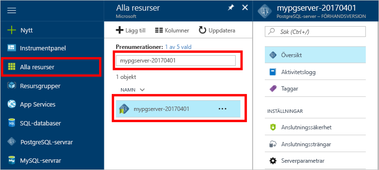
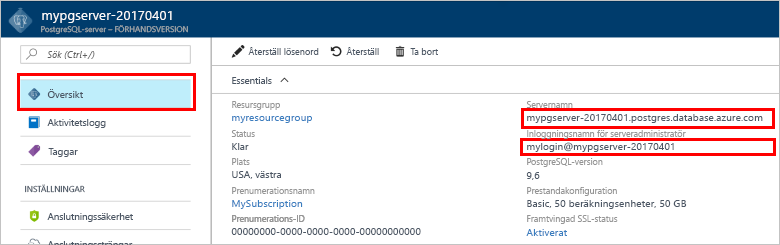
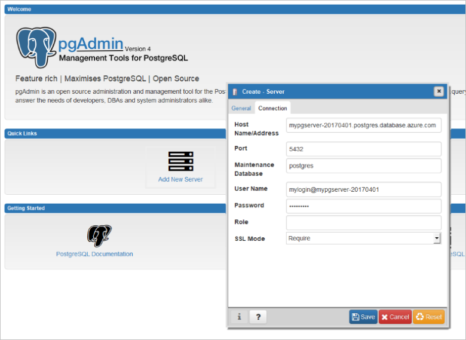

# <a name="create-an-azure-database-for-postgresql-in-hello-azure-portal"></a>Skapa en Azure-databas för PostgreSQL i hello Azure-portalen

Azure PostgreSQL-databas är en hanterad tjänst som gör att du toorun, hantera och skala högtillgänglig PostgreSQL-databaser i hello molnet. Den här snabbstarten visar hur toocreate en Azure-databas för PostgreSQL-server med hello Azure-portalen om fem minuter.

Om du inte har en Azure-prenumeration kan du skapa ett [kostnadsfritt](https://azure.microsoft.com/free/) konto innan du börjar.

## <a name="log-in-toohello-azure-portal"></a>Logga in toohello Azure-portalen
Öppna webbläsaren och gå toohello [Microsoft Azure-portalen](https://portal.azure.com/). Ange dina autentiseringsuppgifter toosign toohello-portalen. hello standardvyn är instrumentpanelen service.

## <a name="create-an-azure-database-for-postgresql"></a>Skapa en Azure Database för PostgreSQL

En Azure Database för PostgreSQL-server skapas med en definierad uppsättning [compute- och lagringsresurser](./concepts-compute-unit-and-storage.md). hello server skapas inom en [Azure-resursgrupp](../azure-resource-manager/resource-group-overview.md).

Följ dessa steg toocreate en Azure-databas för PostgreSQL-server:
1.  Klicka på hello **ny** knappen (+) finns på hello övre vänstra hörnet av hello Azure-portalen.
2.  Välj **databaser** från hello **ny** och väljer **Azure-databas för PostgreSQL** från hello **databaser** sidan.
 

3.  Fyll i formuläret om hello nya servern information med hello följande information som visas i föregående bild hello:

    Inställning|Föreslaget värde|Beskrivning
    ---|---|---
    servernamn |*mypgserver-20170401*|Välj ett unikt namn för Azure Database för PostgreSQL-server. hello domännamn *postgres.database.azure.com* är tillagda toohello servernamn som du anger för program tooconnect till. hello servernamnet får innehålla endast små bokstäver, siffror och hello bindestreck (-) och det måste innehålla mellan 3 och 63 tecken.
    Prenumeration|*Din prenumeration*|hello Azure-prenumeration som du vill toouse för servern. Om du har flera prenumerationer, Välj hello lämpliga prenumeration där hello resurs debiteras för.
    Resursgrupp|*myresourcegroup*| Du kan skapa ett nytt resursgruppnamn eller använda ett befintligt namn i prenumerationen.
    inloggning för serveradministratör |*mylogin*| Se egna inloggningen konto toouse när du ansluter toohello server. Hej administratör inloggningsnamnet får inte vara 'azure_superuser', 'azure_pg_admin', ”admin”, 'administratör', 'rot', 'gäst' eller 'public' och får inte börja med 'pg_'.
    Lösenord |*Ditt val* | Skapa ett nytt lösenord för administratörskontot för hello-server. Måste innehålla från 8 too128 tecken. Lösenordet måste innehålla tecken från tre av hello följande kategorier-engelska versala bokstäver, engelska gemena bokstäver, siffror (0-9) och icke-alfanumeriska tecken (!, $, #, % osv.).
    Plats|*hello region närmaste tooyour användare*| Välj hello-plats som är närmast tooyour användare.
    PostgreSQL-version|*Välj hello senaste version*| Välj hello senaste versionen om du inte har särskilda krav.
    Prisnivå | **Basic**, **50 Compute-enheter** **50 GB** | Klicka på **prisnivå** toospecify hello tjänstnivå och prestandanivå servicenivå för den nya databasen. Välj grundläggande nivån i hello fliken hello överst. Klicka på hello vänstra ände hello Compute enheter skjutreglaget tooadjust hello värdet toohello minsta möjliga som är tillgängliga för denna Snabbstart. Klicka på **Ok** toosave hello priser för val av. Se hello följande skärmbild.
    | PIN-kod toodashboard | Markera | Kontrollera hello **PIN-kod toodashboard** alternativet tooallow enkel spårning av din server på hello främre instrumentpanelssida på Azure-portalen.

  > [!IMPORTANT]
  > hello server admin inloggningsnamn och lösenord som du anger här är nödvändig toolog i toohello server och databaserna senare i den här snabbstartsguide. Kom ihåg eller skriv ned den här informationen så att du kan använda den senare.

    

4.  Klicka på **skapa** tooprovision hello server. Etablering tar några minuter, in too20 minuter maximalt.

5.  På verktygsfältet hello **meddelanden** toomonitor hello distributionsprocessen.
 
   
  Som standard skapas **postgres**-databasen under din server. Hej [postgres](https://www.postgresql.org/docs/9.6/static/app-initdb.html) databasen är en standarddatabas som är avsedd för användning av användare, verktyg och program från tredje part. 

## <a name="configure-a-server-level-firewall-rule"></a>Konfigurera en brandväggsregel på servernivå

hello Azure-databas för PostgreSQL-tjänsten skapar en brandvägg på servernivå för hello. Den här brandväggen förhindrar externa program och verktyg ansluter toohello server och alla databaser på servern hello, såvida inte en brandväggsregel skapas tooopen hello-brandväggen för specifika IP-adresser. 

1.  Leta upp din server när hello distributionen är klar. Om det behövs kan du söka efter den. Klicka till exempel **alla resurser** från hello vänstra menyn och Skriv hello servernamn (till exempel hello exempel *mypgserver 20170401*) toosearch för den nya servern. Klicka på namnet på servern som anges i hello sökresultatet. Hej **översikt** sidan för servern öppnas och visar alternativ för ytterligare konfiguration.
 
    

2.  På serversidan för hello, Välj **anslutningssäkerhet**. 
    

3.  Under hello **regler i brandväggen** rubrik, klicka i hello tom textruta i hello **Regelnamn** kolumnen toobegin skapar hello brandväggsregel. 

    För den här snabbstartsguide vi Tillåt alla IP-adresser i hello-servern genom att fylla i hello textruta i varje kolumn med hello följande värden:

    Regelnamn | Start-ip | Slut-ip 
    ---|---|---
    AllowAllIps |  0.0.0.0 | 255.255.255.255

4. På hello övre verktygsfältet för hello anslutningssidan säkerhet **spara**. Vänta en stund och meddelande hello-meddelande visar att uppdatera anslutningssäkerhet har slutförts innan du fortsätter.

    > [!NOTE]
    > Anslutningar tooyour Azure-databas för PostgreSQL-servern kommunicerar via port 5432. Om du försöker tooconnect från ett företagsnätverk, tillåtas utgående trafik via port 5432 inte av ditt nätverks brandvägg. I så fall, blir inte kan tooconnect tooyour server om din IT-avdelning öppnar port 5432.
    >

## <a name="get-hello-connection-information"></a>Hämta hello anslutningsinformation

När vi skapade vår Azure Database för PostgreSQL-server, skapades även en standarddatabas med namnet **postgres**. tooconnect tooyour databasserver, behöver du tooremember hello fullständig server name och admin inloggningsuppgifter. Du kan märka dessa värden i hello Snabbstart ovan. Om du inte gjorde hitta du enkelt hello server name och logga in information från hello server översiktssidan i hello Azure-portalen.

1. Öppna serverns **Översikt**-sida. Anteckna hello **servernamn** och **serverinloggningsnamnet för admin**.
    Håller markören över varje fält och hello kopiera-ikonen visas toohello höger hello text. Klicka på hello kopiera-ikonen som behövs toocopy hello värden.

 

## <a name="connect-toopostgresql-database-using-psql-in-cloud-shell"></a>Ansluta tooPostgreSQL databasen med hjälp av psql i molnet Shell

Det finns flera program kan du använda tooconnect tooyour Azure-databas för PostgreSQL-server. Låt oss först använda hello psql kommandoradsverktyget tooillustrate hur tooconnect toohello server.  Du kan använda en webbläsare och hello Azure Cloud Shell som beskrivs här utan hello måste tooinstall ytterligare programvara. Om du har hello psql verktyg som finns lokalt på din egen dator kan ansluta du samt i därifrån.

1. Starta hello Azure Cloud Shell via hello terminal ikon på hello övre navigeringsfönstret.

   

2. hello Azure Cloud Shell öppnas i webbläsaren, vilket gör att du tootype bash shell-kommandon.

   

3. I Kommandotolken hello molnet Shell ansluta tooa databasen i din Azure-databas för PostgreSQL-servern genom att ange hello psql kommandoraden hello grön i Kommandotolken.

    hello följande format är används tooconnect tooan Azure-databas för PostgreSQL-server med hello [psql](https://www.postgresql.org/docs/9.6/static/app-psql.html) verktyget:
    ```bash
    psql --host=<yourserver> --port=<port> --username=<server admin login> --dbname=<database name>
    ```

    Till exempel ansluter följande kommando hello tooan exempel server:

    ```bash
    psql --host=mypgserver-20170401.postgres.database.azure.com --port=5432 --username=mylogin@mypgserver-20170401 --dbname=postgres
    ```

    psql-parameter |Föreslaget värde|Beskrivning
    ---|---|---
    --host | *servernamn* | Ange hello server namn-värde som används när du skapade hello Azure-databas för PostgreSQL tidigare. Exempelservern som visas är mypgserver-20170401.postgres.database.azure.com. Använd hello fullständigt kvalificerade domännamnet (\*. postgres.database.azure.com) enligt hello exempel. Åtgärderna hello i hello föregående avsnitt tooget hello anslutningsinformationen om du inte kommer ihåg namnet på servern. 
    --port | **5432** | Använd alltid port 5432 vid anslutning tooAzure databas för PostgreSQL. 
    --username | *inloggning för serveradministratör* |Skriv i hello server inloggningen administratörsanvändarnamnet angavs när du skapade hello Azure-databas för PostgreSQL tidigare. Åtgärderna hello i hello föregående avsnitt tooget hello anslutningsinformationen om du inte kommer ihåg hello användarnamn.  hello-formatet är  *username@servername* .
    --dbname | **postgres** | Använd hello systemgenererade standardnamnet på databasen *postgres* för hello första anslutningen. Senare kan du skapa en egen databas.

    När körs hello psql kommandot är med dina egna parametervärden du tillfrågas tootype hello lösenord för serveradministratören. Lösenordet är hello samma som du angav när du skapade hello-server. 

    psql-parameter |Föreslaget värde|Beskrivning
    ---|---|---
    lösenord | *ditt administratörslösenord* | Observera, hello skrivna lösenord tecken inte visas på hello bash fråga. Tryck på RETUR när du har angett alla hello tecken tooauthenticate och ansluta.

    När du är ansluten, visar hello psql-verktyget en postgres kommandotolk skriver du sql-kommandon. Hello första anslutningen utdata och visas en varning eftersom hello psql i hello Azure Cloud Shell kan vara en annan version än hello Azure-databas för PostgreSQL-serverversionen. 
    
    Exempel på psql-utdata:
    ```bash
    psql (9.5.7, server 9.6.2)
    WARNING: psql major version 9.5, server major version 9.6.
        Some psql features might not work.
    SSL connection (protocol: TLSv1.2, cipher: ECDHE-RSA-AES256-SHA384, bits: 256, compression: off)
    Type "help" for help.
   
    postgres=> 
    ```

    > [!TIP]
    > Om hello-brandväggen inte är konfigurerad tooallow hello IP-adressen för hello Azure Cloud Shell hello följande fel inträffar:
    > 
    > "psql: FATAL:  no pg_hba.conf entry for host "138.91.195.82", user "mylogin", database "postgres", SSL on FATAL:  SSL connection is required. Please specify SSL options and retry.
    > 
    > tooresolve hello fel, kontrollera att hello server configuration matchar hello stegen i hello *konfigurera en brandväggsregel på servernivå* i hello artikeln.

4.  Skapa en tom databas på hello fråga genom att skriva följande kommando hello:
    ```bash
    CREATE DATABASE mypgsqldb;
    ```
    hello-kommandot kan ta några ögonblick toocomplete. 

5.  I Kommandotolken hello köra hello efter kommandot tooswitch toohello nyskapad databas **mypgsqldb**.
    ```bash
    \c mypgsqldb
    ```

6.  Skriv \q och tryck på RETUR tooquit psql. När du är klar kan du stänga hello Azure Cloud-gränssnittet.

Du har nu anslutna toohello Azure-databas för PostgreSQL och skapa en tom databas. Fortsätt toohello nästa avsnitt tooconnect som använder ett annat gemensamma verktyg pgAdmin.

## <a name="connect-toopostgresql-database-using-pgadmin"></a>Ansluta tooPostgreSQL databasen med hjälp av pgAdmin

tooconnect tooAzure PostgreSQL servern med hjälp av verktyget hello GUI _pgAdmin_
1.  Starta hello _pgAdmin_ på klientdatorn. Du kan installera _pgAdmin_ från http://www.pgadmin.org/.
2.  Klicka på hello **Lägg till ny Server** ikon från hello **snabblänkar** avsnitt i hello center för hello instrumentpanelens sida.
3.  I hello **skapa - Server** dialogrutan **allmänna** ange ett unikt namn för hello-server som **Azure PostgreSQL Server**.

4.  I hello **skapa - Server** dialogrutan **anslutning** , använda hello inställningar som anges och klicka på **spara**.
   

    pgAdmin-parameter |Föreslaget värde|Beskrivning
    ---|---|---
    Värdnamn/-adress | *servernamn* | Ange hello server namn-värde som används när du skapade hello Azure-databas för PostgreSQL tidigare. Exempelservern som visas är mypgserver-20170401.postgres.database.azure.com. Använd hello fullständigt kvalificerade domännamnet (\*. postgres.database.azure.com) enligt hello exempel. Åtgärderna hello i hello föregående avsnitt tooget hello anslutningsinformationen om du inte kommer ihåg namnet på servern. 
    Port | **5432** | Använd alltid port 5432 vid anslutning tooAzure databas för PostgreSQL.  
    Underhållsdatabas | **postgres** | Använd hello systemgenererade standardnamnet på databasen *postgres*.
    Användarnamn | *inloggning för serveradministratör* | Skriv i hello server inloggningen administratörsanvändarnamnet angavs när du skapade hello Azure-databas för PostgreSQL tidigare. Åtgärderna hello i hello föregående avsnitt tooget hello anslutningsinformationen om du inte kommer ihåg hello användarnamn. hello-formatet är  *username@servername* .
    Lösenord | *ditt administratörslösenord* |  hello lösenordet du angav när du skapade hello server tidigare i den här snabbstarten.
    Roll | *lämna tomt* | Inte behöver tooprovide en roll namn nu. Lämna hello fältet tomt.
    SSL-läge | Kräv | Som standard skapas alla Azure PostgreSQL-servrar med SSL tvingande aktiverat. tooturn av SSL genomdriva mer information finns i [framtvinga SSL](./concepts-ssl-connection-security.md).
    
5.  Klicka på **Spara**.
6.  I hello webbläsaren till vänster och expanderar hello **servrar** nod. Välj din server, till exempel **Azure PostgreSQL Server** och klicka på tooconnect tooit.
7. Expandera hello servernoden, och sedan **databaser** under den. hello listan över ska inkludera din befintliga *postgres* databasen och alla nyligen skapade användaren databasen som *mypgsqldb*, som vi skapade i föregående avsnitt i hello. Observera att du kan skapa flera databaser per server med Azure Database för PostgreSQL.
8. Högerklicka på **databaser**, Välj hello **skapa** -menyn och klicka på **databasen**.
9.  Ange ett databasnamn önskat i hello **databasen** fält som *mypgsqldb* hello exempel. 
10. Välj hello **ägare** för hello databasen från hello listrutan. Välj ditt inloggningsnamn som administratör för servern, som vårt exempel *mylogin*.
10. Klicka på **spara** toocreate en ny tom databas.
11. I hello **webbläsare** rutan finns hello-databasen som du skapade i hello listan över databaser under namnet på servern.
 


## <a name="clean-up-resources"></a>Rensa resurser
Rensa hello-resurser som du skapade i hello quickstart antingen genom att ta bort hello [Azure-resursgrupp](../azure-resource-manager/resource-group-overview.md), som innehåller alla hello resurser i hello resursgruppen eller resursen hello en server om du vill använda tookeep hello andra resurser är intakt.

> [!TIP]
> De andra snabbstarterna i den här samlingen bygger på den här snabbstarten. Om du tänker toocontinue toowork med efterföljande hello Snabbstart, vill inte rensa resurser som skapats i denna Snabbstart. Om du inte planerar toocontinue använda hello följande steg toodelete resurser som skapats av denna Snabbstart i hello Azure-portalen.

toodelete hello hela resursgruppen inklusive hello nyskapad server:
1.  Leta upp din resursgrupp i hello Azure-portalen. Hello vänstra menyn i hello Azure-portalen klickar du på **resursgrupper** och klicka sedan på hello namnet på resursgruppen, till exempel vårt exempel **myresourcegroup**.
2.  Klicka på **Ta bort** på din resursgruppssida. Sedan hello-typnamn för resursgruppen, till exempel vårt exempel **myresourcegroup**i hello text rutan tooconfirm tas bort och klicka sedan på **ta bort**.

Eller i stället toodelete hello nyskapad server:
1.  Leta upp din server i hello Azure-portalen om du inte har öppnat. Hello vänstra menyn i Azure-portalen klickar du på **alla resurser**, och sök sedan efter hello-server som du skapade.
2.  På hello **översikt** klickar du på hello **ta bort** hello övre fönstret-knappen.

3.  Bekräfta hello servernamnet du vill toodelete och visa hello databaserna under den som påverkas. Skriv namnet på servern hello i textrutan, till exempel vårt exempel **mypgserver 20170401**, och klicka sedan på **ta bort**.

## <a name="next-steps"></a>Nästa steg
> [!div class="nextstepaction"]
> [Migrera din databas med Exportera och importera](./howto-migrate-using-export-and-import.md)
