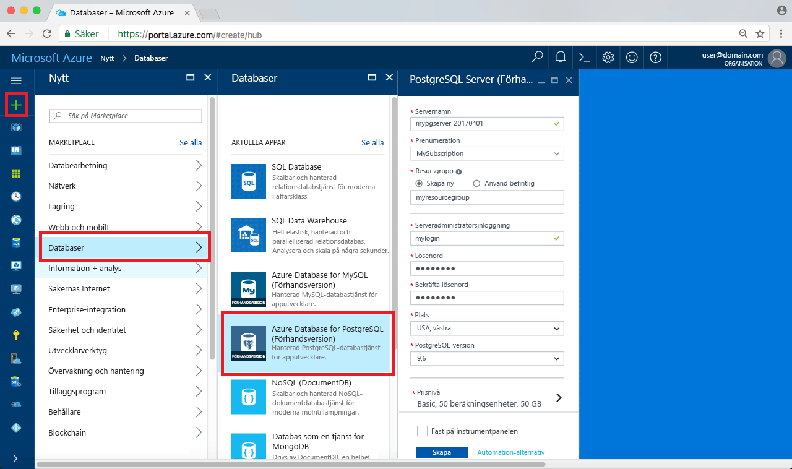
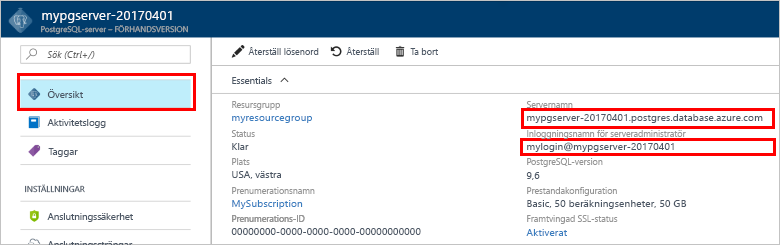

# <a name="design-your-first-azure-database-for-postgresql-using-hello-azure-portal"></a><span data-ttu-id="65f00-103">Utforma din första Azure-databas för PostgreSQL med hello Azure-portalen</span><span class="sxs-lookup"><span data-stu-id="65f00-103">Design your first Azure Database for PostgreSQL using hello Azure portal</span></span>

<span data-ttu-id="65f00-104">Azure PostgreSQL-databas är en hanterad tjänst som gör att du toorun, hantera och skala högtillgänglig PostgreSQL-databaser i hello molnet.</span><span class="sxs-lookup"><span data-stu-id="65f00-104">Azure Database for PostgreSQL is a managed service that enables you toorun, manage, and scale highly available PostgreSQL databases in hello cloud.</span></span> <span data-ttu-id="65f00-105">Med hello Azure-portalen kan du enkelt hantera servern och skapar en databas.</span><span class="sxs-lookup"><span data-stu-id="65f00-105">Using hello Azure portal, you can easily manage your server and design a database.</span></span>

<span data-ttu-id="65f00-106">I den här kursen använder du hello Azure portal toolearn hur till:</span><span class="sxs-lookup"><span data-stu-id="65f00-106">In this tutorial, you use hello Azure portal toolearn how to:</span></span>
> [!div class="checklist"]
> * <span data-ttu-id="65f00-107">Skapa en Azure Database för PostgreSQL</span><span class="sxs-lookup"><span data-stu-id="65f00-107">Create an Azure Database for PostgreSQL</span></span>
> * <span data-ttu-id="65f00-108">Konfigurera hello serverbrandvägg</span><span class="sxs-lookup"><span data-stu-id="65f00-108">Configure hello server firewall</span></span>
> * <span data-ttu-id="65f00-109">Använd [ **psql** ](https://www.postgresql.org/docs/9.6/static/app-psql.html) toocreate verktyget en databas</span><span class="sxs-lookup"><span data-stu-id="65f00-109">Use [**psql**](https://www.postgresql.org/docs/9.6/static/app-psql.html) utility toocreate a database</span></span>
> * <span data-ttu-id="65f00-110">Läs in exempeldata</span><span class="sxs-lookup"><span data-stu-id="65f00-110">Load sample data</span></span>
> * <span data-ttu-id="65f00-111">Frågedata</span><span class="sxs-lookup"><span data-stu-id="65f00-111">Query data</span></span>
> * <span data-ttu-id="65f00-112">Uppdatera data</span><span class="sxs-lookup"><span data-stu-id="65f00-112">Update data</span></span>
> * <span data-ttu-id="65f00-113">Återställa data</span><span class="sxs-lookup"><span data-stu-id="65f00-113">Restore data</span></span>

## <a name="prerequisites"></a><span data-ttu-id="65f00-114">Krav</span><span class="sxs-lookup"><span data-stu-id="65f00-114">Prerequisites</span></span>
<span data-ttu-id="65f00-115">Om du inte har en Azure-prenumeration kan du skapa ett [kostnadsfritt](https://azure.microsoft.com/free/) konto innan du börjar.</span><span class="sxs-lookup"><span data-stu-id="65f00-115">If you don't have an Azure subscription, create a [free](https://azure.microsoft.com/free/) account before you begin.</span></span>

## <a name="log-in-toohello-azure-portal"></a><span data-ttu-id="65f00-116">Logga in toohello Azure-portalen</span><span class="sxs-lookup"><span data-stu-id="65f00-116">Log in toohello Azure portal</span></span>
<span data-ttu-id="65f00-117">Logga in toohello [Azure-portalen](https://portal.azure.com).</span><span class="sxs-lookup"><span data-stu-id="65f00-117">Log in toohello [Azure portal](https://portal.azure.com).</span></span>

## <a name="create-an-azure-database-for-postgresql"></a><span data-ttu-id="65f00-118">Skapa en Azure Database för PostgreSQL</span><span class="sxs-lookup"><span data-stu-id="65f00-118">Create an Azure Database for PostgreSQL</span></span>

<span data-ttu-id="65f00-119">En Azure Database för PostgreSQL-server skapas med en definierad uppsättning [compute- och lagringsresurser](./concepts-compute-unit-and-storage.md).</span><span class="sxs-lookup"><span data-stu-id="65f00-119">An Azure Database for PostgreSQL server is created with a defined set of [compute and storage resources](./concepts-compute-unit-and-storage.md).</span></span> <span data-ttu-id="65f00-120">hello server skapas inom en [Azure-resursgrupp](../azure-resource-manager/resource-group-overview.md).</span><span class="sxs-lookup"><span data-stu-id="65f00-120">hello server is created within an [Azure resource group](../azure-resource-manager/resource-group-overview.md).</span></span>

<span data-ttu-id="65f00-121">Följ dessa steg toocreate en Azure-databas för PostgreSQL-server:</span><span class="sxs-lookup"><span data-stu-id="65f00-121">Follow these steps toocreate an Azure Database for PostgreSQL server:</span></span>
1.  <span data-ttu-id="65f00-122">Klicka på hello **+ ny** knappen hittades på hello övre vänstra hörnet av hello Azure-portalen.</span><span class="sxs-lookup"><span data-stu-id="65f00-122">Click hello **+ New**  button found on hello upper left-hand corner of hello Azure portal.</span></span>
2.  <span data-ttu-id="65f00-123">Välj **databaser** från hello **ny** och väljer **Azure-databas för PostgreSQL** från hello **databaser** sidan.</span><span class="sxs-lookup"><span data-stu-id="65f00-123">Select **Databases** from hello **New** page, and select **Azure Database for PostgreSQL** from hello **Databases** page.</span></span>
 <span data-ttu-id="65f00-124"></span><span class="sxs-lookup"><span data-stu-id="65f00-124"></span></span>

3.  <span data-ttu-id="65f00-125">Fyll i formuläret om hello nya servern information med hello följande information som visas i föregående bild hello:</span><span class="sxs-lookup"><span data-stu-id="65f00-125">Fill out hello new server details form with hello following information, as shown on hello preceding image:</span></span>
    - <span data-ttu-id="65f00-126">Servernamn: **mypgserver 20170401** (namnet på en server mappar tooDNS namn och är därför krävs toobe globalt unik)</span><span class="sxs-lookup"><span data-stu-id="65f00-126">Server name: **mypgserver-20170401** (name of a server maps tooDNS name and is thus required toobe globally unique)</span></span> 
    - <span data-ttu-id="65f00-127">Prenumerationen: Om du har flera prenumerationer, Välj hello lämpliga prenumeration där hello resursen finns eller faktureras för.</span><span class="sxs-lookup"><span data-stu-id="65f00-127">Subscription: If you have multiple subscriptions, choose hello appropriate subscription in which hello resource exists or is billed for.</span></span>
    - <span data-ttu-id="65f00-128">Resursgrupp: **myresourcegroup**</span><span class="sxs-lookup"><span data-stu-id="65f00-128">Resource group: **myresourcegroup**</span></span>
    - <span data-ttu-id="65f00-129">Valfritt inloggningsnamn och lösenord för serveradministratören</span><span class="sxs-lookup"><span data-stu-id="65f00-129">Server admin login and password of your choice</span></span>
    - <span data-ttu-id="65f00-130">Plats</span><span class="sxs-lookup"><span data-stu-id="65f00-130">Location</span></span>
    - <span data-ttu-id="65f00-131">PostgreSQL-version</span><span class="sxs-lookup"><span data-stu-id="65f00-131">PostgreSQL Version</span></span>

  > [!IMPORTANT]
  > <span data-ttu-id="65f00-132">hello server admin inloggningsnamn och lösenord som du anger här är nödvändig toolog i toohello server och databaserna senare i den här snabbstartsguide.</span><span class="sxs-lookup"><span data-stu-id="65f00-132">hello server admin login and password that you specify here are required toolog in toohello server and its databases later in this quick start.</span></span> <span data-ttu-id="65f00-133">Kom ihåg eller skriv ned den här informationen så att du kan använda den senare.</span><span class="sxs-lookup"><span data-stu-id="65f00-133">Remember or record this information for later use.</span></span>

4.  <span data-ttu-id="65f00-134">Klicka på **prisnivå** toospecify hello tjänstnivå och prestandanivå servicenivå för den nya databasen.</span><span class="sxs-lookup"><span data-stu-id="65f00-134">Click **Pricing tier** toospecify hello service tier and performance level for your new database.</span></span> <span data-ttu-id="65f00-135">I den här snabbstarten väljer du **Basic**-nivå **50 compute-enheter** och **50 GB** lagringsutrymme.</span><span class="sxs-lookup"><span data-stu-id="65f00-135">For this quick start, select **Basic** Tier, **50 Compute Units** and **50 GB** of included storage.</span></span>
 <span data-ttu-id="65f00-136"></span><span class="sxs-lookup"><span data-stu-id="65f00-136"></span></span>
5.  <span data-ttu-id="65f00-137">Klicka på **OK**.</span><span class="sxs-lookup"><span data-stu-id="65f00-137">Click **Ok**.</span></span>
6.  <span data-ttu-id="65f00-138">Klicka på **skapa** tooprovision hello server.</span><span class="sxs-lookup"><span data-stu-id="65f00-138">Click **Create** tooprovision hello server.</span></span> <span data-ttu-id="65f00-139">Etableringen tar några minuter.</span><span class="sxs-lookup"><span data-stu-id="65f00-139">Provisioning takes a few minutes.</span></span>

  > [!TIP]
  > <span data-ttu-id="65f00-140">Kontrollera hello **PIN-kod toodashboard** alternativet tooallow enkel spårning av dina distributioner.</span><span class="sxs-lookup"><span data-stu-id="65f00-140">Check hello **Pin toodashboard** option tooallow easy tracking of your deployments.</span></span>

7.  <span data-ttu-id="65f00-141">På verktygsfältet hello **meddelanden** toomonitor hello distributionsprocessen.</span><span class="sxs-lookup"><span data-stu-id="65f00-141">On hello toolbar, click **Notifications** toomonitor hello deployment process.</span></span>
 <span data-ttu-id="65f00-142"></span><span class="sxs-lookup"><span data-stu-id="65f00-142"></span></span>
   
  <span data-ttu-id="65f00-143">Som standard skapas **postgres**-databasen under din server.</span><span class="sxs-lookup"><span data-stu-id="65f00-143">By default, **postgres** database gets created under your server.</span></span> <span data-ttu-id="65f00-144">Hej [postgres](https://www.postgresql.org/docs/9.6/static/app-initdb.html) databasen är en standarddatabas som är avsedd för användning av användare, verktyg och program från tredje part.</span><span class="sxs-lookup"><span data-stu-id="65f00-144">hello [postgres](https://www.postgresql.org/docs/9.6/static/app-initdb.html) database is a default database meant for use by users, utilities, and third-party applications.</span></span> 

## <a name="configure-a-server-level-firewall-rule"></a><span data-ttu-id="65f00-145">Konfigurera en brandväggsregel på servernivå</span><span class="sxs-lookup"><span data-stu-id="65f00-145">Configure a server-level firewall rule</span></span>

<span data-ttu-id="65f00-146">hello Azure-databas för PostgreSQL-tjänsten skapar en brandvägg på servernivå för hello.</span><span class="sxs-lookup"><span data-stu-id="65f00-146">hello Azure Database for PostgreSQL service creates a firewall at hello server-level.</span></span> <span data-ttu-id="65f00-147">Den här brandväggen förhindrar externa program och verktyg ansluter toohello server och alla databaser på servern hello såvida inte en brandväggsregel skapas tooopen hello-brandväggen för specifika IP-adresser.</span><span class="sxs-lookup"><span data-stu-id="65f00-147">This firewall prevents external applications and tools from connecting toohello server and any databases on hello server unless a firewall rule is created tooopen hello firewall for specific IP addresses.</span></span> 

1.  <span data-ttu-id="65f00-148">När hello distributionen är klar klickar du på **alla resurser** från hello vänstra menyn och Skriv hello namn **mypgserver 20170401** toosearch för den nya servern.</span><span class="sxs-lookup"><span data-stu-id="65f00-148">After hello deployment completes, click **All Resources** from hello left-hand menu and type in hello name **mypgserver-20170401** toosearch for your newly created server.</span></span> <span data-ttu-id="65f00-149">Klicka på hello servernamn som anges i hello sökresultatet.</span><span class="sxs-lookup"><span data-stu-id="65f00-149">Click hello server name listed in hello search result.</span></span> <span data-ttu-id="65f00-150">Hej **översikt** sidan för servern öppnas och visar alternativ för ytterligare konfiguration.</span><span class="sxs-lookup"><span data-stu-id="65f00-150">hello **Overview** page for your server opens and provides options for further configuration.</span></span>
 
 

2.  <span data-ttu-id="65f00-152">Markera i hello serverblad **anslutningssäkerhet**.</span><span class="sxs-lookup"><span data-stu-id="65f00-152">In hello server blade, select **Connection Security**.</span></span> 
3.  <span data-ttu-id="65f00-153">Klicka i hello textruta under **Regelnamn** och lägga till en ny brandvägg regeln toowhitelist hello IP-intervall för anslutningen.</span><span class="sxs-lookup"><span data-stu-id="65f00-153">Click in hello text box under **Rule Name,** and add a new firewall rule toowhitelist hello IP range for connectivity.</span></span> <span data-ttu-id="65f00-154">För den här självstudiekursen kommer vi att alla IP-adresser genom att skriva in **Regelnamnet = AllowAllIps**, **första IP-= 0.0.0.0** och **sista IP = 255.255.255.255** och klicka sedan på **spara** .</span><span class="sxs-lookup"><span data-stu-id="65f00-154">For this tutorial, let's allow all IPs by typing in **Rule Name = AllowAllIps**, **Start IP = 0.0.0.0** and **End IP = 255.255.255.255** and then click **Save**.</span></span> <span data-ttu-id="65f00-155">Du kan ange en brandväggsregel som omfattar en IP-intervallet toobe kan tooconnect från nätverket.</span><span class="sxs-lookup"><span data-stu-id="65f00-155">You can set a firewall rule that covers an IP range toobe able tooconnect from your network.</span></span>
 
 

4.  <span data-ttu-id="65f00-157">Klicka på **spara** och klicka sedan på hello **X** tooclose hello **anslutningssäkerhet** sidan.</span><span class="sxs-lookup"><span data-stu-id="65f00-157">Click **Save** and then click hello **X** tooclose hello **Connections Security** page.</span></span>

  > [!NOTE]
  > <span data-ttu-id="65f00-158">Azure PostgreSQL-servern kommunicerar via port 5432.</span><span class="sxs-lookup"><span data-stu-id="65f00-158">Azure PostgreSQL server communicates over port 5432.</span></span> <span data-ttu-id="65f00-159">Om du försöker tooconnect från ett företagsnätverk, tillåtas utgående trafik via port 5432 inte av ditt nätverks brandvägg.</span><span class="sxs-lookup"><span data-stu-id="65f00-159">If you are trying tooconnect from within a corporate network, outbound traffic over port 5432 may not be allowed by your network's firewall.</span></span> <span data-ttu-id="65f00-160">I så fall, blir inte kan tooconnect tooyour Azure SQL Database-server om din IT-avdelning öppnar port 5432.</span><span class="sxs-lookup"><span data-stu-id="65f00-160">If so, you will not be able tooconnect tooyour Azure SQL Database server unless your IT department opens port 5432.</span></span>
  >


## <a name="get-hello-connection-information"></a><span data-ttu-id="65f00-161">Hämta hello anslutningsinformation</span><span class="sxs-lookup"><span data-stu-id="65f00-161">Get hello connection information</span></span>

<span data-ttu-id="65f00-162">När vi skapade vår Azure-databas för PostgreSQL server hello standard **postgres** databasen dessutom hämtar skapas.</span><span class="sxs-lookup"><span data-stu-id="65f00-162">When we created our Azure Database for PostgreSQL server, hello default **postgres** database also gets created.</span></span> <span data-ttu-id="65f00-163">tooconnect tooyour databasserver, behöver du tooprovide värden information och åtkomst-autentiseringsuppgifter.</span><span class="sxs-lookup"><span data-stu-id="65f00-163">tooconnect tooyour database server, you need tooprovide host information and access credentials.</span></span>

1. <span data-ttu-id="65f00-164">Hello vänstra menyn i Azure-portalen klickar du på **alla resurser** och Sök efter hello-server som du just har skapat **mypgserver 20170401**.</span><span class="sxs-lookup"><span data-stu-id="65f00-164">From hello left-hand menu in Azure portal, click **All resources** and search for hello server you just created **mypgserver-20170401**.</span></span>

  

3. <span data-ttu-id="65f00-166">Klicka på servernamnet för hello **mypgserver 20170401**.</span><span class="sxs-lookup"><span data-stu-id="65f00-166">Click hello server name **mypgserver-20170401**.</span></span>
4. <span data-ttu-id="65f00-167">Välj hello server **översikt** sidan.</span><span class="sxs-lookup"><span data-stu-id="65f00-167">Select hello server's **Overview** page.</span></span> <span data-ttu-id="65f00-168">Anteckna hello **servernamn** och **serverinloggningsnamnet för admin**.</span><span class="sxs-lookup"><span data-stu-id="65f00-168">Make a note of hello **Server name** and **Server admin login name**.</span></span>

 


## <a name="connect-toopostgresql-database-using-psql-in-cloud-shell"></a><span data-ttu-id="65f00-170">Ansluta tooPostgreSQL databasen med hjälp av psql i molnet Shell</span><span class="sxs-lookup"><span data-stu-id="65f00-170">Connect tooPostgreSQL database using psql in Cloud Shell</span></span>

<span data-ttu-id="65f00-171">Vi använder nu hello psql kommandoradsverktyget tooconnect toohello Azure-databas för PostgreSQL-server.</span><span class="sxs-lookup"><span data-stu-id="65f00-171">Let's now use hello psql command-line utility tooconnect toohello Azure Database for PostgreSQL server.</span></span> 
1. <span data-ttu-id="65f00-172">Starta hello Azure Cloud Shell via hello terminal ikon på hello övre navigeringsfönstret.</span><span class="sxs-lookup"><span data-stu-id="65f00-172">Launch hello Azure Cloud Shell via hello terminal icon on hello top navigation pane.</span></span>

   

2. <span data-ttu-id="65f00-174">hello Azure Cloud Shell öppnas i webbläsaren, vilket gör att du tootype bash-kommandon.</span><span class="sxs-lookup"><span data-stu-id="65f00-174">hello Azure Cloud Shell opens in your browser, enabling you tootype bash commands.</span></span>

   

3. <span data-ttu-id="65f00-176">Ansluta tooyour Azure-databas för PostgreSQL-server med hello psql kommandon i Kommandotolken hello molnet Shell.</span><span class="sxs-lookup"><span data-stu-id="65f00-176">At hello Cloud Shell prompt, connect tooyour Azure Database for PostgreSQL server using hello psql commands.</span></span> <span data-ttu-id="65f00-177">hello följande format är används tooconnect tooan Azure-databas för PostgreSQL-server med hello [psql](https://www.postgresql.org/docs/9.6/static/app-psql.html) verktyget:</span><span class="sxs-lookup"><span data-stu-id="65f00-177">hello following format is used tooconnect tooan Azure Database for PostgreSQL server with hello [psql](https://www.postgresql.org/docs/9.6/static/app-psql.html) utility:</span></span>
   ```bash
   psql --host=<myserver> --port=<port> --username=<server admin login> --dbname=<database name>
   ```

   <span data-ttu-id="65f00-178">Till exempel följande kommando hello ansluter toohello standarddatabasen kallas **postgres** på servern PostgreSQL **mypgserver 20170401.postgres.database.azure.com** hjälp av autentiseringsuppgifter.</span><span class="sxs-lookup"><span data-stu-id="65f00-178">For example, hello following command connects toohello default database called **postgres** on your PostgreSQL server **mypgserver-20170401.postgres.database.azure.com** using access credentials.</span></span> <span data-ttu-id="65f00-179">Ange ditt lösenord för serveradministratören när du uppmanas till detta.</span><span class="sxs-lookup"><span data-stu-id="65f00-179">Enter your server admin password when prompted.</span></span>

   ```bash
   psql --host=mypgserver-20170401.postgres.database.azure.com --port=5432 --username=mylogin@mypgserver-20170401 --dbname=postgres
   ```

## <a name="create-a-new-database"></a><span data-ttu-id="65f00-180">Skapa en ny databas</span><span class="sxs-lookup"><span data-stu-id="65f00-180">Create a New Database</span></span>
<span data-ttu-id="65f00-181">När du är ansluten toohello server kan du skapa en tom databas hello i Kommandotolken.</span><span class="sxs-lookup"><span data-stu-id="65f00-181">Once you're connected toohello server, create a blank database at hello prompt.</span></span>
```bash
CREATE DATABASE mypgsqldb;
```

<span data-ttu-id="65f00-182">I Kommandotolken hello köra hello efter kommandot tooswitch toohello nyskapad databas **mypgsqldb**.</span><span class="sxs-lookup"><span data-stu-id="65f00-182">At hello prompt, execute hello following command tooswitch connection toohello newly created database **mypgsqldb**.</span></span>
```bash
\c mypgsqldb
```
## <a name="create-tables-in-hello-database"></a><span data-ttu-id="65f00-183">Skapa tabeller i hello-databas</span><span class="sxs-lookup"><span data-stu-id="65f00-183">Create tables in hello database</span></span>
<span data-ttu-id="65f00-184">Nu när du vet hur tooconnect toohello Azure-databas för PostgreSQL vi kan gå igenom hur toocomplete vissa grundläggande uppgifter.</span><span class="sxs-lookup"><span data-stu-id="65f00-184">Now that you know how tooconnect toohello Azure Database for PostgreSQL, we can go over how toocomplete some basic tasks.</span></span>

<span data-ttu-id="65f00-185">Vi kan först skapa en tabell och läsa in den med vissa data.</span><span class="sxs-lookup"><span data-stu-id="65f00-185">First, we can create a table and load it with some data.</span></span> <span data-ttu-id="65f00-186">Nu ska vi skapa en tabell som spårar inventeringsinformation.</span><span class="sxs-lookup"><span data-stu-id="65f00-186">Let's create a table that tracks inventory information.</span></span>
```sql
CREATE TABLE inventory (
    id serial PRIMARY KEY, 
    name VARCHAR(50), 
    quantity INTEGER
);
```

<span data-ttu-id="65f00-187">Du kan se hello nyligen skapade tabellen i hello lista över tabvles nu genom att skriva:</span><span class="sxs-lookup"><span data-stu-id="65f00-187">You can see hello newly created table in hello list of tabvles now by typing:</span></span>
```sql
\dt
```

## <a name="load-data-into-hello-tables"></a><span data-ttu-id="65f00-188">Läs in data till hello tabeller</span><span class="sxs-lookup"><span data-stu-id="65f00-188">Load data into hello tables</span></span>
<span data-ttu-id="65f00-189">Nu när vi har en tabell kan vi infoga vissa data i den.</span><span class="sxs-lookup"><span data-stu-id="65f00-189">Now that we have a table, we can insert some data into it.</span></span> <span data-ttu-id="65f00-190">Kör följande fråga tooinsert hello vissa rader med data vid hello öppna Kommandotolkens fönster</span><span class="sxs-lookup"><span data-stu-id="65f00-190">At hello open command prompt window, run hello following query tooinsert some rows of data</span></span>
```sql
INSERT INTO inventory (id, name, quantity) VALUES (1, 'banana', 150); 
INSERT INTO inventory (id, name, quantity) VALUES (2, 'orange', 154);
```

<span data-ttu-id="65f00-191">Du har nu två rader med exempeldata till hello-tabell som du skapade tidigare.</span><span class="sxs-lookup"><span data-stu-id="65f00-191">You have now two rows of sample data into hello table you created earlier.</span></span>

## <a name="query-and-update-hello-data-in-hello-tables"></a><span data-ttu-id="65f00-192">Fråga efter och uppdatera hello data i hello tabeller</span><span class="sxs-lookup"><span data-stu-id="65f00-192">Query and update hello data in hello tables</span></span>
<span data-ttu-id="65f00-193">Kör följande fråga tooretrieve information från hello databastabell hello.</span><span class="sxs-lookup"><span data-stu-id="65f00-193">Execute hello following query tooretrieve information from hello database table.</span></span> 
```sql
SELECT * FROM inventory;
```

<span data-ttu-id="65f00-194">Du kan också uppdatera hello data i hello tabeller</span><span class="sxs-lookup"><span data-stu-id="65f00-194">You can also update hello data in hello tables</span></span>
```sql
UPDATE inventory SET quantity = 200 WHERE name = 'banana';
```

<span data-ttu-id="65f00-195">hello rad uppdateras i enlighet med detta när du hämtar data.</span><span class="sxs-lookup"><span data-stu-id="65f00-195">hello row gets updated accordingly when you retrieve data.</span></span>
```sql
SELECT * FROM inventory;
```

## <a name="restore-data-tooa-previous-point-in-time"></a><span data-ttu-id="65f00-196">Återställa data tooa tidigare punkt i tiden</span><span class="sxs-lookup"><span data-stu-id="65f00-196">Restore data tooa previous point in time</span></span>
<span data-ttu-id="65f00-197">Anta att du av misstag har tagit bort den här tabellen.</span><span class="sxs-lookup"><span data-stu-id="65f00-197">Imagine you have accidentally deleted this table.</span></span> <span data-ttu-id="65f00-198">Den här situationen är något som du lätt kan återställa från.</span><span class="sxs-lookup"><span data-stu-id="65f00-198">This situation is something you cannot easily recover from.</span></span> <span data-ttu-id="65f00-199">Azure PostgreSQL-databas kan du toogo tillbaka tooany i tidpunkt (i hello senast too7 dagar (grundläggande) och 35 dagar (Standard)) och återställa den här nya tooa point-in-time-servern.</span><span class="sxs-lookup"><span data-stu-id="65f00-199">Azure Database for PostgreSQL allows you toogo back tooany point-in-time (in hello last up too7 days (Basic) and 35 days (Standard)) and restore this point-in-time tooa new server.</span></span> <span data-ttu-id="65f00-200">Du kan använda den här nya servern toorecover dina data.</span><span class="sxs-lookup"><span data-stu-id="65f00-200">You can use this new server toorecover your deleted data.</span></span> <span data-ttu-id="65f00-201">hello följande steg hello exempel server tooa återställningspunkt innan hello tabell har lagts till.</span><span class="sxs-lookup"><span data-stu-id="65f00-201">hello following steps restore hello sample server tooa point before hello table was added.</span></span>

1.  <span data-ttu-id="65f00-202">Klicka på hello Azure-databas för PostgreSQL-sidan för servern, **återställa** hello i verktygsfältet.</span><span class="sxs-lookup"><span data-stu-id="65f00-202">On hello Azure Database for PostgreSQL page for your server, click **Restore** on hello toolbar.</span></span> <span data-ttu-id="65f00-203">Hej **återställa** öppnas.</span><span class="sxs-lookup"><span data-stu-id="65f00-203">hello **Restore** page opens.</span></span>
  <span data-ttu-id="65f00-204"></span><span class="sxs-lookup"><span data-stu-id="65f00-204"></span></span>
2.  <span data-ttu-id="65f00-205">Fyll i hello **återställa** formulär med hello krävs information:</span><span class="sxs-lookup"><span data-stu-id="65f00-205">Fill out hello **Restore** form with hello required information:</span></span>

  
  - <span data-ttu-id="65f00-207">**Återställningspunkt**: Välj en i tidpunkt som inträffar innan hello-servern har ändrats</span><span class="sxs-lookup"><span data-stu-id="65f00-207">**Restore point**: Select a point-in-time that occurs before hello server was changed</span></span>
  - <span data-ttu-id="65f00-208">**Målservern**: Ange ett nytt servernamn som du vill toorestore till</span><span class="sxs-lookup"><span data-stu-id="65f00-208">**Target server**: Provide a new server name you want toorestore to</span></span>
  - <span data-ttu-id="65f00-209">**Plats**: du kan inte välja hello region, som standard är det samma som källservern hello</span><span class="sxs-lookup"><span data-stu-id="65f00-209">**Location**: You cannot select hello region, by default it is same as hello source server</span></span>
  - <span data-ttu-id="65f00-210">**Prisnivån**: du kan inte ändra det här värdet när du återställer en server.</span><span class="sxs-lookup"><span data-stu-id="65f00-210">**Pricing tier**: You cannot change this value when restoring a server.</span></span> <span data-ttu-id="65f00-211">Det är samma som hello källservern.</span><span class="sxs-lookup"><span data-stu-id="65f00-211">It is same as hello source server.</span></span> 
3.  <span data-ttu-id="65f00-212">Klicka på **OK** toorestore hello server för[återställa tooa i tidpunkt](./howto-restore-server-portal.md) innan hello tabeller har tagits bort.</span><span class="sxs-lookup"><span data-stu-id="65f00-212">Click **OK** toorestore hello server too[restore tooa point-in-time](./howto-restore-server-portal.md) before hello tables was deleted.</span></span> <span data-ttu-id="65f00-213">Återställa en server tooa olika punkt i tiden skapar en ny server dubbla som hello originalservern av hello tidpunkt du anger, förutsatt att den är i hello kvarhållningsperiod för din [tjänstnivån](./concepts-service-tiers.md).</span><span class="sxs-lookup"><span data-stu-id="65f00-213">Restoring a server tooa different point in time creates a duplicate new server as hello original server as of hello point in time you specify, provided that it is within hello retention period for your [service tier](./concepts-service-tiers.md).</span></span>

## <a name="next-steps"></a><span data-ttu-id="65f00-214">Nästa steg</span><span class="sxs-lookup"><span data-stu-id="65f00-214">Next Steps</span></span>
<span data-ttu-id="65f00-215">I kursen får du lärt dig hur toouse hello Azure-portalen och andra verktyg för att:</span><span class="sxs-lookup"><span data-stu-id="65f00-215">In this tutorial, you learned how toouse hello Azure portal and other utilities to:</span></span>
> [!div class="checklist"]
> * <span data-ttu-id="65f00-216">Skapa en Azure Database för PostgreSQL</span><span class="sxs-lookup"><span data-stu-id="65f00-216">Create an Azure Database for PostgreSQL</span></span>
> * <span data-ttu-id="65f00-217">Konfigurera hello serverbrandvägg</span><span class="sxs-lookup"><span data-stu-id="65f00-217">Configure hello server firewall</span></span>
> * <span data-ttu-id="65f00-218">Använd [ **psql** ](https://www.postgresql.org/docs/9.6/static/app-psql.html) toocreate verktyget en databas</span><span class="sxs-lookup"><span data-stu-id="65f00-218">Use [**psql**](https://www.postgresql.org/docs/9.6/static/app-psql.html) utility toocreate a database</span></span>
> * <span data-ttu-id="65f00-219">Läs in exempeldata</span><span class="sxs-lookup"><span data-stu-id="65f00-219">Load sample data</span></span>
> * <span data-ttu-id="65f00-220">Frågedata</span><span class="sxs-lookup"><span data-stu-id="65f00-220">Query data</span></span>
> * <span data-ttu-id="65f00-221">Uppdatera data</span><span class="sxs-lookup"><span data-stu-id="65f00-221">Update data</span></span>
> * <span data-ttu-id="65f00-222">Återställa data</span><span class="sxs-lookup"><span data-stu-id="65f00-222">Restore data</span></span>

<span data-ttu-id="65f00-223">Lär dig sedan hur toouse Azure CLI toodo liknande uppgifter, granska den här självstudiekursen: [utforma din första Azure-databas för PostgreSQL med Azure CLI](tutorial-design-database-using-azure-cli.md)</span><span class="sxs-lookup"><span data-stu-id="65f00-223">Next, learn how toouse Azure CLI toodo similar tasks, review this tutorial: [Design your first Azure Database for PostgreSQL using Azure CLI](tutorial-design-database-using-azure-cli.md)</span></span>
