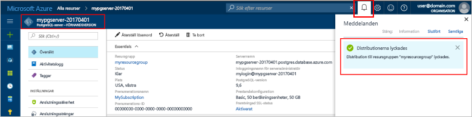

# <a name="design-your-first-azure-database-for-postgresql-using-hello-azure-portal"></a>Utforma din första Azure-databas för PostgreSQL med hello Azure-portalen

Azure PostgreSQL-databas är en hanterad tjänst som gör att du toorun, hantera och skala högtillgänglig PostgreSQL-databaser i hello molnet. Med hello Azure-portalen kan du enkelt hantera servern och skapar en databas.

I den här kursen använder du hello Azure portal toolearn hur till:
> [!div class="checklist"]
> * Skapa en Azure Database för PostgreSQL
> * Konfigurera hello serverbrandvägg
> * Använd [ **psql** ](https://www.postgresql.org/docs/9.6/static/app-psql.html) toocreate verktyget en databas
> * Läs in exempeldata
> * Frågedata
> * Uppdatera data
> * Återställa data

## <a name="prerequisites"></a>Krav
Om du inte har en Azure-prenumeration kan du skapa ett [kostnadsfritt](https://azure.microsoft.com/free/) konto innan du börjar.

## <a name="log-in-toohello-azure-portal"></a>Logga in toohello Azure-portalen
Logga in toohello [Azure-portalen](https://portal.azure.com).

## <a name="create-an-azure-database-for-postgresql"></a>Skapa en Azure Database för PostgreSQL

En Azure Database för PostgreSQL-server skapas med en definierad uppsättning [compute- och lagringsresurser](./concepts-compute-unit-and-storage.md). hello server skapas inom en [Azure-resursgrupp](../azure-resource-manager/resource-group-overview.md).

Följ dessa steg toocreate en Azure-databas för PostgreSQL-server:
1.  Klicka på hello **+ ny** knappen hittades på hello övre vänstra hörnet av hello Azure-portalen.
2.  Välj **databaser** från hello **ny** och väljer **Azure-databas för PostgreSQL** från hello **databaser** sidan.
 

3.  Fyll i formuläret om hello nya servern information med hello följande information som visas i föregående bild hello:
    - Servernamn: **mypgserver 20170401** (namnet på en server mappar tooDNS namn och är därför krävs toobe globalt unik) 
    - Prenumerationen: Om du har flera prenumerationer, Välj hello lämpliga prenumeration där hello resursen finns eller faktureras för.
    - Resursgrupp: **myresourcegroup**
    - Valfritt inloggningsnamn och lösenord för serveradministratören
    - Plats
    - PostgreSQL-version

  > [!IMPORTANT]
  > hello server admin inloggningsnamn och lösenord som du anger här är nödvändig toolog i toohello server och databaserna senare i den här snabbstartsguide. Kom ihåg eller skriv ned den här informationen så att du kan använda den senare.

4.  Klicka på **prisnivå** toospecify hello tjänstnivå och prestandanivå servicenivå för den nya databasen. I den här snabbstarten väljer du **Basic**-nivå **50 compute-enheter** och **50 GB** lagringsutrymme.
 
5.  Klicka på **OK**.
6.  Klicka på **skapa** tooprovision hello server. Etableringen tar några minuter.

  > [!TIP]
  > Kontrollera hello **PIN-kod toodashboard** alternativet tooallow enkel spårning av dina distributioner.

7.  På verktygsfältet hello **meddelanden** toomonitor hello distributionsprocessen.
 
   
  Som standard skapas **postgres**-databasen under din server. Hej [postgres](https://www.postgresql.org/docs/9.6/static/app-initdb.html) databasen är en standarddatabas som är avsedd för användning av användare, verktyg och program från tredje part. 

## <a name="configure-a-server-level-firewall-rule"></a>Konfigurera en brandväggsregel på servernivå

hello Azure-databas för PostgreSQL-tjänsten skapar en brandvägg på servernivå för hello. Den här brandväggen förhindrar externa program och verktyg ansluter toohello server och alla databaser på servern hello såvida inte en brandväggsregel skapas tooopen hello-brandväggen för specifika IP-adresser. 

1.  När hello distributionen är klar klickar du på **alla resurser** från hello vänstra menyn och Skriv hello namn **mypgserver 20170401** toosearch för den nya servern. Klicka på hello servernamn som anges i hello sökresultatet. Hej **översikt** sidan för servern öppnas och visar alternativ för ytterligare konfiguration.
 
 

2.  Markera i hello serverblad **anslutningssäkerhet**. 
3.  Klicka i hello textruta under **Regelnamn** och lägga till en ny brandvägg regeln toowhitelist hello IP-intervall för anslutningen. För den här självstudiekursen kommer vi att alla IP-adresser genom att skriva in **Regelnamnet = AllowAllIps**, **första IP-= 0.0.0.0** och **sista IP = 255.255.255.255** och klicka sedan på **spara** . Du kan ange en brandväggsregel som omfattar en IP-intervallet toobe kan tooconnect från nätverket.
 
 

4.  Klicka på **spara** och klicka sedan på hello **X** tooclose hello **anslutningssäkerhet** sidan.

  > [!NOTE]
  > Azure PostgreSQL-servern kommunicerar via port 5432. Om du försöker tooconnect från ett företagsnätverk, tillåtas utgående trafik via port 5432 inte av ditt nätverks brandvägg. I så fall, blir inte kan tooconnect tooyour Azure SQL Database-server om din IT-avdelning öppnar port 5432.
  >


## <a name="get-hello-connection-information"></a>Hämta hello anslutningsinformation

När vi skapade vår Azure-databas för PostgreSQL server hello standard **postgres** databasen dessutom hämtar skapas. tooconnect tooyour databasserver, behöver du tooprovide värden information och åtkomst-autentiseringsuppgifter.

1. Hello vänstra menyn i Azure-portalen klickar du på **alla resurser** och Sök efter hello-server som du just har skapat **mypgserver 20170401**.

  

3. Klicka på servernamnet för hello **mypgserver 20170401**.
4. Välj hello server **översikt** sidan. Anteckna hello **servernamn** och **serverinloggningsnamnet för admin**.

 


## <a name="connect-toopostgresql-database-using-psql-in-cloud-shell"></a>Ansluta tooPostgreSQL databasen med hjälp av psql i molnet Shell

Vi använder nu hello psql kommandoradsverktyget tooconnect toohello Azure-databas för PostgreSQL-server. 
1. Starta hello Azure Cloud Shell via hello terminal ikon på hello övre navigeringsfönstret.

   

2. hello Azure Cloud Shell öppnas i webbläsaren, vilket gör att du tootype bash-kommandon.

   

3. Ansluta tooyour Azure-databas för PostgreSQL-server med hello psql kommandon i Kommandotolken hello molnet Shell. hello följande format är används tooconnect tooan Azure-databas för PostgreSQL-server med hello [psql](https://www.postgresql.org/docs/9.6/static/app-psql.html) verktyget:
   ```bash
   psql --host=<myserver> --port=<port> --username=<server admin login> --dbname=<database name>
   ```

   Till exempel följande kommando hello ansluter toohello standarddatabasen kallas **postgres** på servern PostgreSQL **mypgserver 20170401.postgres.database.azure.com** hjälp av autentiseringsuppgifter. Ange ditt lösenord för serveradministratören när du uppmanas till detta.

   ```bash
   psql --host=mypgserver-20170401.postgres.database.azure.com --port=5432 --username=mylogin@mypgserver-20170401 --dbname=postgres
   ```

## <a name="create-a-new-database"></a>Skapa en ny databas
När du är ansluten toohello server kan du skapa en tom databas hello i Kommandotolken.
```bash
CREATE DATABASE mypgsqldb;
```

I Kommandotolken hello köra hello efter kommandot tooswitch toohello nyskapad databas **mypgsqldb**.
```bash
\c mypgsqldb
```
## <a name="create-tables-in-hello-database"></a>Skapa tabeller i hello-databas
Nu när du vet hur tooconnect toohello Azure-databas för PostgreSQL vi kan gå igenom hur toocomplete vissa grundläggande uppgifter.

Vi kan först skapa en tabell och läsa in den med vissa data. Nu ska vi skapa en tabell som spårar inventeringsinformation.
```sql
CREATE TABLE inventory (
    id serial PRIMARY KEY, 
    name VARCHAR(50), 
    quantity INTEGER
);
```

Du kan se hello nyligen skapade tabellen i hello lista över tabvles nu genom att skriva:
```sql
\dt
```

## <a name="load-data-into-hello-tables"></a>Läs in data till hello tabeller
Nu när vi har en tabell kan vi infoga vissa data i den. Kör följande fråga tooinsert hello vissa rader med data vid hello öppna Kommandotolkens fönster
```sql
INSERT INTO inventory (id, name, quantity) VALUES (1, 'banana', 150); 
INSERT INTO inventory (id, name, quantity) VALUES (2, 'orange', 154);
```

Du har nu två rader med exempeldata till hello-tabell som du skapade tidigare.

## <a name="query-and-update-hello-data-in-hello-tables"></a>Fråga efter och uppdatera hello data i hello tabeller
Kör följande fråga tooretrieve information från hello databastabell hello. 
```sql
SELECT * FROM inventory;
```

Du kan också uppdatera hello data i hello tabeller
```sql
UPDATE inventory SET quantity = 200 WHERE name = 'banana';
```

hello rad uppdateras i enlighet med detta när du hämtar data.
```sql
SELECT * FROM inventory;
```

## <a name="restore-data-tooa-previous-point-in-time"></a>Återställa data tooa tidigare punkt i tiden
Anta att du av misstag har tagit bort den här tabellen. Den här situationen är något som du lätt kan återställa från. Azure PostgreSQL-databas kan du toogo tillbaka tooany i tidpunkt (i hello senast too7 dagar (grundläggande) och 35 dagar (Standard)) och återställa den här nya tooa point-in-time-servern. Du kan använda den här nya servern toorecover dina data. hello följande steg hello exempel server tooa återställningspunkt innan hello tabell har lagts till.

1.  Klicka på hello Azure-databas för PostgreSQL-sidan för servern, **återställa** hello i verktygsfältet. Hej **återställa** öppnas.
  
2.  Fyll i hello **återställa** formulär med hello krävs information:

  
  - **Återställningspunkt**: Välj en i tidpunkt som inträffar innan hello-servern har ändrats
  - **Målservern**: Ange ett nytt servernamn som du vill toorestore till
  - **Plats**: du kan inte välja hello region, som standard är det samma som källservern hello
  - **Prisnivån**: du kan inte ändra det här värdet när du återställer en server. Det är samma som hello källservern. 
3.  Klicka på **OK** toorestore hello server för[återställa tooa i tidpunkt](./howto-restore-server-portal.md) innan hello tabeller har tagits bort. Återställa en server tooa olika punkt i tiden skapar en ny server dubbla som hello originalservern av hello tidpunkt du anger, förutsatt att den är i hello kvarhållningsperiod för din [tjänstnivån](./concepts-service-tiers.md).

## <a name="next-steps"></a>Nästa steg
I kursen får du lärt dig hur toouse hello Azure-portalen och andra verktyg för att:
> [!div class="checklist"]
> * Skapa en Azure Database för PostgreSQL
> * Konfigurera hello serverbrandvägg
> * Använd [ **psql** ](https://www.postgresql.org/docs/9.6/static/app-psql.html) toocreate verktyget en databas
> * Läs in exempeldata
> * Frågedata
> * Uppdatera data
> * Återställa data

Lär dig sedan hur toouse Azure CLI toodo liknande uppgifter, granska den här självstudiekursen: [utforma din första Azure-databas för PostgreSQL med Azure CLI](tutorial-design-database-using-azure-cli.md)
