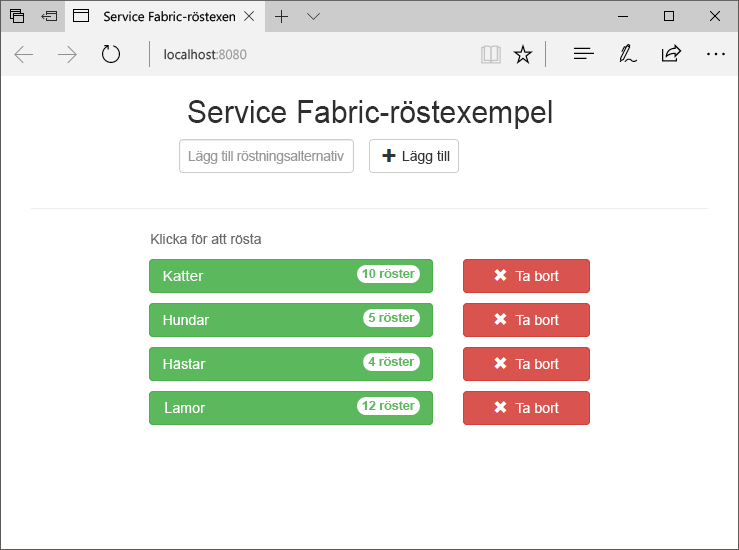
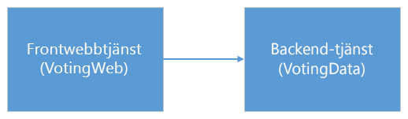
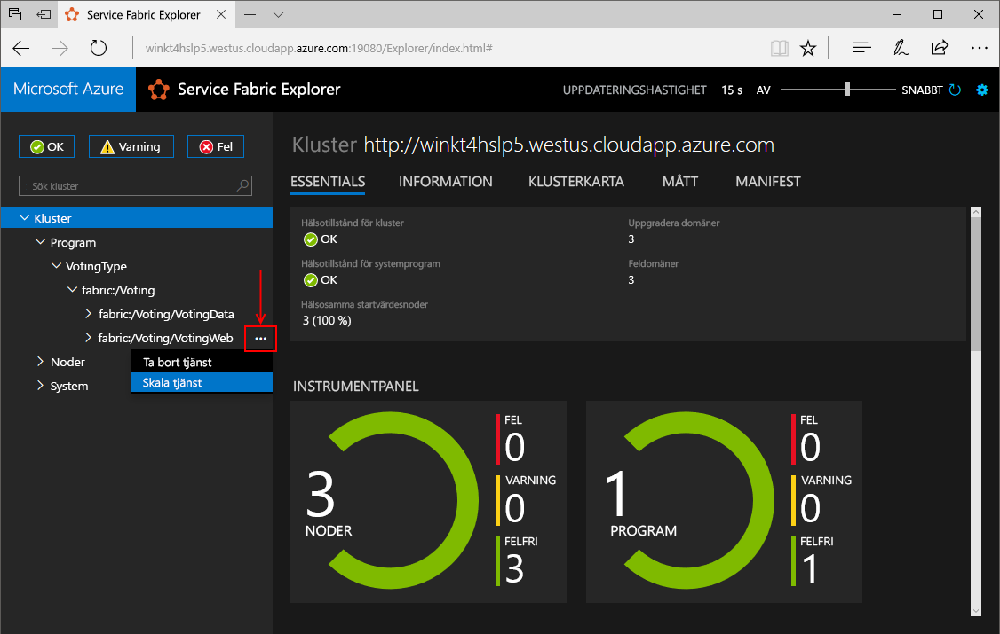
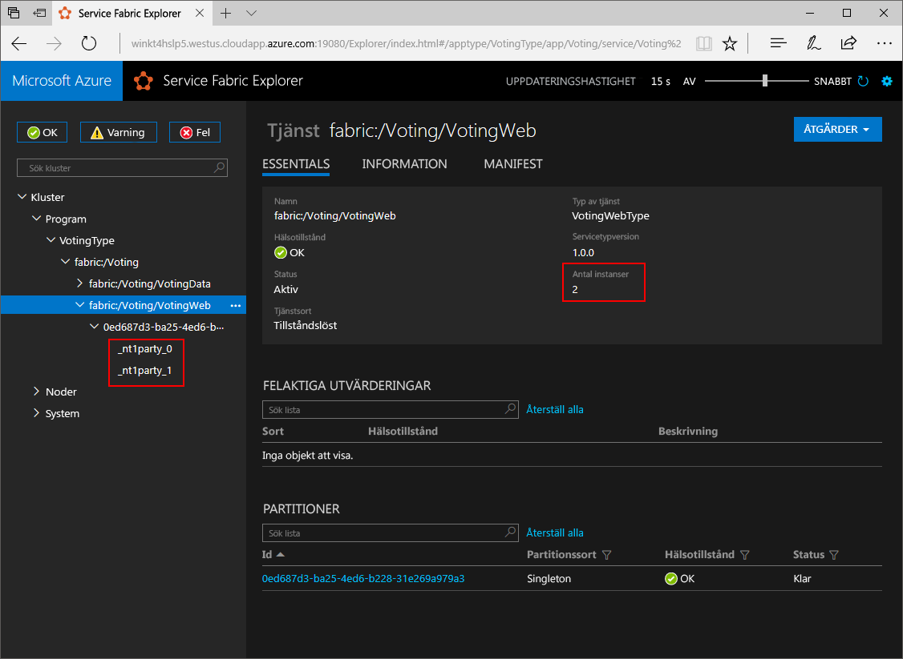
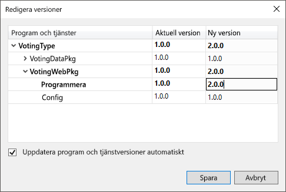
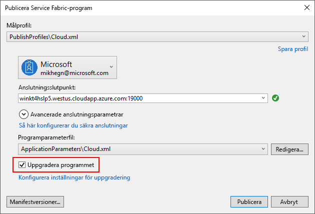
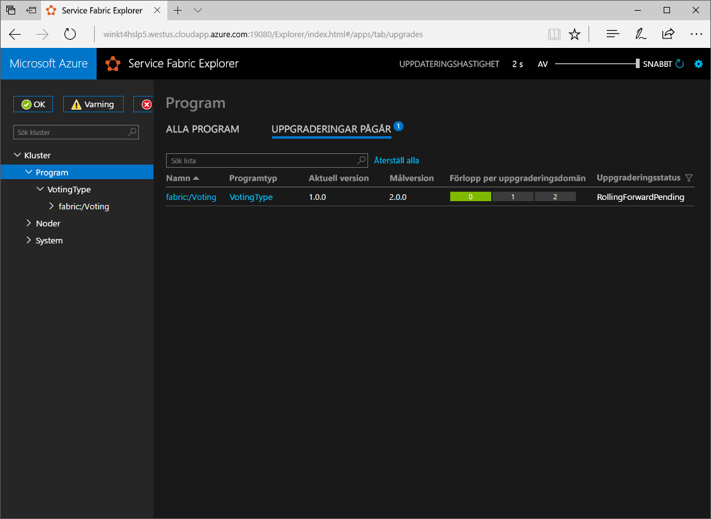

# <a name="create-a-net-service-fabric-application-in-azure"></a>Skapa ett .NET Service Fabric-program i Azure
Azure Service Fabric är en plattform för distribuerade system för distribution och hantering av skalbara och tillförlitliga mikrotjänster och behållare. 

Den här snabbstarten visar hur toodeploy din första .NET application tooService Fabric. När du är klar har röstningsapp med en ASP.NET Core webbklientdelen som sparar röstning resultat i en tillståndskänslig backend-tjänst i hello klustret.



Med det här programmet som du lär dig hur du:
> [!div class="checklist"]
> * Skapa ett program med .NET och Service Fabric
> * Använda ASP.NET core som en webbklientdel
> * Lagra programdata i en tillståndskänslig service
> * Felsöka programmet lokalt
> * Distribuera hello programmet tooa kluster i Azure
> * Skalbar hello program över flera noder
> * Utföra en uppgradering av programmet

## <a name="prerequisites"></a>Krav
toocomplete denna Snabbstart:
1. [Installera Visual Studio 2017](https://www.visualstudio.com/) med hello **Azure-utveckling** och **ASP.NET och web development** arbetsbelastningar.
2. [Installera Git](https://git-scm.com/)
3. [Installera hello Microsoft Azure Service Fabric-SDK](http://www.microsoft.com/web/handlers/webpi.ashx?command=getinstallerredirect&appid=MicrosoftAzure-ServiceFabric-CoreSDK)
4. Kör hello efter kommandot tooenable Visual Studio toodeploy toohello lokala Service Fabric-kluster:
    ```powershell
    Set-ExecutionPolicy -ExecutionPolicy Unrestricted -Force -Scope CurrentUser
    ```

## <a name="download-hello-sample"></a>Hämta hello-exempel
Kör hello efter kommandot tooclone hello exempel app databasen tooyour lokala datorn i ett kommandofönster.
```
git clone https://github.com/Azure-Samples/service-fabric-dotnet-quickstart
```

## <a name="run-hello-application-locally"></a>Kör hello programmet lokalt
Högerklicka på hello Visual Studio-ikonen i hello Start-menyn och välj **kör som administratör**. I ordning tooattach hello felsökare tooyour tjänster behöver du toorun Visual Studio som administratör.

Öppna hello **Voting.sln** Visual Studio-lösning från hello lagringsplats du har klonat.

toodeploy hello program, tryck på **F5**.

> [!NOTE]
> hello skapar första gången du kör och distribuera programmet hello, Visual Studio ett lokala kluster för felsökning. Den här åtgärden kan ta lite tid. hello klustret Skapandestatus visas i utdatafönstret för hello Visual Studio.

När hello distributionen är klar, öppnar en webbläsare och öppna den här sidan: `http://localhost:8080` -hello webbklientdelen av programmet hello.


Du kan nu lägga till en uppsättning röstning alternativ och starta tar röster. hello-program körs och lagrar alla data i ditt Service Fabric-kluster utan hello krävs en separat databas.

## <a name="walk-through-hello-voting-sample-application"></a>Gå igenom hello röstning exempelprogrammet
hello röstning program består av två tjänster:
- Web frontend-tjänst (VotingWeb) – en ASP.NET Core webbtjänsten frontend, vilket fungerar webbsidan hello och visar webb-API: er toocommunicate med hello backend-tjänsten.
- Backend-tjänst (VotingData)-ett ASP.NET Core webbtjänsten, som visar ett API toostore hello rösten resulterar i en tillförlitlig ordlista kvar på disken.



När du rösta i hello programmet hello följande inträffar händelser:
1. En JavaScript skickar hello rösten begäran toohello webb-API i hello Frontend-webbtjänsten som ett HTTP PUT-begäran.

2. hello Frontend-webbtjänsten använder en proxy-toolocate och vidarebefordra en HTTP PUT-begäran toohello backend-tjänst.

3. hello backend-tjänst tar hello inkommande begäran och lagrar hello uppdateras resultera i en tillförlitlig ordlista som hämtar replikerade toomultiple noder i klustret hello och kvar på disken. Alla hello programdata lagras i hello klustret, så det behövs ingen databas.

## <a name="debug-in-visual-studio"></a>Felsökning i Visual Studio
När du felsöker programmet i Visual Studio använder du en lokal utveckling Service Fabric-klustret. Du har hello alternativet tooadjust felsökning upplevelse tooyour scenariot. I det här programmet lagrar vi data i vår backend-tjänst med hjälp av en tillförlitlig ordlista. Visual Studio tar bort hello program per standard när du stoppar hello felsökare. Ta bort programmet hello medför hello data i hello backend-tjänst tooalso tas bort. toopersist hello data mellan felsökning sessioner, kan du ändra hello **programmet felsökningsläge** som en egenskap på hello **Röstningsdatabasen** projekt i Visual Studio.

toolook på vad som händer i hello kod, fullständig hello följande steg:
1. Öppna hello **VotesController.cs** fil och anger en brytpunkt i hello webb-API: er **placera** metod (rad 47) – du kan söka efter hello-filen i hello Solution Explorer i Visual Studio.

2. Öppna hello **VoteDataController.cs** fil och anger en brytpunkt i den här web API **placera** metod (rad 50).

3. Gå tillbaka toohello webbläsare och klicka på ett alternativ för röstning eller lägga till ett nytt alternativ för röstning. Du kan träffa hello första brytpunkt i hello web front slutpunkts api-kontrollanten.
    - Detta är där hello JavaScript i hello webbläsaren skickar en begäran toohello web API-kontrollanten i hello frontend-tjänst.
    
    

    - Först skapar vi hello URL toohello ReverseProxy för vår backend-tjänst **(1)**.
    - Vi skickar hello HTTP PUT-begäran om toohello ReverseProxy **(2)**.
    - Slutligen hello returnerar vi hello svar från hello backend-tjänst toohello klient **(3)**.

4. Tryck på **F5** toocontinue
    - Du är nu vid hello break i hello backend-tjänst.
    
    

    - I hello första raden i hello metoden **(1)** vi använder hello `StateManager` tooget eller Lägg till en tillförlitlig ordlista som heter `counts`.
    - All interaktion med värden i en tillförlitlig ordlista kräver en transaktion detta med hjälp av instruktionen **(2)** skapar den aktuella transaktionen.
    - I hello transaktion vi sedan uppdatera hello värdet för hello relevanta nyckeln för hello röstning alternativet och incheckningar hello åtgärden **(3)**. När hello checkat returnerar metoden hello data uppdateras i hello ordlista och replikeras tooother noder i klustret hello. hello data lagras nu på ett säkert sätt i hello kluster och hello backend-tjänst kan växlas tooother noder och fortfarande har hello data är tillgängliga.
5. Tryck på **F5** toocontinue

toostop hello felsökningssessionen, tryck på **SKIFT + F5**.

## <a name="deploy-hello-application-tooazure"></a>Distribuera hello programmet tooAzure
toodeploy hello programmet tooa klustret i Azure, du kan antingen välja toocreate ditt eget kluster eller Använd en part klustret.

Part kluster är ledigt, tidsbegränsade Service Fabric-kluster i Azure och kör hello Service Fabric-grupp där alla kan distribuera program och lär dig mer om hello-plattformen. tooget åtkomst tooa part klustret [Följ instruktionerna för hello](http://aka.ms/tryservicefabric). 

Information om hur du skapar ett eget kluster finns i [Skapa ditt första Service Fabric-kluster i Azure](service-fabric-get-started-azure-cluster.md).

> [!Note]
> hello Frontend-webbtjänsten är konfigurerade toolisten på port 8080 för inkommande trafik. Se till att den porten är öppen i ditt kluster. Om du använder hello part klustret är den här porten öppen.
>

### <a name="deploy-hello-application-using-visual-studio"></a>Distribuera hello program med hjälp av Visual Studio
Nu när programmet hello är klar, kan du distribuera den tooa kluster direkt från Visual Studio.

1. Högerklicka på **Röstningsdatabasen** hello i Solution Explorer och välj **publicera**. hello publicera dialogrutan visas.

    

2. Ange hello Anslutningens slutpunkt för hello-kluster i hello **Anslutningens slutpunkt** fältet och klickar på **publicera**. När du registrerar dig för hello part klustret tillhandahålls hello Anslutningens slutpunkt i hello webbläsare. – till exempel `winh1x87d1d.westus.cloudapp.azure.com:19000`.

3. Öppna en webbläsare och Skriv i hello klusteradress - exempelvis `http://winh1x87d1d.westus.cloudapp.azure.com`. Du bör nu se hello-program som körs i hello kluster i Azure.


## <a name="scale-applications-and-services-in-a-cluster"></a>Skala program och tjänster i ett kluster
Service Fabric-tjänster kan enkelt skalas över ett kluster tooaccommodate för en ändring i hello belastningen på hello-tjänster. Du kan skala en tjänst genom att ändra hello antalet instanser som körs i hello klustret. Du har flera olika sätt att skala dina tjänster kan du använda skript eller kommandon från PowerShell eller CLI för Service Fabric (sfctl). I det här exemplet använder vi Service Fabric Explorer.

Service Fabric Explorer körs i alla Service Fabric-kluster och kan nås från en webbläsare genom att bläddra toohello kluster HTTP port på hanteringsservern (19080), till exempel `http://winh1x87d1d.westus.cloudapp.azure.com:19080`.

tooscale hello Frontend webbtjänsten, hello följande steg:

1. Öppna Service Fabric Explorer i ditt kluster, till exempel `http://winh1x87d1d.westus.cloudapp.azure.com:19080`.
2. Klicka på nästa toohello för hello ellips (tre punkter) **fabric: / Röstningsdatabasen/VotingWeb** noden i TreeView-kontrollen hello och välj **skala Service**.

    

    Nu kan du välja tooscale hello antal instanser av hello Frontend-webbtjänsten.

3. Ändra hello nummer för**2** och på **skala Service**.
4. Klicka på hello **fabric: / Röstningsdatabasen/VotingWeb** nod i hello trädvy och expandera hello partition nod (representerade av GUID).

    

    Du kan nu se att hello-tjänsten har två instanser och hello trädvyn visas i vilka noder hello-instanser körs på.

Enkel hantering uppgiften dubblerad vi hello-resurser som är tillgängliga för våra klienttjänst tooprocess användare. Det är viktigt toounderstand som du inte behöver flera instanser av en tjänst toohave den köras på ett tillförlitligt sätt. Om en tjänst misslyckas, säkerställer Service Fabric en ny instans av tjänsten som körs i hello klustret.

## <a name="perform-a-rolling-application-upgrade"></a>Utföra en uppgradering av programmet
När du distribuerar nya uppdateringar tooyour programmet samlar Service Fabric ut hello uppdatering på ett säkert sätt. Rullande uppgraderingar får du inget driftstopp medan uppgraderas samt automatisk återställning fel uppstår.

tooupgrade Hej program, hello följande:

1. Öppna hello **Index.cshtml** filen i Visual Studio – du kan söka efter hello-filen i hello Solution Explorer i Visual Studio.
2. Ändra hello rubrik på hello sidan genom att lägga till text - till exempel.
    ```html
        <div class="col-xs-8 col-xs-offset-2 text-center">
            <h2>Service Fabric Voting Sample v2</h2>
        </div>
    ```
3. Spara hello-filen.
4. Högerklicka på **Röstningsdatabasen** hello i Solution Explorer och välj **publicera**. hello publicera dialogrutan visas.
5. Klicka på hello **Manifest Version** knappen toochange hello version av hello-tjänst och program.
6. Ändra hello version av hello **kod** elementet under **VotingWebPkg** för ”2.0.0”, till exempel och klicka på **spara**.

    
7. I hello **publicera Fabric tjänstprogrammet** dialogrutan, kontrollera hello uppgradera hello programmet kryssrutan och klickar på **publicera**.

    
8. Öppna webbläsaren och bläddra till exempel toohello klusteradress på port 19080 - `http://winh1x87d1d.westus.cloudapp.azure.com:19080`.
9. Klicka på hello **program** nod i trädvyn hello och sedan **uppgraderingar pågår** i hello högra rutan. Du ser hur hello uppgraderingen samlas via hello uppgraderingsdomäner i klustret, kontrollera att varje domän är felfri innan du fortsätter toohello nästa.
    

    Service Fabric är uppgraderingar säker väntar på två minuter efter en uppgradering hello-tjänsten på varje nod i klustret hello. Förvänta dig hello hela uppdateringen tootake cirka åtta minuter.

10. Du kan fortfarande använda programmet hello medan hello uppgraderingen är igång. Eftersom du har två instanser av hello-tjänsten som körs i hello kluster, kan vissa av dina begäranden få en uppgraderad version av programmet hello, medan andra kan fortfarande få hello gammal version.

## <a name="next-steps"></a>Nästa steg
I den här snabbstarten har du lärt dig att:

> [!div class="checklist"]
> * Skapa ett program med .NET och Service Fabric
> * Använda ASP.NET core som en webbklientdel
> * Lagra programdata i en tillståndskänslig service
> * Felsöka programmet lokalt
> * Distribuera hello programmet tooa kluster i Azure
> * Skalbar hello program över flera noder
> * Utföra en uppgradering av programmet

toolearn mer om Service Fabric och .NET, ta en titt på den här kursen:
> [!div class="nextstepaction"]
> [.NET-program på Service Fabric](service-fabric-tutorial-create-dotnet-app.md)