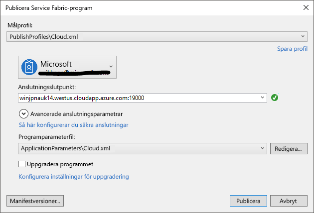

# <a name="deploy-an-application-tooa-party-cluster-in-azure"></a><span data-ttu-id="421fd-103">Distribuera ett program tooa part kluster i Azure</span><span class="sxs-lookup"><span data-stu-id="421fd-103">Deploy an application tooa Party Cluster in Azure</span></span>
<span data-ttu-id="421fd-104">Den här kursen ingår två av en serie och visar hur toodeploy ett Azure Service Fabric application tooa part kluster i Azure.</span><span class="sxs-lookup"><span data-stu-id="421fd-104">This tutorial is part two of a series and shows you how toodeploy an Azure Service Fabric application tooa Party Cluster in Azure.</span></span>

<span data-ttu-id="421fd-105">Del två av hello självstudiekursen serie du lära dig hur du:</span><span class="sxs-lookup"><span data-stu-id="421fd-105">In part two of hello tutorial series, you learn how to:</span></span>
> [!div class="checklist"]
> * <span data-ttu-id="421fd-106">Distribuera ett program tooa remote kluster med hjälp av Visual Studio</span><span class="sxs-lookup"><span data-stu-id="421fd-106">Deploy an application tooa remote cluster using Visual Studio</span></span>
> * <span data-ttu-id="421fd-107">Ta bort ett program från ett kluster med Service Fabric Explorer</span><span class="sxs-lookup"><span data-stu-id="421fd-107">Remove an application from a cluster using Service Fabric Explorer</span></span>

<span data-ttu-id="421fd-108">I den här självstudiekursen serien lär du dig hur du:</span><span class="sxs-lookup"><span data-stu-id="421fd-108">In this tutorial series you learn how to:</span></span>
> [!div class="checklist"]
> * [<span data-ttu-id="421fd-109">Skapa ett .NET Service Fabric-program</span><span class="sxs-lookup"><span data-stu-id="421fd-109">Build a .NET Service Fabric application</span></span>](service-fabric-tutorial-create-dotnet-app.md)
> * <span data-ttu-id="421fd-110">Distribuera programmet hello tooa fjärrkluster</span><span class="sxs-lookup"><span data-stu-id="421fd-110">Deploy hello application tooa remote cluster</span></span>
> * [<span data-ttu-id="421fd-111">Konfigurera CI/CD: N med hjälp av Visual Studio Team Services</span><span class="sxs-lookup"><span data-stu-id="421fd-111">Configure CI/CD using Visual Studio Team Services</span></span>](service-fabric-tutorial-deploy-app-with-cicd-vsts.md)

## <a name="prerequisites"></a><span data-ttu-id="421fd-112">Krav</span><span class="sxs-lookup"><span data-stu-id="421fd-112">Prerequisites</span></span>
<span data-ttu-id="421fd-113">Innan du börjar den här kursen:</span><span class="sxs-lookup"><span data-stu-id="421fd-113">Before you begin this tutorial:</span></span>
- <span data-ttu-id="421fd-114">Om du inte har en Azure-prenumeration kan du skapa en [kostnadsfritt konto](https://azure.microsoft.com/free/?WT.mc_id=A261C142F)</span><span class="sxs-lookup"><span data-stu-id="421fd-114">If you don't have an Azure subscription, create a [free account](https://azure.microsoft.com/free/?WT.mc_id=A261C142F)</span></span>
- <span data-ttu-id="421fd-115">[Installera Visual Studio 2017](https://www.visualstudio.com/) och installera hello **Azure-utveckling** och **ASP.NET och web development** arbetsbelastningar.</span><span class="sxs-lookup"><span data-stu-id="421fd-115">[Install Visual Studio 2017](https://www.visualstudio.com/) and install hello **Azure development** and **ASP.NET and web development** workloads.</span></span>
- [<span data-ttu-id="421fd-116">Installera hello Service Fabric-SDK</span><span class="sxs-lookup"><span data-stu-id="421fd-116">Install hello Service Fabric SDK</span></span>](service-fabric-get-started.md)

## <a name="download-hello-voting-sample-application"></a><span data-ttu-id="421fd-117">Hämta hello röst exempelprogrammet</span><span class="sxs-lookup"><span data-stu-id="421fd-117">Download hello Voting sample application</span></span>
<span data-ttu-id="421fd-118">Om du inte att skapa hello röst exempelprogrammet [ingår i den här självstudiekursen serie](service-fabric-tutorial-create-dotnet-app.md), du kan ladda ned den.</span><span class="sxs-lookup"><span data-stu-id="421fd-118">If you did not build hello Voting sample application in [part one of this tutorial series](service-fabric-tutorial-create-dotnet-app.md), you can download it.</span></span> <span data-ttu-id="421fd-119">Kör hello efter kommandot tooclone hello exempel app databasen tooyour lokala datorn i ett kommandofönster.</span><span class="sxs-lookup"><span data-stu-id="421fd-119">In a command window, run hello following command tooclone hello sample app repository tooyour local machine.</span></span>

```
git clone https://github.com/Azure-Samples/service-fabric-dotnet-quickstart
```

## <a name="set-up-a-party-cluster"></a><span data-ttu-id="421fd-120">Konfigurera en part-kluster</span><span class="sxs-lookup"><span data-stu-id="421fd-120">Set up a Party Cluster</span></span>
<span data-ttu-id="421fd-121">Part kluster är ledigt, tidsbegränsade Service Fabric-kluster i Azure och kör hello Service Fabric-grupp där alla kan distribuera program och lär dig mer om hello-plattformen.</span><span class="sxs-lookup"><span data-stu-id="421fd-121">Party clusters are free, limited-time Service Fabric clusters hosted on Azure and run by hello Service Fabric team where anyone can deploy applications and learn about hello platform.</span></span> <span data-ttu-id="421fd-122">Kostnadsfritt!</span><span class="sxs-lookup"><span data-stu-id="421fd-122">For free!</span></span>

<span data-ttu-id="421fd-123">tooget åtkomst tooa part kluster, bläddra toothis plats: http://aka.ms/tryservicefabric och följ hello instruktioner tooget åtkomst tooa klustret.</span><span class="sxs-lookup"><span data-stu-id="421fd-123">tooget access tooa Party Cluster, browse toothis site: http://aka.ms/tryservicefabric and follow hello instructions tooget access tooa cluster.</span></span> <span data-ttu-id="421fd-124">Du behöver en Facebook eller GitHub-konto tooget åtkomst tooa part klustret.</span><span class="sxs-lookup"><span data-stu-id="421fd-124">You need a Facebook or GitHub account tooget access tooa Party Cluster.</span></span>

> [!NOTE]
> <span data-ttu-id="421fd-125">Part kluster skyddas inte så att dina program och alla data som du lägger till i dem vara synliga tooothers.</span><span class="sxs-lookup"><span data-stu-id="421fd-125">Party clusters are not secured, so your applications and any data you put in them may be visible tooothers.</span></span> <span data-ttu-id="421fd-126">Distribuerar inte något du inte vill att andra toosee.</span><span class="sxs-lookup"><span data-stu-id="421fd-126">Don't deploy anything you don't want others toosee.</span></span> <span data-ttu-id="421fd-127">Vara att tooread via vårt användningsvillkoren för alla hello information.</span><span class="sxs-lookup"><span data-stu-id="421fd-127">Be sure tooread over our Terms of Use for all hello details.</span></span>

## <a name="configure-hello-listening-port"></a><span data-ttu-id="421fd-128">Konfigurera hello lyssningsport</span><span class="sxs-lookup"><span data-stu-id="421fd-128">Configure hello listening port</span></span>
<span data-ttu-id="421fd-129">När hello VotingWeb frontend-tjänst skapas väljer slumpmässigt en port för hello service toolisten på Visual Studio.</span><span class="sxs-lookup"><span data-stu-id="421fd-129">When hello VotingWeb front-end service is created, Visual Studio randomly selects a port for hello service toolisten on.</span></span>  <span data-ttu-id="421fd-130">Hej VotingWeb tjänsten fungerar som frontend för det här programmet hello och godkänner externa trafiken, så vi binda den tjänsten tooa fast och vet port korrekt.</span><span class="sxs-lookup"><span data-stu-id="421fd-130">hello VotingWeb service acts as hello front-end for this application and accepts external traffic, so let's bind that service tooa fixed and well-know port.</span></span> <span data-ttu-id="421fd-131">I Solution Explorer öppnar *VotingWeb/PackageRoot/ServiceManifest.xml*.</span><span class="sxs-lookup"><span data-stu-id="421fd-131">In Solution Explorer, open  *VotingWeb/PackageRoot/ServiceManifest.xml*.</span></span>  <span data-ttu-id="421fd-132">Hitta hello **Endpoint** resurs i hello **resurser** avsnittet och ändra hello **Port** värdet too80.</span><span class="sxs-lookup"><span data-stu-id="421fd-132">Find hello **Endpoint** resource in hello **Resources** section and change hello **Port** value too80.</span></span>

```xml
<Resources>
    <Endpoints>
      <!-- This endpoint is used by hello communication listener tooobtain hello port on which too
           listen. Please note that if your service is partitioned, this port is shared with 
           replicas of different partitions that are placed in your code. -->
      <Endpoint Protocol="http" Name="ServiceEndpoint" Type="Input" Port="80" />
    </Endpoints>
  </Resources>
```

<span data-ttu-id="421fd-133">Uppdatera också hello programmets URL egenskapsvärdet i hello röst-projektet så att en webbläsare öppnas toohello rätt port när du felsöker med 'F5'.</span><span class="sxs-lookup"><span data-stu-id="421fd-133">Also update hello Application URL property value in hello Voting project so a web browser opens toohello correct port when you debug using 'F5'.</span></span>  <span data-ttu-id="421fd-134">Välj hello i Solution Explorer **Röstningsdatabasen** projekt och uppdatera hello **programmets URL** egenskapen.</span><span class="sxs-lookup"><span data-stu-id="421fd-134">In Solution Explorer, select hello **Voting** project and update hello **Application URL** property.</span></span>


## <a name="deploy-hello-app-toohello-azure"></a><span data-ttu-id="421fd-136">Distribuera hello app toohello Azure</span><span class="sxs-lookup"><span data-stu-id="421fd-136">Deploy hello app toohello Azure</span></span>
<span data-ttu-id="421fd-137">Nu när programmet hello är klar, kan du distribuera den toohello part klustret direkt från Visual Studio.</span><span class="sxs-lookup"><span data-stu-id="421fd-137">Now that hello application is ready, you can deploy it toohello Party Cluster direct from Visual Studio.</span></span>

1. <span data-ttu-id="421fd-138">Högerklicka på **Röstningsdatabasen** hello i Solution Explorer och välj **publicera**.</span><span class="sxs-lookup"><span data-stu-id="421fd-138">Right-click **Voting** in hello Solution Explorer and choose **Publish**.</span></span>

    

2. <span data-ttu-id="421fd-140">Ange hello Anslutningens slutpunkt för hello part klustret i hello **Anslutningens slutpunkt** fältet och klickar på **publicera**.</span><span class="sxs-lookup"><span data-stu-id="421fd-140">Type in hello Connection Endpoint of hello Party Cluster in hello **Connection Endpoint** field and click **Publish**.</span></span>

    <span data-ttu-id="421fd-141">När hello publicera har slutförts, bör du kunna toosend en begäran toohello program via en webbläsare.</span><span class="sxs-lookup"><span data-stu-id="421fd-141">Once hello publish has finished, you should be able toosend a request toohello application via a browser.</span></span>

3. <span data-ttu-id="421fd-142">Öppna din webbläsare och ange hello klusteradress (hello Anslutningens slutpunkt utan portinformation hello - exempelvis win1kw5649s.westus.cloudapp.azure.com).</span><span class="sxs-lookup"><span data-stu-id="421fd-142">Open you preferred browser and type in hello cluster address (hello connection endpoint without hello port information - for example, win1kw5649s.westus.cloudapp.azure.com).</span></span>

    <span data-ttu-id="421fd-143">Du bör nu se hello samma resultat som du såg när du kör programmet hello lokalt.</span><span class="sxs-lookup"><span data-stu-id="421fd-143">You should now see hello same result as you saw when running hello application locally.</span></span>

    

## <a name="remove-hello-application-from-a-cluster-using-service-fabric-explorer"></a><span data-ttu-id="421fd-145">Ta bort programmet hello från ett kluster med Service Fabric Explorer</span><span class="sxs-lookup"><span data-stu-id="421fd-145">Remove hello application from a cluster using Service Fabric Explorer</span></span>
<span data-ttu-id="421fd-146">Service Fabric Explorer är ett grafiskt gränssnitt tooexplore och hantera program i ett Service Fabric-kluster.</span><span class="sxs-lookup"><span data-stu-id="421fd-146">Service Fabric Explorer is a graphical user interface tooexplore and manage applications in a Service Fabric cluster.</span></span>

<span data-ttu-id="421fd-147">tooremove hello program från hello part klustret:</span><span class="sxs-lookup"><span data-stu-id="421fd-147">tooremove hello application from hello Party Cluster:</span></span>

1. <span data-ttu-id="421fd-148">Bläddra toohello Service Fabric Explorer med hello-länk som tillhandahålls av hello part klustret registreringssidan.</span><span class="sxs-lookup"><span data-stu-id="421fd-148">Browse toohello Service Fabric Explorer, using hello link provided by hello Party Cluster sign-up page.</span></span> <span data-ttu-id="421fd-149">Till exempel http://win1kw5649s.westus.cloudapp.azure.com:19080/Explorer/index.html.</span><span class="sxs-lookup"><span data-stu-id="421fd-149">For example, http://win1kw5649s.westus.cloudapp.azure.com:19080/Explorer/index.html.</span></span>

2. <span data-ttu-id="421fd-150">Navigera i Service Fabric Explorer toohello **fabric://Voting** noden i treeview hello hello vänster.</span><span class="sxs-lookup"><span data-stu-id="421fd-150">In Service Fabric Explorer, navigate toohello **fabric://Voting** node in hello treeview on hello left-hand side.</span></span>

3. <span data-ttu-id="421fd-151">Klicka på hello **åtgärd** knapp i hello högra **Essentials** fönstret och välj **ta bort programmet**.</span><span class="sxs-lookup"><span data-stu-id="421fd-151">Click hello **Action** button in hello right-hand **Essentials** pane, and choose **Delete Application**.</span></span> <span data-ttu-id="421fd-152">Bekräfta borttagning hello programinstansen, vilket tar bort hello instans av vårt program som körs i hello klustret.</span><span class="sxs-lookup"><span data-stu-id="421fd-152">Confirm deleting hello application instance, which removes hello instance of our application running in hello cluster.</span></span>


## <a name="remove-hello-application-type-from-a-cluster-using-service-fabric-explorer"></a><span data-ttu-id="421fd-154">Ta bort hello programtyp från ett kluster med Service Fabric Explorer</span><span class="sxs-lookup"><span data-stu-id="421fd-154">Remove hello application type from a cluster using Service Fabric Explorer</span></span>
<span data-ttu-id="421fd-155">Program distribueras som programtyperna i ett Service Fabric-kluster, vilket gör du toohave flera instanser och versioner av hello-program som körs inom hello kluster.</span><span class="sxs-lookup"><span data-stu-id="421fd-155">Applications are deployed as application types in a Service Fabric cluster, which enables you toohave multiple instances and versions of hello application running within hello cluster.</span></span> <span data-ttu-id="421fd-156">När du har tagit bort hello kör instans av vårt program, kan vi också ta bort hello typ, toocomplete hello rensning av hello distribution.</span><span class="sxs-lookup"><span data-stu-id="421fd-156">After having removed hello running instance of our application, we can also remove hello type, toocomplete hello cleanup of hello deployment.</span></span>

<span data-ttu-id="421fd-157">Mer information om hello programmodell i Service Fabric finns [modellen är ett program i Service Fabric](service-fabric-application-model.md).</span><span class="sxs-lookup"><span data-stu-id="421fd-157">For more information about hello application model in Service Fabric, see [Model an application in Service Fabric](service-fabric-application-model.md).</span></span>

1. <span data-ttu-id="421fd-158">Navigera toohello **VotingType** nod i hello treeview.</span><span class="sxs-lookup"><span data-stu-id="421fd-158">Navigate toohello **VotingType** node in hello treeview.</span></span>

2. <span data-ttu-id="421fd-159">Klicka på hello **åtgärd** knapp i hello högra **Essentials** fönstret och välj **avetablera typen**.</span><span class="sxs-lookup"><span data-stu-id="421fd-159">Click hello **Action** button in hello right-hand **Essentials** pane, and choose **Unprovision Type**.</span></span> <span data-ttu-id="421fd-160">Bekräfta avetableras hello programtyp.</span><span class="sxs-lookup"><span data-stu-id="421fd-160">Confirm unprovisioning hello application type.</span></span>


<span data-ttu-id="421fd-162">Detta avslutar hello kursen.</span><span class="sxs-lookup"><span data-stu-id="421fd-162">This concludes hello tutorial.</span></span>

## <a name="next-steps"></a><span data-ttu-id="421fd-163">Nästa steg</span><span class="sxs-lookup"><span data-stu-id="421fd-163">Next steps</span></span>
<span data-ttu-id="421fd-164">I den här självstudiekursen lärde du dig att:</span><span class="sxs-lookup"><span data-stu-id="421fd-164">In this tutorial, you learned how to:</span></span>

> [!div class="checklist"]
> * <span data-ttu-id="421fd-165">Distribuera ett program tooa remote kluster med hjälp av Visual Studio</span><span class="sxs-lookup"><span data-stu-id="421fd-165">Deploy an application tooa remote cluster using Visual Studio</span></span>
> * <span data-ttu-id="421fd-166">Ta bort ett program från ett kluster med Service Fabric Explorer</span><span class="sxs-lookup"><span data-stu-id="421fd-166">Remove an application from a cluster using Service Fabric Explorer</span></span>

<span data-ttu-id="421fd-167">Avancerade toohello nästa kurs:</span><span class="sxs-lookup"><span data-stu-id="421fd-167">Advance toohello next tutorial:</span></span>
> [!div class="nextstepaction"]
> [<span data-ttu-id="421fd-168">Ställ in kontinuerlig integration med hjälp av Visual Studio Team Services</span><span class="sxs-lookup"><span data-stu-id="421fd-168">Set up continuous integration using Visual Studio Team Services</span></span>](service-fabric-tutorial-deploy-app-with-cicd-vsts.md)