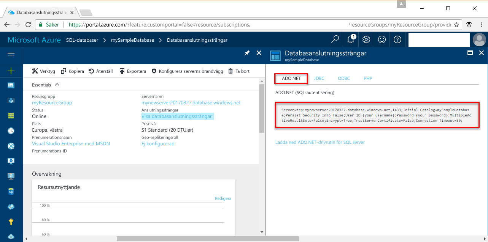

# <a name="use-net-core-c-to-query-an-azure-sql-database"></a><span data-ttu-id="62641-103">Köra frågor mot Azure SQL Database med hjälp av .NET Core (C#)</span><span class="sxs-lookup"><span data-stu-id="62641-103">Use .NET Core (C#) to query an Azure SQL database</span></span>

<span data-ttu-id="62641-104">Den här snabbstartskursen beskriver hur du använder [.NET Core](https://www.microsoft.com/net/) i Windows/Linux/Mac OS för att skapa ett #C-program som ansluter till en Azure SQL-databas och hur du kör frågor mot databasen med hjälp av Transact-SQL-uttryck.</span><span class="sxs-lookup"><span data-stu-id="62641-104">This quick start tutorial demonstrates how to use [.NET Core](https://www.microsoft.com/net/) on Windows/Linux/macOS to create a C# program to connect to an Azure SQL database and use Transact-SQL statements to query data.</span></span>

## <a name="prerequisites"></a><span data-ttu-id="62641-105">Krav</span><span class="sxs-lookup"><span data-stu-id="62641-105">Prerequisites</span></span>

<span data-ttu-id="62641-106">Kontrollera att du har följande för att slutföra den här snabbstartskursen:</span><span class="sxs-lookup"><span data-stu-id="62641-106">To complete this quick start tutorial, make sure you have the following:</span></span>

- <span data-ttu-id="62641-107">En Azure SQL-databas.</span><span class="sxs-lookup"><span data-stu-id="62641-107">An Azure SQL database.</span></span> <span data-ttu-id="62641-108">Den här snabbstarten använder resurser som har skapats i någon av dessa snabbstarter:</span><span class="sxs-lookup"><span data-stu-id="62641-108">This quick start uses the resources created in one of these quick starts:</span></span> 

   - [<span data-ttu-id="62641-109">Skapa DB – Portal</span><span class="sxs-lookup"><span data-stu-id="62641-109">Create DB - Portal</span></span>](sql-database-get-started-portal.md)
   - [<span data-ttu-id="62641-110">Skapa DB – CLI</span><span class="sxs-lookup"><span data-stu-id="62641-110">Create DB - CLI</span></span>](sql-database-get-started-cli.md)
   - [<span data-ttu-id="62641-111">Skapa DB – PowerShell</span><span class="sxs-lookup"><span data-stu-id="62641-111">Create DB - PowerShell</span></span>](sql-database-get-started-powershell.md)

- <span data-ttu-id="62641-112">En [brandväggsregel på servernivå](sql-database-get-started-portal.md#create-a-server-level-firewall-rule) för den offentliga IP-adressen för datorn som du använder för den här snabbstartskursen.</span><span class="sxs-lookup"><span data-stu-id="62641-112">A [server-level firewall rule](sql-database-get-started-portal.md#create-a-server-level-firewall-rule) for the public IP address of the computer you use for this quick start tutorial.</span></span>
- <span data-ttu-id="62641-113">Du har installerat [.NET Core för ditt operativsystem](https://www.microsoft.com/net/core).</span><span class="sxs-lookup"><span data-stu-id="62641-113">You have installed [.NET Core for your operating system](https://www.microsoft.com/net/core).</span></span> 

## <a name="sql-server-connection-information"></a><span data-ttu-id="62641-114">Anslutningsinformation för en SQL-server</span><span class="sxs-lookup"><span data-stu-id="62641-114">SQL server connection information</span></span>

<span data-ttu-id="62641-115">Skaffa den anslutningsinformation du behöver för att ansluta till Azure SQL Database.</span><span class="sxs-lookup"><span data-stu-id="62641-115">Get the connection information needed to connect to the Azure SQL database.</span></span> <span data-ttu-id="62641-116">Du behöver det fullständiga servernamnet, databasnamnet och inloggningsinformationen i nästa procedurer.</span><span class="sxs-lookup"><span data-stu-id="62641-116">You will need the fully qualified server name, database name, and login information in the next procedures.</span></span>

1. <span data-ttu-id="62641-117">Logga in på [Azure-portalen](https://portal.azure.com/).</span><span class="sxs-lookup"><span data-stu-id="62641-117">Log in to the [Azure portal](https://portal.azure.com/).</span></span>
2. <span data-ttu-id="62641-118">Välj **SQL-databaser** på den vänstra menyn och klicka på databasen på sidan **SQL-databaser**.</span><span class="sxs-lookup"><span data-stu-id="62641-118">Select **SQL Databases** from the left-hand menu, and click your database on the **SQL databases** page.</span></span> 
3. <span data-ttu-id="62641-119">Granska serverns fullständiga namn på sidan **Översikt** för databasen, se bilden nedan.</span><span class="sxs-lookup"><span data-stu-id="62641-119">On the **Overview** page for your database, review the fully qualified server name as shown in the following image.</span></span> <span data-ttu-id="62641-120">Om du hovrar över servernamnet visas alternativet **Kopiera genom att klicka**.</span><span class="sxs-lookup"><span data-stu-id="62641-120">You can hover over the server name to bring up the **Click to copy** option.</span></span> 

    

4. <span data-ttu-id="62641-122">Om du glömmer inloggningsinformationen för din Azure SQL Database-server öppnar du serversidan i SQL Database. Där ser du administratörsnamnet för servern.</span><span class="sxs-lookup"><span data-stu-id="62641-122">If you forget your Azure SQL Database server login information, navigate to the SQL Database server page to view the server admin name.</span></span> <span data-ttu-id="62641-123">Du kan återställa lösenordet om det behövs.</span><span class="sxs-lookup"><span data-stu-id="62641-123">You can reset the password if necessary.</span></span>

5. <span data-ttu-id="62641-124">Klicka på **Visa databasanslutningssträngar**.</span><span class="sxs-lookup"><span data-stu-id="62641-124">Click **Show database connection strings**.</span></span>

6. <span data-ttu-id="62641-125">Granska den fullständiga **ADO.NET**-anslutningssträngen.</span><span class="sxs-lookup"><span data-stu-id="62641-125">Review the complete **ADO.NET** connection string.</span></span>

    

> [!IMPORTANT]
> <span data-ttu-id="62641-127">Du måste ha en brandväggsregel för den offentliga IP-adressen för datorn som du utför den här självstudien med.</span><span class="sxs-lookup"><span data-stu-id="62641-127">You must have a firewall rule in place for the public IP address of the computer on which you perform this tutorial.</span></span> <span data-ttu-id="62641-128">Om du använder en annan dator eller har en annan offentlig IP-adress så skapar du en [brandväggsregel på servernivå med hjälp av Azure Portal](sql-database-get-started-portal.md#create-a-server-level-firewall-rule).</span><span class="sxs-lookup"><span data-stu-id="62641-128">If you are on a different computer or have a different public IP address, create a [server-level firewall rule using the Azure portal](sql-database-get-started-portal.md#create-a-server-level-firewall-rule).</span></span> 
>
  
## <a name="create-a-new-net-project"></a><span data-ttu-id="62641-129">Skapa ett nytt .NET-projekt</span><span class="sxs-lookup"><span data-stu-id="62641-129">Create a new .NET project</span></span>

1. <span data-ttu-id="62641-130">Öppna en kommandotolk och skapa en mapp med namnet *sqltest*.</span><span class="sxs-lookup"><span data-stu-id="62641-130">Open a command prompt and create a folder named *sqltest*.</span></span> <span data-ttu-id="62641-131">Navigera till den mapp som du har skapat och kör följande kommando:</span><span class="sxs-lookup"><span data-stu-id="62641-131">Navigate to the folder you created and run the following command:</span></span>

    ```
    dotnet new console
    ```

2. <span data-ttu-id="62641-132">Öppna ***sqltest.csproj*** med valfri textredigerare och lägg till System.Data.SqlClient som ett beroende med hjälp av följande kod:</span><span class="sxs-lookup"><span data-stu-id="62641-132">Open ***sqltest.csproj*** with your favorite text editor and add System.Data.SqlClient as a dependency using the following code:</span></span>

    ```xml
    <ItemGroup>
        <PackageReference Include="System.Data.SqlClient" Version="4.3.0" />
    </ItemGroup>
    ```

## <a name="insert-code-to-query-sql-database"></a><span data-ttu-id="62641-133">Infoga kod för att fråga SQL Database</span><span class="sxs-lookup"><span data-stu-id="62641-133">Insert code to query SQL database</span></span>

1. <span data-ttu-id="62641-134">Öppna **Program.cs** i din utvecklingsmiljö eller textredigerare</span><span class="sxs-lookup"><span data-stu-id="62641-134">In your development environment or favorite text editor open **Program.cs**</span></span>

2. <span data-ttu-id="62641-135">Ersätt innehållet med följande kod och lägg till lämpliga värden för server, databas, användare och lösenord.</span><span class="sxs-lookup"><span data-stu-id="62641-135">Replace the contents with the following code and add the appropriate values for your server, database, user, and password.</span></span>

```csharp
using System;
using System.Data.SqlClient;
using System.Text;

namespace sqltest
{
    class Program
    {
        static void Main(string[] args)
        {
            try 
            { 
                SqlConnectionStringBuilder builder = new SqlConnectionStringBuilder();
                builder.DataSource = "your_server.database.windows.net"; 
                builder.UserID = "your_user";            
                builder.Password = "your_password";     
                builder.InitialCatalog = "your_database";

                using (SqlConnection connection = new SqlConnection(builder.ConnectionString))
                {
                    Console.WriteLine("\nQuery data example:");
                    Console.WriteLine("=========================================\n");
                    
                    connection.Open();       
                    StringBuilder sb = new StringBuilder();
                    sb.Append("SELECT TOP 20 pc.Name as CategoryName, p.name as ProductName ");
                    sb.Append("FROM [SalesLT].[ProductCategory] pc ");
                    sb.Append("JOIN [SalesLT].[Product] p ");
                    sb.Append("ON pc.productcategoryid = p.productcategoryid;");
                    String sql = sb.ToString();

                    using (SqlCommand command = new SqlCommand(sql, connection))
                    {
                        using (SqlDataReader reader = command.ExecuteReader())
                        {
                            while (reader.Read())
                            {
                                Console.WriteLine("{0} {1}", reader.GetString(0), reader.GetString(1));
                            }
                        }
                    }                    
                }
            }
            catch (SqlException e)
            {
                Console.WriteLine(e.ToString());
            }
            Console.ReadLine();
        }
    }
}
```

## <a name="run-the-code"></a><span data-ttu-id="62641-136">Kör koden</span><span class="sxs-lookup"><span data-stu-id="62641-136">Run the code</span></span>

1. <span data-ttu-id="62641-137">Kör följande kommandon i kommandotolken:</span><span class="sxs-lookup"><span data-stu-id="62641-137">At the command prompt, run the following commands:</span></span>

   ```csharp
   dotnet restore
   dotnet run
   ```

2. <span data-ttu-id="62641-138">Kontrollera att de 20 översta raderna returneras och stäng sedan programfönstret.</span><span class="sxs-lookup"><span data-stu-id="62641-138">Verify that the top 20 rows are returned and then close the application window.</span></span>


## <a name="next-steps"></a><span data-ttu-id="62641-139">Nästa steg</span><span class="sxs-lookup"><span data-stu-id="62641-139">Next steps</span></span>

- <span data-ttu-id="62641-140">[Komma igång med .NET Core för Windows/Linux/macOS med hjälp av kommandoraden](/dotnet/core/tutorials/using-with-xplat-cli).</span><span class="sxs-lookup"><span data-stu-id="62641-140">[Getting started with .NET Core on Windows/Linux/macOS using the command line](/dotnet/core/tutorials/using-with-xplat-cli).</span></span>
- <span data-ttu-id="62641-141">Lär dig hur du [ansluter till och frågar en Azure SQL Database med .NET Framework och Visual Studio](sql-database-connect-query-dotnet-visual-studio.md).</span><span class="sxs-lookup"><span data-stu-id="62641-141">Learn how to [connect and query an Azure SQL database using the .NET framework and Visual Studio](sql-database-connect-query-dotnet-visual-studio.md).</span></span>  
- <span data-ttu-id="62641-142">Lär dig hur du [utformar din första Azure SQL Database med hjälp av SSMS](sql-database-design-first-database.md) eller [utformar din första Azure SQL Database med hjälp av .NET](sql-database-design-first-database-csharp.md).</span><span class="sxs-lookup"><span data-stu-id="62641-142">Learn how to [Design your first Azure SQL database using SSMS](sql-database-design-first-database.md) or [Design your first Azure SQL database using .NET](sql-database-design-first-database-csharp.md).</span></span>
- <span data-ttu-id="62641-143">Mer information om .NET finns i [.NET-dokumentationen](https://docs.microsoft.com/dotnet/).</span><span class="sxs-lookup"><span data-stu-id="62641-143">For more information about .NET, see [.NET documentation](https://docs.microsoft.com/dotnet/).</span></span>
