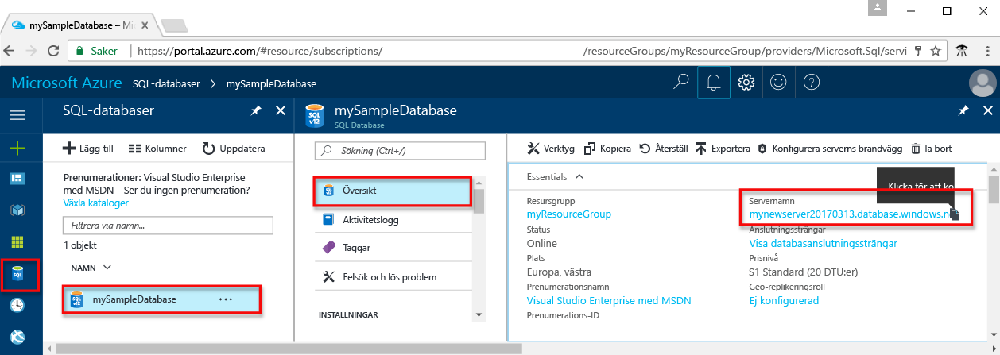

# <a name="use-net-core-c-tooquery-an-azure-sql-database"></a>Använda .NET Core (C#) tooquery en Azure SQL database

Den här snabbstartsguide visar hur toouse [.NET Core](https://www.microsoft.com/net/) på Windows/Linux/macOS toocreate C#-program tooconnect tooan Azure SQL-databas och använda Transact-SQL-instruktioner tooquery data.

## <a name="prerequisites"></a>Krav

toocomplete detta snabb start kursen, kontrollera att du har hello följande:

- En Azure SQL-databas. Den här snabbstartsguide använder hello resurser skapas i ett av dessa snabbstarter: 

   - [Skapa DB – Portal](sql-database-get-started-portal.md)
   - [Skapa DB – CLI](sql-database-get-started-cli.md)
   - [Skapa DB – PowerShell](sql-database-get-started-powershell.md)

- En [brandväggsregel på servernivå](sql-database-get-started-portal.md#create-a-server-level-firewall-rule) för hello offentliga IP-adressen för hello datorn du använder för den här snabbstartsguide.
- Du har installerat [.NET Core för ditt operativsystem](https://www.microsoft.com/net/core). 

## <a name="sql-server-connection-information"></a>Anslutningsinformation för en SQL-server

Hämta hello anslutning information som behövs för tooconnect toohello Azure SQL-databas. Du behöver hello fullständigt kvalificerade servernamnet, databasnamnet och inloggningsinformation i hello nästkommande procedurer.

1. Logga in toohello [Azure-portalen](https://portal.azure.com/).
2. Välj **SQL-databaser** vänstra hello-menyn och klicka på din databas på hello **SQL-databaser** sidan. 
3. På hello **översikt** för databasen, granska hello fullständigt kvalificerade servernamnet som visas i följande bild hello. Du kan hovrar över hello server name toobring in hello **klickar du på toocopy** alternativet. 

    

4. Om du glömmer dina inloggningsuppgifter för Azure SQL Database-server kan du navigera toohello SQL server sidan tooview hello admin Databasservernamnet. Du kan återställa hello lösenord om det behövs.

5. Klicka på **Visa databasanslutningssträngar**.

6. Granska hello fullständig **ADO.NET** anslutningssträngen.

    

> [!IMPORTANT]
> Du måste ha en brandväggsregel för hello offentliga IP-adressen hello datorn som du utför den här kursen. Om du är på en annan dator eller en annan offentlig IP-adress, skapar du en [servernivå brandväggen regeln med hjälp av hello Azure-portalen](sql-database-get-started-portal.md#create-a-server-level-firewall-rule). 
>
  
## <a name="create-a-new-net-project"></a>Skapa ett nytt .NET-projekt

1. Öppna en kommandotolk och skapa en mapp med namnet *sqltest*. Navigera toohello mappen du skapade och kör följande kommando hello:

    ```
    dotnet new console
    ```

2. Öppna ***sqltest.csproj*** med valfri textredigerare och Lägg till System.Data.SqlClient som ett beroende som använder hello följande kod:

    ```xml
    <ItemGroup>
        <PackageReference Include="System.Data.SqlClient" Version="4.3.0" />
    </ItemGroup>
    ```

## <a name="insert-code-tooquery-sql-database"></a>Infoga kod tooquery SQL-databas

1. Öppna **Program.cs** i din utvecklingsmiljö eller textredigerare

2. Ersätt hello innehållet med hello följande kod och lägga till hello lämpliga värden för din server, databas, användare och lösenord.

```csharp
using System;
using System.Data.SqlClient;
using System.Text;

namespace sqltest
{
    class Program
    {
        static void Main(string[] args)
        {
            try 
            { 
                SqlConnectionStringBuilder builder = new SqlConnectionStringBuilder();
                builder.DataSource = "your_server.database.windows.net"; 
                builder.UserID = "your_user";            
                builder.Password = "your_password";     
                builder.InitialCatalog = "your_database";

                using (SqlConnection connection = new SqlConnection(builder.ConnectionString))
                {
                    Console.WriteLine("\nQuery data example:");
                    Console.WriteLine("=========================================\n");
                    
                    connection.Open();       
                    StringBuilder sb = new StringBuilder();
                    sb.Append("SELECT TOP 20 pc.Name as CategoryName, p.name as ProductName ");
                    sb.Append("FROM [SalesLT].[ProductCategory] pc ");
                    sb.Append("JOIN [SalesLT].[Product] p ");
                    sb.Append("ON pc.productcategoryid = p.productcategoryid;");
                    String sql = sb.ToString();

                    using (SqlCommand command = new SqlCommand(sql, connection))
                    {
                        using (SqlDataReader reader = command.ExecuteReader())
                        {
                            while (reader.Read())
                            {
                                Console.WriteLine("{0} {1}", reader.GetString(0), reader.GetString(1));
                            }
                        }
                    }                    
                }
            }
            catch (SqlException e)
            {
                Console.WriteLine(e.ToString());
            }
            Console.ReadLine();
        }
    }
}
```

## <a name="run-hello-code"></a>Köra hello kod

1. Kör följande kommandon hello Kommandotolken hello:

   ```csharp
   dotnet restore
   dotnet run
   ```

2. Kontrollera att hello översta 20 rader returneras och stäng sedan hello-fönstret.


## <a name="next-steps"></a>Nästa steg

- [Komma igång med .NET Core för Windows/Linux/macOS hello kommandoraden](/dotnet/core/tutorials/using-with-xplat-cli).
- Lär dig hur för[ansluter och frågar en Azure SQL-databas med hjälp av hello .NET framework och Visual Studio](sql-database-connect-query-dotnet-visual-studio.md).  
- Lär dig hur för[utforma din första Azure SQL-databas med hjälp av SSMS](sql-database-design-first-database.md) eller [utforma din första Azure SQL-databas med hjälp av .NET](sql-database-design-first-database-csharp.md).
- Mer information om .NET finns i [.NET-dokumentationen](https://docs.microsoft.com/dotnet/).
