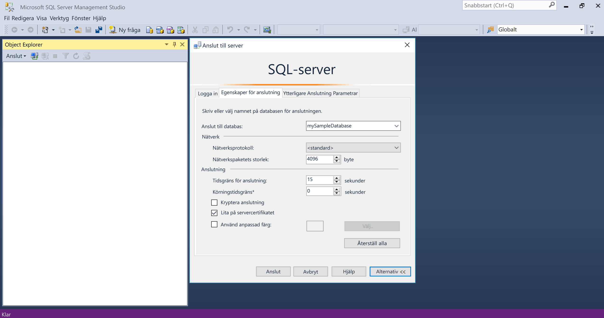

# <a name="azure-sql-database-use-sql-server-management-studio-tooconnect-and-query-data"></a><span data-ttu-id="1dcaf-105">Azure SQL Database: Använd SQL Server Management Studio tooconnect och fråga data</span><span class="sxs-lookup"><span data-stu-id="1dcaf-105">Azure SQL Database: Use SQL Server Management Studio tooconnect and query data</span></span>

<span data-ttu-id="1dcaf-106">[SQL Server Management Studio](https://msdn.microsoft.com/library/ms174173.aspx) (SSMS) är en integrerad miljö för att hantera alla SQL-infrastruktur från SQL Server-tooSQL för Microsoft Windows-databas.</span><span class="sxs-lookup"><span data-stu-id="1dcaf-106">[SQL Server Management Studio](https://msdn.microsoft.com/library/ms174173.aspx) (SSMS) is an integrated environment for managing any SQL infrastructure, from SQL Server tooSQL Database for Microsoft Windows.</span></span> <span data-ttu-id="1dcaf-107">Den här snabbstartsguide visar hur toouse SSMS tooconnect tooan Azure SQL-databas och Använd Transact-SQL-instruktioner tooquery infoga, uppdatera och ta bort data i hello-databas.</span><span class="sxs-lookup"><span data-stu-id="1dcaf-107">This quick start demonstrates how toouse SSMS tooconnect tooan Azure SQL database, and then use Transact-SQL statements tooquery, insert, update, and delete data in hello database.</span></span> 

## <a name="prerequisites"></a><span data-ttu-id="1dcaf-108">Krav</span><span class="sxs-lookup"><span data-stu-id="1dcaf-108">Prerequisites</span></span>

<span data-ttu-id="1dcaf-109">Den här snabbstartsguide används som första plats hello resurserna skapas i ett av dessa snabbstarter:</span><span class="sxs-lookup"><span data-stu-id="1dcaf-109">This quick start uses as its starting point hello resources created in one of these quick starts:</span></span>

- [<span data-ttu-id="1dcaf-110">Skapa DB – Portal</span><span class="sxs-lookup"><span data-stu-id="1dcaf-110">Create DB - Portal</span></span>](sql-database-get-started-portal.md)
- [<span data-ttu-id="1dcaf-111">Skapa DB – CLI</span><span class="sxs-lookup"><span data-stu-id="1dcaf-111">Create DB - CLI</span></span>](sql-database-get-started-cli.md)
- [<span data-ttu-id="1dcaf-112">Skapa DB – PowerShell</span><span class="sxs-lookup"><span data-stu-id="1dcaf-112">Create DB - PowerShell</span></span>](sql-database-get-started-powershell.md)

<span data-ttu-id="1dcaf-113">Innan du börjar, kontrollera att du har installerat hello senaste versionen av [SSMS](https://msdn.microsoft.com/library/mt238290.aspx).</span><span class="sxs-lookup"><span data-stu-id="1dcaf-113">Before you start, make sure you have installed hello newest version of [SSMS](https://msdn.microsoft.com/library/mt238290.aspx).</span></span> 

## <a name="sql-server-connection-information"></a><span data-ttu-id="1dcaf-114">Anslutningsinformation för en SQL-server</span><span class="sxs-lookup"><span data-stu-id="1dcaf-114">SQL server connection information</span></span>

<span data-ttu-id="1dcaf-115">Hämta hello anslutning information som behövs för tooconnect toohello Azure SQL-databas.</span><span class="sxs-lookup"><span data-stu-id="1dcaf-115">Get hello connection information needed tooconnect toohello Azure SQL database.</span></span> <span data-ttu-id="1dcaf-116">Du behöver hello fullständigt kvalificerade servernamnet, databasnamnet och inloggningsinformation i hello nästkommande procedurer.</span><span class="sxs-lookup"><span data-stu-id="1dcaf-116">You will need hello fully qualified server name, database name, and login information in hello next procedures.</span></span>

1. <span data-ttu-id="1dcaf-117">Logga in toohello [Azure-portalen](https://portal.azure.com/).</span><span class="sxs-lookup"><span data-stu-id="1dcaf-117">Log in toohello [Azure portal](https://portal.azure.com/).</span></span>
2. <span data-ttu-id="1dcaf-118">Välj **SQL-databaser** vänstra hello-menyn och klicka på din databas på hello **SQL-databaser** sidan.</span><span class="sxs-lookup"><span data-stu-id="1dcaf-118">Select **SQL Databases** from hello left-hand menu, and click your database on hello **SQL databases** page.</span></span> 
3. <span data-ttu-id="1dcaf-119">På hello **översikt** för din databas kan du granska hello fullständigt kvalificerade servernamnet enligt hello bilden nedan.</span><span class="sxs-lookup"><span data-stu-id="1dcaf-119">On hello **Overview** page for your database, review hello fully qualified server name as shown in hello image below.</span></span> <span data-ttu-id="1dcaf-120">Du kan hovrar över hello server name toobring in hello **klickar du på toocopy** alternativet.</span><span class="sxs-lookup"><span data-stu-id="1dcaf-120">You can hover over hello server name toobring up hello **Click toocopy** option.</span></span>

    

4. <span data-ttu-id="1dcaf-122">Om du har glömt hello inloggningsinformation för din Azure SQL Database-server, navigera toohello SQL server sidan tooview hello admin Databasservernamnet och, om nödvändigt återställa hello lösenord.</span><span class="sxs-lookup"><span data-stu-id="1dcaf-122">If you have forgotten hello login information for your Azure SQL Database server, navigate toohello SQL Database server page tooview hello server admin name and, if necessary, reset hello password.</span></span> 

## <a name="connect-tooyour-database"></a><span data-ttu-id="1dcaf-123">Ansluta tooyour databas</span><span class="sxs-lookup"><span data-stu-id="1dcaf-123">Connect tooyour database</span></span>

<span data-ttu-id="1dcaf-124">Använda SQL Server Management Studio tooestablish en anslutning tooyour Azure SQL Database-server.</span><span class="sxs-lookup"><span data-stu-id="1dcaf-124">Use SQL Server Management Studio tooestablish a connection tooyour Azure SQL Database server.</span></span> 

> [!IMPORTANT]
> <span data-ttu-id="1dcaf-125">En logisk Azure SQL Database-server avlyssnar port 1433.</span><span class="sxs-lookup"><span data-stu-id="1dcaf-125">An Azure SQL Database logical server listens on port 1433.</span></span> <span data-ttu-id="1dcaf-126">Om du försöker tooconnect tooan Azure SQL Database logiska server från en företagsbrandvägg måste den här porten öppnas i hello företagets brandvägg för du toosuccessfully ansluta.</span><span class="sxs-lookup"><span data-stu-id="1dcaf-126">If you are attempting tooconnect tooan Azure SQL Database logical server from within a corporate firewall, this port must be open in hello corporate firewall for you toosuccessfully connect.</span></span>
>

1. <span data-ttu-id="1dcaf-127">Öppna SQL Server Management Studio.</span><span class="sxs-lookup"><span data-stu-id="1dcaf-127">Open SQL Server Management Studio.</span></span>

2. <span data-ttu-id="1dcaf-128">I hello **ansluta tooServer** dialogrutan Ange hello följande information:</span><span class="sxs-lookup"><span data-stu-id="1dcaf-128">In hello **Connect tooServer** dialog box, enter hello following information:</span></span>

   | <span data-ttu-id="1dcaf-129">Inställning</span><span class="sxs-lookup"><span data-stu-id="1dcaf-129">Setting</span></span>       | <span data-ttu-id="1dcaf-130">Föreslaget värde</span><span class="sxs-lookup"><span data-stu-id="1dcaf-130">Suggested value</span></span> | <span data-ttu-id="1dcaf-131">Beskrivning</span><span class="sxs-lookup"><span data-stu-id="1dcaf-131">Description</span></span> | 
   | ------------ | ------------------ | ------------------------------------------------- | 
   | <span data-ttu-id="1dcaf-132">**Servertyp**</span><span class="sxs-lookup"><span data-stu-id="1dcaf-132">**Server type**</span></span> | <span data-ttu-id="1dcaf-133">Databasmotor</span><span class="sxs-lookup"><span data-stu-id="1dcaf-133">Database engine</span></span> | <span data-ttu-id="1dcaf-134">Det här värdet är obligatoriskt.</span><span class="sxs-lookup"><span data-stu-id="1dcaf-134">This value is required.</span></span> |
   | <span data-ttu-id="1dcaf-135">**Servernamn**</span><span class="sxs-lookup"><span data-stu-id="1dcaf-135">**Server name**</span></span> | <span data-ttu-id="1dcaf-136">hello fullständigt kvalificerade servernamnet</span><span class="sxs-lookup"><span data-stu-id="1dcaf-136">hello fully qualified server name</span></span> | <span data-ttu-id="1dcaf-137">hello namnet ska vara ungefär så här: **mynewserver20170313.database.windows.net**.</span><span class="sxs-lookup"><span data-stu-id="1dcaf-137">hello name should be something like this: **mynewserver20170313.database.windows.net**.</span></span> |
   | <span data-ttu-id="1dcaf-138">**Autentisering**</span><span class="sxs-lookup"><span data-stu-id="1dcaf-138">**Authentication**</span></span> | <span data-ttu-id="1dcaf-139">SQL Server-autentisering</span><span class="sxs-lookup"><span data-stu-id="1dcaf-139">SQL Server Authentication</span></span> | <span data-ttu-id="1dcaf-140">SQL-autentisering är hello endast autentiseringstyp som vi har konfigurerat i den här kursen.</span><span class="sxs-lookup"><span data-stu-id="1dcaf-140">SQL Authentication is hello only authentication type that we have configured in this tutorial.</span></span> |
   | <span data-ttu-id="1dcaf-141">**Inloggning**</span><span class="sxs-lookup"><span data-stu-id="1dcaf-141">**Login**</span></span> | <span data-ttu-id="1dcaf-142">Hej server-administratörskontot</span><span class="sxs-lookup"><span data-stu-id="1dcaf-142">hello server admin account</span></span> | <span data-ttu-id="1dcaf-143">Detta är hello-konto som du angav när du skapade hello-server.</span><span class="sxs-lookup"><span data-stu-id="1dcaf-143">This is hello account that you specified when you created hello server.</span></span> |
   | <span data-ttu-id="1dcaf-144">**Lösenord**</span><span class="sxs-lookup"><span data-stu-id="1dcaf-144">**Password**</span></span> | <span data-ttu-id="1dcaf-145">hello lösenord för administratörskontot server</span><span class="sxs-lookup"><span data-stu-id="1dcaf-145">hello password for your server admin account</span></span> | <span data-ttu-id="1dcaf-146">Detta är hello lösenord som du angav när du skapade hello-server.</span><span class="sxs-lookup"><span data-stu-id="1dcaf-146">This is hello password that you specified when you created hello server.</span></span> |

     

3. <span data-ttu-id="1dcaf-148">Klicka på **alternativ** i hello **ansluta tooserver** dialogrutan.</span><span class="sxs-lookup"><span data-stu-id="1dcaf-148">Click **Options** in hello **Connect tooserver** dialog box.</span></span> <span data-ttu-id="1dcaf-149">I hello **ansluta toodatabase** ange **mySampleDatabase** tooconnect toothis databas.</span><span class="sxs-lookup"><span data-stu-id="1dcaf-149">In hello **Connect toodatabase** section, enter **mySampleDatabase** tooconnect toothis database.</span></span>

     

4. <span data-ttu-id="1dcaf-151">Klicka på **Anslut**.</span><span class="sxs-lookup"><span data-stu-id="1dcaf-151">Click **Connect**.</span></span> <span data-ttu-id="1dcaf-152">öppnas med hello Object Explorer i SSMS.</span><span class="sxs-lookup"><span data-stu-id="1dcaf-152">hello Object Explorer window opens in SSMS.</span></span> 

     

5. <span data-ttu-id="1dcaf-154">I Object Explorer, expandera **databaser** och expandera sedan **mySampleDatabase** tooview hello objekt i hello-exempeldatabasen.</span><span class="sxs-lookup"><span data-stu-id="1dcaf-154">In Object Explorer, expand **Databases** and then expand **mySampleDatabase** tooview hello objects in hello sample database.</span></span>

## <a name="query-data"></a><span data-ttu-id="1dcaf-155">Frågedata</span><span class="sxs-lookup"><span data-stu-id="1dcaf-155">Query data</span></span>

<span data-ttu-id="1dcaf-156">Använd hello följande kod tooquery för hello de 20 största produkter efter kategori med hello [Välj](https://msdn.microsoft.com/library/ms189499.aspx) Transact-SQL-instruktionen.</span><span class="sxs-lookup"><span data-stu-id="1dcaf-156">Use hello following code tooquery for hello top 20 products by category using hello [SELECT](https://msdn.microsoft.com/library/ms189499.aspx) Transact-SQL statement.</span></span>

1. <span data-ttu-id="1dcaf-157">I Object Explorer högerklickar du på **mySampleDatabase** och klickar sedan på **Ny fråga**.</span><span class="sxs-lookup"><span data-stu-id="1dcaf-157">In Object Explorer, right-click **mySampleDatabase** and click **New Query**.</span></span> <span data-ttu-id="1dcaf-158">Ett tomt frågefönster öppnas som är anslutna tooyour databas.</span><span class="sxs-lookup"><span data-stu-id="1dcaf-158">A blank query window opens that is connected tooyour database.</span></span>
2. <span data-ttu-id="1dcaf-159">Ange hello följande fråga i frågefönstret hello:</span><span class="sxs-lookup"><span data-stu-id="1dcaf-159">In hello query window, enter hello following query:</span></span>

   ```sql
   SELECT pc.Name as CategoryName, p.name as ProductName
   FROM [SalesLT].[ProductCategory] pc
   JOIN [SalesLT].[Product] p
   ON pc.productcategoryid = p.productcategoryid;
   ```

3. <span data-ttu-id="1dcaf-160">På verktygsfältet hello **kör** tooretrieve data från hello produkt och produktkategori.</span><span class="sxs-lookup"><span data-stu-id="1dcaf-160">On hello toolbar, click **Execute** tooretrieve data from hello Product and ProductCategory tables.</span></span>

    

## <a name="insert-data"></a><span data-ttu-id="1dcaf-162">Infoga data</span><span class="sxs-lookup"><span data-stu-id="1dcaf-162">Insert data</span></span>

<span data-ttu-id="1dcaf-163">Använd hello följande kod tooinsert en ny produkt i hello SalesLT.Product tabellen med hjälp av hello [infoga](https://msdn.microsoft.com/library/ms174335.aspx) Transact-SQL-instruktionen.</span><span class="sxs-lookup"><span data-stu-id="1dcaf-163">Use hello following code tooinsert a new product into hello SalesLT.Product table using hello [INSERT](https://msdn.microsoft.com/library/ms174335.aspx) Transact-SQL statement.</span></span>

1. <span data-ttu-id="1dcaf-164">Ersätt hello föregående fråga med hello följande fråga i frågefönstret hello:</span><span class="sxs-lookup"><span data-stu-id="1dcaf-164">In hello query window, replace hello previous query with hello following query:</span></span>

   ```sql
   INSERT INTO [SalesLT].[Product]
           ( [Name]
           , [ProductNumber]
           , [Color]
           , [ProductCategoryID]
           , [StandardCost]
           , [ListPrice]
           , [SellStartDate]
           )
     VALUES
           ('myNewProduct'
           ,123456789
           ,'NewColor'
           ,1
           ,100
           ,100
           ,GETDATE() );
   ```

2. <span data-ttu-id="1dcaf-165">På verktygsfältet hello **kör** tooinsert en ny rad i tabellen för hello-produkten.</span><span class="sxs-lookup"><span data-stu-id="1dcaf-165">On hello toolbar, click **Execute**  tooinsert a new row in hello Product table.</span></span>

    

## <a name="update-data"></a><span data-ttu-id="1dcaf-166">Uppdatera data</span><span class="sxs-lookup"><span data-stu-id="1dcaf-166">Update data</span></span>

<span data-ttu-id="1dcaf-167">Använd hello följande kod tooupdate hello ny produkt som du tidigare har lagts till med hello [uppdatering](https://msdn.microsoft.com/library/ms177523.aspx) Transact-SQL-instruktionen.</span><span class="sxs-lookup"><span data-stu-id="1dcaf-167">Use hello following code tooupdate hello new product that you previously added using hello [UPDATE](https://msdn.microsoft.com/library/ms177523.aspx) Transact-SQL statement.</span></span>

1. <span data-ttu-id="1dcaf-168">Ersätt hello föregående fråga med hello följande fråga i frågefönstret hello:</span><span class="sxs-lookup"><span data-stu-id="1dcaf-168">In hello query window, replace hello previous query with hello following query:</span></span>

   ```sql
   UPDATE [SalesLT].[Product]
   SET [ListPrice] = 125
   WHERE Name = 'myNewProduct';
   ```

2. <span data-ttu-id="1dcaf-169">På verktygsfältet hello **kör** tooupdate hello angivna raden i tabellen för hello-produkten.</span><span class="sxs-lookup"><span data-stu-id="1dcaf-169">On hello toolbar, click **Execute** tooupdate hello specified row in hello Product table.</span></span>

    

## <a name="delete-data"></a><span data-ttu-id="1dcaf-170">Ta bort data</span><span class="sxs-lookup"><span data-stu-id="1dcaf-170">Delete data</span></span>

<span data-ttu-id="1dcaf-171">Använd hello följande kod toodelete hello ny produkt som du tidigare har lagts till med hello [ta bort](https://msdn.microsoft.com/library/ms189835.aspx) Transact-SQL-instruktionen.</span><span class="sxs-lookup"><span data-stu-id="1dcaf-171">Use hello following code toodelete hello new product that you previously added using hello [DELETE](https://msdn.microsoft.com/library/ms189835.aspx) Transact-SQL statement.</span></span>

1. <span data-ttu-id="1dcaf-172">Ersätt hello föregående fråga med hello följande fråga i frågefönstret hello:</span><span class="sxs-lookup"><span data-stu-id="1dcaf-172">In hello query window, replace hello previous query with hello following query:</span></span>

   ```sql
   DELETE FROM [SalesLT].[Product]
   WHERE Name = 'myNewProduct';
   ```

2. <span data-ttu-id="1dcaf-173">På verktygsfältet hello **kör** toodelete hello angivna raden i tabellen för hello-produkten.</span><span class="sxs-lookup"><span data-stu-id="1dcaf-173">On hello toolbar, click **Execute** toodelete hello specified row in hello Product table.</span></span>

    

## <a name="next-steps"></a><span data-ttu-id="1dcaf-174">Nästa steg</span><span class="sxs-lookup"><span data-stu-id="1dcaf-174">Next steps</span></span>

- <span data-ttu-id="1dcaf-175">toolearn om att skapa och hantera servrar och databaser med Transact-SQL finns [Lär dig mer om Azure SQL Database-servrar och databaser](sql-database-servers-databases.md).</span><span class="sxs-lookup"><span data-stu-id="1dcaf-175">toolearn about creating and managing servers and databases with Transact-SQL, see [Learn about Azure SQL Database servers and databases](sql-database-servers-databases.md).</span></span>
- <span data-ttu-id="1dcaf-176">Mer information om SSMS finns i [Använda SQL Server Management Studio](https://msdn.microsoft.com/library/ms174173.aspx).</span><span class="sxs-lookup"><span data-stu-id="1dcaf-176">For information about SSMS, see [Use SQL Server Management Studio](https://msdn.microsoft.com/library/ms174173.aspx).</span></span>
- <span data-ttu-id="1dcaf-177">tooconnect och fråga med hjälp av Visual Studio Code finns [Anslut och fråga med Visual Studio Code](sql-database-connect-query-vscode.md).</span><span class="sxs-lookup"><span data-stu-id="1dcaf-177">tooconnect and query using Visual Studio Code, see [Connect and query with Visual Studio Code](sql-database-connect-query-vscode.md).</span></span>
- <span data-ttu-id="1dcaf-178">tooconnect och fråga med hjälp av .NET, se [ansluter och frågar med .NET](sql-database-connect-query-dotnet.md).</span><span class="sxs-lookup"><span data-stu-id="1dcaf-178">tooconnect and query using .NET, see [Connect and query with .NET](sql-database-connect-query-dotnet.md).</span></span>
- <span data-ttu-id="1dcaf-179">tooconnect och fråga med hjälp av PHP finns [ansluter och frågar med PHP](sql-database-connect-query-php.md).</span><span class="sxs-lookup"><span data-stu-id="1dcaf-179">tooconnect and query using PHP, see [Connect and query with PHP](sql-database-connect-query-php.md).</span></span>
- <span data-ttu-id="1dcaf-180">tooconnect och fråga med Node.js, se [Anslut och fråga med Node.js](sql-database-connect-query-nodejs.md).</span><span class="sxs-lookup"><span data-stu-id="1dcaf-180">tooconnect and query using Node.js, see [Connect and query with Node.js](sql-database-connect-query-nodejs.md).</span></span>
- <span data-ttu-id="1dcaf-181">tooconnect och fråga med Java, se [ansluter och frågar med Java](sql-database-connect-query-java.md).</span><span class="sxs-lookup"><span data-stu-id="1dcaf-181">tooconnect and query using Java, see [Connect and query with Java](sql-database-connect-query-java.md).</span></span>
- <span data-ttu-id="1dcaf-182">tooconnect och fråga med hjälp av Python, se [ansluter och frågar med Python](sql-database-connect-query-python.md).</span><span class="sxs-lookup"><span data-stu-id="1dcaf-182">tooconnect and query using Python, see [Connect and query with Python](sql-database-connect-query-python.md).</span></span>
- <span data-ttu-id="1dcaf-183">tooconnect och fråga med Ruby, se [Anslut och fråga med Ruby](sql-database-connect-query-ruby.md).</span><span class="sxs-lookup"><span data-stu-id="1dcaf-183">tooconnect and query using Ruby, see [Connect and query with Ruby](sql-database-connect-query-ruby.md).</span></span>
