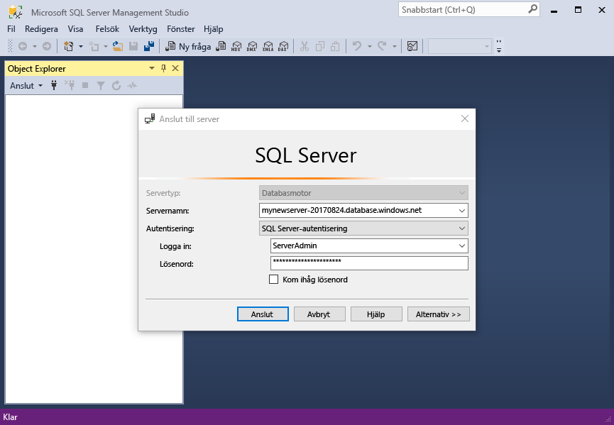

# <a name="azure-sql-database-use-sql-server-management-studio-tooconnect-and-query-data"></a>Azure SQL Database: Använd SQL Server Management Studio tooconnect och fråga data

[SQL Server Management Studio](https://msdn.microsoft.com/library/ms174173.aspx) (SSMS) är en integrerad miljö för att hantera alla SQL-infrastruktur från SQL Server-tooSQL för Microsoft Windows-databas. Den här snabbstartsguide visar hur toouse SSMS tooconnect tooan Azure SQL-databas och Använd Transact-SQL-instruktioner tooquery infoga, uppdatera och ta bort data i hello-databas. 

## <a name="prerequisites"></a>Krav

Den här snabbstartsguide används som första plats hello resurserna skapas i ett av dessa snabbstarter:

- [Skapa DB – Portal](sql-database-get-started-portal.md)
- [Skapa DB – CLI](sql-database-get-started-cli.md)
- [Skapa DB – PowerShell](sql-database-get-started-powershell.md)

Innan du börjar, kontrollera att du har installerat hello senaste versionen av [SSMS](https://msdn.microsoft.com/library/mt238290.aspx). 

## <a name="sql-server-connection-information"></a>Anslutningsinformation för en SQL-server

Hämta hello anslutning information som behövs för tooconnect toohello Azure SQL-databas. Du behöver hello fullständigt kvalificerade servernamnet, databasnamnet och inloggningsinformation i hello nästkommande procedurer.

1. Logga in toohello [Azure-portalen](https://portal.azure.com/).
2. Välj **SQL-databaser** vänstra hello-menyn och klicka på din databas på hello **SQL-databaser** sidan. 
3. På hello **översikt** för din databas kan du granska hello fullständigt kvalificerade servernamnet enligt hello bilden nedan. Du kan hovrar över hello server name toobring in hello **klickar du på toocopy** alternativet.

    

4. Om du har glömt hello inloggningsinformation för din Azure SQL Database-server, navigera toohello SQL server sidan tooview hello admin Databasservernamnet och, om nödvändigt återställa hello lösenord. 

## <a name="connect-tooyour-database"></a>Ansluta tooyour databas

Använda SQL Server Management Studio tooestablish en anslutning tooyour Azure SQL Database-server. 

> [!IMPORTANT]
> En logisk Azure SQL Database-server avlyssnar port 1433. Om du försöker tooconnect tooan Azure SQL Database logiska server från en företagsbrandvägg måste den här porten öppnas i hello företagets brandvägg för du toosuccessfully ansluta.
>

1. Öppna SQL Server Management Studio.

2. I hello **ansluta tooServer** dialogrutan Ange hello följande information:

   | Inställning       | Föreslaget värde | Beskrivning | 
   | ------------ | ------------------ | ------------------------------------------------- | 
   | **Servertyp** | Databasmotor | Det här värdet är obligatoriskt. |
   | **Servernamn** | hello fullständigt kvalificerade servernamnet | hello namnet ska vara ungefär så här: **mynewserver20170313.database.windows.net**. |
   | **Autentisering** | SQL Server-autentisering | SQL-autentisering är hello endast autentiseringstyp som vi har konfigurerat i den här kursen. |
   | **Inloggning** | Hej server-administratörskontot | Detta är hello-konto som du angav när du skapade hello-server. |
   | **Lösenord** | hello lösenord för administratörskontot server | Detta är hello lösenord som du angav när du skapade hello-server. |

     

3. Klicka på **alternativ** i hello **ansluta tooserver** dialogrutan. I hello **ansluta toodatabase** ange **mySampleDatabase** tooconnect toothis databas.

     

4. Klicka på **Anslut**. öppnas med hello Object Explorer i SSMS. 

     

5. I Object Explorer, expandera **databaser** och expandera sedan **mySampleDatabase** tooview hello objekt i hello-exempeldatabasen.

## <a name="query-data"></a>Frågedata

Använd hello följande kod tooquery för hello de 20 största produkter efter kategori med hello [Välj](https://msdn.microsoft.com/library/ms189499.aspx) Transact-SQL-instruktionen.

1. I Object Explorer högerklickar du på **mySampleDatabase** och klickar sedan på **Ny fråga**. Ett tomt frågefönster öppnas som är anslutna tooyour databas.
2. Ange hello följande fråga i frågefönstret hello:

   ```sql
   SELECT pc.Name as CategoryName, p.name as ProductName
   FROM [SalesLT].[ProductCategory] pc
   JOIN [SalesLT].[Product] p
   ON pc.productcategoryid = p.productcategoryid;
   ```

3. På verktygsfältet hello **kör** tooretrieve data från hello produkt och produktkategori.

    

## <a name="insert-data"></a>Infoga data

Använd hello följande kod tooinsert en ny produkt i hello SalesLT.Product tabellen med hjälp av hello [infoga](https://msdn.microsoft.com/library/ms174335.aspx) Transact-SQL-instruktionen.

1. Ersätt hello föregående fråga med hello följande fråga i frågefönstret hello:

   ```sql
   INSERT INTO [SalesLT].[Product]
           ( [Name]
           , [ProductNumber]
           , [Color]
           , [ProductCategoryID]
           , [StandardCost]
           , [ListPrice]
           , [SellStartDate]
           )
     VALUES
           ('myNewProduct'
           ,123456789
           ,'NewColor'
           ,1
           ,100
           ,100
           ,GETDATE() );
   ```

2. På verktygsfältet hello **kör** tooinsert en ny rad i tabellen för hello-produkten.

    

## <a name="update-data"></a>Uppdatera data

Använd hello följande kod tooupdate hello ny produkt som du tidigare har lagts till med hello [uppdatering](https://msdn.microsoft.com/library/ms177523.aspx) Transact-SQL-instruktionen.

1. Ersätt hello föregående fråga med hello följande fråga i frågefönstret hello:

   ```sql
   UPDATE [SalesLT].[Product]
   SET [ListPrice] = 125
   WHERE Name = 'myNewProduct';
   ```

2. På verktygsfältet hello **kör** tooupdate hello angivna raden i tabellen för hello-produkten.

    

## <a name="delete-data"></a>Ta bort data

Använd hello följande kod toodelete hello ny produkt som du tidigare har lagts till med hello [ta bort](https://msdn.microsoft.com/library/ms189835.aspx) Transact-SQL-instruktionen.

1. Ersätt hello föregående fråga med hello följande fråga i frågefönstret hello:

   ```sql
   DELETE FROM [SalesLT].[Product]
   WHERE Name = 'myNewProduct';
   ```

2. På verktygsfältet hello **kör** toodelete hello angivna raden i tabellen för hello-produkten.

    

## <a name="next-steps"></a>Nästa steg

- toolearn om att skapa och hantera servrar och databaser med Transact-SQL finns [Lär dig mer om Azure SQL Database-servrar och databaser](sql-database-servers-databases.md).
- Mer information om SSMS finns i [Använda SQL Server Management Studio](https://msdn.microsoft.com/library/ms174173.aspx).
- tooconnect och fråga med hjälp av Visual Studio Code finns [Anslut och fråga med Visual Studio Code](sql-database-connect-query-vscode.md).
- tooconnect och fråga med hjälp av .NET, se [ansluter och frågar med .NET](sql-database-connect-query-dotnet.md).
- tooconnect och fråga med hjälp av PHP finns [ansluter och frågar med PHP](sql-database-connect-query-php.md).
- tooconnect och fråga med Node.js, se [Anslut och fråga med Node.js](sql-database-connect-query-nodejs.md).
- tooconnect och fråga med Java, se [ansluter och frågar med Java](sql-database-connect-query-java.md).
- tooconnect och fråga med hjälp av Python, se [ansluter och frågar med Python](sql-database-connect-query-python.md).
- tooconnect och fråga med Ruby, se [Anslut och fråga med Ruby](sql-database-connect-query-ruby.md).
