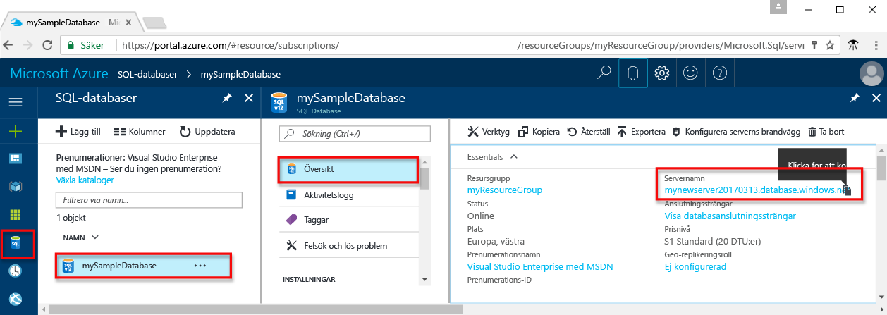
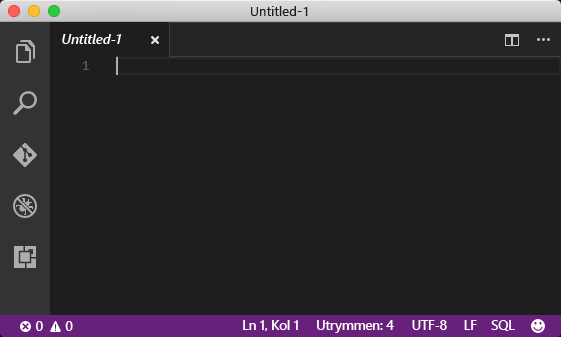
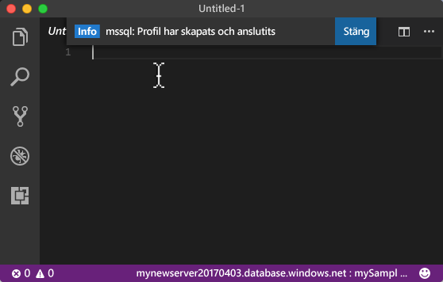
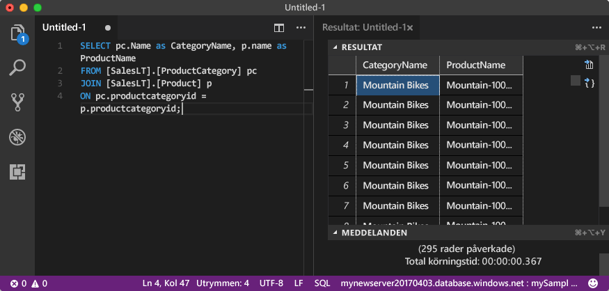

# <a name="azure-sql-database-use-visual-studio-code-tooconnect-and-query-data"></a>Azure SQL Database: Använd Visual Studio Code tooconnect och fråga data

[Visual Studio Code](https://code.visualstudio.com/docs) är en grafiska redigerare för macOS, Linux och Windows som stöder tillägg, inklusive hello [mssql tillägget](https://aka.ms/mssql-marketplace) för frågor till Microsoft SQL Server, Azure SQL Database och SQL Data Warehouse. Den här snabbstartsguide visar hur toouse Visual Studio Code tooconnect tooan Azure SQL database och sedan använda Transact-SQL-instruktioner tooquery infoga, uppdatera och ta bort data i hello-databas.

## <a name="prerequisites"></a>Krav

Den här snabbstartsguide används som första plats hello resurserna skapas i ett av dessa snabbstarter:

- [Skapa DB – Portal](sql-database-get-started-portal.md)
- [Skapa DB – CLI](sql-database-get-started-cli.md)
- [Skapa DB – PowerShell](sql-database-get-started-powershell.md)

Innan du börjar, kontrollera att du har installerat hello senaste versionen av [Visual Studio Code](https://code.visualstudio.com/Download) och läsa in hello [mssql tillägget](https://aka.ms/mssql-marketplace). Installationen vägledning för hello mssql tillägg finns [installera VS kod](https://docs.microsoft.com/sql/linux/sql-server-linux-develop-use-vscode#install-vs-code) och se [mssql för Visual Studio Code](https://marketplace.visualstudio.com/items?itemName=ms-mssql.mssql). 

## <a name="configure-vs-code"></a>Konfigurera VS-kod 

### <a name="mac-os"></a>**Mac OS**
För macOS behöver du tooinstall OpenSSL som är en prerequiste för DotNet Core som mssql-tillägget används. Öppna terminalen och ange följande kommandon tooinstall hello **brew** och **OpenSSL**. 

```bash
ruby -e "$(curl -fsSL https://raw.githubusercontent.com/Homebrew/install/master/install)"
brew update
brew install openssl
mkdir -p /usr/local/lib
ln -s /usr/local/opt/openssl/lib/libcrypto.1.0.0.dylib /usr/local/lib/
ln -s /usr/local/opt/openssl/lib/libssl.1.0.0.dylib /usr/local/lib/
```

### <a name="linux-ubuntu"></a>**Linux (Ubuntu)**

Ingen särskild konfiguration behövs.

### <a name="windows"></a>**Windows**

Ingen särskild konfiguration behövs.

## <a name="sql-server-connection-information"></a>Anslutningsinformation för en SQL-server

Hämta hello anslutning information som behövs för tooconnect toohello Azure SQL-databas. Du behöver hello fullständigt kvalificerade servernamnet, databasnamnet och inloggningsinformation i hello nästkommande procedurer.

1. Logga in toohello [Azure-portalen](https://portal.azure.com/).
2. Välj **SQL-databaser** vänstra hello-menyn och klicka på din databas på hello **SQL-databaser** sidan. 
3. På hello **översikt** för databasen, granska hello fullständigt kvalificerade servernamnet som visas i följande bild hello. Du kan hovrar över hello server name toobring in hello **klickar du på toocopy** alternativet.

    

4. Om du har glömt hello inloggningsinformation för din Azure SQL Database-server, navigera toohello SQL server sidan tooview hello admin Databasservernamnet och, om nödvändigt återställa hello lösenord. 

## <a name="set-language-mode-toosql"></a>Ange språk läge tooSQL

Ange hello språk läge har angetts för**SQL** i Visual Studio Code tooenable mssql kommandon och T-SQL IntelliSense.

1. Öppna ett Visual Studio Code-fönster. 

2. Klicka på **oformaterad Text** i hello nedre högra hörnet i statusfältet för hello.
3. I hello **språk läge** nedrullningsbara menyn som öppnas, skriver **SQL**, och tryck sedan på **RETUR** tooset hello språk läge tooSQL. 

   

## <a name="connect-tooyour-database"></a>Ansluta tooyour databas

Använd Visual Studio Code tooestablish en anslutning tooyour Azure SQL Database-server.

> [!IMPORTANT]
> Kontrollera att du har din server, databas och inloggningsinformation redo innan du fortsätter. När du börjar att ange hello anslutningsinformation till profilen, om du ändrar ditt fokus från Visual Studio Code, har toorestart skapar hello-anslutningsprofilen.
>

1. VS-koden trycker du på **CTRL + SKIFT + P** (eller **F1**) tooopen hello kommandot palett.

2. Skriv in **sqlcon** och tryck på **RETUR**.

3. Tryck på **RETUR** tooselect **skapa anslutningsprofilen**. Detta skapar en anslutningsprofil för SQL Server-instansen.

4. Följ anslutningsegenskaper för hello prompter toospecify hello för nya hello-anslutningsprofilen. När du har angett varje värde trycker du på **RETUR** toocontinue. 

   | Inställning       | Föreslaget värde | Beskrivning |
   | ------------ | ------------------ | ------------------------------------------------- | 
   | **Servernamn | hello fullständigt kvalificerade servernamnet | hello namnet ska vara ungefär så här: **mynewserver20170313.database.windows.net**. |
   | **Databasnamn** | mySampleDatabase | hello namnet på hello databasen toowhich tooconnect. |
   | **Autentisering** | SQL-inloggning| SQL-autentisering är hello endast autentiseringstyp som vi har konfigurerat i den här kursen. |
   | **Användarnamn** | Hej server-administratörskontot | Detta är hello-konto som du angav när du skapade hello-server. |
   | **Lösenord (SQL-inloggning)** | hello lösenord för administratörskontot server | Detta är hello lösenord som du angav när du skapade hello-server. |
   | **Spara lösenordet?** | Ja eller nej | Välj Ja om du inte vill att tooenter hello lösenord varje gång. |
   | **Ange ett namn för den här profilen** | Ett anslutningsprofilnamn, t.ex. **mySampleDatabase** | Ett sparat profilnamn förbättrar anslutningen på efterföljande inloggningar. | 

5. Tryck på hello **ESC** viktiga tooclose info hälsningsmeddelande som informerar dig om att hello profil skapas och ansluten.

6. Kontrollera din anslutning i hello statusfältet.

   

## <a name="query-data"></a>Frågedata

Använd hello följande kod tooquery för hello de 20 största produkter efter kategori med hello [Välj](https://msdn.microsoft.com/library/ms189499.aspx) Transact-SQL-instruktionen.

1. I hello **Editor** fönstret Ange hello följande fråga i hello tom frågefönstret:

   ```sql
   SELECT pc.Name as CategoryName, p.name as ProductName
   FROM [SalesLT].[ProductCategory] pc
   JOIN [SalesLT].[Product] p
   ON pc.productcategoryid = p.productcategoryid;
   ```

2. Tryck på **CTRL + SKIFT + E** tooretrieve data från hello produkt och produktkategori.

    

## <a name="insert-data"></a>Infoga data

Använd hello följande kod tooinsert en ny produkt i hello SalesLT.Product tabellen med hjälp av hello [infoga](https://msdn.microsoft.com/library/ms174335.aspx) Transact-SQL-instruktionen.

1. I hello **Editor** , ta bort hello föregående fråga och ange hello följande fråga:

   ```sql
   INSERT INTO [SalesLT].[Product]
           ( [Name]
           , [ProductNumber]
           , [Color]
           , [ProductCategoryID]
           , [StandardCost]
           , [ListPrice]
           , [SellStartDate]
           )
     VALUES
           ('myNewProduct'
           ,123456789
           ,'NewColor'
           ,1
           ,100
           ,100
           ,GETDATE() );
   ```

2. Tryck på **CTRL + SKIFT + E** tooinsert en ny rad i tabellen för hello-produkten.

## <a name="update-data"></a>Uppdatera data

Använd hello följande kod tooupdate hello ny produkt som du tidigare har lagts till med hello [uppdatering](https://msdn.microsoft.com/library/ms177523.aspx) Transact-SQL-instruktionen.

1.  I hello **Editor** , ta bort hello föregående fråga och ange hello följande fråga:

   ```sql
   UPDATE [SalesLT].[Product]
   SET [ListPrice] = 125
   WHERE Name = 'myNewProduct';
   ```

2. Tryck på **CTRL + SKIFT + E** tooupdate hello angivna raden i tabellen för hello-produkten.

## <a name="delete-data"></a>Ta bort data

Använd hello följande kod toodelete hello ny produkt som du tidigare har lagts till med hello [ta bort](https://msdn.microsoft.com/library/ms189835.aspx) Transact-SQL-instruktionen.

1. I hello **Editor** , ta bort hello föregående fråga och ange hello följande fråga:

   ```sql
   DELETE FROM [SalesLT].[Product]
   WHERE Name = 'myNewProduct';
   ```

2. Tryck på **CTRL + SKIFT + E** toodelete hello angivna raden i tabellen för hello-produkten.

## <a name="next-steps"></a>Nästa steg

- tooconnect och fråga med SQL Server Management Studio finns [Anslut och fråga med SSMS](sql-database-connect-query-ssms.md).
- En artikel från MSDN-magazine om hur du använder Visual Studio Code finns i [Skapa en IDE-databas med MSSQL-tillägget blogginlägg](https://msdn.microsoft.com/magazine/mt809115).
