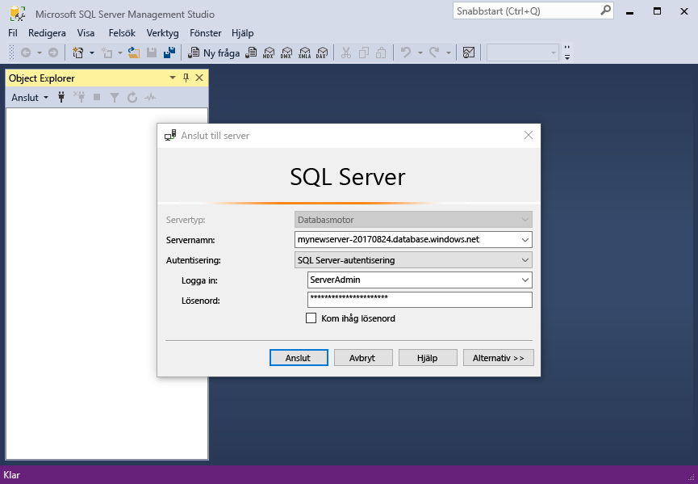
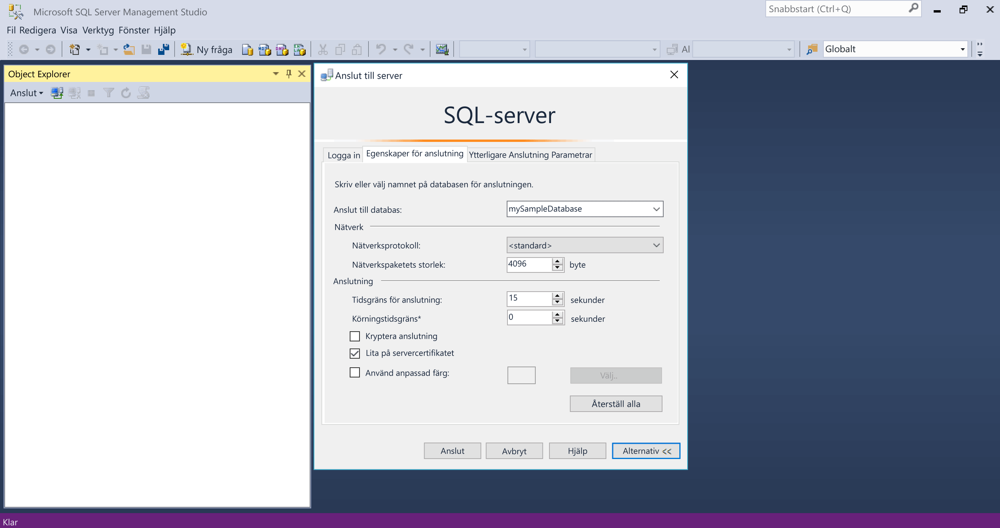
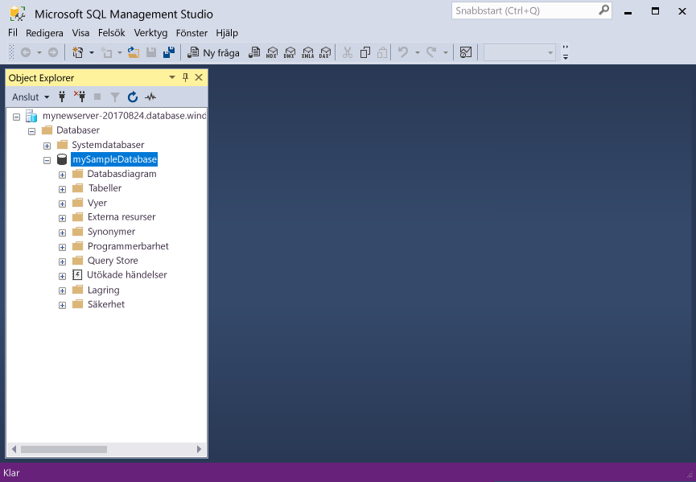

# <a name="design-your-first-azure-sql-database"></a><span data-ttu-id="12ee4-103">Utforma din första Azure SQL-databas</span><span class="sxs-lookup"><span data-stu-id="12ee4-103">Design your first Azure SQL database</span></span>

<span data-ttu-id="12ee4-104">Azure SQL Database är en relationell databas-som-en tjänst (DBaaS) i hello Microsoft Cloud (”Azure”).</span><span class="sxs-lookup"><span data-stu-id="12ee4-104">Azure SQL Database is a relational database-as-a service (DBaaS) in hello Microsoft Cloud ("Azure").</span></span> <span data-ttu-id="12ee4-105">I kursen får du lära dig hur toouse hello Azure-portalen och [SQL Server Management Studio](https://msdn.microsoft.com/library/ms174173.aspx) (SSMS) till:</span><span class="sxs-lookup"><span data-stu-id="12ee4-105">In this tutorial, you learn how toouse hello Azure portal and [SQL Server Management Studio](https://msdn.microsoft.com/library/ms174173.aspx) (SSMS) to:</span></span> 

> [!div class="checklist"]
> * <span data-ttu-id="12ee4-106">Skapa en databas i hello Azure-portalen</span><span class="sxs-lookup"><span data-stu-id="12ee4-106">Create a database in hello Azure portal</span></span>
> * <span data-ttu-id="12ee4-107">Konfigurera en brandväggsregel på servernivå i hello Azure-portalen</span><span class="sxs-lookup"><span data-stu-id="12ee4-107">Set up a server-level firewall rule in hello Azure portal</span></span>
> * <span data-ttu-id="12ee4-108">Ansluta toohello databas med SSMS</span><span class="sxs-lookup"><span data-stu-id="12ee4-108">Connect toohello database with SSMS</span></span>
> * <span data-ttu-id="12ee4-109">Skapa tabeller med SSMS</span><span class="sxs-lookup"><span data-stu-id="12ee4-109">Create tables with SSMS</span></span>
> * <span data-ttu-id="12ee4-110">Massinläsning av data med BCP</span><span class="sxs-lookup"><span data-stu-id="12ee4-110">Bulk load data with BCP</span></span>
> * <span data-ttu-id="12ee4-111">Fråga data med SSMS</span><span class="sxs-lookup"><span data-stu-id="12ee4-111">Query that data with SSMS</span></span>
> * <span data-ttu-id="12ee4-112">Återställa hello databasen tooa tidigare [återställning vid tidpunkt](sql-database-recovery-using-backups.md#point-in-time-restore) i hello Azure-portalen</span><span class="sxs-lookup"><span data-stu-id="12ee4-112">Restore hello database tooa previous [point in time restore](sql-database-recovery-using-backups.md#point-in-time-restore) in hello Azure portal</span></span>

<span data-ttu-id="12ee4-113">Om du inte har en Azure-prenumeration [skapa ett kostnadsfritt konto](https://azure.microsoft.com/free/) innan du börjar.</span><span class="sxs-lookup"><span data-stu-id="12ee4-113">If you don't have an Azure subscription, [create a free account](https://azure.microsoft.com/free/) before you begin.</span></span>

## <a name="prerequisites"></a><span data-ttu-id="12ee4-114">Krav</span><span class="sxs-lookup"><span data-stu-id="12ee4-114">Prerequisites</span></span>

<span data-ttu-id="12ee4-115">toocomplete den här självstudiekursen, se till att du har installerat:</span><span class="sxs-lookup"><span data-stu-id="12ee4-115">toocomplete this tutorial, make sure you have installed:</span></span>
- <span data-ttu-id="12ee4-116">hello senaste versionen av [SQL Server Management Studio](https://msdn.microsoft.com/library/ms174173.aspx) (SSMS).</span><span class="sxs-lookup"><span data-stu-id="12ee4-116">hello newest version of [SQL Server Management Studio](https://msdn.microsoft.com/library/ms174173.aspx) (SSMS).</span></span>
- <span data-ttu-id="12ee4-117">hello senaste versionen av [BCP och SQLCMD](https://www.microsoft.com/download/details.aspx?id=36433).</span><span class="sxs-lookup"><span data-stu-id="12ee4-117">hello newest version of [BCP and SQLCMD](https://www.microsoft.com/download/details.aspx?id=36433).</span></span>

## <a name="log-in-toohello-azure-portal"></a><span data-ttu-id="12ee4-118">Logga in toohello Azure-portalen</span><span class="sxs-lookup"><span data-stu-id="12ee4-118">Log in toohello Azure portal</span></span>

<span data-ttu-id="12ee4-119">Logga in toohello [Azure-portalen](https://portal.azure.com/).</span><span class="sxs-lookup"><span data-stu-id="12ee4-119">Log in toohello [Azure portal](https://portal.azure.com/).</span></span>

## <a name="create-a-blank-sql-database"></a><span data-ttu-id="12ee4-120">Skapa en tom SQL-databas</span><span class="sxs-lookup"><span data-stu-id="12ee4-120">Create a blank SQL database</span></span>

<span data-ttu-id="12ee4-121">Azure SQL-databasen skapas med en definierad uppsättning [beräknings-och lagringsresurser](sql-database-service-tiers.md).</span><span class="sxs-lookup"><span data-stu-id="12ee4-121">An Azure SQL database is created with a defined set of [compute and storage resources](sql-database-service-tiers.md).</span></span> <span data-ttu-id="12ee4-122">hello-databas skapas inom en [Azure-resursgrupp](../azure-resource-manager/resource-group-overview.md) och i en [logisk Azure SQL Database-server](sql-database-features.md).</span><span class="sxs-lookup"><span data-stu-id="12ee4-122">hello database is created within an [Azure resource group](../azure-resource-manager/resource-group-overview.md) and in an [Azure SQL Database logical server](sql-database-features.md).</span></span> 

<span data-ttu-id="12ee4-123">Följ dessa steg toocreate en tom SQL-databas.</span><span class="sxs-lookup"><span data-stu-id="12ee4-123">Follow these steps toocreate a blank SQL database.</span></span> 

1. <span data-ttu-id="12ee4-124">Klicka på hello **ny** knappen hittades på hello övre vänstra hörnet av hello Azure-portalen.</span><span class="sxs-lookup"><span data-stu-id="12ee4-124">Click hello **New** button found on hello upper left-hand corner of hello Azure portal.</span></span>

2. <span data-ttu-id="12ee4-125">Välj **databaser** från hello **ny** och väljer **SQL-databas** från hello **databaser** sidan.</span><span class="sxs-lookup"><span data-stu-id="12ee4-125">Select **Databases** from hello **New** page, and select **SQL Database** from hello **Databases** page.</span></span> 

   

3. <span data-ttu-id="12ee4-127">Fyll i formuläret om hello SQL-databas med hello följande information som visas i föregående bild hello:</span><span class="sxs-lookup"><span data-stu-id="12ee4-127">Fill out hello SQL Database form with hello following information, as shown on hello preceding image:</span></span>   

   | <span data-ttu-id="12ee4-128">Inställning</span><span class="sxs-lookup"><span data-stu-id="12ee4-128">Setting</span></span>       | <span data-ttu-id="12ee4-129">Föreslaget värde</span><span class="sxs-lookup"><span data-stu-id="12ee4-129">Suggested value</span></span> | <span data-ttu-id="12ee4-130">Beskrivning</span><span class="sxs-lookup"><span data-stu-id="12ee4-130">Description</span></span> | 
   | ------------ | ------------------ | ------------------------------------------------- | 
   | <span data-ttu-id="12ee4-131">**Databasnamn**</span><span class="sxs-lookup"><span data-stu-id="12ee4-131">**Database name**</span></span> | <span data-ttu-id="12ee4-132">mySampleDatabase</span><span class="sxs-lookup"><span data-stu-id="12ee4-132">mySampleDatabase</span></span> | <span data-ttu-id="12ee4-133">För giltiga databasnamn, se [databasidentifierare](https://docs.microsoft.com/sql/relational-databases/databases/database-identifiers).</span><span class="sxs-lookup"><span data-stu-id="12ee4-133">For valid database names, see [Database Identifiers](https://docs.microsoft.com/sql/relational-databases/databases/database-identifiers).</span></span> | 
   | <span data-ttu-id="12ee4-134">**Prenumeration**</span><span class="sxs-lookup"><span data-stu-id="12ee4-134">**Subscription**</span></span> | <span data-ttu-id="12ee4-135">Din prenumeration</span><span class="sxs-lookup"><span data-stu-id="12ee4-135">Your subscription</span></span>  | <span data-ttu-id="12ee4-136">Mer information om dina prenumerationer finns i [Prenumerationer](https://account.windowsazure.com/Subscriptions).</span><span class="sxs-lookup"><span data-stu-id="12ee4-136">For details about your subscriptions, see [Subscriptions](https://account.windowsazure.com/Subscriptions).</span></span> |
   | <span data-ttu-id="12ee4-137">**Resursgrupp**</span><span class="sxs-lookup"><span data-stu-id="12ee4-137">**Resource group**</span></span> | <span data-ttu-id="12ee4-138">myResourceGroup</span><span class="sxs-lookup"><span data-stu-id="12ee4-138">myResourceGroup</span></span> | <span data-ttu-id="12ee4-139">Giltiga resursgruppnamn finns i [Namngivningsregler och begränsningar](https://docs.microsoft.com/azure/architecture/best-practices/naming-conventions).</span><span class="sxs-lookup"><span data-stu-id="12ee4-139">For valid resource group names, see [Naming rules and restrictions](https://docs.microsoft.com/azure/architecture/best-practices/naming-conventions).</span></span> |
   | <span data-ttu-id="12ee4-140">**Välj källa**</span><span class="sxs-lookup"><span data-stu-id="12ee4-140">**Select source**</span></span> | <span data-ttu-id="12ee4-141">Tom databas</span><span class="sxs-lookup"><span data-stu-id="12ee4-141">Blank database</span></span> | <span data-ttu-id="12ee4-142">Anger att en tom databas ska skapas.</span><span class="sxs-lookup"><span data-stu-id="12ee4-142">Specifies that a blank database should be created.</span></span> |

4. <span data-ttu-id="12ee4-143">Klicka på **Server** toocreate och konfigurera en ny server för den nya databasen.</span><span class="sxs-lookup"><span data-stu-id="12ee4-143">Click **Server** toocreate and configure a new server for your new database.</span></span> <span data-ttu-id="12ee4-144">Fyll i hello **nytt serverformulär** med hello följande information:</span><span class="sxs-lookup"><span data-stu-id="12ee4-144">Fill out hello **New server form** with hello following information:</span></span> 

   | <span data-ttu-id="12ee4-145">Inställning</span><span class="sxs-lookup"><span data-stu-id="12ee4-145">Setting</span></span>       | <span data-ttu-id="12ee4-146">Föreslaget värde</span><span class="sxs-lookup"><span data-stu-id="12ee4-146">Suggested value</span></span> | <span data-ttu-id="12ee4-147">Beskrivning</span><span class="sxs-lookup"><span data-stu-id="12ee4-147">Description</span></span> | 
   | ------------ | ------------------ | ------------------------------------------------- | 
   | <span data-ttu-id="12ee4-148">**Servernamn**</span><span class="sxs-lookup"><span data-stu-id="12ee4-148">**Server name**</span></span> | <span data-ttu-id="12ee4-149">Valfritt globalt unikt namn</span><span class="sxs-lookup"><span data-stu-id="12ee4-149">Any globally unique name</span></span> | <span data-ttu-id="12ee4-150">Giltiga servernamn finns i [Namngivningsregler och begränsningar](https://docs.microsoft.com/azure/architecture/best-practices/naming-conventions).</span><span class="sxs-lookup"><span data-stu-id="12ee4-150">For valid server names, see [Naming rules and restrictions](https://docs.microsoft.com/azure/architecture/best-practices/naming-conventions).</span></span> | 
   | <span data-ttu-id="12ee4-151">**Inloggning för serveradministratör**</span><span class="sxs-lookup"><span data-stu-id="12ee4-151">**Server admin login**</span></span> | <span data-ttu-id="12ee4-152">Valfritt giltigt namn</span><span class="sxs-lookup"><span data-stu-id="12ee4-152">Any valid name</span></span> | <span data-ttu-id="12ee4-153">För giltiga inloggningsnamn, se [Databasidentifierare](https://docs.microsoft.com/sql/relational-databases/databases/database-identifiers).</span><span class="sxs-lookup"><span data-stu-id="12ee4-153">For valid login names, see [Database Identifiers](https://docs.microsoft.com/sql/relational-databases/databases/database-identifiers).</span></span>|
   | <span data-ttu-id="12ee4-154">**Lösenord**</span><span class="sxs-lookup"><span data-stu-id="12ee4-154">**Password**</span></span> | <span data-ttu-id="12ee4-155">Valfritt giltigt lösenord</span><span class="sxs-lookup"><span data-stu-id="12ee4-155">Any valid password</span></span> | <span data-ttu-id="12ee4-156">Lösenordet måste innehålla minst 8 tecken och måste innehålla tecken från tre av hello följande kategorier: versaler, gemener, siffror och specialtecken.</span><span class="sxs-lookup"><span data-stu-id="12ee4-156">Your password must have at least 8 characters and must contain characters from three of hello following categories: upper case characters, lower case characters, numbers, and non-alphanumeric characters.</span></span> |
   | <span data-ttu-id="12ee4-157">**Plats**</span><span class="sxs-lookup"><span data-stu-id="12ee4-157">**Location**</span></span> | <span data-ttu-id="12ee4-158">Valfri giltig plats</span><span class="sxs-lookup"><span data-stu-id="12ee4-158">Any valid location</span></span> | <span data-ttu-id="12ee4-159">För information om regioner, se [Azure-regioner](https://azure.microsoft.com/regions/).</span><span class="sxs-lookup"><span data-stu-id="12ee4-159">For information about regions, see [Azure Regions](https://azure.microsoft.com/regions/).</span></span> |

   

5. <span data-ttu-id="12ee4-161">Klicka på **Välj**.</span><span class="sxs-lookup"><span data-stu-id="12ee4-161">Click **Select**.</span></span>

6. <span data-ttu-id="12ee4-162">Klicka på **prisnivå** toospecify hello tjänstnivå och prestandanivå servicenivå för den nya databasen.</span><span class="sxs-lookup"><span data-stu-id="12ee4-162">Click **Pricing tier** toospecify hello service tier and performance level for your new database.</span></span> <span data-ttu-id="12ee4-163">Den här kursen väljer **20 dtu: er** och **250** GB lagringsutrymme.</span><span class="sxs-lookup"><span data-stu-id="12ee4-163">For this tutorial, select **20 DTUs** and **250** GB of storage.</span></span>

   

7. <span data-ttu-id="12ee4-165">Klicka på **Använd**.</span><span class="sxs-lookup"><span data-stu-id="12ee4-165">Click **Apply**.</span></span>  

8. <span data-ttu-id="12ee4-166">Välj en **sorteringen** för hello tom databas (för den här kursen används hello standardvärdet).</span><span class="sxs-lookup"><span data-stu-id="12ee4-166">Select a **collation** for hello blank database (for this tutorial, use hello default value).</span></span> <span data-ttu-id="12ee4-167">Mer information om sorteringar finns [sorteringar](https://docs.microsoft.com/sql/t-sql/statements/collations)</span><span class="sxs-lookup"><span data-stu-id="12ee4-167">For more information about collations, see [Collations](https://docs.microsoft.com/sql/t-sql/statements/collations)</span></span>

9. <span data-ttu-id="12ee4-168">Klicka på **skapa** tooprovision hello-databasen.</span><span class="sxs-lookup"><span data-stu-id="12ee4-168">Click **Create** tooprovision hello database.</span></span> <span data-ttu-id="12ee4-169">Etablering tar om en minut och en halv toocomplete.</span><span class="sxs-lookup"><span data-stu-id="12ee4-169">Provisioning takes about a minute and a half toocomplete.</span></span> 

10. <span data-ttu-id="12ee4-170">På verktygsfältet hello **meddelanden** toomonitor hello distributionsprocessen.</span><span class="sxs-lookup"><span data-stu-id="12ee4-170">On hello toolbar, click **Notifications** toomonitor hello deployment process.</span></span>

   

## <a name="create-a-server-level-firewall-rule"></a><span data-ttu-id="12ee4-172">Skapa en brandväggsregel på servernivå</span><span class="sxs-lookup"><span data-stu-id="12ee4-172">Create a server-level firewall rule</span></span>

<span data-ttu-id="12ee4-173">hello SQL Database-tjänsten skapar en brandvägg på hello-servernivå som förhindrar att externa program och verktyg ansluter toohello server eller en databas på servern hello såvida inte en brandväggsregel skapas tooopen hello-brandväggen för specifika IP-adresser.</span><span class="sxs-lookup"><span data-stu-id="12ee4-173">hello SQL Database service creates a firewall at hello server-level that prevents external applications and tools from connecting toohello server or any databases on hello server unless a firewall rule is created tooopen hello firewall for specific IP addresses.</span></span> <span data-ttu-id="12ee4-174">Följ dessa steg toocreate en [SQL-databas brandväggsregel på servernivå](sql-database-firewall-configure.md) för din klients IP-adress och aktivera extern anslutning via hello SQL Database-Brandvägg för din IP-adress.</span><span class="sxs-lookup"><span data-stu-id="12ee4-174">Follow these steps toocreate a [SQL Database server-level firewall rule](sql-database-firewall-configure.md) for your client's IP address and enable external connectivity through hello SQL Database firewall for your IP address only.</span></span> 

> [!NOTE]
> <span data-ttu-id="12ee4-175">SQL Database kommunicerar via port 1433.</span><span class="sxs-lookup"><span data-stu-id="12ee4-175">SQL Database communicates over port 1433.</span></span> <span data-ttu-id="12ee4-176">Om du försöker tooconnect från ett företagsnätverk, tillåtas utgående trafik via port 1433 inte av ditt nätverks brandvägg.</span><span class="sxs-lookup"><span data-stu-id="12ee4-176">If you are trying tooconnect from within a corporate network, outbound traffic over port 1433 may not be allowed by your network's firewall.</span></span> <span data-ttu-id="12ee4-177">I så fall, kan du inte ansluta tooyour Azure SQL Database-server om din IT-avdelning öppnar port 1433.</span><span class="sxs-lookup"><span data-stu-id="12ee4-177">If so, you cannot connect tooyour Azure SQL Database server unless your IT department opens port 1433.</span></span>
>

1. <span data-ttu-id="12ee4-178">När hello distributionen är klar klickar du på **SQL-databaser** från hello vänstra menyn och klicka sedan på **mySampleDatabase** på hello **SQL-databaser** sidan.</span><span class="sxs-lookup"><span data-stu-id="12ee4-178">After hello deployment completes, click **SQL databases** from hello left-hand menu and then click **mySampleDatabase** on hello **SQL databases** page.</span></span> <span data-ttu-id="12ee4-179">hello översiktssidan för din databas öppnas som visar du hello fullständigt kvalificerade servernamnet (exempelvis **mynewserver20170313.database.windows.net**) och innehåller alternativ för ytterligare konfiguration.</span><span class="sxs-lookup"><span data-stu-id="12ee4-179">hello overview page for your database opens, showing you hello fully qualified server name (such as **mynewserver20170313.database.windows.net**) and provides options for further configuration.</span></span> <span data-ttu-id="12ee4-180">Kopiera det fullständiga servernamnet för senare användning.</span><span class="sxs-lookup"><span data-stu-id="12ee4-180">Copy this fully qualified server name for use later.</span></span>

   > [!IMPORTANT]
   > <span data-ttu-id="12ee4-181">Du behöver den här fullständigt kvalificerade namnet tooconnect tooyour-server och dess databaser i efterföljande snabbstarter.</span><span class="sxs-lookup"><span data-stu-id="12ee4-181">You need this fully qualified server name tooconnect tooyour server and its databases in subsequent quick starts.</span></span>
   > 

    

2. <span data-ttu-id="12ee4-183">Klicka på **ange serverbrandvägg** hello verktygsfältet enligt hello föregående bild.</span><span class="sxs-lookup"><span data-stu-id="12ee4-183">Click **Set server firewall** on hello toolbar as shown in hello previous image.</span></span> <span data-ttu-id="12ee4-184">Hej **brandväggsinställningar** öppnas sidan för hello SQL Database-server.</span><span class="sxs-lookup"><span data-stu-id="12ee4-184">hello **Firewall settings** page for hello SQL Database server opens.</span></span> 

    


3. <span data-ttu-id="12ee4-186">Klicka på **lägga till klientens IP-Adressen** på hello verktygsfältet tooadd din aktuella IP-adressen tooa ny brandväggsregel.</span><span class="sxs-lookup"><span data-stu-id="12ee4-186">Click **Add client IP** on hello toolbar tooadd your current IP address tooa new firewall rule.</span></span> <span data-ttu-id="12ee4-187">Med en brandväggsregel kan du öppna port 1433 för en enskild IP-adress eller för IP-adressintervall.</span><span class="sxs-lookup"><span data-stu-id="12ee4-187">A firewall rule can open port 1433 for a single IP address or a range of IP addresses.</span></span>

4. <span data-ttu-id="12ee4-188">Klicka på **Spara**.</span><span class="sxs-lookup"><span data-stu-id="12ee4-188">Click **Save**.</span></span> <span data-ttu-id="12ee4-189">En brandväggsregel på servernivå har skapats för din aktuella IP-adress som är öppna port 1433 på hello logisk server.</span><span class="sxs-lookup"><span data-stu-id="12ee4-189">A server-level firewall rule is created for your current IP address opening port 1433 on hello logical server.</span></span>

    

4. <span data-ttu-id="12ee4-191">Klicka på **OK** och stäng sedan hello **brandväggsinställningar** sidan.</span><span class="sxs-lookup"><span data-stu-id="12ee4-191">Click **OK** and then close hello **Firewall settings** page.</span></span>

<span data-ttu-id="12ee4-192">Nu kan du ansluta toohello SQL Database-server och dess databaser med SQL Server Management Studio eller ett annat verktyg som helst från den här IP-adressen med hello server administratörskonto som skapats tidigare.</span><span class="sxs-lookup"><span data-stu-id="12ee4-192">You can now connect toohello SQL Database server and its databases using SQL Server Management Studio or another tool of your choice from this IP address using hello server admin account created previously.</span></span>

> [!IMPORTANT]
> <span data-ttu-id="12ee4-193">Som standard är åtkomst via hello SQL Database-brandvägg aktiverad för alla Azure-tjänster.</span><span class="sxs-lookup"><span data-stu-id="12ee4-193">By default, access through hello SQL Database firewall is enabled for all Azure services.</span></span> <span data-ttu-id="12ee4-194">Klicka på **OFF** på den här sidan toodisable för alla Azure-tjänster.</span><span class="sxs-lookup"><span data-stu-id="12ee4-194">Click **OFF** on this page toodisable for all Azure services.</span></span>

## <a name="sql-server-connection-information"></a><span data-ttu-id="12ee4-195">Anslutningsinformation för en SQL-server</span><span class="sxs-lookup"><span data-stu-id="12ee4-195">SQL server connection information</span></span>

<span data-ttu-id="12ee4-196">Hämta hello fullständigt kvalificerade servernamnet för din Azure SQL Database-server i hello Azure-portalen.</span><span class="sxs-lookup"><span data-stu-id="12ee4-196">Get hello fully qualified server name for your Azure SQL Database server in hello Azure portal.</span></span> <span data-ttu-id="12ee4-197">Du kan använda hello fullständiga server name tooconnect tooyour servern med hjälp av SQL Server Management Studio.</span><span class="sxs-lookup"><span data-stu-id="12ee4-197">You use hello fully qualified server name tooconnect tooyour server using SQL Server Management Studio.</span></span>

1. <span data-ttu-id="12ee4-198">Logga in toohello [Azure-portalen](https://portal.azure.com/).</span><span class="sxs-lookup"><span data-stu-id="12ee4-198">Log in toohello [Azure portal](https://portal.azure.com/).</span></span>
2. <span data-ttu-id="12ee4-199">Välj **SQL-databaser** vänstra hello-menyn och klicka på din databas på hello **SQL-databaser** sidan.</span><span class="sxs-lookup"><span data-stu-id="12ee4-199">Select **SQL Databases** from hello left-hand menu, and click your database on hello **SQL databases** page.</span></span> 
3. <span data-ttu-id="12ee4-200">I hello **Essentials** rutan i hello Azure Portalsida för databasen, leta upp och sedan kopiera hello **servernamn**.</span><span class="sxs-lookup"><span data-stu-id="12ee4-200">In hello **Essentials** pane in hello Azure portal page for your database, locate and then copy hello **Server name**.</span></span>

   

## <a name="connect-toohello-database-with-ssms"></a><span data-ttu-id="12ee4-202">Ansluta toohello databas med SSMS</span><span class="sxs-lookup"><span data-stu-id="12ee4-202">Connect toohello database with SSMS</span></span>

<span data-ttu-id="12ee4-203">Använd [SQL Server Management Studio](https://docs.microsoft.com/sql/ssms/sql-server-management-studio-ssms) tooestablish en anslutning tooyour Azure SQL Database-server.</span><span class="sxs-lookup"><span data-stu-id="12ee4-203">Use [SQL Server Management Studio](https://docs.microsoft.com/sql/ssms/sql-server-management-studio-ssms) tooestablish a connection tooyour Azure SQL Database server.</span></span>

1. <span data-ttu-id="12ee4-204">Öppna SQL Server Management Studio.</span><span class="sxs-lookup"><span data-stu-id="12ee4-204">Open SQL Server Management Studio.</span></span>

2. <span data-ttu-id="12ee4-205">I hello **ansluta tooServer** dialogrutan Ange hello följande information:</span><span class="sxs-lookup"><span data-stu-id="12ee4-205">In hello **Connect tooServer** dialog box, enter hello following information:</span></span>

   | <span data-ttu-id="12ee4-206">Inställning</span><span class="sxs-lookup"><span data-stu-id="12ee4-206">Setting</span></span>       | <span data-ttu-id="12ee4-207">Föreslaget värde</span><span class="sxs-lookup"><span data-stu-id="12ee4-207">Suggested value</span></span> | <span data-ttu-id="12ee4-208">Beskrivning</span><span class="sxs-lookup"><span data-stu-id="12ee4-208">Description</span></span> | 
   | ------------ | ------------------ | ------------------------------------------------- | 
   | <span data-ttu-id="12ee4-209">Servertyp</span><span class="sxs-lookup"><span data-stu-id="12ee4-209">Server type</span></span> | <span data-ttu-id="12ee4-210">Databasmotor</span><span class="sxs-lookup"><span data-stu-id="12ee4-210">Database engine</span></span> | <span data-ttu-id="12ee4-211">Det här värdet krävs</span><span class="sxs-lookup"><span data-stu-id="12ee4-211">This value is required</span></span> |
   | <span data-ttu-id="12ee4-212">servernamn</span><span class="sxs-lookup"><span data-stu-id="12ee4-212">Server name</span></span> | <span data-ttu-id="12ee4-213">hello fullständigt kvalificerade servernamnet</span><span class="sxs-lookup"><span data-stu-id="12ee4-213">hello fully qualified server name</span></span> | <span data-ttu-id="12ee4-214">hello namnet ska vara ungefär så här: **mynewserver20170313.database.windows.net**.</span><span class="sxs-lookup"><span data-stu-id="12ee4-214">hello name should be something like this: **mynewserver20170313.database.windows.net**.</span></span> |
   | <span data-ttu-id="12ee4-215">Autentisering</span><span class="sxs-lookup"><span data-stu-id="12ee4-215">Authentication</span></span> | <span data-ttu-id="12ee4-216">SQL Server-autentisering</span><span class="sxs-lookup"><span data-stu-id="12ee4-216">SQL Server Authentication</span></span> | <span data-ttu-id="12ee4-217">SQL-autentisering är hello endast autentiseringstyp som vi har konfigurerat i den här kursen.</span><span class="sxs-lookup"><span data-stu-id="12ee4-217">SQL Authentication is hello only authentication type that we have configured in this tutorial.</span></span> |
   | <span data-ttu-id="12ee4-218">Inloggning</span><span class="sxs-lookup"><span data-stu-id="12ee4-218">Login</span></span> | <span data-ttu-id="12ee4-219">Hej server-administratörskontot</span><span class="sxs-lookup"><span data-stu-id="12ee4-219">hello server admin account</span></span> | <span data-ttu-id="12ee4-220">Detta är hello-konto som du angav när du skapade hello-server.</span><span class="sxs-lookup"><span data-stu-id="12ee4-220">This is hello account that you specified when you created hello server.</span></span> |
   | <span data-ttu-id="12ee4-221">Lösenord</span><span class="sxs-lookup"><span data-stu-id="12ee4-221">Password</span></span> | <span data-ttu-id="12ee4-222">hello lösenord för administratörskontot server</span><span class="sxs-lookup"><span data-stu-id="12ee4-222">hello password for your server admin account</span></span> | <span data-ttu-id="12ee4-223">Detta är hello lösenord som du angav när du skapade hello-server.</span><span class="sxs-lookup"><span data-stu-id="12ee4-223">This is hello password that you specified when you created hello server.</span></span> |

   

3. <span data-ttu-id="12ee4-225">Klicka på **alternativ** i hello **ansluta tooserver** dialogrutan.</span><span class="sxs-lookup"><span data-stu-id="12ee4-225">Click **Options** in hello **Connect tooserver** dialog box.</span></span> <span data-ttu-id="12ee4-226">I hello **ansluta toodatabase** ange **mySampleDatabase** tooconnect toothis databas.</span><span class="sxs-lookup"><span data-stu-id="12ee4-226">In hello **Connect toodatabase** section, enter **mySampleDatabase** tooconnect toothis database.</span></span>

     

4. <span data-ttu-id="12ee4-228">Klicka på **Anslut**.</span><span class="sxs-lookup"><span data-stu-id="12ee4-228">Click **Connect**.</span></span> <span data-ttu-id="12ee4-229">öppnas med hello Object Explorer i SSMS.</span><span class="sxs-lookup"><span data-stu-id="12ee4-229">hello Object Explorer window opens in SSMS.</span></span> 

5. <span data-ttu-id="12ee4-230">I Object Explorer, expandera **databaser** och expandera sedan **mySampleDatabase** tooview hello objekt i hello-exempeldatabasen.</span><span class="sxs-lookup"><span data-stu-id="12ee4-230">In Object Explorer, expand **Databases** and then expand **mySampleDatabase** tooview hello objects in hello sample database.</span></span>

     

## <a name="create-tables-in-hello-database"></a><span data-ttu-id="12ee4-232">Skapa tabeller i hello-databas</span><span class="sxs-lookup"><span data-stu-id="12ee4-232">Create tables in hello database</span></span> 

<span data-ttu-id="12ee4-233">Skapa ett databasschema med fyra tabeller som modellen är ett system för hantering av student för universitet med [Transact-SQL](https://docs.microsoft.com/sql/t-sql/language-reference):</span><span class="sxs-lookup"><span data-stu-id="12ee4-233">Create a database schema with four tables that model a student management system for universities using [Transact-SQL](https://docs.microsoft.com/sql/t-sql/language-reference):</span></span>

- <span data-ttu-id="12ee4-234">Person</span><span class="sxs-lookup"><span data-stu-id="12ee4-234">Person</span></span>
- <span data-ttu-id="12ee4-235">Kursen</span><span class="sxs-lookup"><span data-stu-id="12ee4-235">Course</span></span>
- <span data-ttu-id="12ee4-236">För studenter</span><span class="sxs-lookup"><span data-stu-id="12ee4-236">Student</span></span>
- <span data-ttu-id="12ee4-237">Kredit att modellen ett student hanteringssystem för universitet</span><span class="sxs-lookup"><span data-stu-id="12ee4-237">Credit that model a student management system for universities</span></span>

<span data-ttu-id="12ee4-238">hello följande diagram visar hur dessa tabeller är andra relaterade tooeach.</span><span class="sxs-lookup"><span data-stu-id="12ee4-238">hello following diagram shows how these tables are related tooeach other.</span></span> <span data-ttu-id="12ee4-239">Vissa av dessa tabeller referera till kolumner i andra tabeller.</span><span class="sxs-lookup"><span data-stu-id="12ee4-239">Some of these tables reference columns in other tables.</span></span> <span data-ttu-id="12ee4-240">Till exempel hello studenttabell refererar till hello **PersonId** kolumn i hello **Person** tabell.</span><span class="sxs-lookup"><span data-stu-id="12ee4-240">For example, hello Student table references hello **PersonId** column of hello **Person** table.</span></span> <span data-ttu-id="12ee4-241">Undersökning hello diagram toounderstand hur hello tabeller i den här kursen är relaterade tooone en annan.</span><span class="sxs-lookup"><span data-stu-id="12ee4-241">Study hello diagram toounderstand how hello tables in this tutorial are related tooone another.</span></span> <span data-ttu-id="12ee4-242">För en titt på hur toocreate effektiva databastabeller finns [skapa effektiva databastabeller](https://msdn.microsoft.com/library/cc505842.aspx).</span><span class="sxs-lookup"><span data-stu-id="12ee4-242">For an in-depth look at how toocreate effective database tables, see [Create effective database tables](https://msdn.microsoft.com/library/cc505842.aspx).</span></span> <span data-ttu-id="12ee4-243">Information om hur du väljer datatyper finns i [datatyper](https://docs.microsoft.com/sql/t-sql/data-types/data-types-transact-sql).</span><span class="sxs-lookup"><span data-stu-id="12ee4-243">For information about choosing data types, see [Data types](https://docs.microsoft.com/sql/t-sql/data-types/data-types-transact-sql).</span></span>

> [!NOTE]
> <span data-ttu-id="12ee4-244">Du kan också använda hello [tabelldesignern i SQL Server Management Studio](https://msdn.microsoft.com/library/hh272695.aspx) toocreate och utforma tabeller.</span><span class="sxs-lookup"><span data-stu-id="12ee4-244">You can also use hello [table designer in SQL Server Management Studio](https://msdn.microsoft.com/library/hh272695.aspx) toocreate and design your tables.</span></span> 


1. <span data-ttu-id="12ee4-246">I Object Explorer högerklickar du på **mySampleDatabase** och klickar sedan på **Ny fråga**.</span><span class="sxs-lookup"><span data-stu-id="12ee4-246">In Object Explorer, right-click **mySampleDatabase** and click **New Query**.</span></span> <span data-ttu-id="12ee4-247">Ett tomt frågefönster öppnas som är anslutna tooyour databas.</span><span class="sxs-lookup"><span data-stu-id="12ee4-247">A blank query window opens that is connected tooyour database.</span></span>

2. <span data-ttu-id="12ee4-248">I frågefönstret hello kör hello följande fråga toocreate fyra tabeller i databasen:</span><span class="sxs-lookup"><span data-stu-id="12ee4-248">In hello query window, execute hello following query toocreate four tables in your database:</span></span> 

   ```sql 
   -- Create Person table

   CREATE TABLE Person
   (
   PersonId   INT IDENTITY PRIMARY KEY,
   FirstName   NVARCHAR(128) NOT NULL,
   MiddelInitial NVARCHAR(10),
   LastName   NVARCHAR(128) NOT NULL,
   DateOfBirth   DATE NOT NULL
   )
   
   -- Create Student table
 
   CREATE TABLE Student
   (
   StudentId INT IDENTITY PRIMARY KEY,
   PersonId  INT REFERENCES Person (PersonId),
   Email   NVARCHAR(256)
   )
   
   -- Create Course table
 
   CREATE TABLE Course
   (
   CourseId  INT IDENTITY PRIMARY KEY,
   Name   NVARCHAR(50) NOT NULL,
   Teacher   NVARCHAR(256) NOT NULL
   ) 

   -- Create Credit table
 
   CREATE TABLE Credit
   (
   StudentId   INT REFERENCES Student (StudentId),
   CourseId   INT REFERENCES Course (CourseId),
   Grade   DECIMAL(5,2) CHECK (Grade <= 100.00),
   Attempt   TINYINT,
   CONSTRAINT  [UQ_studentgrades] UNIQUE CLUSTERED
   (
   StudentId, CourseId, Grade, Attempt
   )
   )
   ```

   

3. <span data-ttu-id="12ee4-250">Expandera hello-tabeller'-nod i hello objektet för SQL Server Management Studio explorer toosee hello tabeller som du skapade.</span><span class="sxs-lookup"><span data-stu-id="12ee4-250">Expand hello 'tables' node in hello SQL Server Management Studio Object explorer toosee hello tables you created.</span></span>

   

## <a name="load-data-into-hello-tables"></a><span data-ttu-id="12ee4-252">Läs in data till hello tabeller</span><span class="sxs-lookup"><span data-stu-id="12ee4-252">Load data into hello tables</span></span>

1. <span data-ttu-id="12ee4-253">Skapa en mapp med namnet **SampleTableData** i dina hämtningar mappen toostore exempeldata för din databas.</span><span class="sxs-lookup"><span data-stu-id="12ee4-253">Create a folder called **SampleTableData** in your Downloads folder toostore sample data for your database.</span></span> 

2. <span data-ttu-id="12ee4-254">Högerklicka på hello följande länkar och spara dem i hello **SampleTableData** mapp.</span><span class="sxs-lookup"><span data-stu-id="12ee4-254">Right-click hello following links and save them into hello **SampleTableData** folder.</span></span> 

   - [<span data-ttu-id="12ee4-255">SampleCourseData</span><span class="sxs-lookup"><span data-stu-id="12ee4-255">SampleCourseData</span></span>](https://sqldbtutorial.blob.core.windows.net/tutorials/SampleCourseData)
   - [<span data-ttu-id="12ee4-256">SamplePersonData</span><span class="sxs-lookup"><span data-stu-id="12ee4-256">SamplePersonData</span></span>](https://sqldbtutorial.blob.core.windows.net/tutorials/SamplePersonData)
   - [<span data-ttu-id="12ee4-257">SampleStudentData</span><span class="sxs-lookup"><span data-stu-id="12ee4-257">SampleStudentData</span></span>](https://sqldbtutorial.blob.core.windows.net/tutorials/SampleStudentData)
   - [<span data-ttu-id="12ee4-258">SampleCreditData</span><span class="sxs-lookup"><span data-stu-id="12ee4-258">SampleCreditData</span></span>](https://sqldbtutorial.blob.core.windows.net/tutorials/SampleCreditData)

3. <span data-ttu-id="12ee4-259">Öppna ett kommandotolksfönster och gå toohello SampleTableData mapp.</span><span class="sxs-lookup"><span data-stu-id="12ee4-259">Open a command prompt window and navigate toohello SampleTableData folder.</span></span>

4. <span data-ttu-id="12ee4-260">Kör följande kommandon tooinsert exempeldata i hello tabeller ersätter hello värden för hello **ServerName**, **DatabaseName**, **användarnamn**, och **Lösenord** med hello värden för din miljö.</span><span class="sxs-lookup"><span data-stu-id="12ee4-260">Execute hello following commands tooinsert sample data into hello tables replacing hello values for **ServerName**, **DatabaseName**, **UserName**, and **Password** with hello values for your environment.</span></span>
  
   ```bcp
   bcp Course in SampleCourseData -S <ServerName>.database.windows.net -d <DatabaseName> -U <Username> -P <password> -q -c -t ","
   bcp Person in SamplePersonData -S <ServerName>.database.windows.net -d <DatabaseName> -U <Username> -P <password> -q -c -t ","
   bcp Student in SampleStudentData -S <ServerName>.database.windows.net -d <DatabaseName> -U <Username> -P <password> -q -c -t ","
   bcp Credit in SampleCreditData -S <ServerName>.database.windows.net -d <DatabaseName> -U <Username> -P <password> -q -c -t ","
   ```

<span data-ttu-id="12ee4-261">Du har nu lästs in exempeldata i hello-tabeller som du skapade tidigare.</span><span class="sxs-lookup"><span data-stu-id="12ee4-261">You have now loaded sample data into hello tables you created earlier.</span></span>

## <a name="query-data"></a><span data-ttu-id="12ee4-262">Frågedata</span><span class="sxs-lookup"><span data-stu-id="12ee4-262">Query data</span></span>

<span data-ttu-id="12ee4-263">Köra hello följande frågor tooretrieve information från hello databastabeller.</span><span class="sxs-lookup"><span data-stu-id="12ee4-263">Execute hello following queries tooretrieve information from hello database tables.</span></span> <span data-ttu-id="12ee4-264">Se [skriva SQL-frågor](https://technet.microsoft.com/library/bb264565.aspx) toolearn mer om hur du skriver SQL-frågor.</span><span class="sxs-lookup"><span data-stu-id="12ee4-264">See [Writing SQL Queries](https://technet.microsoft.com/library/bb264565.aspx) toolearn more about writing SQL queries.</span></span> <span data-ttu-id="12ee4-265">hello första frågan kopplar ihop alla fyra tabeller toofind alla hello elever vilka undervisning förekommer av ' Dominick påven ' som har en klass som är högre än 75% i sin klass.</span><span class="sxs-lookup"><span data-stu-id="12ee4-265">hello first query joins all four tables toofind all hello students taught by 'Dominick Pope' who have a grade higher than 75% in his class.</span></span> <span data-ttu-id="12ee4-266">hello andra frågan kopplar ihop alla fyra tabeller och söker efter alla kurser där 'Noe Coleman' någonsin har registrerats.</span><span class="sxs-lookup"><span data-stu-id="12ee4-266">hello second query joins all four tables and finds all courses in which 'Noe Coleman' has ever enrolled.</span></span>

1. <span data-ttu-id="12ee4-267">Kör följande fråga hello i en SQL Server Management Studio i frågefönstret:</span><span class="sxs-lookup"><span data-stu-id="12ee4-267">In a SQL Server Management Studio query window, execute hello following query:</span></span>

   ```sql 
   -- Find hello students taught by Dominick Pope who have a grade higher than 75%

   SELECT  person.FirstName,
   person.LastName,
   course.Name,
   credit.Grade
   FROM  Person AS person
   INNER JOIN Student AS student ON person.PersonId = student.PersonId
   INNER JOIN Credit AS credit ON student.StudentId = credit.StudentId
   INNER JOIN Course AS course ON credit.CourseId = course.courseId
   WHERE course.Teacher = 'Dominick Pope' 
   AND Grade > 75
   ```

2. <span data-ttu-id="12ee4-268">Kör följande fråga i frågefönstret en SQL Server Management Studio:</span><span class="sxs-lookup"><span data-stu-id="12ee4-268">In a SQL Server Management Studio query window, execute following query:</span></span>

   ```sql
   -- Find all hello courses in which Noe Coleman has ever enrolled

   SELECT  course.Name,
   course.Teacher,
   credit.Grade
   FROM  Course AS course
   INNER JOIN Credit AS credit ON credit.CourseId = course.CourseId
   INNER JOIN Student AS student ON student.StudentId = credit.StudentId
   INNER JOIN Person AS person ON person.PersonId = student.PersonId
   WHERE person.FirstName = 'Noe'
   AND person.LastName = 'Coleman'
   ```

## <a name="restore-a-database-tooa-previous-point-in-time"></a><span data-ttu-id="12ee4-269">Återställa en databas tooa tidigare punkt i tiden</span><span class="sxs-lookup"><span data-stu-id="12ee4-269">Restore a database tooa previous point in time</span></span>

<span data-ttu-id="12ee4-270">Anta att du av misstag har tagit bort en tabell.</span><span class="sxs-lookup"><span data-stu-id="12ee4-270">Imagine you have accidentally deleted a table.</span></span> <span data-ttu-id="12ee4-271">Detta är något du lätt kan återställa från.</span><span class="sxs-lookup"><span data-stu-id="12ee4-271">This is something you cannot easily recover from.</span></span> <span data-ttu-id="12ee4-272">Azure SQL-databas kan du toogo tillbaka tooany punkt tidpunkt i hello senast in too35 dagar och återställningspunkt i tid tooa nya databasen.</span><span class="sxs-lookup"><span data-stu-id="12ee4-272">Azure SQL Database allows you toogo back tooany point in time in hello last up too35 days and restore this point in time tooa new database.</span></span> <span data-ttu-id="12ee4-273">Du kan den här databasen toorecover dina data.</span><span class="sxs-lookup"><span data-stu-id="12ee4-273">You can you this database toorecover your deleted data.</span></span> <span data-ttu-id="12ee4-274">hello återställningspunkt följande hello exempel databasen tooa innan hello tabeller har lagts till.</span><span class="sxs-lookup"><span data-stu-id="12ee4-274">hello following steps restore hello sample database tooa point before hello tables were added.</span></span>

1. <span data-ttu-id="12ee4-275">På hello SQL-databasen för databasen klickar du på **återställa** hello i verktygsfältet.</span><span class="sxs-lookup"><span data-stu-id="12ee4-275">On hello SQL Database page for your database, click **Restore** on hello toolbar.</span></span> <span data-ttu-id="12ee4-276">Hej **återställa** öppnas.</span><span class="sxs-lookup"><span data-stu-id="12ee4-276">hello **Restore** page opens.</span></span>

   

2. <span data-ttu-id="12ee4-278">Fyll i hello **återställa** formulär med hello krävs information:</span><span class="sxs-lookup"><span data-stu-id="12ee4-278">Fill out hello **Restore** form with hello required information:</span></span>
    * <span data-ttu-id="12ee4-279">Databasnamn: Ange ett databasnamn</span><span class="sxs-lookup"><span data-stu-id="12ee4-279">Database name: Provide a database name</span></span> 
    * <span data-ttu-id="12ee4-280">I tidpunkt: Välj hello **i tidpunkt** fliken hello återställning formuläret</span><span class="sxs-lookup"><span data-stu-id="12ee4-280">Point-in-time: Select hello **Point-in-time** tab on hello Restore form</span></span> 
    * <span data-ttu-id="12ee4-281">Återställningspunkt: Välj en tidpunkt som inträffar innan hello databasen har ändrats</span><span class="sxs-lookup"><span data-stu-id="12ee4-281">Restore point: Select a time that occurs before hello database was changed</span></span>
    * <span data-ttu-id="12ee4-282">Målservern: du kan inte ändra det här värdet när du återställer en databas</span><span class="sxs-lookup"><span data-stu-id="12ee4-282">Target server: You cannot change this value when restoring a database</span></span> 
    * <span data-ttu-id="12ee4-283">Elastisk databaspool: Välj **ingen**</span><span class="sxs-lookup"><span data-stu-id="12ee4-283">Elastic database pool: Select **None**</span></span>  
    * <span data-ttu-id="12ee4-284">Prisnivån: Välj **20 dtu: er** och **250 GB** lagring.</span><span class="sxs-lookup"><span data-stu-id="12ee4-284">Pricing tier: Select **20 DTUs** and **250 GB** of storage.</span></span>

   

3. <span data-ttu-id="12ee4-286">Klicka på **OK** toorestore hello databas för[tooa återställningspunkt i tid](sql-database-recovery-using-backups.md#point-in-time-restore) innan hello tabeller har lagts till.</span><span class="sxs-lookup"><span data-stu-id="12ee4-286">Click **OK** toorestore hello database too[restore tooa point in time](sql-database-recovery-using-backups.md#point-in-time-restore) before hello tables were added.</span></span> <span data-ttu-id="12ee4-287">Återställa en databas tooa olika punkt i tiden skapar en dubblett databas i hello samma server som hello originaldatabasen från och med hello tidpunkt som du anger, så länge som befinner sig inom hello kvarhållningsperiod för din [tjänstnivån](sql-database-service-tiers.md).</span><span class="sxs-lookup"><span data-stu-id="12ee4-287">Restoring a database tooa different point in time creates a duplicate database in hello same server as hello original database as of hello point in time you specify, as long as it is within hello retention period for your [service tier](sql-database-service-tiers.md).</span></span>

## <a name="next-steps"></a><span data-ttu-id="12ee4-288">Nästa steg</span><span class="sxs-lookup"><span data-stu-id="12ee4-288">Next Steps</span></span> 
<span data-ttu-id="12ee4-289">I kursen får du lärt dig grundläggande uppgifter som skapar en databas och tabeller, läsa in fråga efter data och återställningspunkt hello databasen tooa tidigare tidpunkt.</span><span class="sxs-lookup"><span data-stu-id="12ee4-289">In this tutorial, you learned basic database tasks such as create a database and tables, load and query data, and restore hello database tooa previous point in time.</span></span> <span data-ttu-id="12ee4-290">Du har lärt dig att:</span><span class="sxs-lookup"><span data-stu-id="12ee4-290">You learned how to:</span></span>
> [!div class="checklist"]
> * <span data-ttu-id="12ee4-291">Skapa en databas</span><span class="sxs-lookup"><span data-stu-id="12ee4-291">Create a database</span></span>
> * <span data-ttu-id="12ee4-292">Konfigurera en brandväggsregel</span><span class="sxs-lookup"><span data-stu-id="12ee4-292">Set up a firewall rule</span></span>
> * <span data-ttu-id="12ee4-293">Ansluta toohello databasen med [SQL Server Management Studio](https://msdn.microsoft.com/library/ms174173.aspx) (SSMS)</span><span class="sxs-lookup"><span data-stu-id="12ee4-293">Connect toohello database with [SQL Server Management Studio](https://msdn.microsoft.com/library/ms174173.aspx) (SSMS)</span></span>
> * <span data-ttu-id="12ee4-294">Skapa tabeller</span><span class="sxs-lookup"><span data-stu-id="12ee4-294">Create tables</span></span>
> * <span data-ttu-id="12ee4-295">Massinläsning av data</span><span class="sxs-lookup"><span data-stu-id="12ee4-295">Bulk load data</span></span>
> * <span data-ttu-id="12ee4-296">Fråga data</span><span class="sxs-lookup"><span data-stu-id="12ee4-296">Query that data</span></span>
> * <span data-ttu-id="12ee4-297">Återställningspunkt hello databasen tooa tidigare tidpunkt med hjälp av SQL-databas [återställning vid tidpunkt](sql-database-recovery-using-backups.md#point-in-time-restore) funktioner</span><span class="sxs-lookup"><span data-stu-id="12ee4-297">Restore hello database tooa previous point in time using SQL Database [point in time restore](sql-database-recovery-using-backups.md#point-in-time-restore) capabilities</span></span>

<span data-ttu-id="12ee4-298">Avancera toohello nästa självstudiekurs toolearn om hur du utformar en databas med Visual Studio och C#.</span><span class="sxs-lookup"><span data-stu-id="12ee4-298">Advance toohello next tutorial toolearn about designing a database using Visual Studio and C#.</span></span>

> [!div class="nextstepaction"]
>[<span data-ttu-id="12ee4-299">Utforma en Azure SQL database och ansluta med C# och ADO.NET</span><span class="sxs-lookup"><span data-stu-id="12ee4-299">Design an Azure SQL database and connect with C# and ADO.NET</span></span>](sql-database-design-first-database-csharp.md)
