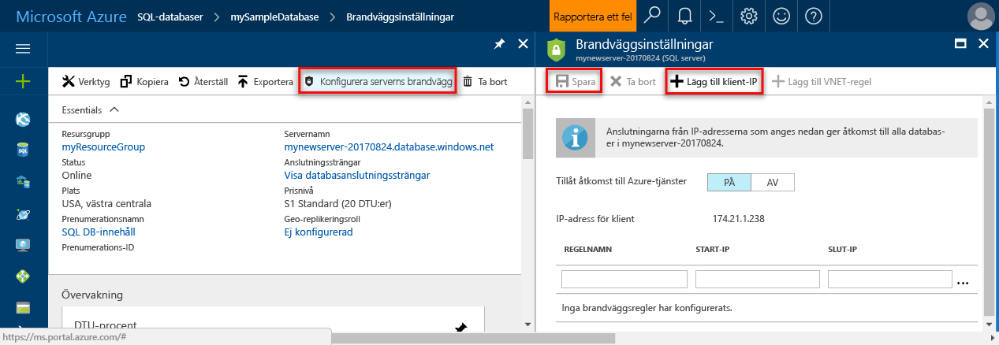

# <a name="azure-sql-database-server-level-and-database-level-firewall-rules"></a>Azure SQL Database server- och databasnivå brandväggsregler 

Microsoft Azure SQL Database tillhandahåller en relationsdatabastjänst för Azure och andra Internetbaserade program. toohelp skydda dina data, brandväggar förhindra all åtkomst tooyour databasserver förrän du anger vilka datorer som har behörighet. hello brandväggen beviljar åtkomst toodatabases baserat på hello kommer IP-adressen för varje begäran.

## <a name="overview"></a>Översikt

Först har alla Transact-SQL åtkomst tooyour Azure SQL server blockerats av hello brandväggen. toobegin med din Azure SQL-server måste du ange en eller flera servernivå brandväggsregler som tillåter åtkomst tooyour Azure SQL-server. Om Azure-program kan försöka tooconnect tooyour Azure SQL server använder hello brandväggen regler toospecify vilka IP-adressintervallen från hello Internet tillåts.

tooselectively bevilja åtkomst toojust hello databaserna i Azure SQL-server, måste du skapa en regel för databasnivå för hello obligatorisk databas. Ange ett IP-adressintervall för hello databas-brandväggsregler som ligger utanför hello IP-adressintervall som anges i hello brandväggsregel på servernivå och se till att hello hello klientens IP-adress ligger i hello-intervall som anges i regeln för hello databasnivå.

Anslutningsförsök från hello Internet och Azure måste först passera genom brandväggen hello innan de kan nå dina Azure SQL server eller SQL-databas som visas i följande diagram hello:

   ![Diagram över brandväggskonfigurationen.][1]

* **Brandväggsregler på servernivå:** reglerna aktivera klienter tooaccess hela Azure SQL server, det vill säga hello alla hello databaser inom samma logiska server. Dessa regler är lagrade i hello **master** databas. Brandväggsregler på servernivå kan konfigureras med hjälp av hello-portalen eller med hjälp av Transact-SQL-uttryck. toocreate servernivå brandväggsregler med hello Azure-portalen eller PowerShell, som du måste vara hello prenumerationsägare eller prenumeration deltagare. toocreate en brandväggsregel på servernivå med hjälp av Transact-SQL, måste du ansluta toohello SQL Database-instans som hello huvudsaklig inloggning på servernivå eller hello Azure Active Directory-administratör (vilket innebär en brandväggsregel på servernivå måste först skapas av en användare med Azure-behörighet).
* **Databasnivå brandväggsregler:** dessa regler kan klienter tooaccess vissa (säkrare) databaser inom hello samma logiska server. Du kan skapa reglerna för varje databas (inklusive hello **master** database0) och de lagras i hello enskilda databaser. Brandväggsregler på databasnivå kan bara konfigureras med hjälp av Transact-SQL-uttryck och bara när du har konfigurerat hello första servernivå brandväggen. Om du anger ett IP-adressintervall i hello databasnivå brandväggsregel som är utanför hello-intervall som anges i hello brandväggsregel på servernivå kan endast de klienter som har IP-adresser i intervallet för hello databasnivå åtkomst hello-databasen. Du kan skapa upp till 128 brandväggsregler på databasnivå för en databas. Brandväggsregler på databasnivå för databaserna master och användaren kan bara skapas och hanteras via Transact-SQL. Mer information om hur du konfigurerar brandväggsregler på databasnivå finns hello exemplet senare i den här artikeln och se [sp_set_database_firewall_rule (Azure SQL-databaser)](https://msdn.microsoft.com/library/dn270010.aspx).

**Rekommendation:** Microsoft rekommenderar att du använder brandväggsregler på databasnivå när det är möjligt tooenhance säkerhets- och toomake fler bärbara databasen. Använd brandväggsregler på servernivå för administratörer och när du har många databaser som har hello samma behörigheter som krävs och du vill inte toospend tid konfigurerar varje databas individuellt.

> [!Note]
> Information om bärbara databaser i hello kontexten kontinuitet för företag finns i [autentiseringskraven för katastrofåterställning](sql-database-geo-replication-security-config.md).
>

### <a name="connecting-from-hello-internet"></a>Ansluta från hello Internet

När en dator försöker tooconnect tooyour databasservern från hello Internet, kontrollerar hello brandväggen först hello kommer IP-adressen för hello begäran mot hello databasnivå brandväggsregler, för hello-databas som hello anslutningen begär:

* Om hello IP-adressen för hello begäran inom ett hello-intervall som anges i hello brandväggsregler på databasnivå beviljas hello anslutning toohello SQL-databas som innehåller hello regel.
* Om hello IP-adressen för hello begäran inte är inom en hello-intervall som anges i hello databasnivå brandväggsregel kontrolleras hello brandväggsregler på servernivå. Om hello IP-adressen för hello-begäran är inom ett hello-intervall som anges i hello servernivå brandväggsregler, beviljas hello-anslutning. Brandväggsregler på servernivå tillämpa tooall SQL-databaser på hello Azure SQL-server.  
* Om hello IP-adressen för begäran om hello inte ligger inom hello-intervall som anges i någon av hello databasnivå eller servernivå brandväggsregler, hello anslutningsbegäran misslyckas.

> [!NOTE]
> tooaccess Azure SQL Database från din lokala dator, kontrollera hello brandväggen på ditt nätverk och en lokal dator tillåter utgående kommunikation på TCP-port 1433.
> 

### <a name="connecting-from-azure"></a>Ansluta från Azure
tooallow program från Azure tooconnect tooyour Azure SQLServer, Azure-anslutningar måste aktiveras. När ett program från Azure försöker tooconnect tooyour databasserver, verifierar hello brandväggen att Azure-anslutningar tillåts. En brandvägg med inledande och avslutande adress lika too0.0.0.0 anger dessa anslutningar tillåts. Om hello anslutningsförsöket inte tillåts, når hello begäran inte hello Azure SQL Database-server.

> [!IMPORTANT]
> Det här alternativet konfigurerar hello brandväggen tooallow alla anslutningar från Azure inklusive anslutningar från hello prenumerationer av andra kunder. När det här alternativet, se till att din inloggning och användarbehörigheter begränsa åtkomst tooonly behöriga användare.
> 

## <a name="creating-and-managing-firewall-rules"></a>Skapa och hantera brandväggsregler
hello första servernivå brandväggsinställningen kan skapas med hello [Azure-portalen](https://portal.azure.com/) eller programmässigt med [Azure PowerShell](https://msdn.microsoft.com/library/azure/dn546724.aspx), [Azure CLI](/cli/azure/sql/server/firewall-rule#create), eller hello [REST API](https://msdn.microsoft.com/library/azure/dn505712.aspx). Efterföljande brandväggsregler på servernivå kan skapas och hanteras med hjälp av dessa metoder samt via Transact-SQL. 

> [!IMPORTANT]
> Brandväggsregler på databasnivå kan bara skapas och hanteras med hjälp av Transact-SQL. 
>

tooimprove prestanda, servernivå brandväggen regler cachelagras tillfälligt på hello databasnivå. toorefresh hello cache, se [DBCC FLUSHAUTHCACHE](https://msdn.microsoft.com/library/mt627793.aspx). 

> [!TIP]
> Du kan använda [SQL Database Auditing](sql-database-auditing.md) tooaudit ändringar av server- och databasnivå brandvägg.
>

### <a name="azure-portal"></a>Azure Portal

tooset en brandväggsregel på servernivå i hello Azure-portalen, antingen går du toohello översiktssidan för Azure SQL database eller hello översiktssidan för din logiska Azure Database-server.

> [!TIP]
> En självstudiekurs finns [skapa en databas med hjälp av hello Azure-portalen](sql-database-get-started-portal.md).
>

**Från sidan för databas-översikt**

1. tooset en brandväggsregel på servernivå från hello översiktssidan för databasen, klickar du på **ange serverbrandvägg** hello verktygsfältet som visas i följande bild hello: hello **brandväggsinställningar** för hello SQL Databasservern öppnas.

       

2. Klicka på **lägga till klientens IP-Adressen** på hello verktygsfältet tooadd hello IP-adressen hello datorn du använder och klicka sedan på **spara**. En brandväggsregel på servernivå skapas för din aktuella IP-adress.

       

**Från server översiktssida**

hello översiktssidan för din server öppnas som visar du hello fullständigt kvalificerade servernamnet (exempelvis **mynewserver20170403.database.windows.net**) och innehåller alternativ för ytterligare konfiguration.

1. tooset en regel för servernivå från sidan Översikt över server klickar du på **brandväggen** hello vänstra menyn under inställningar som visades i hello följande bild: 

     

2. Klicka på **lägga till klientens IP-Adressen** på hello verktygsfältet tooadd hello IP-adressen hello datorn du använder och klicka sedan på **spara**. En brandväggsregel på servernivå skapas för din aktuella IP-adress.

     

### <a name="transact-sql"></a>Transact-SQL
| Katalogvy eller lagrad procedur | Nivå | Beskrivning |
| --- | --- | --- |
| [sys.firewall_rules](https://msdn.microsoft.com/library/dn269980.aspx) |Server |Visar hello aktuella servernivå brandväggsregler |
| [sp_set_firewall_rule](https://msdn.microsoft.com/library/dn270017.aspx) |Server |Skapar eller uppdaterar brandväggsregler på servernivå |
| [sp_delete_firewall_rule](https://msdn.microsoft.com/library/dn270024.aspx) |Server |Tar bort brandväggsregler på servernivå |
| [sys.database_firewall_rules](https://msdn.microsoft.com/library/dn269982.aspx) |Databas |Visar hello aktuella databasnivå brandväggsregler |
| [sp_set_database_firewall_rule](https://msdn.microsoft.com/library/dn270010.aspx) |Databas |Skapar eller uppdaterar hello brandväggsregler på databasnivå |
| [sp_delete_database_firewall_rule](https://msdn.microsoft.com/library/dn270030.aspx) |Databaser |Tar bort brandväggsregler på databasnivå |


hello följande exempel granska hello befintliga regler, aktivera ett intervall med IP-adresser på hello server Contoso och tar bort en brandväggsregel:
   
```sql
SELECT * FROM sys.firewall_rules ORDER BY name;
```
  
Lägg sedan till en brandväggsregel.
   
```sql
EXECUTE sp_set_firewall_rule @name = N'ContosoFirewallRule',
   @start_ip_address = '192.168.1.1', @end_ip_address = '192.168.1.10'
```

toodelete servernivå brandväggsregel, köra hello sp_delete_firewall_rule lagrade proceduren. hello följande exempel tar bort hello regeln med namnet ContosoFirewallRule:
   
```sql
EXECUTE sp_delete_firewall_rule @name = N'ContosoFirewallRule'
```   

### <a name="azure-powershell"></a>Azure PowerShell
| Cmdlet | Nivå | Beskrivning |
| --- | --- | --- |
| [Get-AzureSqlDatabaseServerFirewallRule](https://msdn.microsoft.com/library/azure/dn546731.aspx) |Server |Returnerar hello aktuella servernivå brandväggsregler |
| [New-AzureSqlDatabaseServerFirewallRule](https://msdn.microsoft.com/library/azure/dn546724.aspx) |Server |Skapar en ny brandväggsregel på servernivå |
| [Set-AzureSqlDatabaseServerFirewallRule](https://msdn.microsoft.com/library/azure/dn546739.aspx) |Server |Uppdaterar hello egenskaperna för en befintlig brandväggsregel på servernivå |
| [Remove-AzureSqlDatabaseServerFirewallRule](https://msdn.microsoft.com/library/azure/dn546727.aspx) |Server |Tar bort brandväggsregler på servernivå |


hello följande exempel anger en brandväggsregel på servernivå med hjälp av PowerShell:

```powershell
New-AzureRmSqlServerFirewallRule -ResourceGroupName "myResourceGroup" `
    -ServerName $servername `
    -FirewallRuleName "AllowSome" -StartIpAddress "0.0.0.0" -EndIpAddress "0.0.0.0"
```

> [!TIP]
> PowerShell-exemplen i hello kontexten för en Snabbstart Se [skapa DB - PowerShell](sql-database-get-started-powershell.md) och [skapa en enskild databas och konfigurera en brandväggsregel med hjälp av PowerShell](scripts/sql-database-create-and-configure-database-powershell.md)
>

### <a name="azure-cli"></a>Azure CLI
| Cmdlet | Nivå | Beskrivning |
| --- | --- | --- |
| [Skapa AZ sql server-brandvägg](/cli/azure/sql/server/firewall-rule#create) | Skapar en brandvägg regeln tooallow åtkomst tooall SQL-databaser på hello-servern från hello angivna IP-adressintervall.|
| [ta bort AZ sql server-brandväggen](/cli/azure/sql/server/firewall-rule#delete)| Tar bort en brandväggsregel.|
| [listan över AZ sql server-brandväggen](/cli/azure/sql/server/firewall-rule#list)| Visar hello brandväggsregler.|
| [Visa AZ sql server-brandväggsregel](/cli/azure/sql/server/firewall-rule#show)| Visar hello detaljerad information om en brandväggsregel.|
| [AX uppdatera regel för sql server-brandväggen](/cli/azure/sql/server/firewall-rule#update)| Uppdaterar en brandväggsregel.

hello följande exempel anger en brandväggsregel på servernivå med hjälp av hello Azure CLI: 

```azurecli-interactive
az sql server firewall-rule create --resource-group myResourceGroup --server $servername \
    -n AllowYourIp --start-ip-address 0.0.0.0 --end-ip-address 0.0.0.0
```

> [!TIP]
> Azure CLI exempelvis i hello kontexten för en Snabbstart Se [skapa DDB - Azure CLI](sql-database-get-started-cli.md) och [skapa en enskild databas och konfigurera en brandväggsregel som använder hello Azure CLI](scripts/sql-database-create-and-configure-database-cli.md)
>

### <a name="rest-api"></a>REST API
| API | Nivå | Beskrivning |
| --- | --- | --- |
| [Visa en lista med brandväggsregler](https://msdn.microsoft.com/library/azure/dn505715.aspx) |Server |Visar hello aktuella servernivå brandväggsregler |
| [Skapa brandväggsregel](https://msdn.microsoft.com/library/azure/dn505712.aspx) |Server |Skapar eller uppdaterar brandväggsregler på servernivå |
| [Konfigurera brandväggsregel](https://msdn.microsoft.com/library/azure/dn505707.aspx) |Server |Uppdaterar hello egenskaperna för en befintlig brandväggsregel på servernivå |
| [Ta bort brandväggsregel](https://msdn.microsoft.com/library/azure/dn505706.aspx) |Server |Tar bort brandväggsregler på servernivå |

## <a name="server-level-firewall-rule-versus-a-database-level-firewall-rule"></a>Brandväggsregel på servernivå och en databasnivå brandväggsregel
FRÅGOR. Användare av en databas isoleras fullständigt från en annan databas?   
  Om Ja, kan du bevilja åtkomst med hjälp av brandväggsregler på databasnivå. Detta förhindrar med servernivå brandväggsregler, som tillåter åtkomst via brandväggen hello tooall databaser, minskar säkerheten hello djup.   
 
FRÅGOR. Kommer användarna på hello IP-adressen måste åt tooall databaser?   
  Använda servernivå brandväggen regler tooreduce hello antal gånger som du måste konfigurera brandväggens regler.   

FRÅGOR. Har åtkomst via hello Azure-portalen PowerShell eller hello REST API när du hello person eller det team konfigurera hello brandväggsregler endast?   
  Du måste använda brandväggsregler på servernivå. Brandväggsregler på databasnivå kan bara konfigureras med hjälp av Transact-SQL.  

FRÅGOR. Hello person eller det team att konfigurera brandväggsregler för hello förbjudet från och med hög behörighet på databasnivå hello?   
  Använd brandväggsreglerna på servernivå. Konfigurera brandväggsregler på databasnivå med hjälp av Transact-SQL, kräver minst `CONTROL DATABASE` behörigheten på hello databasnivå.  

FRÅGOR. Är hello person eller det team konfigureras eller granskning hello brandväggsregler centralt hantera brandväggsregler för många (kanske 100-tal) av databaser?   
  Det här valet är beroende av behov och miljö. Brandväggsregler på servernivå kan vara enklare tooconfigure, men skript kan konfigurera regler på hello databasnivå. Och även om du använder brandväggsregler på servernivå kan du behöva tooaudit hello databas-brandväggsregler, toosee om användare med `CONTROL` behörigheten på hello databas har skapats brandväggsregler på databasnivå.   

FRÅGOR. Kan jag använda en blandning av både server- och databasnivå brandväggsregler?   
  Ja. Vissa användare, till exempel Administratörer behöva brandväggsregler på servernivå. Andra användare, till exempel användare i ett databasprogram kan behöva brandväggsregler på databasnivå.   

## <a name="troubleshooting-hello-database-firewall"></a>Felsöka hello database-brandvägg
Överväg följande punkter när åtkomst toohello Microsoft Azure SQL Database-tjänsten inte fungerar som förväntat hello:

* **Lokala brandväggskonfigurationen:** innan datorn kan komma åt Azure SQL Database, måste toocreate ett undantag i brandväggen på datorn för TCP-port 1433. Om du upprättar anslutningar i hello Azure-molnet gräns kanske tooopen ytterligare portar. Mer information finns i hello **SQL Database: utanför eller innanför** avsnitt i [portar utöver 1433 för ADO.NET 4.5 och SQL Database](sql-database-develop-direct-route-ports-adonet-v12.md).
* **Network address translation (NAT):** förfallodatum tooNAT, hello IP-adress som används av din dator tooconnect tooAzure SQL-databas är annorlunda än hello IP-adress som visas i IP-konfigurationsinställningar. datorn är tooview hello IP-adress med tooconnect tooAzure, logga in toohello portal och navigera toohello **konfigurera** fliken på hello-server som värd för din databas. Under hello **tillåtna IP-adresser** avsnittet hello **aktuella klientens IP-adress** visas. Klicka på **Lägg till** toohello **tillåtna IP-adresser** tooallow den här datorn tooaccess hello-servern.
* **Lista över tillåtna ändringar toohello inte har börjat gälla ännu:** kan det vara så mycket som en fem-minuters fördröjning för ändras toohello Azure SQL Database-brandvägg configuration tootake effekt.
* **hello inloggningen har inte behörighet eller ett felaktigt lösenord användes:** om en inloggning har inte behörighet på hello Azure SQL Database-server eller hello lösenordet som används är felaktig, nekas hello anslutning toohello Azure SQL Database-server. Skapa en brandväggsinställningen endast ger klienterna en möjlighet tooattempt ansluter tooyour server; varje klient måste ange autentiseringsuppgifter för hello säkerhet som behövs. Mer information om hur du förbereder inloggningar finns i avsnittet Managing Databases, Logins, and Users in Azure SQL Database (Hantera databaser, inloggningar och användare i Azure SQL Database).
* **Dynamisk IP-adress:** om du har en Internetanslutning med dynamisk IP-adressering och du har problem med att få hello-brandväggen kan du försöka något av följande lösningar hello:
  
  * Be din Internet Service Provider (ISP) för hello IP-adressintervall som tilldelats tooyour klientdatorer att åtkomst hello Azure SQL Database-server och lägger sedan till hello IP-adressintervall som en brandväggsregel.
  * Hämta statiska IP-adresser i stället för dina klientdatorer och lägger sedan till hello IP-adresser som brandväggsregler.

## <a name="next-steps"></a>Nästa steg

- Snabbstart för att skapa en databas och en brandväggsregel på servernivå finns [skapa en Azure SQL database](sql-database-get-started-portal.md).
- Hjälp i anslutande tooan Azure SQL-databas från öppen källkod eller program från tredje part finns [Snabbkurs klientkod exempel tooSQL databasen](https://msdn.microsoft.com/library/azure/ee336282.aspx).
- Information om ytterligare portar som du kanske måste tooopen finns hello **SQL-databas: utanför eller innanför** avsnitt i [portar utöver 1433 för ADO.NET 4.5 och SQL-databas](sql-database-develop-direct-route-ports-adonet-v12.md)
- En översikt över Azure SQL Database-säkerhet finns i [att säkra din databas](sql-database-security-overview.md)

<!--Image references-->
[1]: ./media/sql-database-firewall-configure/sqldb-firewall-1.png
