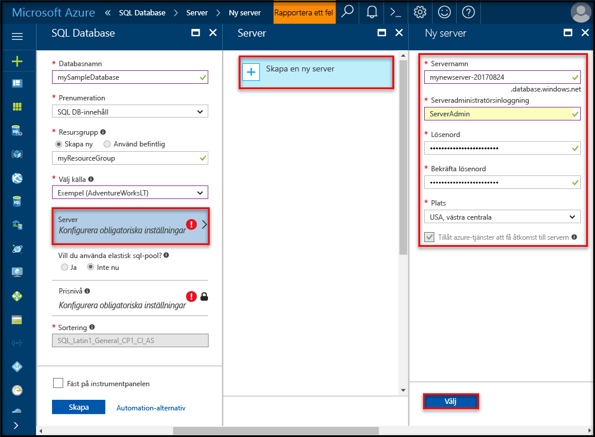
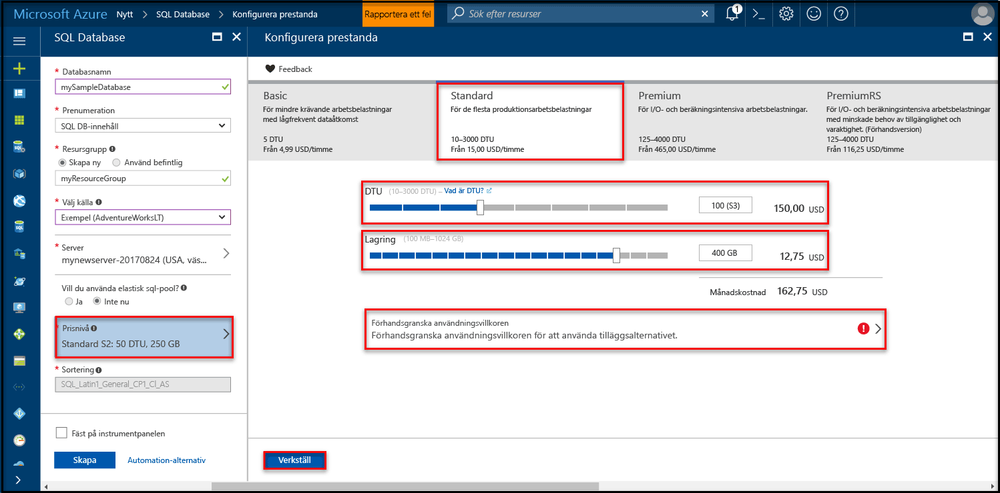
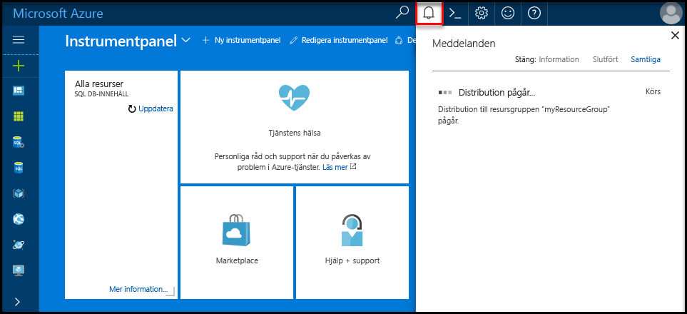

# <a name="create-an-azure-sql-database-in-hello-azure-portal"></a><span data-ttu-id="6b631-105">Skapa en Azure SQL database i hello Azure-portalen</span><span class="sxs-lookup"><span data-stu-id="6b631-105">Create an Azure SQL database in hello Azure portal</span></span>

<span data-ttu-id="6b631-106">Den här snabbstartskursen går igenom hur toocreate en SQL-databas i Azure.</span><span class="sxs-lookup"><span data-stu-id="6b631-106">This quick start tutorial walks through how toocreate a SQL database in Azure.</span></span> <span data-ttu-id="6b631-107">Azure SQL Database är en ”databas-as-a-Service” erbjudande som du kan använda toorun och skala högtillgänglig SQL Server-databaser i hello molnet.</span><span class="sxs-lookup"><span data-stu-id="6b631-107">Azure SQL Database is a “Database-as-a-Service” offering that enables you toorun and scale highly available SQL Server databases in hello cloud.</span></span> <span data-ttu-id="6b631-108">Den här snabbstartsguide visar hur tooget igång genom att skapa en SQL-databas med hjälp av hello Azure-portalen.</span><span class="sxs-lookup"><span data-stu-id="6b631-108">This quick start shows you how tooget started by creating a SQL database using hello Azure portal.</span></span>

<span data-ttu-id="6b631-109">Om du inte har en Azure-prenumeration kan du skapa ett [kostnadsfritt](https://azure.microsoft.com/free/) konto innan du börjar.</span><span class="sxs-lookup"><span data-stu-id="6b631-109">If you don't have an Azure subscription, create a [free](https://azure.microsoft.com/free/) account before you begin.</span></span>

## <a name="log-in-toohello-azure-portal"></a><span data-ttu-id="6b631-110">Logga in toohello Azure-portalen</span><span class="sxs-lookup"><span data-stu-id="6b631-110">Log in toohello Azure portal</span></span>

<span data-ttu-id="6b631-111">Logga in toohello [Azure-portalen](https://portal.azure.com/).</span><span class="sxs-lookup"><span data-stu-id="6b631-111">Log in toohello [Azure portal](https://portal.azure.com/).</span></span>

## <a name="create-a-sql-database"></a><span data-ttu-id="6b631-112">Skapa en SQL-databas</span><span class="sxs-lookup"><span data-stu-id="6b631-112">Create a SQL database</span></span>

<span data-ttu-id="6b631-113">Azure SQL-databasen skapas med en definierad uppsättning [beräknings-och lagringsresurser](sql-database-service-tiers.md).</span><span class="sxs-lookup"><span data-stu-id="6b631-113">An Azure SQL database is created with a defined set of [compute and storage resources](sql-database-service-tiers.md).</span></span> <span data-ttu-id="6b631-114">hello-databas skapas inom en [Azure-resursgrupp](../azure-resource-manager/resource-group-overview.md) och i en [logisk Azure SQL Database-server](sql-database-features.md).</span><span class="sxs-lookup"><span data-stu-id="6b631-114">hello database is created within an [Azure resource group](../azure-resource-manager/resource-group-overview.md) and in an [Azure SQL Database logical server](sql-database-features.md).</span></span> 

<span data-ttu-id="6b631-115">Följ dessa steg toocreate en SQL-databas som innehåller hello Adventure Works LT exempeldata.</span><span class="sxs-lookup"><span data-stu-id="6b631-115">Follow these steps toocreate a SQL database containing hello Adventure Works LT sample data.</span></span> 

1. <span data-ttu-id="6b631-116">Klicka på hello **ny** knappen hittades på hello övre vänstra hörnet av hello Azure-portalen.</span><span class="sxs-lookup"><span data-stu-id="6b631-116">Click hello **New** button found on hello upper left-hand corner of hello Azure portal.</span></span>

2. <span data-ttu-id="6b631-117">Välj **databaser** från hello **ny** och väljer **SQL-databas** från hello **databaser** sidan.</span><span class="sxs-lookup"><span data-stu-id="6b631-117">Select **Databases** from hello **New** page, and select **SQL Database** from hello **Databases** page.</span></span>

   

3. <span data-ttu-id="6b631-119">Fyll i formuläret om hello SQL-databas med hello följande information som visas i föregående bild hello:</span><span class="sxs-lookup"><span data-stu-id="6b631-119">Fill out hello SQL Database form with hello following information, as shown on hello preceding image:</span></span>   

   | <span data-ttu-id="6b631-120">Inställning</span><span class="sxs-lookup"><span data-stu-id="6b631-120">Setting</span></span>       | <span data-ttu-id="6b631-121">Föreslaget värde</span><span class="sxs-lookup"><span data-stu-id="6b631-121">Suggested value</span></span> | <span data-ttu-id="6b631-122">Beskrivning</span><span class="sxs-lookup"><span data-stu-id="6b631-122">Description</span></span> | 
   | ------------ | ------------------ | ------------------------------------------------- | 
   | <span data-ttu-id="6b631-123">**Databasnamn**</span><span class="sxs-lookup"><span data-stu-id="6b631-123">**Database name**</span></span> | <span data-ttu-id="6b631-124">mySampleDatabase</span><span class="sxs-lookup"><span data-stu-id="6b631-124">mySampleDatabase</span></span> | <span data-ttu-id="6b631-125">För giltiga databasnamn, se [databasidentifierare](https://docs.microsoft.com/en-us/sql/relational-databases/databases/database-identifiers).</span><span class="sxs-lookup"><span data-stu-id="6b631-125">For valid database names, see [Database Identifiers](https://docs.microsoft.com/en-us/sql/relational-databases/databases/database-identifiers).</span></span> | 
   | <span data-ttu-id="6b631-126">**Prenumeration**</span><span class="sxs-lookup"><span data-stu-id="6b631-126">**Subscription**</span></span> | <span data-ttu-id="6b631-127">Din prenumeration</span><span class="sxs-lookup"><span data-stu-id="6b631-127">Your subscription</span></span>  | <span data-ttu-id="6b631-128">Mer information om dina prenumerationer finns i [Prenumerationer](https://account.windowsazure.com/Subscriptions).</span><span class="sxs-lookup"><span data-stu-id="6b631-128">For details about your subscriptions, see [Subscriptions](https://account.windowsazure.com/Subscriptions).</span></span> |
   | <span data-ttu-id="6b631-129">**Resursgrupp**</span><span class="sxs-lookup"><span data-stu-id="6b631-129">**Resource group**</span></span>  | <span data-ttu-id="6b631-130">myResourceGroup</span><span class="sxs-lookup"><span data-stu-id="6b631-130">myResourceGroup</span></span> | <span data-ttu-id="6b631-131">Giltiga resursgruppnamn finns i [Namngivningsregler och begränsningar](https://docs.microsoft.com/azure/architecture/best-practices/naming-conventions).</span><span class="sxs-lookup"><span data-stu-id="6b631-131">For valid resource group names, see [Naming rules and restrictions](https://docs.microsoft.com/azure/architecture/best-practices/naming-conventions).</span></span> |
   | <span data-ttu-id="6b631-132">**Källa källa**</span><span class="sxs-lookup"><span data-stu-id="6b631-132">**Source source**</span></span> | <span data-ttu-id="6b631-133">Exempel: (AdventureWorksLT)</span><span class="sxs-lookup"><span data-stu-id="6b631-133">Sample (AdventureWorksLT)</span></span> | <span data-ttu-id="6b631-134">Läser in hello AdventureWorksLT schema och data i den nya databasen</span><span class="sxs-lookup"><span data-stu-id="6b631-134">Loads hello AdventureWorksLT schema and data into your new database</span></span> |

   > [!IMPORTANT]
   > <span data-ttu-id="6b631-135">Du måste välja hello exempeldatabasen i det här formuläret eftersom den används i hello resten av den här snabbstartsguide.</span><span class="sxs-lookup"><span data-stu-id="6b631-135">You must select hello sample database on this form because it is used in hello remainder of this quick start.</span></span>
   > 

4. <span data-ttu-id="6b631-136">Under **Server**, klickar du på **konfigurera nödvändiga inställningar** och registrerar hello SQL server (logisk server) formulär med hello följande information som visas i följande bild hello:</span><span class="sxs-lookup"><span data-stu-id="6b631-136">Under **Server**, click **Configure required settings** and fill out hello SQL server (logical server) form with hello following information, as shown on hello following image:</span></span>   

   | <span data-ttu-id="6b631-137">Inställning</span><span class="sxs-lookup"><span data-stu-id="6b631-137">Setting</span></span>       | <span data-ttu-id="6b631-138">Föreslaget värde</span><span class="sxs-lookup"><span data-stu-id="6b631-138">Suggested value</span></span> | <span data-ttu-id="6b631-139">Beskrivning</span><span class="sxs-lookup"><span data-stu-id="6b631-139">Description</span></span> | 
   | ------------ | ------------------ | ------------------------------------------------- | 
   | <span data-ttu-id="6b631-140">**Servernamn**</span><span class="sxs-lookup"><span data-stu-id="6b631-140">**Server name**</span></span> | <span data-ttu-id="6b631-141">Valfritt globalt unikt namn</span><span class="sxs-lookup"><span data-stu-id="6b631-141">Any globally unique name</span></span> | <span data-ttu-id="6b631-142">Giltiga servernamn finns i [Namngivningsregler och begränsningar](https://docs.microsoft.com/azure/architecture/best-practices/naming-conventions).</span><span class="sxs-lookup"><span data-stu-id="6b631-142">For valid server names, see [Naming rules and restrictions](https://docs.microsoft.com/azure/architecture/best-practices/naming-conventions).</span></span> | 
   | <span data-ttu-id="6b631-143">**Inloggning för serveradministratör**</span><span class="sxs-lookup"><span data-stu-id="6b631-143">**Server admin login**</span></span> | <span data-ttu-id="6b631-144">Valfritt giltigt namn</span><span class="sxs-lookup"><span data-stu-id="6b631-144">Any valid name</span></span> | <span data-ttu-id="6b631-145">För giltiga inloggningsnamn, se [Databasidentifierare](https://docs.microsoft.com/en-us/sql/relational-databases/databases/database-identifiers).</span><span class="sxs-lookup"><span data-stu-id="6b631-145">For valid login names, see [Database Identifiers](https://docs.microsoft.com/en-us/sql/relational-databases/databases/database-identifiers).</span></span> |
   | <span data-ttu-id="6b631-146">**Lösenord**</span><span class="sxs-lookup"><span data-stu-id="6b631-146">**Password**</span></span> | <span data-ttu-id="6b631-147">Valfritt giltigt lösenord</span><span class="sxs-lookup"><span data-stu-id="6b631-147">Any valid password</span></span> | <span data-ttu-id="6b631-148">Lösenordet måste innehålla minst 8 tecken och måste innehålla tecken från tre av hello följande kategorier: versaler, gemener, siffror och och icke-alfanumeriska tecken.</span><span class="sxs-lookup"><span data-stu-id="6b631-148">Your password must have at least 8 characters and must contain characters from three of hello following categories: upper case characters, lower case characters, numbers, and and non-alphanumeric characters.</span></span> |
   | <span data-ttu-id="6b631-149">**Prenumeration**</span><span class="sxs-lookup"><span data-stu-id="6b631-149">**Subscription**</span></span> | <span data-ttu-id="6b631-150">Din prenumeration</span><span class="sxs-lookup"><span data-stu-id="6b631-150">Your subscription</span></span> | <span data-ttu-id="6b631-151">Mer information om dina prenumerationer finns i [Prenumerationer](https://account.windowsazure.com/Subscriptions).</span><span class="sxs-lookup"><span data-stu-id="6b631-151">For details about your subscriptions, see [Subscriptions](https://account.windowsazure.com/Subscriptions).</span></span> |
   | <span data-ttu-id="6b631-152">**Resursgrupp**</span><span class="sxs-lookup"><span data-stu-id="6b631-152">**Resource group**</span></span> | <span data-ttu-id="6b631-153">myResourceGroup</span><span class="sxs-lookup"><span data-stu-id="6b631-153">myResourceGroup</span></span> | <span data-ttu-id="6b631-154">Giltiga resursgruppnamn finns i [Namngivningsregler och begränsningar](https://docs.microsoft.com/azure/architecture/best-practices/naming-conventions).</span><span class="sxs-lookup"><span data-stu-id="6b631-154">For valid resource group names, see [Naming rules and restrictions](https://docs.microsoft.com/azure/architecture/best-practices/naming-conventions).</span></span> |
   | <span data-ttu-id="6b631-155">**Plats**</span><span class="sxs-lookup"><span data-stu-id="6b631-155">**Location**</span></span> | <span data-ttu-id="6b631-156">Valfri giltig plats</span><span class="sxs-lookup"><span data-stu-id="6b631-156">Any valid location</span></span> | <span data-ttu-id="6b631-157">För information om regioner, se [Azure-regioner](https://azure.microsoft.com/regions/).</span><span class="sxs-lookup"><span data-stu-id="6b631-157">For information about regions, see [Azure Regions](https://azure.microsoft.com/regions/).</span></span> |

   > [!IMPORTANT]
   > <span data-ttu-id="6b631-158">hello server admin inloggningsnamn och lösenord som du anger här är nödvändig toolog i toohello server och databaserna senare i den här snabbstartsguide.</span><span class="sxs-lookup"><span data-stu-id="6b631-158">hello server admin login and password that you specify here are required toolog in toohello server and its databases later in this quick start.</span></span> <span data-ttu-id="6b631-159">Kom ihåg eller skriv ned den här informationen så att du kan använda den senare.</span><span class="sxs-lookup"><span data-stu-id="6b631-159">Remember or record this information for later use.</span></span> 
   >  

   

5. <span data-ttu-id="6b631-161">När du har slutfört hello formuläret, klickar du på **Välj**.</span><span class="sxs-lookup"><span data-stu-id="6b631-161">When you have completed hello form, click **Select**.</span></span>

6. <span data-ttu-id="6b631-162">Klicka på **prisnivå** toospecify hello tjänstnivå och prestandanivå servicenivå för den nya databasen.</span><span class="sxs-lookup"><span data-stu-id="6b631-162">Click **Pricing tier** toospecify hello service tier and performance level for your new database.</span></span> <span data-ttu-id="6b631-163">Använd hello skjutreglaget tooselect **20 dtu: er** och **250** GB lagringsutrymme.</span><span class="sxs-lookup"><span data-stu-id="6b631-163">Use hello slider tooselect **20 DTUs** and **250** GB of storage.</span></span> <span data-ttu-id="6b631-164">Mer information om DTU:er finns i [Vad är en DTU?](sql-database-what-is-a-dtu.md)</span><span class="sxs-lookup"><span data-stu-id="6b631-164">For more information on DTUs, see [What is a DTU?](sql-database-what-is-a-dtu.md).</span></span>

   

7. <span data-ttu-id="6b631-166">När valda hello mängden dtu: er, klickar du på **tillämpa**.</span><span class="sxs-lookup"><span data-stu-id="6b631-166">After selected hello amount of DTUs, click **Apply**.</span></span>  

8. <span data-ttu-id="6b631-167">Nu när du har slutfört hello SQL Database formuläret, klickar du på **skapa** tooprovision hello-databasen.</span><span class="sxs-lookup"><span data-stu-id="6b631-167">Now that you have completed hello SQL Database form, click **Create** tooprovision hello database.</span></span> <span data-ttu-id="6b631-168">Etableringen tar några minuter.</span><span class="sxs-lookup"><span data-stu-id="6b631-168">Provisioning takes a few minutes.</span></span> 

9. <span data-ttu-id="6b631-169">På verktygsfältet hello **meddelanden** toomonitor hello distributionsprocessen.</span><span class="sxs-lookup"><span data-stu-id="6b631-169">On hello toolbar, click **Notifications** toomonitor hello deployment process.</span></span>

   

## <a name="create-a-server-level-firewall-rule"></a><span data-ttu-id="6b631-171">Skapa en brandväggsregel på servernivå</span><span class="sxs-lookup"><span data-stu-id="6b631-171">Create a server-level firewall rule</span></span>

<span data-ttu-id="6b631-172">hello SQL Database-tjänsten skapar en brandvägg på hello-servernivå som förhindrar att externa program och verktyg ansluter toohello server eller en databas på servern hello såvida inte en brandväggsregel skapas tooopen hello-brandväggen för specifika IP-adresser.</span><span class="sxs-lookup"><span data-stu-id="6b631-172">hello SQL Database service creates a firewall at hello server-level that prevents external applications and tools from connecting toohello server or any databases on hello server unless a firewall rule is created tooopen hello firewall for specific IP addresses.</span></span> <span data-ttu-id="6b631-173">Följ dessa steg toocreate en [SQL-databas brandväggsregel på servernivå](sql-database-firewall-configure.md) för din klients IP-adress och aktivera extern anslutning via hello SQL Database-Brandvägg för din IP-adress.</span><span class="sxs-lookup"><span data-stu-id="6b631-173">Follow these steps toocreate a [SQL Database server-level firewall rule](sql-database-firewall-configure.md) for your client's IP address and enable external connectivity through hello SQL Database firewall for your IP address only.</span></span> 

> [!NOTE]
> <span data-ttu-id="6b631-174">SQL Database kommunicerar via port 1433.</span><span class="sxs-lookup"><span data-stu-id="6b631-174">SQL Database communicates over port 1433.</span></span> <span data-ttu-id="6b631-175">Om du försöker tooconnect från ett företagsnätverk, tillåtas utgående trafik via port 1433 inte av ditt nätverks brandvägg.</span><span class="sxs-lookup"><span data-stu-id="6b631-175">If you are trying tooconnect from within a corporate network, outbound traffic over port 1433 may not be allowed by your network's firewall.</span></span> <span data-ttu-id="6b631-176">I så fall, kan du inte ansluta tooyour Azure SQL Database-server om din IT-avdelning öppnar port 1433.</span><span class="sxs-lookup"><span data-stu-id="6b631-176">If so, you cannot connect tooyour Azure SQL Database server unless your IT department opens port 1433.</span></span>
>

1. <span data-ttu-id="6b631-177">När hello distributionen är klar klickar du på **SQL-databaser** från hello vänstra menyn och klicka sedan på **mySampleDatabase** på hello **SQL-databaser** sidan.</span><span class="sxs-lookup"><span data-stu-id="6b631-177">After hello deployment completes, click **SQL databases** from hello left-hand menu and then click **mySampleDatabase** on hello **SQL databases** page.</span></span> <span data-ttu-id="6b631-178">hello översiktssidan för din databas öppnas som visar du hello fullständigt kvalificerade servernamnet (exempelvis **mynewserver20170313.database.windows.net**) och innehåller alternativ för ytterligare konfiguration.</span><span class="sxs-lookup"><span data-stu-id="6b631-178">hello overview page for your database opens, showing you hello fully qualified server name (such as **mynewserver20170313.database.windows.net**) and provides options for further configuration.</span></span> <span data-ttu-id="6b631-179">Kopiera det fullständiga servernamnet för senare användning.</span><span class="sxs-lookup"><span data-stu-id="6b631-179">Copy this fully qualified server name for use later.</span></span>

   > [!IMPORTANT]
   > <span data-ttu-id="6b631-180">Du behöver den här fullständigt kvalificerade namnet tooconnect tooyour-server och dess databaser i efterföljande snabbstarter.</span><span class="sxs-lookup"><span data-stu-id="6b631-180">You need this fully qualified server name tooconnect tooyour server and its databases in subsequent quick starts.</span></span>
   > 

    

2. <span data-ttu-id="6b631-182">Klicka på **ange serverbrandvägg** hello verktygsfältet enligt hello föregående bild.</span><span class="sxs-lookup"><span data-stu-id="6b631-182">Click **Set server firewall** on hello toolbar as shown in hello previous image.</span></span> <span data-ttu-id="6b631-183">Hej **brandväggsinställningar** öppnas sidan för hello SQL Database-server.</span><span class="sxs-lookup"><span data-stu-id="6b631-183">hello **Firewall settings** page for hello SQL Database server opens.</span></span> 

    

3. <span data-ttu-id="6b631-185">Klicka på **lägga till klientens IP-Adressen** på hello verktygsfältet tooadd din aktuella IP-adressen tooa ny brandväggsregel.</span><span class="sxs-lookup"><span data-stu-id="6b631-185">Click **Add client IP** on hello toolbar tooadd your current IP address tooa new firewall rule.</span></span> <span data-ttu-id="6b631-186">Med en brandväggsregel kan du öppna port 1433 för en enskild IP-adress eller för IP-adressintervall.</span><span class="sxs-lookup"><span data-stu-id="6b631-186">A firewall rule can open port 1433 for a single IP address or a range of IP addresses.</span></span>

4. <span data-ttu-id="6b631-187">Klicka på **Spara**.</span><span class="sxs-lookup"><span data-stu-id="6b631-187">Click **Save**.</span></span> <span data-ttu-id="6b631-188">En brandväggsregel på servernivå har skapats för din aktuella IP-adress som är öppna port 1433 på hello logisk server.</span><span class="sxs-lookup"><span data-stu-id="6b631-188">A server-level firewall rule is created for your current IP address opening port 1433 on hello logical server.</span></span>

    

4. <span data-ttu-id="6b631-190">Klicka på **OK** och stäng sedan hello **brandväggsinställningar** sidan.</span><span class="sxs-lookup"><span data-stu-id="6b631-190">Click **OK** and then close hello **Firewall settings** page.</span></span>

<span data-ttu-id="6b631-191">Nu kan du ansluta toohello SQL Database-server och dess databaser med SQL Server Management Studio eller ett annat verktyg som helst från den här IP-adressen med hello server administratörskonto som skapats tidigare.</span><span class="sxs-lookup"><span data-stu-id="6b631-191">You can now connect toohello SQL Database server and its databases using SQL Server Management Studio or another tool of your choice from this IP address using hello server admin account created previously.</span></span>

> [!IMPORTANT]
> <span data-ttu-id="6b631-192">Som standard är åtkomst via hello SQL Database-brandvägg aktiverad för alla Azure-tjänster.</span><span class="sxs-lookup"><span data-stu-id="6b631-192">By default, access through hello SQL Database firewall is enabled for all Azure services.</span></span> <span data-ttu-id="6b631-193">Klicka på **OFF** på den här sidan toodisable för alla Azure-tjänster.</span><span class="sxs-lookup"><span data-stu-id="6b631-193">Click **OFF** on this page toodisable for all Azure services.</span></span>
>

## <a name="query-hello-sql-database"></a><span data-ttu-id="6b631-194">Frågan hello SQL-databas</span><span class="sxs-lookup"><span data-stu-id="6b631-194">Query hello SQL database</span></span>

<span data-ttu-id="6b631-195">Nu när du har skapat en exempeldatabas i Azure kan vi verktyget hello inbyggda frågan inom hello Azure portal tooconfirm att du kan ansluta toohello databasen och fråga hello-data.</span><span class="sxs-lookup"><span data-stu-id="6b631-195">Now that you have created a sample database in Azure, let’s use hello built-in query tool within hello Azure portal tooconfirm that you can connect toohello database and query hello data.</span></span> 

1. <span data-ttu-id="6b631-196">På hello SQL-databasen för databasen klickar du på **verktyg** hello i verktygsfältet.</span><span class="sxs-lookup"><span data-stu-id="6b631-196">On hello SQL Database page for your database, click **Tools** on hello toolbar.</span></span> <span data-ttu-id="6b631-197">Hej **verktyg** öppnas.</span><span class="sxs-lookup"><span data-stu-id="6b631-197">hello **Tools** page opens.</span></span>

    

2. <span data-ttu-id="6b631-199">Klicka på **frågeredigeraren (förhandsgranskning)**, klickar du på hello **Förhandsgranska villkoren** kryssrutan och klicka sedan på **OK**.</span><span class="sxs-lookup"><span data-stu-id="6b631-199">Click **Query editor (preview)**, click hello **Preview terms** checkbox, and then click **OK**.</span></span> <span data-ttu-id="6b631-200">hello Query editor sidan öppnas.</span><span class="sxs-lookup"><span data-stu-id="6b631-200">hello Query editor page opens.</span></span>

3. <span data-ttu-id="6b631-201">Klicka på **inloggning** och när du uppmanas, markera **SQL server-autentisering** och ange sedan hello inloggning för serveradministratör och lösenord som du skapade tidigare.</span><span class="sxs-lookup"><span data-stu-id="6b631-201">Click **Login** and then, when prompted, select **SQL server authentication** and then provide hello server admin login and password that you created earlier.</span></span>

    

4. <span data-ttu-id="6b631-203">Klicka på **OK** toolog i.</span><span class="sxs-lookup"><span data-stu-id="6b631-203">Click **OK** toolog in.</span></span>

5. <span data-ttu-id="6b631-204">När du är autentiserad fråga typen hello följande i hello query editor-fönstret.</span><span class="sxs-lookup"><span data-stu-id="6b631-204">After you are authenticated, type hello following query in hello query editor pane.</span></span>

   ```sql
   SELECT TOP 20 pc.Name as CategoryName, p.name as ProductName
   FROM SalesLT.ProductCategory pc
   JOIN SalesLT.Product p
   ON pc.productcategoryid = p.productcategoryid;
   ```

6. <span data-ttu-id="6b631-205">Klicka på **kör** och granska sedan hello frågeresultaten i hello **resultat** fönstret.</span><span class="sxs-lookup"><span data-stu-id="6b631-205">Click **Run** and then review hello query results in hello **Results** pane.</span></span>

   

7. <span data-ttu-id="6b631-207">Stäng hello **frågeredigeraren** sida och hello **verktyg** sidan.</span><span class="sxs-lookup"><span data-stu-id="6b631-207">Close hello **Query editor** page and hello **Tools** page.</span></span>

## <a name="clean-up-resources"></a><span data-ttu-id="6b631-208">Rensa resurser</span><span class="sxs-lookup"><span data-stu-id="6b631-208">Clean up resources</span></span>

<span data-ttu-id="6b631-209">Om du inte behöver dessa resurser för en annan Snabbstartsguide (se [nästa steg](#next-steps)), kan du ta bort dem genom att göra hello följande:</span><span class="sxs-lookup"><span data-stu-id="6b631-209">If you don't need these resources for another quickstart/tutorial (see [Next steps](#next-steps)), you can delete them by doing hello following:</span></span>


1. <span data-ttu-id="6b631-210">Hello vänstra menyn i hello Azure-portalen klickar du på **resursgrupper** och klicka sedan på **myResourceGroup**.</span><span class="sxs-lookup"><span data-stu-id="6b631-210">From hello left-hand menu in hello Azure portal, click **Resource groups** and then click **myResourceGroup**.</span></span> 
2. <span data-ttu-id="6b631-211">På din resurs gruppen klickar du på **ta bort**, typen **myResourceGroup** i hello textrutan och klicka sedan på **ta bort**.</span><span class="sxs-lookup"><span data-stu-id="6b631-211">On your resource group page, click **Delete**, type **myResourceGroup** in hello text box, and then click **Delete**.</span></span>

## <a name="next-steps"></a><span data-ttu-id="6b631-212">Nästa steg</span><span class="sxs-lookup"><span data-stu-id="6b631-212">Next steps</span></span>

<span data-ttu-id="6b631-213">Nu när du har en databas kan du ansluta och söka med dina favoritverktyg.</span><span class="sxs-lookup"><span data-stu-id="6b631-213">Now that you have a database, you can connect and query using your favorite tools.</span></span> <span data-ttu-id="6b631-214">Lär dig mer genom att välja verktyg nedan:</span><span class="sxs-lookup"><span data-stu-id="6b631-214">Learn more by choosing your tool below:</span></span>

- [<span data-ttu-id="6b631-215">SQL Server Management Studio</span><span class="sxs-lookup"><span data-stu-id="6b631-215">SQL Server Management Studio</span></span>](sql-database-connect-query-ssms.md)
- [<span data-ttu-id="6b631-216">Visual Studio Code</span><span class="sxs-lookup"><span data-stu-id="6b631-216">Visual Studio Code</span></span>](sql-database-connect-query-vscode.md)
- [<span data-ttu-id="6b631-217">NET</span><span class="sxs-lookup"><span data-stu-id="6b631-217">.NET</span></span>](sql-database-connect-query-dotnet.md)
- [<span data-ttu-id="6b631-218">PHP</span><span class="sxs-lookup"><span data-stu-id="6b631-218">PHP</span></span>](sql-database-connect-query-php.md)
- [<span data-ttu-id="6b631-219">Node.js</span><span class="sxs-lookup"><span data-stu-id="6b631-219">Node.js</span></span>](sql-database-connect-query-nodejs.md)
- [<span data-ttu-id="6b631-220">Java</span><span class="sxs-lookup"><span data-stu-id="6b631-220">Java</span></span>](sql-database-connect-query-java.md)
- [<span data-ttu-id="6b631-221">Python</span><span class="sxs-lookup"><span data-stu-id="6b631-221">Python</span></span>](sql-database-connect-query-python.md)
- [<span data-ttu-id="6b631-222">Ruby</span><span class="sxs-lookup"><span data-stu-id="6b631-222">Ruby</span></span>](sql-database-connect-query-ruby.md)
